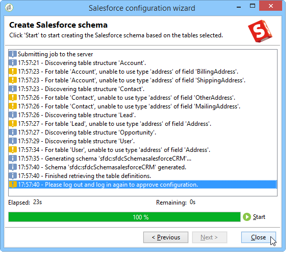

# Collegare Campaign e Salesforce.com{#connect-to-sfdc}

In questa pagina verrà illustrato come connettere Campaign Classic a **Salesforce**.

La sincronizzazione dei dati viene eseguita tramite un’attività del flusso di lavoro dedicata. [Ulteriori informazioni](../../platform/using/crm-data-sync.md).

L’account esterno ti consente di importare ed esportare dati Salesforce in Adobe Campaign.
Per configurare il connettore di gestione delle relazioni con i clienti per Salesforce, effettua le seguenti operazioni:

1. Crea un nuovo account esterno tramite il nodo **[!UICONTROL Administration > Platform > External accounts]** della struttura Adobe Campaign.
1. Seleziona **[!UICONTROL Salesforce.com]**.
1. Immettere le impostazioni per abilitare la connessione.

   

   Per configurare l’account esterno di Salesforce CRM per l’utilizzo con Adobe Campaign, è necessario fornire i seguenti dettagli:

   * **[!UICONTROL Account]**
Account utilizzato per accedere a Salesforce CRM.

   * **[!UICONTROL Password]**
Password utilizzata per accedere a Salesforce CRM.

   * **[!UICONTROL Client identifier]**
Per sapere dove trovare l&#39;identificatore client, fare riferimento a questa [pagina](https://help.salesforce.com/articleView?id=000205876&amp;type=1).

   * **[!UICONTROL Security token]**
Per sapere dove trovare il token di sicurezza, consulta questa [pagina](https://help.salesforce.com/articleView?id=000205876&amp;type=1).

   * **[!UICONTROL API version]**
Seleziona la versione dell’API.
1. Esegui l’assistente alla configurazione per generare la tabella di gestione delle relazioni con i clienti disponibile: l’assistente alla configurazione ti consente di raccogliere tabelle e creare lo schema corrispondente.

   

   >[!NOTE]
   >
   >Per approvare la configurazione, devi disconnetterti e accedere di nuovo alla console Adobe Campaign.

1. Controllare lo schema generato in Adobe Campaign nel nodo **[!UICONTROL Administration > Configuration > Data schemas]**.

   Esempio per lo schema **Salesforce**:

   

1. Una volta creato lo schema, puoi sincronizzare automaticamente le enumerazioni da Salesforce ad Adobe Campaign.

   A tale scopo, fare clic sul collegamento **[!UICONTROL Synchronizing enumerations...]** e selezionare l&#39;enumerazione Adobe Campaign corrispondente all&#39;enumerazione Salesforce.

   

   >[!NOTE]
   >
   >È possibile sostituire tutti i valori di un&#39;enumerazione Adobe Campaign con quelli del CRM: a questo scopo, selezionare **[!UICONTROL Yes]** nella colonna **[!UICONTROL Replace]**.

   Fare clic su **[!UICONTROL Next]** e quindi su **[!UICONTROL Start]** per avviare l&#39;importazione dell&#39;elenco.

1. Controllare i valori importati nel menu **[!UICONTROL Administration > Platform > Enumerations]**.

   

   >[!NOTE]
   >
   > Le enumerazioni di selezione multiple non sono supportate.

Campaign e Salesforce.com sono ora connessi. È possibile impostare la sincronizzazione dei dati tra i due sistemi.

Per sincronizzare i dati tra Adobe Campaign e SFDC, è necessario creare un flusso di lavoro e utilizzare l&#39;attività **[!UICONTROL CRM connector]**.

Ulteriori informazioni sulla sincronizzazione dei dati [sono disponibili in questa pagina](../../platform/using/crm-data-sync.md).
