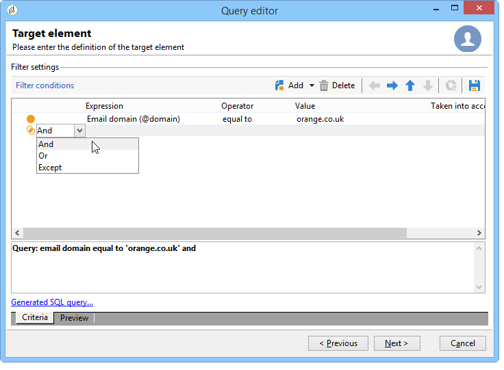
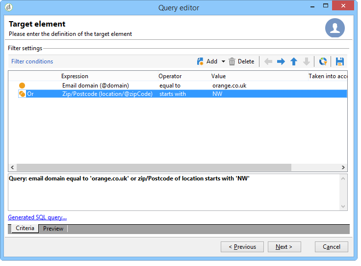

# Definire le condizioni del filtro{#defining-filter-conditions}

## Scegli l’operatore {#choosing-the-operator}

All’interno delle condizioni di filtro, è necessario collegare due valori utilizzando un operatore .

Di seguito è riportato un elenco degli operatori disponibili:

<table> 
 <thead> 
  <tr> 
   <th> Operatore  </th> 
   <th> Finalità  </th> 
   <th> Esempio  </th> 
  </tr> 
 </thead> 
 <tbody> 
  <tr> 
   <td> Uguale a   </td> 
   <td> Restituisce un risultato identico ai dati immessi nella seconda colonna Valore.  </td> 
   <td> <strong>Cognome (@lastName) uguale a "Jones"</strong>, restituirà solo i destinatari il cui cognome è Jones.  </td> 
  </tr> 
  <tr> 
   <td> Maggiore di   </td> 
   <td> Restituisce un valore maggiore del valore inserito.  </td> 
   <td> <strong>Età (@età) superiore a 50</strong>, restituirà tutti i valori maggiori di "50", ovvero "51", "52", ecc.  </td> 
  </tr> 
  <tr> 
   <td> Minore di   </td> 
   <td> Restituisce un valore inferiore al valore inserito.  </td> 
   <td> <strong>Data di creazione (@created) prima di 'DaysAgo(100)'</strong>, restituirà tutti i destinatari creati meno di 100 giorni fa.  </td> 
  </tr> 
  <tr> 
   <td> Maggiore o uguale a   </td> 
   <td> Restituisce tutti i valori uguali o maggiori del valore inserito.  </td> 
   <td> <strong>Età (@età) maggiore o uguale a '30'</strong>, restituirà tutti i destinatari di età pari o superiore a 30 anni.  </td> 
  </tr> 
  <tr> 
   <td> Minore o uguale a   </td> 
   <td> Restituisce tutti i valori uguali o inferiori al valore inserito.  </td> 
   <td> <strong>Età (@età) inferiore o uguale a '60'</strong>, restituirà tutti i destinatari di età non superiore a 60 anni.  </td> 
  </tr> 
  <tr> 
   <td> Non uguale a   </td> 
   <td> Restituisce tutti i valori non identici al valore inserito.  </td> 
   <td> <strong>Lingua (@lingua) uguale a "Inglese"</strong>.  </td> 
  </tr> 
  <tr> 
   <td> Inizia con   </td> 
   <td> Restituisce i risultati che iniziano con il valore inserito.  </td> 
   <td> <strong>L'account # (@account) inizia con '32010'.</strong>  </td> 
  </tr> 
  <tr> 
   <td> Non inizia con   </td> 
   <td> Restituisce i risultati che non iniziano con il valore inserito  </td> 
   <td> <strong>L'account # (@account) non inizia con '20'</strong>.  </td> 
  </tr> 
  <tr> 
   <td> Contiene   </td> 
   <td> Restituisce i risultati contenenti almeno il valore inserito.  </td> 
   <td> <strong>Il dominio e-mail (@dominio) contiene 'mail'</strong>, restituirà tutti i nomi di dominio contenenti "mail". Quindi verrà restituito anche il dominio "gmail.com".  </td> 
  </tr> 
  <tr> 
   <td> Non contiene   </td> 
   <td> Restituisce risultati che non contengono il valore inserito.  </td> 
   <td> <strong>Il dominio e-mail (@dominio) non contiene 'vo'</strong>. In questo caso, i nomi di dominio contenenti "vo" non verranno restituiti. Il nome di dominio 'voila.fr' non verrà visualizzato nei risultati.  </td> 
  </tr> 
  <tr> 
   <td> Simile   </td> 
   <td> Simile è molto simile all’operatore Contains. Consente di inserire un % carattere jolly nel valore .  </td> 
   <td> <strong>Cognome (@lastName) simile a 'Jon%s'</strong>. Qui, il carattere jolly è usato come un "jolly" per trovare il nome "Jones", se l'operatore ha dimenticato la lettera mancante tra il 'n' e il 's'.  </td> 
  </tr> 
  <tr> 
   <td> Diverso   </td> 
   <td> È simile a Simile . Consente di non recuperare il valore immesso. Anche in questo caso, il valore immesso deve contenere il carattere jolly %.  </td> 
   <td> <strong>Cognome (@lastName) non simile a 'Smi%h'</strong>. In questo caso, i destinatari il cui cognome è "Smi%h" non verranno restituiti.  </td> 
  </tr> 
  <tr> 
   <td> È vuoto   </td> 
   <td> In questo caso, il risultato che stiamo cercando corrisponde a un valore vuoto nella seconda colonna Valore .  </td> 
   <td> <strong>Mobile (@mobilePhone) è vuoto</strong> restituisce tutti i destinatari che non dispongono di un numero mobile.  </td> 
  </tr> 
  <tr> 
   <td> Non è vuoto   </td> 
   <td> Opere al contrario È vuoto operatore. Non è necessario inserire dati nella seconda colonna Valore.  </td> 
   <td> <strong>E-mail (@email) non è vuota</strong>.  </td> 
  </tr> 
  <tr> 
   <td> È incluso in   </td> 
   <td> Restituisce i risultati inclusi nei valori indicati. Questi valori devono essere separati da una virgola.  </td> 
   <td> <strong>La data di nascita (@datadinascita) è inclusa in '12/10/1979,12/10/1984'</strong>, restituirà i destinatari nati tra queste date.   </td> 
  </tr> 
  <tr> 
   <td> Non è incluso in   </td> 
   <td> Funziona come È incluso in operatore. In questo caso, vogliamo escludere i destinatari in base ai valori inseriti.  </td> 
   <td> <strong>La data di nascita (@datadinascita) non è inclusa in '12/10/1979,12/10/1984'</strong>. A differenza dell’esempio precedente, i destinatari nati entro queste date non verranno restituiti.  </td> 
  </tr> 
 </tbody> 
</table>

## UTILIZZARE E, O, ECCETTO {#using-and--or--except}

Per le query che utilizzano diverse condizioni di filtro, è necessario definire collegamenti tra le condizioni. Esistono tre possibili collegamenti:

* **[!UICONTROL And]** consente di combinare due condizioni di filtro,
* **[!UICONTROL Or]** consente di offrire un’alternativa,
* **[!UICONTROL Except]** ti consente di definire un’eccezione.

Fai clic su **[!UICONTROL And]** (offerta per impostazione predefinita) e scegli dall’elenco a discesa.

* **[!UICONTROL And]**: aggiunge una condizione e abilita il filtro eccessivo.
* **[!UICONTROL Or]**: aggiunge una condizione e abilita il filtro eccessivo.

   L’esempio seguente ti consente di trovare i destinatari il cui dominio e-mail contiene &quot;orange.co.uk&quot; O il cui codice postale inizia con &quot;NW&quot;.

   

* **[!UICONTROL Except]**: se disponi di due filtri e il primo non restituisce un valore, questo tipo di collegamento crea un’eccezione.

   Nell’esempio seguente, vogliamo restituire i destinatari il cui dominio e-mail contiene &quot;orange.co.uk&quot; ECCETTO se il cognome del destinatario è &quot;Smith&quot;.

   

Questo esempio mostra un filtro che consente di visualizzare: destinatari che parlano spagnolo, OPPURE sono donne con numeri di cellulare, OPPURE destinatari senza un numero di conto e il cui nome dell&#39;azienda inizia con la lettera &quot;N&quot;.

## Dare priorità alle condizioni {#prioritizing-conditions}

Questa sezione spiega come assegnare priorità alle condizioni grazie alle frecce blu nella barra degli strumenti.

* La freccia rivolta a destra consente di aggiungere al filtro un livello di parentesi.
* La freccia rivolta a sinistra consente di eliminare un livello di parentesi selezionato dal filtro.

   

* Le frecce verticali consentono di spostare una condizione, cambiandone la sequenza di esecuzione.

In questo esempio viene illustrato come utilizzare la freccia per eliminare un livello di parentesi. Inizia dalla seguente condizione di filtro: **[!UICONTROL City equal to London OR gender equal to male and mobile not indicated OR account # starts with "95" and company name starts with "A"]**.

Posizionare il cursore sul **[!UICONTROL Gender (@gender) equal to Male]** condizione di filtro e fai clic su **[!UICONTROL Remove a parenthesis level]** freccia.

La **[!UICONTROL Gender (@gender) equal to Male]** condizione estratta dalla sua parentesi. Si è spostata allo stesso livello della condizione &quot;City equal to London&quot;. Tali condizioni sono collegate tra loro (**[!UICONTROL And]**).

## Selezionare i dati da estrarre {#selecting-data-to-extract}

I campi disponibili variano da una tabella all’altra. Tutti i campi sono memorizzati in un nodo principale noto come **[!UICONTROL Main element]**. Nell’esempio seguente, i campi disponibili si trovano nella tabella dei destinatari. I campi vengono sempre visualizzati in ordine alfabetico.

Il dettaglio del campo selezionato è visibile nella parte inferiore della finestra. Ad esempio, il **[!UICONTROL Email domain]** è un campo **[!UICONTROL Calculated SQL field]** e la sua estensione **[!UICONTROL (@domain)]**.

>[!NOTE]
>
>Utilizza la **[!UICONTROL Search]** strumento per trovare un campo disponibile.

Fare doppio clic su un campo disponibile per aggiungerlo alle colonne di output. Alla fine della query, ogni campo selezionato crea una colonna nel **[!UICONTROL Data preview]** finestra.

I campi avanzati non vengono visualizzati per impostazione predefinita. Fai clic su **[!UICONTROL Display advanced fields]** nell’angolo in basso a destra dei campi disponibili per visualizzare tutti gli elementi. Fai di nuovo clic su per tornare alla visualizzazione precedente.

Ad esempio, nella tabella dei destinatari, i campi avanzati sono **Booleano 1**, **[!UICONTROL Boolean 2]**, **[!UICONTROL Boolean 3]**, **[!UICONTROL Foreign key of "Folder" link]**, ecc.

L’esempio seguente mostra i campi avanzati della tabella dei destinatari.

Le varie categorie di campi:

<table> 
 <thead> 
  <tr> 
   <th> Icona  </th> 
   <th> Descrizione  </th> 
   <th> Esempi  </th> 
  </tr> 
 </thead> 
 <tbody> 
  <tr> 
   <td>  </td> 
   <td> Campo semplice  </td> 
   <td> E-mail, genere, ecc.  </td> 
  </tr> 
  <tr> 
   <td>  </td> 
   <td> Chiave primaria. Questo campo SQL è un modo per identificare un record in una tabella.  </td> 
   <td> I destinatari degli identificatori sono chiavi primarie e gli identificatori sono univoci per definizione.  </td> 
  </tr> 
  <tr> 
   <td>  </td> 
   <td> Chiave esterna. Utilizzato come collegamento a un’altra tabella.  </td> 
   <td> Chiave esterna del destinatario, chiave esterna del servizio, ecc.  </td> 
  </tr> 
  <tr> 
   <td>  </td> 
   <td> Campo calcolato. Questo tipo di campo viene calcolato su richiesta utilizzando i valori del database.  </td> 
   <td> Età, dominio e-mail, ecc.  </td> 
  </tr> 
  <tr> 
   <td>  </td> 
   <td> Campo contenente testi lunghi.  </td> 
   <td> Commento, indirizzo completo, ecc.  </td> 
  </tr> 
  <tr> 
   <td>  </td> 
   <td> Campo SQL indicizzato.   </td> 
   <td> Nome completo, codice ISO, ecc.   </td> 
  </tr> 
 </tbody> 
</table>

Collegamento a una tabella e a un elemento di raccolta:

<table> 
 <thead> 
  <tr> 
   <th> Icona  </th> 
   <th> Descrizione  </th> 
   <th> Esempio  </th> 
  </tr> 
 </thead> 
 <tbody> 
  <tr> 
   <td>  </td> 
   <td> Collegamenti a una tabella in particolare. Questi coincidono con associazioni di tipo 1-1. Una occorrenza della tabella sorgente può coincidere con una sola occorrenza della tabella di destinazione. Ad esempio, un solo destinatario può essere collegato a un paese.  </td> 
   <td> Cartella, Stato, Paese, ecc.   </td> 
  </tr> 
  <tr> 
   <td>  </td> 
   <td> Elemento di raccolta in una tabella specifica. Queste coincidono con le associazioni di tipo 1-N. Una occorrenza della tabella sorgente può coincidere con diverse occorrenze della tabella di destinazione, ma una occorrenza della tabella di destinazione può coincidere con una sola occorrenza della tabella sorgente. Ad esempio, un destinatario può abbonarsi alle lettere di abbonamento "n".  </td> 
   <td> Abbonamenti, elenchi, registri di esclusione, ecc.  </td> 
  </tr> 
 </tbody> 
</table>

>[!NOTE]
>
>* Utilizza la **[!UICONTROL Add]** pulsante (sopra la barra delle icone laterali) per aggiungere una colonna di output in cui modificare l’espressione. Per ulteriori informazioni sulla modifica di un’espressione, consulta [questa sezione](#building-expressions).
>* Elimina una colonna di output facendo clic sulla &quot;x&quot; rossa (**Elimina**).
>* Modificare l’ordine delle colonne di output utilizzando le frecce.
>* La **[!UICONTROL Distribution of values]** consente di visualizzare la distribuzione dei valori del campo selezionato (ad esempio, le distribuzioni collegate alle città destinatarie, alle lingue dei destinatari, ecc.).

## Creazione di campi calcolati {#creating-calculated-fields}

Se necessario, aggiungere una colonna durante la formattazione dei dati. Un campo calcolato aggiunge una colonna alla sezione di anteprima dati. Fai clic su **[!UICONTROL Add a calculated field]**.

Esistono quattro tipi di campi calcolati:

* **[!UICONTROL Fixed string]**: consente di aggiungere una stringa di caratteri.

   

* **[!UICONTROL String with JavaScript tags]**: il valore del campo calcolato combina una stringa di caratteri e direttive JavaScript.

   

* **[!UICONTROL JavaScript expression]**: il valore del campo calcolato è il risultato di una valutazione della funzione JavaScript. Il valore restituito può essere digitato (numero, data, ecc.).

   

* **[!UICONTROL Enumerations]**: Questo tipo di campo consente di utilizzare/modificare il contenuto di una delle colonne di output in una nuova colonna.

   È possibile utilizzare il valore sorgente di una colonna e assegnargli un valore di destinazione. Questo valore di destinazione verrà visualizzato nella nuova colonna di output.

   Esempio di aggiunta del tipo di campo calcolato **[!UICONTROL Enumerations]** è disponibile, fai riferimento a [questa sezione](../../workflow/using/adding-enumeration-type-calculated-field.md).

   

   La **[!UICONTROL Enumerations]** il campo calcolato di tipo può includere 4 condizioni:

   * **[!UICONTROL Keep the source value]** ripristina il valore sorgente nel target senza modificarlo.
   * **[!UICONTROL Use the following value]** consente di immettere un valore di destinazione predefinito per i valori di origine non definiti.
   * **[!UICONTROL Generate a warning and continue]** avverte l&#39;utente che il valore sorgente non può essere modificato.
   * **[!UICONTROL Generate an error and reject the line]** impedisce il calcolo e l’importazione della riga.

Fai clic sul pulsante **[!UICONTROL Detail of calculated field]** per visualizzare i dettagli del campo inserito.

Per rimuovere questo campo calcolato, fai clic sul pulsante **[!UICONTROL Remove the calculated field]** croce.

## Creare espressioni {#building-expressions}

Lo strumento di modifica delle espressioni consente di calcolare gli aggregati, generare una funzione o modificare una formula utilizzando un’espressione.

L&#39;esempio seguente mostra come eseguire un conteggio su una chiave primaria.

Applica i seguenti passaggi:

1. Fai clic su **[!UICONTROL Add]** in **[!UICONTROL Data to extract]** finestra. In **[!UICONTROL Formula type]** selezionare un tipo di formula per immettere l&#39;espressione.

   Sono disponibili diversi tipi di formule: **[!UICONTROL Field only]**, **[!UICONTROL Aggregate]**, **[!UICONTROL Expression]**.

   Seleziona **[!UICONTROL Process on an aggregate function]** e **[!UICONTROL Count]**. Fai clic su **[!UICONTROL Next]**.

   

1. Viene calcolata la chiave primaria.

   

Di seguito è riportata una visualizzazione dettagliata delle scelte disponibili nel **[!UICONTROL Formula types]** finestra:

1. **[!UICONTROL Field only]** consente di tornare alla sezione **[!UICONTROL Field to select]** finestra.
1. **[!UICONTROL Aggregate (Process on an aggregate function)]**. Di seguito sono riportati alcuni esempi di utilizzo aggregato:

   * **[!UICONTROL Count]** consente di eseguire un conteggio delle chiavi primarie.
   * **[!UICONTROL Sum]** consente di sommare tutti gli acquisti effettuati da un cliente su un anno.
   * **[!UICONTROL Maximum value]** consente di trovare i clienti che hanno acquistato il maggior numero di prodotti &quot;n&quot;.
   * **[!UICONTROL Minimum value]** ti consente di ordinare in base ai clienti e individuare quelli che si sono abbonati a un’offerta più di recente.
   * **[!UICONTROL Average]**. Questa funzione ti consente di calcolare l’età media dei destinatari.

      La **[!UICONTROL Distinct]** consente di recuperare valori univoci e diversi da zero di una colonna. Ad esempio, puoi recuperare tutti i registri di tracciamento di un destinatario e questi vengono modificati nel valore 1 in quanto riguardano tutti lo stesso destinatario.

1. **[!UICONTROL Expression]** apre **[!UICONTROL Edit the expression]** finestra. Questo consente di rilevare i numeri telefonici con troppe cifre, che potrebbero essere errori di inserimento.

   

   Per un elenco di tutte le funzioni disponibili, consulta [Elenco delle funzioni](#list-of-functions).

## Elenco delle funzioni {#list-of-functions}

Se **[!UICONTROL Expression]** viene scelta la formula del tipo, verrà visualizzata la finestra &quot;modifica l&#39;espressione&quot;. Ai campi disponibili possono essere associate diverse categorie di funzioni: **[!UICONTROL Aggregates]**, **[!UICONTROL String]**, **[!UICONTROL Date]**, **[!UICONTROL Numerical]**, **[!UICONTROL Currency]**, **[!UICONTROL Geomarketing]**, **[!UICONTROL Windowing function]** e **[!UICONTROL Others]**.

L’editor di espressioni si presenta così:

Consente di selezionare i campi nelle tabelle del database e di aggiungere funzioni avanzate. Sono disponibili le seguenti funzioni:

**Aggregati**

<table> 
 <tbody> 
  <tr> 
   <td> <strong>Nome</strong>  </td> 
   <td> <strong>Descrizione</strong>  </td> 
   <td> <strong>Sintassi</strong>  </td> 
  </tr> 
  <tr> 
   <td> <strong>Avg</strong>  </td> 
   <td> Restituisce la media di una colonna del tipo di numero  </td> 
   <td> Avg(&lt;valore&gt;) </td> 
  </tr> 
  <tr> 
   <td> <strong>Conteggio</strong>  </td> 
   <td> Conta i valori non nulli di una colonna  </td> 
   <td> Count(&lt;valore&gt;) </td>  
  </tr> 
  <tr> 
   <td> <strong>CountAll</strong>  </td> 
   <td> Conta i valori restituiti (tutti i campi)  </td> 
   <td> CountAll()  </td> 
  </tr> 
  <tr> 
   <td> <strong>Countdistinct</strong>  </td> 
   <td> Conta i valori distinti non nulli di una colonna  </td> 
   <td> Countdistinct(&lt;valore&gt;) </td> 
  </tr> 
  <tr> 
   <td> <strong>Max</strong>  </td> 
   <td> Restituisce il valore massimo di una colonna numero, stringa o tipo di data  </td> 
   <td> Max(&lt;valore&gt;) </td>  
  </tr> 
  <tr> 
   <td> <strong>Min</strong>  </td> 
   <td> Restituisce il valore minimo di una colonna numero, stringa o tipo di data  </td> 
   <td> Min(&lt;valore&gt;) </td> 
  </tr> 
  <tr> 
   <td> <strong>StdDev</strong>  </td> 
   <td> Restituisce la deviazione standard di un numero, una stringa o una colonna di data  </td> 
   <td> StdDev(&lt;value&gt;) </td> 
  </tr> 
  <tr> 
   <td> <strong>Somma</strong>  </td> 
   <td> Restituisce la somma dei valori di una colonna numero, stringa o tipo di data  </td> 
   <td> Sum(&lt;valore&gt;) </td> 
  </tr> 
 </tbody> 
</table>

**Stringa**

<table> 
 <tbody> 
  <tr> 
   <td> <strong>Nome</strong>  </td> 
   <td> <strong>Descrizione</strong>  </td> 
   <td> <strong>Sintassi</strong>  </td> 
  </tr> 
  <tr> 
   <td> <strong>AllNonNull2</strong>  </td> 
   <td> Indica se tutti i parametri non sono nulli e non sono vuoti  </td> 
   <td> AllNonNull2(&lt;stringa&gt;, &lt;stringa&gt;) </td> 
  </tr> 
  <tr> 
   <td> <strong>AllNonNull3</strong>  </td> 
   <td> Indica se tutti i parametri non sono nulli e non sono vuoti  </td> 
   <td> AllNonNull3(&lt;stringa&gt;, &lt;stringa&gt;, &lt;stringa&gt;) </td> 
  </tr> 
  <tr> 
   <td> <strong>Ascii</strong>  </td> 
   <td> Restituisce il valore ASCII del primo carattere della stringa.  </td> 
   <td> Ascii(&lt;stringa&gt;) </td> 
  </tr> 
  <tr> 
   <td> <strong>Char</strong>  </td> 
   <td> Restituisce il carattere corrispondente al codice ASCII “n”  </td> 
   <td> Char(&lt;numero&gt;) </td>  
  </tr> 
  <tr> 
   <td> <strong>Charindex</strong>  </td> 
   <td> Restituisce la posizione della stringa 2 nella stringa 1.  </td> 
   <td> Charindex(&lt;stringa&gt;, &lt;stringa&gt;) </td> 
  </tr> 
  <tr> 
   <td> <strong>GetLine</strong>  </td> 
   <td> Restituisce l’ennesima riga (da 1 a n) della stringa  </td> 
   <td> GetLine(&lt;stringa&gt;) </td> 
  </tr> 
  <tr> 
   <td> <strong>IfEquals</strong>  </td> 
   <td> Restituisce il terzo parametro se i primi due parametri sono uguali. In caso contrario, restituisce l'ultimo parametro  </td> 
   <td> IfEquals(&lt;stringa&gt;, &lt;stringa&gt;, &lt;stringa&gt;, &lt;stringa&gt;) </td> 
  </tr> 
  <tr> 
   <td> <strong>IsMemoNull</strong>  </td> 
   <td> Indica se il promemoria passato come parametro è nullo  </td> 
   <td> IsMemoNull(&lt;memo&gt;) </td> 
  </tr> 
  <tr> 
   <td> <strong>JuxtWords</strong>  </td> 
   <td> Concatena le stringhe passate come parametri. Se necessario, aggiunge spazi tra le stringhe.  </td> 
   <td> JuxtWords(&lt;stringa&gt;, &lt;stringa&gt;) </td> 
  </tr> 
  <tr> 
   <td> <strong>JuxtWords3</strong>  </td> 
   <td> Concatena le stringhe passate come parametri. Se necessario, aggiunge spazi tra le stringhe  </td> 
   <td> JuxtWords3(&lt;stringa&gt;, &lt;stringa&gt;, &lt;stringa&gt;) </td>  
  </tr> 
  <tr> 
   <td> <strong>LPad</strong>  </td> 
   <td> Restituisce la stringa completata a sinistra  </td> 
   <td> LPad(&lt;string&gt;, &lt;number&gt;, &lt;character&gt;) </td> 
  </tr> 
  <tr> 
   <td> <strong>Left</strong>  </td> 
   <td> Restituisce i primi n caratteri della stringa  </td> 
   <td> Left(&lt;stringa&gt;, &lt;numero&gt;) </td> 
  </tr> 
  <tr> 
   <td> <strong>Length</strong>  </td> 
   <td> Restituisce la lunghezza della stringa  </td> 
   <td> Length(&lt;stringa&gt;) </td> 
  </tr> 
  <tr> 
   <td> <strong>Lower</strong>  </td> 
   <td> Restituisce la stringa in caratteri minuscoli  </td> 
   <td> Lower(&lt;stringa&gt;) </td> 
  </tr> 
  <tr> 
   <td> <strong>Ltrim</strong>  </td> 
   <td> Rimuove gli spazi a sinistra della stringa  </td> 
   <td> Ltrim(&lt;stringa&gt;) </td> 
  </tr> 
  <tr> 
   <td> <strong>Md5Digest</strong>  </td> 
   <td> Restituisce una rappresentazione esadecimale della chiave MD5 di una stringa  </td> 
   <td> Md5Digest(&lt;stringa&gt;) </td> 
  </tr> 
  <tr> 
   <td> <strong>MemoContains</strong>  </td> 
   <td> Specifica se il promemoria contiene la stringa passata come parametro  </td> 
   <td> MemoContains(&lt;promemoria&gt;, &lt;stringa&gt;) </td> 
  </tr> 
  <tr> 
   <td> <strong>RPad</strong>  </td> 
   <td> Restituisce la stringa completata a destra  </td> 
   <td> RPad(&lt;stringa&gt;, &lt;numero&gt;, &lt;carattere&gt;) </td> 
  </tr> 
  <tr> 
   <td> <strong>Right</strong>  </td> 
   <td> Restituisce gli ultimi n caratteri della stringa  </td> 
   <td> Right(&lt;stringa&gt;)  </td> 
  </tr> 
  <tr> 
   <td> <strong>Rtrim</strong>  </td> 
   <td> Rimuove gli spazi a destra della stringa  </td> 
   <td> Rtrim(&lt;stringa&gt;)  </td> 
  </tr> 
  <tr> 
   <td> <strong>Smart</strong>  </td> 
   <td> Restituisce la stringa con la prima lettera di ciascuna parola in maiuscolo  </td> 
   <td> Smart(&lt;stringa&gt;)  </td> 
  </tr> 
  <tr> 
   <td> <strong>Substring</strong>  </td> 
   <td> Estrae la sottostringa a partire dal carattere n1 della stringa e di lunghezza n2  </td> 
   <td> Substring(&lt;stringa&gt;, &lt;offset&gt;, &lt;lunghezza&gt;)  </td>  
  </tr> 
  <tr> 
   <td> <strong>ToString</strong>  </td> 
   <td> Converte il numero in una stringa  </td> 
   <td> ToString(&lt;number&gt;, &lt;number&gt;)  </td>  
  </tr> 
  <tr> 
   <td> <strong>Upper</strong>  </td> 
   <td> Restituisce la stringa in caratteri maiuscoli  </td> 
   <td> Upper(&lt;stringa&gt;)  </td>  
  </tr> 
  <tr> 
   <td> <strong>VirtualLink</strong>  </td> 
   <td> Restituisce la chiave esterna di un collegamento passato come parametro se gli altri due parametri sono uguali  </td> 
   <td> VirtualLink(&lt;numero&gt;, &lt;numero&gt;, &lt;numero&gt;)  </td>  
  </tr> 
  <tr> 
   <td> <strong>VirtualLinkStr</strong>  </td> 
   <td> Restituisce la chiave esterna (testo) di un collegamento passato come parametro se gli altri due parametri sono uguali  </td> 
   <td> VirtualLinkStr(&lt;stringa&gt;, &lt;numero&gt;, &lt;numero&gt;)  </td>  
  </tr> 
  <tr> 
   <td> <strong>dataLength</strong>  </td> 
   <td> Restituisce la dimensione della stringa  </td> 
   <td> dataLength(&lt;string&gt;)  </td>  
  </tr> 
 </tbody> 
</table>

**Data**

<table> 
 <tbody> 
  <tr> 
   <td> <strong>Nome</strong>  </td> 
   <td> <strong>Descrizione</strong>  </td> 
   <td> <strong>Sintassi</strong>  </td> 
  </tr> 
  <tr> 
   <td> <strong>AddDays</strong>  </td> 
   <td> Aggiunge un numero di giorni a una data  </td> 
   <td> AddDays(&lt;data&gt;, &lt;numero&gt;)  </td>  
  </tr> 
  <tr> 
   <td> <strong>AddHours</strong>  </td> 
   <td> Aggiunge un numero di ore a una data  </td> 
   <td> AddHours(&lt;data&gt;, &lt;numero&gt;)  </td>  
  </tr> 
  <tr> 
   <td> <strong>AddMinutes</strong>  </td> 
   <td> Aggiunge un numero di minuti a una data  </td> 
   <td> AddMinutes(&lt;data&gt;, &lt;numero&gt;)  </td>  
  </tr> 
  <tr> 
   <td> <strong>AddMonths</strong>  </td> 
   <td> Aggiunge un numero di mesi a una data  </td> 
   <td> AddMonths(&lt;data&gt;, &lt;numero&gt;)  </td>  
  </tr> 
  <tr> 
   <td> <strong>AddSeconds</strong>  </td> 
   <td> Aggiunge un numero di secondi a una data  </td> 
   <td> AddSeconds(&lt;data&gt;, &lt;numero&gt;)  </td>  
  </tr> 
  <tr> 
   <td> <strong>AddYears</strong>  </td> 
   <td> Aggiunge un numero di anni a una data  </td> 
   <td> AddYears(&lt;data&gt;, &lt;numero&gt;)  </td>  
  </tr> 
  <tr> 
   <td> <strong>DateOnly</strong>  </td> 
   <td> Restituisce solo la data (con l’ora su 00.00)*  </td> 
   <td> DateOnly(&lt;data&gt;)  </td>  
  </tr> 
  <tr> 
   <td> <strong>Day</strong>  </td> 
   <td> Restituisce il numero che rappresenta il giorno della data  </td> 
   <td> Day(&lt;data&gt;)  </td>  
  </tr> 
  <tr> 
   <td> <strong>DayOfYear</strong>  </td> 
   <td> Restituisce il numero del giorno dell’anno della data  </td> 
   <td> DayOfYear(&lt;data&gt;)  </td>  
  </tr> 
  <tr> 
   <td> <strong>DaysAgo</strong>  </td> 
   <td> Restituisce la data corrispondente alla data corrente meno n giorni  </td> 
   <td> DaysAgo(&lt;numero&gt;)  </td>  
  </tr> 
  <tr> 
   <td> <strong>DaysAgoInt</strong>  </td> 
   <td> Restituisce la data (numero intero aaaammgg) corrispondente alla data corrente meno n giorni  </td> 
   <td> DaysAgoInt(&lt;numero&gt;)  </td>  
  </tr> 
  <tr> 
   <td> <strong>DaysDiff</strong>  </td> 
   <td> Numero di giorni tra due date  </td> 
   <td> DaysDiff(&lt;data di fine&gt;, &lt;data di inizio&gt;)  </td>  
  </tr> 
  <tr> 
   <td> <strong>DaysOld</strong>  </td> 
   <td> Restituisce l’età in giorni di una data  </td> 
   <td> DaysOld(&lt;data&gt;)  </td>  
  </tr> 
  <tr> 
   <td> <strong>GetDate</strong>  </td> 
   <td> Restituisce la data di sistema corrente del server  </td> 
   <td> GetDate()  </td> 
  </tr> 
  <tr> 
   <td> <strong>Hour</strong>  </td> 
   <td> Restituisce l’ora della data  </td> 
   <td> Hour(&lt;data&gt;)  </td>  
  </tr> 
  <tr> 
   <td> <strong>HoursDiff</strong>  </td> 
   <td> Restituisce il numero di ore tra due date  </td> 
   <td> HoursDiff(&lt;data di fine&gt;, &lt;data di inizio&gt;)  </td>  
  </tr> 
  <tr> 
   <td> <strong>Minute</strong>  </td> 
   <td> Restituisce i minuti della data  </td> 
   <td> Minute(&lt;data&gt;)  </td>  
  </tr> 
  <tr> 
   <td> <strong>MinutesDiff</strong>  </td> 
   <td> Restituisce il numero di minuti tra due date  </td> 
   <td> MinutesDiff(&lt;data di fine&gt;, &lt;data di inizio&gt;)  </td>  
  </tr> 
  <tr> 
   <td> <strong>Month</strong>  </td> 
   <td> Restituisce il numero che rappresenta il mese della data  </td> 
   <td> Month(&lt;data&gt;)  </td>  
  </tr> 
  <tr> 
   <td> <strong>MonthsAgo</strong>  </td> 
   <td> Restituisce la data corrispondente alla data corrente meno n mesi  </td> 
   <td> MonthsAgo(&lt;numero&gt;)  </td>  
  </tr> 
  <tr> 
   <td> <strong>MonthsDiff</strong>  </td> 
   <td> Restituisce il numero di mesi tra due date  </td> 
   <td> MonthsDiff(&lt;data di fine&gt;, &lt;data di inizio&gt;)  </td>  
  </tr> 
  <tr> 
   <td> <strong>MonthsOld</strong>  </td> 
   <td> Restituisce l’età in mesi di una data  </td> 
   <td> MonthsOld(&lt;data&gt;)  </td>  
  </tr> 
  <tr> 
   <td> <strong>Second</strong>  </td> 
   <td> Restituisce i secondi della data  </td> 
   <td> Second(&lt;data&gt;)  </td>  
  </tr> 
  <tr> 
   <td> <strong>SecondsDiff</strong>  </td> 
   <td> Restituisce il numero di secondi tra due date  </td> 
   <td> SecondsDiff(&lt;data di fine&gt;, &lt;data di inizio&gt;)  </td>  
  </tr> 
  <tr> 
   <td> <strong>SubDays</strong>  </td> 
   <td> Sottrae un numero di giorni da una data  </td> 
   <td> SubDays(&lt;data&gt;, &lt;numero&gt;)  </td>  
  </tr> 
  <tr> 
   <td> <strong>SubHours</strong>  </td> 
   <td> Sottrae un numero di ore da una data  </td> 
   <td> SubHours(&lt;data&gt;, &lt;numero&gt;)  </td>  
  </tr> 
  <tr> 
   <td> <strong>SubMinutes</strong>  </td> 
   <td> Sottrae un numero di minuti da una data  </td> 
   <td> SubMinutes(&lt;data&gt;, &lt;numero&gt;)  </td>  
  </tr> 
  <tr> 
   <td> <strong>SubMonths</strong>  </td> 
   <td> Sottrae un numero di mesi da una data  </td> 
   <td> SubMonths(&lt;data&gt;, &lt;numero&gt;)  </td>  
  </tr> 
  <tr> 
   <td> <strong>SubSeconds</strong>  </td> 
   <td> Sottrae un numero di secondi da una data  </td> 
   <td> SubSeconds(&lt;data&gt;, &lt;numero&gt;)  </td>  
  </tr> 
  <tr> 
   <td> <strong>SubYears</strong>  </td> 
   <td> Sottrae un numero di anni da una data  </td> 
   <td> SubYears(&lt;data&gt;, &lt;numero&gt;)  </td>  
  </tr> 
  <tr> 
   <td> <strong>ToDate</strong>  </td> 
   <td> Converte una data + ora in una data  </td> 
   <td> ToDate(&lt;data + ora&gt;)  </td>  
  </tr> 
  <tr> 
   <td> <strong>ToDateTime</strong>  </td> 
   <td> Converte una stringa in una data + ora  </td> 
   <td> ToDateTime(&lt;stringa&gt;)  </td>  
  </tr> 
  <tr> 
   <td> <strong>TruncDate</strong>  </td> 
   <td> Arrotonda una data+ora al secondo più vicino  </td> 
   <td> TruncDate(@lastModified, &lt;numero di secondi&gt;)  </td> 
  </tr> 
  <tr> 
   <td> <strong>TruncDateTZ</strong>  </td> 
   <td> Arrotonda una data + ora a una determinata precisione, espressa in secondi  </td> 
   <td> TruncDateTZ(&lt;data&gt;, &lt;numero di secondi&gt;, &lt;fuso orario&gt;)  </td> 
  </tr> 
  <tr> 
   <td> <strong>TruncQuarter</strong>  </td> 
   <td> Arrotonda una data al trimestre  </td> 
   <td> TruncQuarter(&lt;data&gt;)  </td>  
  </tr> 
  <tr> 
   <td> <strong>TruncTime</strong>  </td> 
   <td> Arrotonda la parte dell’ora al secondo più vicino  </td> 
   <td> TruncTim(e&lt;date&gt;, &lt;number of="" seconds=""&gt;)  </td>  
  </tr> 
  <tr> 
   <td> <strong>TruncWeek</strong>  </td> 
   <td> Arrotonda una data alla settimana  </td> 
   <td> TruncWeek(&lt;data&gt;)  </td>  
  </tr> 
  <tr> 
   <td> <strong>TruncYear</strong>  </td> 
   <td> Arrotonda una data + ora al 1° gennaio dell’anno  </td> 
   <td> TruncYear(&lt;data&gt;)  </td>  
  </tr> 
  <tr> 
   <td> <strong>TruncWeek</strong>  </td> 
   <td> Restituisce il numero che rappresenta il giorno della settimana della data  </td> 
   <td> WeekDay(&lt;data&gt;)  </td>  
  </tr> 
  <tr> 
   <td> <strong>Year</strong>  </td> 
   <td> Restituisce il numero che rappresenta l’anno della data  </td> 
   <td> Year(&lt;data&gt;)  </td>  
  </tr> 
  <tr> 
   <td> <strong>YearAnd Month</strong>  </td> 
   <td> Restituisce il numero che rappresenta l’anno e il mese della data  </td> 
   <td> YearAndMonth(&lt;data&gt;)  </td>  
  </tr> 
  <tr> 
   <td> <strong>YearsDiff</strong>  </td> 
   <td> Restituisce il numero di anni tra le due date  </td> 
   <td> YearsDiff(&lt;data di fine&gt;, &lt;data di inizio&gt;)  </td>  
  </tr> 
  <tr> 
   <td> <strong>YearsOld</strong>  </td> 
   <td> Restituisce l’età in anni di una data  </td> 
   <td> YearsOld(&lt;data&gt;)  </td>  
  </tr> 
 </tbody> 
</table>

>[!NOTE]
>
>Tieni presente che **Solo dati** prende in considerazione il fuso orario del server, non quello dell&#39;operatore.

**Numeriche**

<table> 
 <tbody> 
  <tr> 
   <td> <strong>Nome</strong>  </td> 
   <td> <strong>Descrizione</strong>  </td> 
   <td> <strong>Sintassi</strong>  </td> 
  </tr> 
  <tr> 
   <td> <strong>Abs</strong>  </td> 
   <td> Restituisce il valore assoluto di un numero  </td> 
   <td> Abs(&lt;numero&gt;)  </td>  
  </tr> 
  <tr> 
   <td> <strong>Ceil</strong>  </td> 
   <td> Restituisce il numero intero più piccolo maggiore o uguale a un numero  </td> 
   <td> Ceil(&lt;numero&gt;)  </td>  
  </tr> 
  <tr> 
   <td> <strong>Floor</strong>  </td> 
   <td> Restituisce il numero intero più grande maggiore o uguale a un numero  </td> 
   <td> Floor(&lt;numero&gt;)  </td>  
  </tr> 
  <tr> 
   <td> <strong>Greatest</strong>  </td> 
   <td> Restituisce il numero maggiore tra due numeri  </td> 
   <td> Greatest(&lt;numero 1&gt;, &lt;numero 2&gt;)  </td>  
  </tr> 
  <tr> 
   <td> <strong>Least</strong>  </td> 
   <td> Restituisce il minore tra due numeri  </td> 
   <td> Least(&lt;numero 1&gt;, &lt;numero 2&gt;)  </td>  
  </tr> 
  <tr> 
   <td> <strong>Mod</strong>  </td> 
   <td> Restituisce il resto della divisione del numero intero di n1 per n2  </td> 
   <td> Mod(&lt;numero 1&gt;, &lt;numero 2&gt;)  </td>  
  </tr> 
  <tr> 
   <td> <strong>Percent</strong>  </td> 
   <td> Restituisce il rapporto tra due numeri espresso come percentuale  </td> 
   <td> Percent(&lt;numero 1&gt;, &lt;numero 2&gt;)  </td>  
  </tr> 
  <tr> 
   <td> <strong>Random</strong>  </td> 
   <td> Restituisce il valore casuale  </td> 
   <td> Random()  </td> 
  </tr> 
  <tr> 
   <td> <strong>Round</strong>  </td> 
   <td> Arrotonda un numero a n decimali  </td> 
   <td> Round(&lt;numero&gt;, &lt;numero di decimali&gt;)  </td>  
  </tr> 
  <tr> 
   <td> <strong>Sign</strong>  </td> 
   <td> Restituisce il segno del numero  </td> 
   <td> Sign(&lt;numero&gt;)  </td>  
  </tr> 
  <tr> 
   <td> <strong>ToDouble</strong>  </td> 
   <td> Converte un numero intero in un numero in virgola mobile  </td> 
   <td> ToDouble(&lt;numero&gt;)  </td>  
  </tr> 
  <tr> 
   <td> <strong>ToInt64</strong>  </td> 
   <td> Converte un numero in virgola mobile in un numero intero a 64 bit  </td> 
   <td> ToInt64(&lt;numero&gt;)  </td>  
  </tr> 
  <tr> 
   <td> <strong>ToInteger</strong>  </td> 
   <td> Converte un numero in virgola mobile in un numero intero  </td> 
   <td> ToInteger(&lt;numero&gt;)  </td>  
  </tr> 
  <tr> 
   <td> <strong>Trunc</strong>  </td> 
   <td> Tronca n1 a n2 decimali  </td> 
   <td> Trunc(&lt;n1&gt;, &lt;n2&gt;)  </td>  
  </tr> 
 </tbody> 
</table>

1. Valuta

<table> 
 <tbody> 
  <tr> 
   <td> <strong>Nome</strong>  </td> 
   <td> <strong>Descrizione</strong>  </td> 
   <td> <strong>Sintassi</strong>  </td> 
  </tr> 
  <tr> 
   <td> <strong>ConvertCurrency</strong>  </td> 
   <td> Converte un importo in una valuta di origine in un importo in una valuta di destinazione  </td> 
   <td> ConvertCurrency(&lt;amount&gt;, &lt;source currency=""&gt;, &lt;target currency=""&gt;, &lt;conversion date=""&gt;)  </td>  
  </tr> 
  <tr> 
   <td> <strong>FormatoValuta</strong>  </td> 
   <td> Formatta l'importo visualizzato in base alle impostazioni di valuta selezionate  </td> 
   <td> FormatCurrency(&lt;amount&gt;, &lt;currency&gt;)  </td>  
  </tr> 
 </tbody> 
</table>

**Geomarketing**

<table> 
 <tbody> 
  <tr> 
   <td> <strong>Nome</strong>  </td> 
   <td> <strong>Descrizione</strong>  </td> 
   <td> <strong>Sintassi</strong>  </td> 
  </tr> 
  <tr> 
   <td> <strong>Distance</strong>  </td> 
   <td> Restituisce la distanza tra due punti definiti da longitudine e latitudine, espressa in gradi.  </td> 
   <td> Distance(&lt;Longitudine A&gt;, &lt;Latitudine A&gt;, &lt;Longitudine B&gt;, &lt;Latitudine B&gt;)  </td>  
  </tr> 
 </tbody> 
</table>

**Altro**

<table> 
 <tbody> 
  <tr> 
   <td> <strong>Nome</strong>  </td> 
   <td> <strong>Descrizione</strong>  </td> 
   <td> <strong>Sintassi</strong>  </td> 
  </tr> 
  <tr> 
   <td> <strong>Case</strong>  </td> 
   <td> Restituisce il valore 1 se la condizione è true. In caso contrario restituisce il valore 2.  </td> 
   <td> Case(When(&lt;condizione&gt;, &lt;valore 1&gt;), Else(&lt;valore 2&gt;))  </td> 
  </tr> 
  <tr> 
   <td> <strong>ClearBit</strong>  </td> 
   <td> Elimina il contrassegno nel valore  </td> 
   <td> ClearBit(&lt;identificatore&gt;, &lt;contrassegno&gt;)  </td>  
  </tr> 
  <tr> 
   <td> <strong>Coalesce</strong>  </td> 
   <td> Restituisce il valore 2 se il valore 1 è zero o nullo, altrimenti restituisce il valore 1  </td> 
   <td> Coalesce(&lt;valore 1&gt;, &lt;valore 2&gt;)  </td>  
  </tr> 
  <tr> 
   <td> <strong>Decode</strong>  </td> 
   <td> Restituisce il valore 3 se valore 1 = valore 2. Se non restituisce il valore 4.  </td> 
   <td> Decode(&lt;valore 1&gt;, &lt;valore 2&gt;, &lt;valore 3&gt;, &lt;valore 4&gt;)  </td>  
  </tr> 
  <tr> 
   <td> <strong>Else</strong>  </td> 
   <td> Restituisce il valore 1 (può essere utilizzato solo come parametro della funzione Case)  </td> 
   <td> Else(&lt;value&gt;, &lt;value&gt;)  </td>  
  </tr> 
  <tr> 
   <td> <strong>GetEmailDomain</strong>  </td> 
   <td> Estrae il dominio da un indirizzo e-mail  </td> 
   <td> GetEmailDomain(&lt;valore&gt;)  </td>  
  </tr> 
  <tr> 
   <td> <strong>GetMirrorURL</strong>  </td> 
   <td> Recupera l’URL del server della pagina speculare  </td> 
   <td> GetMirrorURL(&lt;valore&gt;)  </td>  
  </tr> 
  <tr> 
   <td> <strong>Iif</strong>  </td> 
   <td> Restituisce il valore 1 se l’espressione è vera. In caso contrario, restituisce il valore 2  </td> 
   <td> Iif(&lt;condizione&gt;, &lt;valore 1&gt;, &lt;valore 2&gt;)  </td>  
  </tr> 
  <tr> 
   <td> <strong>IsBitSet</strong>  </td> 
   <td> Indica se il contrassegno si trova nel valore  </td> 
   <td> IsBitSet(&lt;identificatore&gt;, &lt;contrassegno&gt;)  </td>  
  </tr> 
  <tr> 
   <td> <strong>IsEmptyString</strong>  </td> 
   <td> Restituisce il valore 2 se la stringa 1 è vuota, altrimenti restituisce il valore 3  </td> 
   <td> IsEmptyString(&lt;value&gt;, &lt;value&gt;, &lt;value&gt;)  </td>  
  </tr> 
  <tr> 
   <td> <strong>NoNull</strong>  </td> 
   <td> Restituisce la stringa vuota se l’argomento è NULL  </td> 
   <td> NoNull(&lt;valore&gt;)  </td>   
  </tr> 
  <tr> 
   <td> <strong>RowId</strong>  </td> 
   <td> Restituisce il numero di riga  </td> 
   <td> RowId  </td> 
  </tr> 
  <tr> 
   <td> <strong>SetBit</strong>  </td> 
   <td> Forza il contrassegno nel valore  </td> 
   <td> SetBit(&lt;identificatore&gt;, &lt;contrassegno&gt;)  </td>  
  </tr> 
  <tr> 
   <td> <strong>ToBoolean</strong>  </td> 
   <td> Converte un numero in booleano  </td> 
   <td> ToBoolean(&lt;numero&gt;)  </td>   
  </tr> 
  <tr> 
   <td> <strong>When</strong>  </td> 
   <td> Restituisce il valore 1 se l’espressione è vera. In caso contrario restituisce il valore 2 (può essere utilizzato solo come parametro della funzione Case)  </td> 
   <td> When(&lt;condizione&gt;, &lt;valore 1&gt;)  </td>  
  </tr> 
 </tbody> 
</table>

**Funzioni di Windows**

<table> 
 <tbody> 
  <tr> 
   <td> <strong>Nome</strong>  </td> 
   <td> <strong>Descrizione</strong>  </td> 
   <td> <strong>Sintassi</strong>  </td> 
  </tr> 
  <tr> 
   <td> <strong>Desc</strong>  </td> 
   <td> Applica un ordinamento decrescente  </td> 
   <td> Desc(&lt;valore 1&gt;)  </td>  
  </tr> 
  <tr> 
   <td> <strong>OrderBy</strong>  </td> 
   <td> Ordina il risultato all’interno della partizione  </td> 
   <td> OrderBy(&lt;valore 1&gt;)  </td>  
  </tr> 
  <tr> 
   <td> <strong>PartitionBy</strong>  </td> 
   <td> Partiziona il risultato di una query su una tabella  </td> 
   <td> PartitionBy(&lt;valore 1&gt;)  </td>  
  </tr> 
  <tr> 
   <td> <strong>RowNum</strong>  </td> 
   <td> Genera un numero di riga basato sulla partizione della tabella e su una sequenza di ordinamento.  </td> 
   <td> RowNum(PartitionBy(&lt;valore 1&gt;), OrderBy(&lt;valore 1&gt;))  </td> 
  </tr> 
 </tbody> 
</table>
