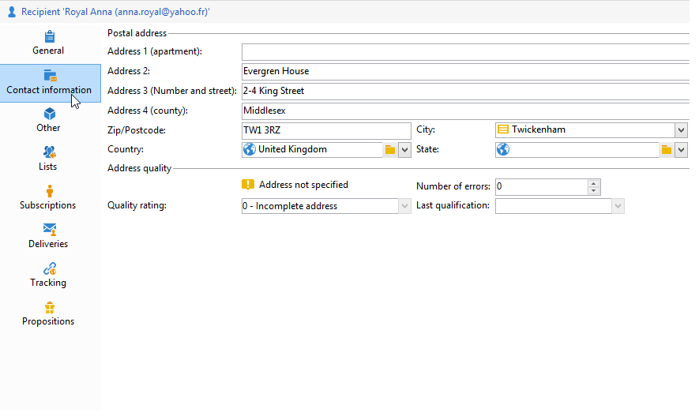
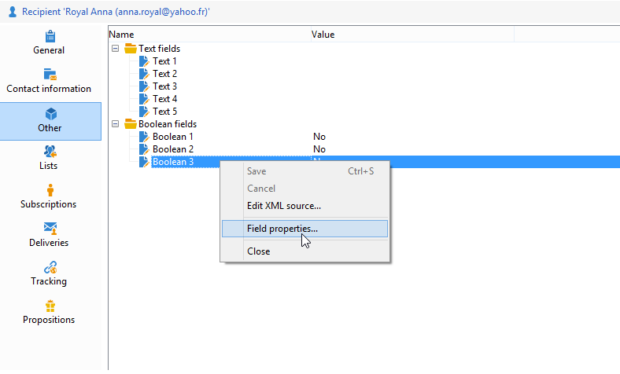

# Modificare un profilo{#editing-a-profile}

Per visualizzare le informazioni relative a un profilo, fare clic sul nome nell&#39;elenco dei profili.

I dettagli del profilo vengono visualizzati in una nuova scheda.

I dati relativi ai profili sono raggruppati in schede.

Le schede e il loro contenuto dipendono dalla configurazione e dai pacchetti installati.

>[!CAUTION]
>
>Lo schema XML e il modulo relativo ai campi nella tabella dei profili sono accessibili tramite il nodo **[!UICONTROL Administration > Configuration > Data schemas]** della struttura Adobe Campaign. Solo gli utenti esperti possono apportare modifiche a questi schemi.
>
>Per ulteriori informazioni, consultare [questa pagina](../../configuration/using/about-schema-edition.md).

## Scheda Generale {#general-tab}

Questa schermata contiene tutti i dati generali sul profilo selezionato. In particolare, contiene il cognome, il nome, l’indirizzo e-mail, il formato di ricezione e-mail, ecc. Ecco come si presenta:

>[!NOTE]
>
>Quando l&#39;opzione **[!UICONTROL No longer contact (by any channel)]** è selezionata, significa che il profilo è in fase di inserisco nell&#39;elenco Bloccati di annullamento dell&#39;iscrizione, ovvero il profilo ha espresso il desiderio di non essere contattato (ad esempio, facendo clic su un collegamento di annullamento dell&#39;iscrizione in una newsletter). Non saranno più oggetto di consegne su alcun canale (e-mail, direct mailing, ecc.). Per ulteriori informazioni, consulta [questa pagina](../../delivery/using/understanding-quarantine-management.md).

## Scheda Informazioni di contatto {#contact-information-tab}

Questa schermata contiene l’indirizzo di direct mailing del profilo selezionato. Ecco come si presenta:

Questa schermata mostra l’indice di qualità dell’indirizzo e quanti errori contiene l’indirizzo. Queste informazioni vengono utilizzate direttamente dal gestore della posta in base al numero di errori rilevati durante le consegne precedenti e non possono essere modificate manualmente.

## Altra scheda {#other-tab}

Questa schermata contiene campi definiti dall’utente che possono essere personalizzati in base ai requisiti. È inoltre possibile modificare i nomi dei campi e definirne il formato tramite **[!UICONTROL Field properties...]**, come illustrato di seguito:

>[!NOTE]
>
>Per ulteriori informazioni sulle proprietà dei campi e sull&#39;aggiunta di campi, consulta [questa pagina](../../configuration/using/new-field-wizard.md).

## Scheda Elenchi {#lists-tab}

Questa schermata visualizza i gruppi a cui appartiene il profilo selezionato. Fare clic su **[!UICONTROL Add]** per sottoscrivere il profilo a un elenco. Fare clic su **[!UICONTROL Detail]** per visualizzare la descrizione e l&#39;elenco dei profili nell&#39;elenco selezionato.

Per ulteriori informazioni, consulta [Creare e gestire gli elenchi](../../platform/using/creating-and-managing-lists.md).

## Scheda Iscrizioni {#subscriptions-tab}

Questa schermata contiene i servizi di informazioni a cui il profilo si è abbonato.

Il pulsante **[!UICONTROL Detail]** visualizza le proprietà della sottoscrizione selezionata. Il pulsante **[!UICONTROL Add]** viene utilizzato per aggiungere manualmente una nuova sottoscrizione.

Per ulteriori informazioni, consulta [questa pagina](../../delivery/using/managing-subscriptions.md).

## Scheda Consegne {#deliveries-tab}

In questa schermata vengono visualizzati i registri di consegna per il profilo selezionato. Puoi anche visualizzare le etichette, le date e lo stato delle azioni di consegna indirizzate al profilo tramite tutti i canali.

## Scheda Tracciamento {#tracking-tab}

Questa schermata ti consente di visualizzare i registri di tracciamento per il profilo selezionato. Queste informazioni vengono utilizzate per tenere traccia del comportamento del profilo dopo le consegne.

Questa scheda mostra il totale cumulativo di tutti gli URL tracciati nelle consegne.

L’elenco è configurabile e in genere contiene: l’URL su cui è stato fatto clic, la data e l’ora del clic e il documento che conteneva l’URL.

>[!NOTE]
>
>Per ulteriori informazioni sulla funzionalità di tracciamento, consulta [questa pagina](../../delivery/using/delivery-dashboard.md).
