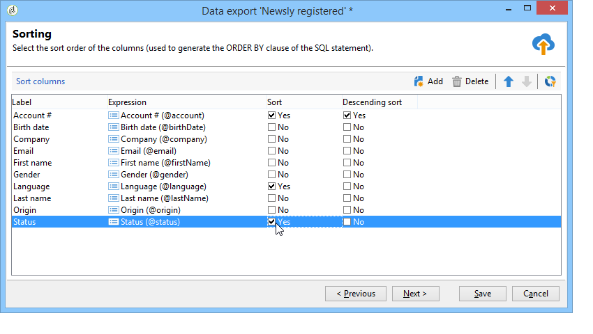

# Configurare i processi di esportazione {#executing-export-jobs}

I processi di esportazione consentono di accedere ed estrarre dati dal database: contatti, client, elenchi, segmenti, ecc.

Ad esempio, può essere utile utilizzare i dati di tracciamento delle campagne (cronologia di tracciamento, ecc.) in un foglio di calcolo. I dati di output possono essere in formato TXT, CSV, TAB o XML.

La procedura guidata di esportazione consente di configurare un’esportazione, definirne le opzioni e avviarne l’esecuzione. Si tratta di una serie di schermate il cui contenuto dipende dal tipo di esportazione (semplice o multipla) e dai diritti dell’operatore.

La procedura guidata di esportazione viene visualizzata dopo la creazione di un nuovo processo di esportazione (consulta [Creare processi di importazione ed esportazione](../../platform/using/creating-import-export-jobs.md).

## Passaggio 1: scegli il modello di esportazione {#step-1---choosing-the-export-template}

Quando si avvia la procedura guidata di esportazione, è innanzitutto necessario selezionare un modello. Ad esempio, per configurare l’esportazione dei destinatari che si sono registrati di recente, effettua le seguenti operazioni:

1. Seleziona la cartella **[!UICONTROL Profiles and Targets > Job > Generic imports and exports]** .
1. Fai clic su **Nuovo**, quindi fai clic su **Esporta** per creare il modello di esportazione.

   

1. Fai clic sulla freccia a destra del campo **[!UICONTROL Export template]** per selezionare il modello, oppure fai clic su **[!UICONTROL Select link]** per sfogliare la struttura.

   Il modello nativo è **[!UICONTROL New text export]**. Questo modello non deve essere modificato, ma puoi duplicarlo per configurarne uno nuovo. Per impostazione predefinita, i modelli di esportazione vengono salvati nel nodo **[!UICONTROL Resources > Templates > Job templates]** .

1. Immetti un nome per l’esportazione nel campo **[!UICONTROL Label]** . Puoi aggiungere una descrizione.
1. Seleziona il tipo di esportazione. Esistono due possibili tipi di esportazione: **[!UICONTROL Simple export]** per esportare un solo file e **[!UICONTROL Multiple export]** per esportare più file in una sola esecuzione, da uno o più tipi di documenti di origine.

## Passaggio 2 - Tipo di file da esportare {#step-2---type-of-file-to-export}

Selezionare il tipo di documento da esportare, ovvero lo schema dei dati da esportare.

Per impostazione predefinita, quando l’esportazione viene avviata dal nodo **[!UICONTROL Jobs]** i dati provengono dalla tabella dei destinatari. Quando l’esportazione viene avviata da un elenco di dati (dal menu **[!UICONTROL right click > Export]** ), la tabella a cui appartengono i dati viene compilata automaticamente nel campo **[!UICONTROL Document type]** .

* Per impostazione predefinita, è selezionata l’opzione **[!UICONTROL Download the file generated on the server after the export]** . Nel campo **[!UICONTROL Local file]**, compila il nome e il percorso del file da creare oppure sfoglia il disco locale facendo clic sulla cartella a destra del campo. È possibile deselezionare questa opzione per immettere il percorso di accesso e il nome del file di output del server.

   >[!NOTE]
   >
   >I processi di importazione ed esportazione automatici vengono sempre eseguiti sul server.
   >
   >Per esportare solo alcuni dati, fai clic su **[!UICONTROL Advanced parameters]** e immetti il numero di righe da esportare nel campo appropriato.

* Puoi creare un’esportazione differenziale per esportare solo i record modificati dall’ultima esecuzione. A questo scopo, fai clic sul collegamento **[!UICONTROL Advanced parameters]**, quindi sulla scheda **[!UICONTROL Differential export]** , quindi seleziona **[!UICONTROL Activate differential export]**.

   

   Devi immettere la data dell’ultima modifica. Può essere recuperato da un campo o calcolato.

## Passaggio 3: definire il formato di output {#step-3---defining-the-output-format}

Selezionare un formato di output per il file di esportazione. È possibile utilizzare i seguenti formati: testo, testo a colonna fissa, CSV e XML.

* Per il formato **[!UICONTROL Text]** , seleziona i delimitatori per separare le colonne (tabulazioni, virgole, punti e virgola o personalizzate) e le stringhe (virgolette singole o doppie o nessuna).
* Per **[!UICONTROL text]** e **[!UICONTROL CSV]**, puoi selezionare l’opzione **[!UICONTROL Use first lines as column titles]**.
* Indicare il formato della data e il formato del numero. A questo scopo, fai clic sul pulsante **[!UICONTROL Edit]** per il campo interessato e utilizza l’editor.
* Per i campi contenenti valori enumerati, puoi selezionare **[!UICONTROL Export labels instead of internal values of enumerations]**. Ad esempio, il titolo può essere memorizzato nel modulo **1=Sig.**,  **2=Sig.na**,  **3=Sig.ra**. Se questa opzione è selezionata, verranno esportati **Sig**, **Miss** e **Sig.ra**.

## Passaggio 4: selezione dei dati {#step-4---data-selection}

Seleziona i campi da esportare. Per eseguire questa operazione:

1. Fare doppio clic sui campi desiderati nell&#39;elenco **[!UICONTROL Available fields]** per aggiungerli alla sezione **[!UICONTROL Output columns]**.
1. Utilizzare le frecce a destra dell’elenco per definire l’ordine dei campi nel file di output.

   

1. Fai clic sul pulsante **[!UICONTROL Add]** per attivare le funzioni. Per ulteriori informazioni, consulta [Elenco di funzioni](../../platform/using/defining-filter-conditions.md#list-of-functions).

## Passaggio 5: ordinare le colonne {#step-5---sorting-columns}

Selezionare l’ordinamento delle colonne.

## Passaggio 6: filtrare le condizioni {#step-6---filter-conditions-}

Puoi aggiungere condizioni di filtro per evitare di esportare tutti i dati. La configurazione di questo filtro è la stessa del targeting del destinatario nella procedura guidata di consegna. Consulta [questa pagina](../../delivery/using/steps-defining-the-target-population.md).

## Passaggio 7: formattazione dei dati {#step-7---data-formatting}

È possibile modificare l’ordine e l’etichetta dei campi per il file di output e applicare le trasformazioni ai dati di origine.

* Per modificare l’ordine delle colonne da esportare, selezionare la colonna interessata e utilizzare le frecce blu a destra della tabella.
* Per modificare l’etichetta di un campo, fai clic nella cella della colonna **[!UICONTROL Label]** che corrisponde al campo da modificare e immetti la nuova etichetta. Premere Invio sulla tastiera per confermare.
* Per applicare una trasformazione maiuscole/minuscole al contenuto di un campo, selezionala dalla colonna **[!UICONTROL Transformation]**. Puoi selezionare:

   * Passa a minuscolo
   * Passa al maiuscolo
   * Prima lettera in maiuscolo

   

* Fare clic su **[!UICONTROL Add a calculated field]** se si desidera creare un nuovo campo calcolato (ad esempio, una colonna contenente cognome + nome). Per ulteriori informazioni, consulta [Campi calcolati](../../platform/using/executing-import-jobs.md#calculated-fields).

Se esporti una raccolta di elementi (ad esempio le sottoscrizioni dei destinatari, gli elenchi a cui appartengono, ecc.), devi specificare il numero di elementi nella raccolta da esportare.

## Passaggio 8: anteprima dati {#step-8---data-preview}

Fai clic su **[!UICONTROL Start the preview of the data]** per un&#39;anteprima del risultato dell&#39;esportazione. Per impostazione predefinita, vengono visualizzate le prime 200 righe. Per modificare questo valore, fai clic sulle frecce a destra del campo **[!UICONTROL Lines to display]** .

Fai clic sulle schede nella parte inferiore della procedura guidata per passare dall’anteprima dei risultati in colonne ai risultati in XML. È inoltre possibile visualizzare le query SQL generate.

## Passaggio 9 - Avvia l&#39;esportazione {#step-9---launching-the-export}

Fai clic su **[!UICONTROL Start]** per avviare l’esportazione dei dati.

Puoi quindi monitorare l’esecuzione del processo di importazione (consulta [Monitorare l’esecuzione dei processi](../../platform/using/monitoring-jobs-execution.md).
