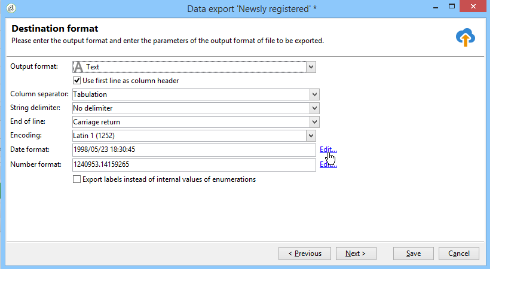

# Configurare i processi di esportazione {#executing-export-jobs}

I processi di esportazione ti consentono di accedere ed estrarre dati dal database: contatti, client, elenchi, segmenti, ecc.

Ad esempio, può essere utile utilizzare i dati di tracciamento delle campagne (cronologia di tracciamento, ecc.) in un foglio di calcolo. I dati di output possono essere in formato TXT, CSV, TAB o XML.

L’esportazione guidata consente di configurare un’esportazione, definirne le opzioni e avviarne l’esecuzione. Si tratta di una serie di schermate il cui contenuto dipende dal tipo di esportazione (semplice o multipla) e dai diritti dell’operatore.

L’esportazione guidata viene visualizzata dopo la creazione di un nuovo processo di esportazione (vedi [Creare processi di importazione ed esportazione](../../platform/using/creating-import-export-jobs.md).

## Passaggio 1: scegliere il modello di esportazione {#step-1---choosing-the-export-template}

Quando si avvia l&#39;esportazione guidata, è necessario selezionare un modello. Ad esempio, per configurare l’esportazione dei destinatari che si sono registrati di recente, effettua le seguenti operazioni:

1. Seleziona la **[!UICONTROL Profiles and Targets > Job > Generic imports and exports]** cartella.
1. Clic **Nuovo** e quindi fare clic su **Esporta** per creare il modello di esportazione.

   

1. Fare clic sulla freccia a destra della **[!UICONTROL Export template]** per selezionare il modello, oppure fare clic su **[!UICONTROL Select link]** per sfogliare l&#39;albero.

   Il modello nativo è **[!UICONTROL New text export]**. Questo modello non deve essere modificato, ma puoi duplicarlo per configurarne uno nuovo. Per impostazione predefinita, i modelli di esportazione vengono salvati in **[!UICONTROL Resources > Templates > Job templates]** nodo.

1. Immetti un nome per l&#39;esportazione nel **[!UICONTROL Label]** campo. Puoi aggiungere una descrizione.
1. Seleziona il tipo di esportazione. Esistono due possibili tipi di esportazione: **[!UICONTROL Simple export]** per esportare un solo file, e **[!UICONTROL Multiple export]** per esportare più file in una singola esecuzione da uno o più tipi di documenti di origine.

## Passaggio 2: tipo di file da esportare {#step-2---type-of-file-to-export}

Selezionare il tipo di documento da esportare, ovvero lo schema dei dati da esportare.

Per impostazione predefinita, quando l’esportazione viene avviata da **[!UICONTROL Jobs]** nodo i dati provengono dalla tabella dei destinatari. Quando l’esportazione viene avviata da un elenco di dati (dal **[!UICONTROL right click > Export]** ), la tabella a cui appartengono i dati viene automaticamente compilata nel **[!UICONTROL Document type]** campo.

* Per impostazione predefinita, il **[!UICONTROL Download the file generated on the server after the export]** è selezionata. In **[!UICONTROL Local file]** inserire il nome e il percorso del file da creare oppure sfogliare il disco locale facendo clic sulla cartella a destra del campo. È possibile deselezionare questa opzione per immettere il percorso di accesso e il nome del file di output del server.

  >[!NOTE]
  >
  >I processi di importazione ed esportazione automatici vengono sempre eseguiti sul server.
  >
  >Per esportare solo alcuni dati, fare clic su **[!UICONTROL Advanced parameters]** e immettere il numero di righe da esportare nel campo appropriato.

* È possibile creare un&#39;esportazione differenziale per esportare solo i record modificati dopo l&#39;ultima esecuzione. A questo scopo, fai clic su **[!UICONTROL Advanced parameters]** , quindi fare clic sul pulsante **[!UICONTROL Differential export]** , quindi seleziona **[!UICONTROL Activate differential export]**.

  

  Immettere la data dell&#39;ultima modifica. Può essere recuperato da un campo o calcolato.

## Passaggio 3: definire il formato di output {#step-3---defining-the-output-format}

Selezionate un formato di output per il file di esportazione. È possibile utilizzare i seguenti formati: testo, testo a colonne fisse, CSV e XML.

* Per **[!UICONTROL Text]** , selezionare i delimitatori per separare le colonne (tabulazioni, virgole, punti e virgola o personalizzate) e le stringhe (virgolette singole o doppie o nessuna).
* Per **[!UICONTROL text]** e **[!UICONTROL CSV]**, è possibile selezionare l’opzione **[!UICONTROL Use first lines as column titles]**.
* Indicare il formato della data e del numero. A questo scopo, fai clic su **[!UICONTROL Edit]** per il campo interessato e utilizza l’editor.
* Per i campi contenenti valori enumerati, puoi selezionare **[!UICONTROL Export labels instead of internal values of enumerations]**. Ad esempio, il titolo può essere memorizzato nel modulo **1=Sig.**, **2=Non risposta**, **3=Sig.ra**. Se questa opzione è selezionata, **Sig.**, **Signorina** e **Sig.ra** verrà esportato.

## Passaggio 4: selezione dei dati {#step-4---data-selection}

Selezionare i campi da esportare. Per eseguire questa operazione:

1. Fare doppio clic sui campi desiderati nella **[!UICONTROL Available fields]** per aggiungerli al **[!UICONTROL Output columns]** sezione.
1. Utilizzare le frecce a destra dell&#39;elenco per definire l&#39;ordine dei campi nel file di output.

   

1. Fai clic su **[!UICONTROL Add]** per attivare le funzioni. Per ulteriori informazioni, consulta [Elenco delle funzioni](../../platform/using/defining-filter-conditions.md#list-of-functions).

## Passaggio 5: ordinare le colonne {#step-5---sorting-columns}

Selezionare l&#39;ordinamento delle colonne.

## Passaggio 6 - Condizioni del filtro {#step-6---filter-conditions-}

Puoi aggiungere condizioni di filtro per evitare di esportare tutti i dati. La configurazione di questo filtro è la stessa del targeting dei destinatari nella procedura guidata di consegna. Consulta [questa pagina](../../delivery/using/steps-defining-the-target-population.md).

## Passaggio 7: formattazione dei dati {#step-7---data-formatting}

È possibile modificare l&#39;ordine e l&#39;etichetta dei campi per il file di output e applicare le trasformazioni ai dati di origine.

* Per modificare l’ordine delle colonne da esportare, seleziona la colonna interessata e utilizza le frecce blu a destra della tabella.
* Per modificare l’etichetta di un campo, fai clic su nella cella del **[!UICONTROL Label]** che corrisponde al campo da modificare e immettere la nuova etichetta. Premere Invio sulla tastiera per confermare.
* Per applicare una trasformazione del caso al contenuto di un campo, selezionarlo dal **[!UICONTROL Transformation]** colonna. Puoi selezionare:

   * Passa al carattere minuscolo
   * Passa al carattere maiuscolo
   * Prima lettera in carattere maiuscolo

  

* Clic **[!UICONTROL Add a calculated field]** se si desidera creare un nuovo campo calcolato, ad esempio una colonna contenente cognome + nome. Per ulteriori informazioni, consulta [Campi calcolati](../../platform/using/executing-import-jobs.md#calculated-fields).

Se esporti una raccolta di elementi (ad esempio le sottoscrizioni dei destinatari, gli elenchi a cui appartengono e così via), devi specificare il numero di elementi della raccolta da esportare.

## Passaggio 8: anteprima dei dati {#step-8---data-preview}

Clic **[!UICONTROL Start the preview of the data]** per un&#39;anteprima del risultato dell&#39;esportazione. Per impostazione predefinita, vengono visualizzate le prime 200 righe. Per modificare questo valore, fare clic sulle frecce a destra del **[!UICONTROL Lines to display]** campo.

Fare clic sulle schede nella parte inferiore della procedura guidata per passare dall&#39;anteprima dei risultati nelle colonne ai risultati in XML. È inoltre possibile visualizzare le query SQL generate.

## Passaggio 9: avviare l’esportazione {#step-9---launching-the-export}

Clic **[!UICONTROL Start]** per avviare l&#39;esportazione dei dati.

Puoi quindi monitorare l’esecuzione del processo di importazione (consulta [Monitorare l’esecuzione dei processi](../../platform/using/monitoring-jobs-execution.md).
