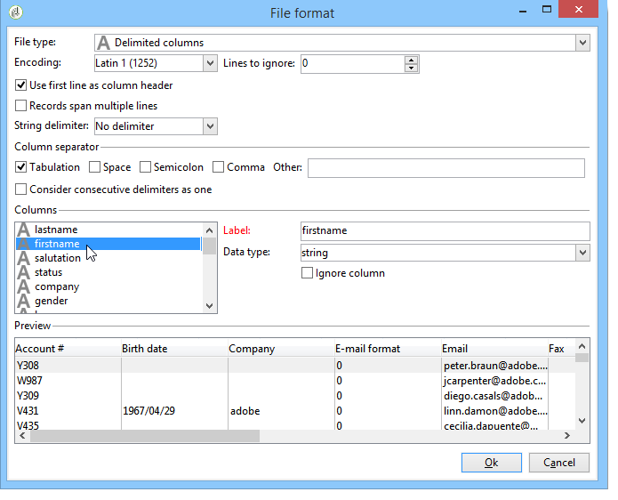

# Configurare i processi di importazione {#executing-import-jobs}

Adobe Campaign consente di importare nel database dati da uno o più file in formato testo, CSV, TAB o XML. Questi file sono associati a una tabella (principale o collegata) e ogni campo dei file di origine è associato a un campo del database.

>[!NOTE]
>
>È possibile importare i dati senza eseguirne il mapping con i dati del database utilizzando **[!UICONTROL Import a list]** funzione. I dati possono quindi essere utilizzati esclusivamente nei flussi di lavoro tramite **[!UICONTROL Read list]** oggetto. Per ulteriori informazioni, consulta [questa pagina](../../workflow/using/read-list.md).

L’importazione guidata consente di configurare un’importazione, definirne le opzioni (ad esempio, la trasformazione dei dati) e avviarne l’esecuzione. Si tratta di una serie di schermate il cui contenuto dipende dal tipo di importazione (semplice o multipla) e dai diritti dell’operatore.

L’Importazione guidata viene visualizzata dopo la creazione di un nuovo processo di importazione (consulta [Creare processi di importazione ed esportazione](../../platform/using/creating-import-export-jobs.md).

>[!NOTE]
>
>Se si utilizza un server Web IIS, potrebbe essere necessaria una configurazione per autorizzare il caricamento di file di grandi dimensioni (>28 MB). Per ulteriori informazioni, consulta [questa sezione](../../installation/using/integration-into-a-web-server-for-windows.md#changing-the-upload-file-size-limit).

## File sorgente {#source-file}

Nel file di origine, ogni riga coincide con un record. I dati nei record sono separati da delimitatori (spazio, tabulazione, carattere, ecc.). Ciò significa che i dati vengono recuperati sotto forma di colonne e che ogni colonna è associata a un campo del database.

## Passaggio 1: scegliere il modello di importazione {#step-1---choosing-the-import-template}

Quando si avvia l&#39;importazione guidata, è necessario selezionare un modello. Ad esempio, per configurare l’importazione dei destinatari che hanno ricevuto una newsletter, effettua le seguenti operazioni:

1. Seleziona la **[!UICONTROL Profiles and Targets > Job > Generic imports and exports]** cartella.
1. Clic **Nuovo** e quindi fare clic su **Importa** per creare il modello di importazione.

   

1. Fare clic sulla freccia a destra della **[!UICONTROL Import template]** per selezionare il modello, oppure fare clic su **[!UICONTROL Select link]** per sfogliare l&#39;albero.

   Il modello nativo è **[!UICONTROL New text import]**. Questo modello non deve essere modificato, ma puoi duplicarlo per configurarne uno nuovo a seconda delle tue esigenze. Per impostazione predefinita, i modelli di importazione vengono salvati in **[!UICONTROL Profiles and targets > Templates > Job templates]** nodo.

1. Immetti un nome per questa importazione in **[!UICONTROL Label]** campo. Puoi aggiungere una descrizione.
1. Seleziona il tipo di importazione nel campo appropriato. Esistono due possibili tipi di importazione: **[!UICONTROL Simple import]** per importare un solo file e **[!UICONTROL Multiple import]** per importare più file in una singola esecuzione.

   Per un’importazione multipla, seleziona **[!UICONTROL Multiple import]** dal **[!UICONTROL Import type]** nella prima schermata dell&#39;importazione guidata.

   

1. Specificare i campi da importare facendo clic su **[!UICONTROL Add]**.

   

   Ogni volta che viene aggiunto un file, la schermata **[!UICONTROL File to import]** viene visualizzata la procedura guidata. Vedere la sezione [Passaggio 2: selezione del file di origine](#step-2---source-file-selection) e segui i passaggi della procedura guidata per definire le opzioni di importazione come per un’importazione semplice.

   >[!NOTE]
   >
   >Le importazioni multiple devono soddisfare solo esigenze specifiche e non sono consigliate.

### Parametri avanzati {#advanced-parameters}

Il **[!UICONTROL Advanced parameters]** Il collegamento ti consente di accedere alle seguenti opzioni:

* **[!UICONTROL General]** scheda

   * **[!UICONTROL Stop execution if there are too many rejects]**

     Questa opzione è selezionata per impostazione predefinita. Puoi deselezionarla se desideri continuare a eseguire l’importazione indipendentemente dal numero di rifiuti. Per impostazione predefinita, l’esecuzione viene interrotta se le prime 100 righe vengono rifiutate.

   * **[!UICONTROL Trace mode]**

     Selezionare questa opzione per tenere traccia dell&#39;esecuzione dell&#39;importazione per ogni riga.

   * **[!UICONTROL Start the job in a detached process]**

     Questa opzione è selezionata per impostazione predefinita. Consente di scollegare l’esecuzione dell’importazione in modo che non influisca su altri processi in corso nel database.

   * **[!UICONTROL Do not update enumerations]**

     Selezionare questa opzione per evitare di arricchire l&#39;elenco dei valori enumerati nel database. Consulta [Gestire le enumerazioni](../../platform/using/managing-enumerations.md).

* **[!UICONTROL Variables]** scheda

  Puoi definire le variabili associate al processo che saranno accessibili negli editor delle query e nei campi calcolati. Per creare una variabile, fai clic su **[!UICONTROL Add]** e utilizza l’editor delle variabili.

  >[!IMPORTANT]
  >
  >Il **[!UICONTROL Variables]** La scheda è solo per l’utilizzo di programmazione di tipo Flusso di lavoro e deve essere configurata solo da utenti esperti.

## Passaggio 2: selezione del file di origine {#step-2---source-file-selection}

Il file di origine può essere in formato testo (txt, csv, tab, colonne fisse) o xml.

Per impostazione predefinita, **[!UICONTROL Upload file on the server]** è selezionato. Fai clic sulla cartella a destra della **[!UICONTROL Local file]** per sfogliare il disco locale e selezionare il file da importare. È possibile deselezionare questa opzione per immettere il percorso di accesso e il nome del file da importare se si trova sul server.

Una volta specificato il file, è possibile visualizzarne i dati nella sezione inferiore della finestra facendo clic su **[!UICONTROL Auto-detect format]**. Questa anteprima mostra le prime 200 righe del file di origine.

Utilizza le opzioni offerte sopra questa vista per configurare l’importazione. I parametri definiti tramite queste opzioni vengono trasferiti nell’anteprima. Sono disponibili le seguenti opzioni:

* **[!UICONTROL Click here to change the file format...]** consente di controllare il formato del file e perfezionare la configurazione.
* **[!UICONTROL Update on server...]** consente di trasferire il file locale al server. Questa opzione è disponibile solo se **[!UICONTROL Upload file on the server]** è selezionato.
* **[!UICONTROL Download]** è disponibile solo se il file è stato caricato sul server.
* **[!UICONTROL Auto-detect format]** viene utilizzato per reinizializzare il formato dell&#39;origine dati. Questa opzione consente di riapplicare i formati originali ai dati formattati tramite il **[!UICONTROL Click here to change the file format...]** opzione.
* Il **[!UICONTROL Advanced parameters]** consente di filtrare i dati di origine e di accedere alle opzioni avanzate. Da questa schermata, puoi scegliere di importare solo una parte del file. Puoi anche definire un filtro, ad esempio per importare solo gli utenti di tipo &quot;Potenziale cliente&quot; o &quot;Cliente&quot;, in base al valore della riga corrispondente. Queste opzioni devono essere utilizzate solo da utenti JavaScript esperti.

### Modificare il formato del file {#changing-the-file-format}

Il **[!UICONTROL Click here to change the file format...]** consente di formattare i dati del file di origine, in particolare per specificare il separatore di colonna e il tipo di dati per ciascun campo. Questa configurazione viene eseguita tramite la seguente finestra:

Questo passaggio ti consente di descrivere come leggere i valori dei campi del file. Ad esempio, nel caso di una data, i dati Data o Data + Ora possono essere associati a un formato (gg/mm/aaaa, mm/gg/aa, ecc.). Se i dati di input non corrispondono al formato previsto, durante l’importazione si verificheranno dei rifiuti.

È possibile visualizzare il risultato della configurazione nella zona di anteprima nella parte inferiore della finestra.

Clic **[!UICONTROL OK]** per salvare la formattazione, fai clic su **[!UICONTROL Next]** per visualizzare il passaggio successivo.

## Passaggio 3: mappatura dei campi {#step-3---field-mapping}

È quindi necessario selezionare lo schema di destinazione e mappare i dati di ciascuna colonna sui campi del database.

* Il **[!UICONTROL Destination schema]** consente di selezionare lo schema in cui importare i dati. Queste informazioni sono obbligatorie. Fai clic su **[!UICONTROL Select link]** per selezionare uno degli schemi esistenti. Clic **[!UICONTROL Edit link]** per visualizzare il contenuto della tabella selezionata.
* La tabella centrale mostra tutti i campi definiti nel file di origine. Selezionare i campi da importare per associare ad essi un file di destinazione. Questi campi possono essere mappati manualmente o automaticamente.

  Per mappare manualmente un campo, fare clic sulla casella di controllo per selezionare il campo di origine, quindi fare clic sulla seconda colonna per attivare la cella corrispondente al campo selezionato. Quindi, fai clic su **[!UICONTROL Edit expression]** per visualizzare tutti i campi della tabella corrente. Seleziona il campo di destinazione e fai clic su **[!UICONTROL OK]** per convalidare la mappatura.

  Per associare automaticamente i campi di origine e di destinazione, fare clic sul pulsante **[!UICONTROL Guess the destination fields]** a destra dell’elenco dei campi. Se necessario, i campi proposti possono essere modificati.

  >[!IMPORTANT]
  >
  >Il risultato di questa operazione deve sempre essere convalidato prima di procedere al passaggio successivo.

* È possibile applicare una trasformazione ai campi importati. A questo scopo, fai clic su nella cella del **[!UICONTROL Transformation]** che si riferisce al campo in questione e selezionare la trasformazione da applicare.

  

  >[!IMPORTANT]
  >
  >La trasformazione viene applicata al momento dell’importazione. Tuttavia, se sono stati definiti vincoli sul campo di destinazione (nell’esempio precedente, sul campo di @lastname), questi vincoli hanno la priorità.

* Puoi aggiungere campi calcolati utilizzando l’icona appropriata, situata a destra della tabella centrale. I campi calcolati consentono di eseguire trasformazioni complesse, aggiungere colonne virtuali o unire i dati di più colonne. Per informazioni dettagliate sulle varie possibilità, consulta le sezioni seguenti.

### Campi calcolati {#calculated-fields}

I campi calcolati sono nuove colonne aggiunte al file di origine e calcolate da altre colonne. I campi calcolati possono quindi essere associati ai campi del database di Adobe Campaign. Le operazioni di riconciliazione, tuttavia, non sono possibili sui campi calcolati.

Esistono quattro tipi di campi calcolati:

* **[!UICONTROL Fixed string]**: il valore del campo calcolato è lo stesso per tutte le righe del file di origine. Consente di impostare il valore di un campo dei record inseriti o aggiornati. Ad esempio, potete impostare un marcatore su &quot;yes&quot; per tutti i record importati.
* **[!UICONTROL String with JavaScript tags]**: il valore del campo calcolato è una stringa di caratteri contenente comandi JavaScript.
* **[!UICONTROL JavaScript expression]**: il valore del campo calcolato è il risultato della valutazione di una funzione JavaScript. Il valore restituito può essere un numero, una data e così via.
* **[!UICONTROL Enumeration]**: il valore del campo viene attribuito in base a un valore contenuto nel file di origine. L’editor consente di specificare la colonna di origine e di immettere l’elenco dei valori di enumerazione, come nell’esempio seguente:

  

  Il **[!UICONTROL Preview]** Questa scheda ti consente di visualizzare il risultato della configurazione definita. Ecco, il **[!UICONTROL Subscription]** è stata aggiunta la colonna. Il valore viene calcolato dalla **Stato** campo.

  

## Passaggio 4 - Riconciliazione {#step-4---reconciliation}

Il passaggio di riconciliazione dell’importazione guidata consente di definire la modalità di riconciliazione dei dati del file con i dati esistenti nel database e di impostare le regole di priorità tra i dati del file e i dati del database. La finestra di configurazione si presenta così:

La sezione centrale della schermata contiene una struttura con i campi e le tabelle del database Adobe Campaign in cui verranno importati i dati.

Sono disponibili opzioni speciali per ciascun nodo (tabella o campo). Quando fai clic sul nodo interessato nell’elenco, di seguito vengono visualizzati i relativi parametri e una breve descrizione. Il comportamento definito per ciascun elemento viene visualizzato nel **[!UICONTROL Behavior]** colonna.

### Tipi di operazioni {#types-of-operation}

Per ogni tabella interessata dall’importazione, è necessario definire il tipo di operazione. Per l&#39;elemento principale del database sono disponibili le seguenti operazioni:

* **[!UICONTROL Update or insertion]**: aggiorna il record se esiste nel database e, in caso contrario, lo crea.
* **[!UICONTROL Insertion]**: inserisce i record nel database.
* **[!UICONTROL Update]**: aggiorna solo i record esistenti (ignora gli altri record).
* **[!UICONTROL Reconciliation only]**: cerca il record nel database, ma non esegue un aggiornamento. Ad esempio, ti consente di associare la cartella dei destinatari da importare in base a una colonna del file senza aggiornare i dati nelle cartelle.
* **[!UICONTROL Deletion]**: consente di eliminare i record nel database.

Per ogni campo della tabella interessata dall’importazione sono disponibili le seguenti opzioni:

* **[!UICONTROL Update (empty) if source value is empty]**: in caso di aggiornamento, il valore nel campo rimuove il valore del database se il campo è vuoto nel file di origine. In caso contrario, viene mantenuto il campo del database.
* **[!UICONTROL Update only if destination is empty]**: il valore del file di origine non sovrascrive il valore del campo del database a meno che il campo del database non sia vuoto. In tal caso, assume il valore del file di origine.
* **[!UICONTROL Update the field only when the record is inserted]**: durante un’operazione di aggiornamento o inserimento, verranno importati solo i record dei file di origine nuovi.

>[!NOTE]
>
>La definizione di una chiave di riconciliazione è sempre **obbligatorio**, tranne in caso di inserimento senza deduplicazione.

### Chiavi riconciliazione {#reconciliation-keys}

Per gestire la deduplicazione è necessario specificare almeno una chiave di riconciliazione.

Una chiave di riconciliazione è un insieme di campi utilizzati per identificare un record. Ad esempio, per importare i destinatari, la chiave di riconciliazione può essere il numero dell’account, il campo &quot;e-mail&quot; o i campi &quot;Cognome, Nome, Società&quot; e così via.

In questo caso, per verificare se una riga di un file corrisponde a un destinatario esistente nel database, il motore di importazione confronta i valori del file con quelli del database per tutti i campi della chiave. Quando i campi sono specifici di un record, è possibile eseguire un confronto preciso tra i dati di origine e di destinazione, garantendo l’integrità dei dati dopo l’importazione. Una seconda chiave di riconciliazione può essere compilata per la stessa tabella; viene utilizzata per le righe la cui prima chiave è vuota.

Evita di scegliere un campo che potrebbe essere modificato durante l’importazione; in questo caso, il motore potrebbe creare record aggiuntivi.

>[!NOTE]
>
>Per un’importazione di destinatari, l’identificatore della cartella selezionata viene aggiunto implicitamente alla chiave.
>
>La riconciliazione viene quindi eseguita solo su questa cartella (a meno che non sia selezionata alcuna cartella).

### Deduplica {#deduplication}

>[!NOTE]
>
>Un &#39;double&#39; è un elemento che esiste due o più volte nel file da importare.
>
>Un duplicato è un elemento presente sia nel file da importare che nel database.

Il **[!UICONTROL Management of doubles]** consente di configurare la deduplicazione dei dati. La deduplicazione riguarda i record visualizzati più volte **nel file di origine** (o file di origine in caso di importazione di più file), ovvero righe per le quali i campi della chiave di riconciliazione sono identici.

* Gestione duplicata in **[!UICONTROL Update]** (modalità predefinita) non esegue la deduplicazione. L&#39;ultimo record ha quindi la priorità (in quanto aggiorna i dati dei record precedenti). Il conteggio dei duplicati non viene eseguito in questa modalità.
* Gestione duplicata in **[!UICONTROL Ignore]** modalità o **[!UICONTROL Reject entity]** esclude i duplicati dall’importazione. In questo caso, non viene importato alcun record.
* In entrata **[!UICONTROL Reject entity]** , l’elemento non viene importato e nei registri di importazione viene generato un errore.
* In entrata **[!UICONTROL Ignore]** , l’elemento non viene importato, ma non viene mantenuta alcuna traccia dell’errore. Questa modalità ti consente di ottimizzare le prestazioni.

>[!IMPORTANT]
>
>La deduplicazione viene eseguita solo in memoria. Le dimensioni di un’importazione con deduplicazione sono pertanto limitate. Il limite dipende da diversi parametri (capacità del server applicazioni, attività, numero di campi nella chiave, ecc.). La dimensione massima per una deduplicazione è dell&#39;ordine di 1.000.000 righe.

La deduplicazione riguarda un record presente sia nel file di origine che nel database. Riguarda solo le operazioni con aggiornamento (ovvero **[!UICONTROL Update and insertion]** o **[!UICONTROL Update]**). Il **[!UICONTROL Duplicate management]** consente di aggiornare o ignorare il record se si trova sia nel file di origine che nel database. Il **[!UICONTROL Update or insert based on origin]** L&#39;opzione appartiene al modulo opzionale e non può essere utilizzata in un contesto standard.

Le opzioni **[!UICONTROL Reject]** e **[!UICONTROL Ignore]** operare come indicato sopra.

### In caso di errore {#behavior-in-the-event-of-an-error}

La maggior parte delle operazioni di trasferimento dei dati genera vari tipi di errori (formato di riga incoerente, indirizzo e-mail non valido, ecc.). Tutti gli errori e gli avvisi generati dal motore di importazione vengono memorizzati e collegati all’istanza di importazione.

I dettagli di questi rifiuti possono essere visualizzati tramite **[!UICONTROL Rejects]** scheda.

Esistono due tipi di rifiuto (il tipo viene visualizzato nel **[!UICONTROL Connector]** colonna):

* I rifiuti del connettore di testo riguardano errori che si verificano durante l’elaborazione della riga di file (campo calcolato, analisi dei dati, ecc.). In questo caso, in caso di errore, l’intera riga viene sempre rifiutata.
* I rifiuti del connettore del database riguardano errori che si verificano durante la riconciliazione dei dati o la scrittura nel database. In caso di importazione in più tabelle, il rifiuto può riguardare solo una parte del record (ad esempio, per un’importazione di destinatari ed eventi associati, un errore può impedire l’aggiornamento di un evento senza rifiutare il destinatario).

Nella pagina di riconciliazione dei dati, puoi definire il tipo di gestione degli errori desiderato, campo per campo e tabella per tabella.

* **[!UICONTROL Ignore and log a warning]**: tutti i campi vengono importati nel database, tranne quello che ha generato un errore.
* **[!UICONTROL Reject parent element]**: viene rifiutata l’intera riga del record, non solo il campo che ha causato l’errore.
* **[!UICONTROL Reject all elements]**: l’importazione viene interrotta e tutti gli elementi del record vengono rifiutati.

  

La struttura nella schermata di rifiuto di un’istanza di importazione indica quali campi sono stati rifiutati e dove si sono verificati gli errori.

Puoi generare un file contenente questi record tramite **[!UICONTROL Export rejects]** icona:

## Passaggio 5: passaggio aggiuntivo durante l’importazione dei destinatari {#step-5---additional-step-when-importing-recipients}

Il passaggio successivo dell’importazione guidata consente di selezionare o creare la cartella in cui verranno importati i dati, mappare automaticamente i destinatari importati con un elenco (nuovo o esistente) e abbonare i destinatari a un servizio.

>[!NOTE]
>
>Questo passaggio viene visualizzato quando si importano solo i destinatari e quando si utilizza la tabella dei destinatari di Adobe Campaign predefinita (**nms:destinatario**).

* Fai clic su **[!UICONTROL Edit]** collegamenti per selezionare la cartella, l&#39;elenco o il servizio a cui si desidera associare o sottoscrivere i destinatari.

   1. Importazione in una cartella

      Il **[!UICONTROL Edit...]** collegamento del **[!UICONTROL Import into a folder]** consente di selezionare o creare la cartella in cui verranno importati i destinatari. Per impostazione predefinita, se non è definita alcuna partizione, i dati vengono importati nella cartella predefinita dell’operatore.

      >[!NOTE]
      >
      >La cartella predefinita di un operatore è la prima cartella per la quale l&#39;operatore dispone dell&#39;accesso in scrittura. Ulteriori informazioni in [Gestione dell’accesso alle cartelle](../../platform/using/access-management-folders.md).

      Per selezionare la cartella di importazione, fare clic sulla freccia a destra della **[!UICONTROL Folder]** e selezionare la cartella interessata. È inoltre possibile utilizzare **[!UICONTROL Select link]** per visualizzare la struttura in una nuova finestra o creare una nuova cartella.

      

      Per creare una nuova cartella, seleziona il nodo da cui desideri aggiungere una cartella e fai clic con il pulsante destro del mouse. Seleziona **[!UICONTROL Create a new 'Recipients' folder]**.

      

      La cartella viene aggiunta sotto il nodo corrente. Inserisci il nome della nuova cartella, premi Invio per confermare, quindi fai clic su **[!UICONTROL OK]**.

      

   1. Associazione a un elenco

      Il **[!UICONTROL Edit...]** collegamento in **[!UICONTROL Add recipients to a list]** consente di selezionare o creare un elenco in cui verranno importati i destinatari.

      

      Per creare un nuovo elenco per questi destinatari, fai clic su **[!UICONTROL Select link]**, quindi **[!UICONTROL Create]**. La creazione e la gestione degli elenchi sono presentate in [questa sezione](../../platform/using/creating-and-managing-lists.md).

      

      Puoi decidere di aggiungere i destinatari a quelli già presenti in un elenco o di ricrearlo con i nuovi destinatari. In questo caso, se l’elenco conteneva già dei destinatari, questi verranno eliminati e sostituiti dai destinatari importati.

   1. Iscrizione a un servizio

      Per abbonare tutti i destinatari importati a un servizio di informazioni, fai clic sul pulsante **[!UICONTROL Edit...]** collegamento del **[!UICONTROL Subscribe recipients to a service]** per selezionare o creare il servizio di informazioni a cui i destinatari saranno abbonati. È possibile selezionare **[!UICONTROL Send a confirmation message]** opzione: il contenuto di questo messaggio è definito nel modello di consegna associato al servizio di abbonamento.

      

      Per creare un nuovo servizio per questi destinatari, fai clic su **[!UICONTROL Select link]** e quindi il **[!UICONTROL Create]** icona. La gestione dei servizi di informazione è presentata in [questa sezione](../../delivery/using/managing-subscriptions.md).

* Utilizza il **[!UICONTROL Origin]** per aggiungere informazioni sull’origine dei destinatari ai loro profili. Queste informazioni sono particolarmente utili nel quadro di un’importazione multipla.

Clic **[!UICONTROL Next]** per convalidare questo passaggio e visualizzare il passaggio seguente.

## Passaggio 6: avviare l’importazione {#step-6---launching-the-import}

L’ultimo passaggio della procedura guidata consente di avviare l’importazione dei dati. A questo scopo, fai clic su **[!UICONTROL Start]** pulsante.

Puoi quindi monitorare l’esecuzione del processo di importazione (consulta [Monitorare l’esecuzione dei processi](../../platform/using/monitoring-jobs-execution.md).
