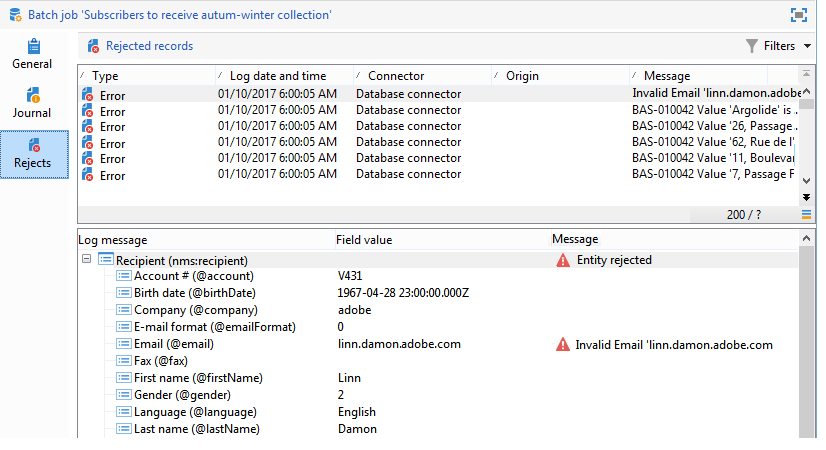
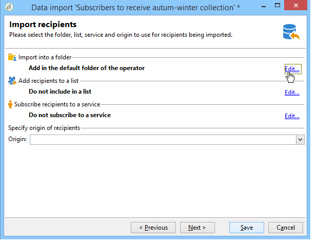

# Configurare i processi di importazione {#executing-import-jobs}

Adobe Campaign consente di importare dati nel database da uno o più file in formato testo, CSV, TAB o XML. Questi file sono associati a una tabella (principale o collegata) e ogni campo dei file di origine è associato a un campo del database.

>[!NOTE]
>
>Puoi importare i dati senza mapparli con i dati del database utilizzando **[!UICONTROL Import a list]** funzione . I dati possono quindi essere utilizzati esclusivamente nei flussi di lavoro tramite il **[!UICONTROL Read list]** oggetto. Per ulteriori informazioni, consulta [questa pagina](../../workflow/using/read-list.md).

La procedura guidata di importazione consente di configurare un’importazione, di definirne le opzioni (ad esempio la trasformazione dei dati) e di avviarne l’esecuzione. Si tratta di una serie di schermate il cui contenuto dipende dal tipo di importazione (semplice o multipla) e dai diritti dell’operatore.

Viene visualizzata la procedura guidata di importazione dopo la creazione di un nuovo processo di importazione (consulta [Creazione di processi di importazione ed esportazione](../../platform/using/creating-import-export-jobs.md).

>[!NOTE]
>
>Se utilizzi un server Web IIS, potrebbe essere necessaria una configurazione per autorizzare il caricamento di file di grandi dimensioni (>28 MB). Per ulteriori informazioni, consulta [questa sezione](../../installation/using/integration-into-a-web-server-for-windows.md#changing-the-upload-file-size-limit).

## File di origine {#source-file}

Nel file di origine, ogni riga coincide con un record. I dati contenuti nei record sono separati da delimitatori (spazio, tabulazione, carattere, ecc.). Ciò significa che i dati vengono recuperati sotto forma di colonne e che ogni colonna è associata a un campo del database.

## Passaggio 1: scegli il modello di importazione {#step-1---choosing-the-import-template}

Quando si avvia la procedura guidata di importazione, è innanzitutto necessario selezionare un modello. Ad esempio, per configurare l’importazione dei destinatari che hanno ricevuto una newsletter, effettua le seguenti operazioni:

1. Seleziona la **[!UICONTROL Profiles and Targets > Job > Generic imports and exports]** cartella.
1. Fai clic su **Nuovo** quindi fai clic su **Importa** per creare il modello di importazione.

   

1. Fai clic sulla freccia a destra della **[!UICONTROL Import template]** per selezionare il modello, oppure fai clic su **[!UICONTROL Select link]** per sfogliare l&#39;albero.

   Il modello nativo è **[!UICONTROL New text import]**. Questo modello non deve essere modificato, ma puoi duplicarlo per configurarne uno nuovo in base ai tuoi requisiti. Per impostazione predefinita, i modelli di importazione vengono salvati in **[!UICONTROL Profiles and targets > Templates > Job templates]** nodo.

1. Immettere un nome per l&#39;importazione nella **[!UICONTROL Label]** campo . Puoi aggiungere una descrizione.
1. Seleziona il tipo di importazione nel campo appropriato. Esistono due tipi possibili di importazione: **[!UICONTROL Simple import]** per importare un solo file, e **[!UICONTROL Multiple import]** per importare più file in una singola esecuzione.

   Per un’importazione multipla, seleziona **[!UICONTROL Multiple import]** dal **[!UICONTROL Import type]** elenco a discesa nella prima schermata della procedura guidata di importazione.

   

1. Specifica i campi da importare facendo clic su **[!UICONTROL Add]**.

   

   Ogni volta che viene aggiunto un file, la schermata **[!UICONTROL File to import]** viene visualizzata la procedura guidata. Vedere la sezione [Passaggio 2: selezione dei file di origine](#step-2---source-file-selection) e segui i passaggi della procedura guidata per definire le opzioni di importazione come per una semplice importazione.

   >[!NOTE]
   >
   >Le importazioni multiple devono soddisfare solo esigenze specifiche e non sono raccomandate.

### Parametri avanzati {#advanced-parameters}

La **[!UICONTROL Advanced parameters]** link consente di accedere alle seguenti opzioni:

* **[!UICONTROL General]** scheda

   * **[!UICONTROL Stop execution if there are too many rejects]**

      Questa opzione è selezionata per impostazione predefinita. Puoi deselezionare questa opzione se desideri continuare a eseguire l’importazione indipendentemente dal numero di rifiuti. Per impostazione predefinita, l’esecuzione viene interrotta se le prime 100 righe vengono rifiutate.

   * **[!UICONTROL Trace mode]**

      Seleziona questa opzione per tenere traccia dell’esecuzione dell’importazione per ogni riga.

   * **[!UICONTROL Start the job in a detached process]**

      Questa opzione è selezionata per impostazione predefinita. Ti consente di scollegare l’esecuzione dell’importazione in modo che non influisca sugli altri processi in corso sul database.

   * **[!UICONTROL Do not update enumerations]**

      Selezionare questa opzione per evitare di arricchire l’elenco dei valori enumerati nel database. Vedi [Gestire le enumerazioni](../../platform/using/managing-enumerations.md).

* **[!UICONTROL Variables]** scheda

   Puoi definire le variabili associate al processo che saranno accessibili negli editor delle query e nei campi calcolati. Per creare una variabile, fai clic su **[!UICONTROL Add]** e utilizza l&#39;editor di variabili.

   >[!IMPORTANT]
   >
   >La **[!UICONTROL Variables]** è solo per uso di programmazione di tipo Workflow e deve essere configurato solo da utenti esperti.

## Passaggio 2: selezione dei file di origine {#step-2---source-file-selection}

Il file di origine può essere in formato testo (txt, csv, tab, fixed columns) o xml.

Per impostazione predefinita, **[!UICONTROL Upload file on the server]** è selezionato. Fai clic sulla cartella a destra del **[!UICONTROL Local file]** per sfogliare il disco locale e selezionare il file da importare. È possibile deselezionare questa opzione per immettere il percorso di accesso e il nome del file da importare, se presente sul server.

Quando il file è stato specificato, è possibile visualizzarne i dati nella sezione inferiore della finestra facendo clic su **[!UICONTROL Auto-detect format]**. In questa anteprima vengono visualizzate le prime 200 righe del file di origine.

Utilizza le opzioni offerte in questa visualizzazione per configurare l’importazione. I parametri definiti tramite queste opzioni vengono trasferiti nell’anteprima. Sono disponibili le seguenti opzioni:

* **[!UICONTROL Click here to change the file format...]** consente di controllare il formato del file e di perfezionare la configurazione.
* **[!UICONTROL Update on server...]** consente di trasferire il file locale al server. Questa opzione è disponibile solo se **[!UICONTROL Upload file on the server]** è selezionato.
* **[!UICONTROL Download]** è disponibile solo se il file è stato caricato sul server.
* **[!UICONTROL Auto-detect format]** viene utilizzato per reinizializzare il formato dell&#39;origine dati. Questa opzione consente di riapplicare i formati originali ai dati formattati tramite il **[!UICONTROL Click here to change the file format...]** opzione .
* La **[!UICONTROL Advanced parameters]** link ti consente di filtrare i dati sorgente e di accedere alle opzioni avanzate. Da questa schermata, puoi scegliere di importare solo una parte del file. Puoi anche definire un filtro, ad esempio per importare solo gli utenti di tipo &quot;Prospect&quot; o &quot;Customer&quot;, in base al valore della riga corrispondente. Queste opzioni devono essere utilizzate solo dagli utenti JavaScript esperti.

### Modificare il formato del file {#changing-the-file-format}

La **[!UICONTROL Click here to change the file format...]** consente di formattare i dati del file di origine, in particolare per specificare il separatore di colonna e il tipo di dati per ciascun campo. Questa configurazione viene eseguita tramite la finestra seguente:

Questo passaggio ti consente di descrivere la lettura dei valori dei campi file. Ad esempio, nel caso di una data, i dati Data o Data + Ora possono essere associati a un formato (gg/mm/aaaa, mm/gg/aa, ecc.). Se i dati di input non corrispondono al formato previsto, si verificheranno dei rifiuti durante l’importazione.

Puoi visualizzare il risultato della configurazione nella zona di anteprima nella parte inferiore della finestra.

Fai clic su **[!UICONTROL OK]** per salvare la formattazione, fare clic su **[!UICONTROL Next]** per visualizzare il passaggio successivo.

## Passaggio 3 - Mappatura dei campi {#step-3---field-mapping}

È quindi necessario selezionare lo schema di destinazione e mappare i dati di ciascuna colonna sui campi del database.

* La **[!UICONTROL Destination schema]** consente di selezionare lo schema in cui verranno importati i dati. Queste informazioni sono obbligatorie. Fai clic sul pulsante **[!UICONTROL Select link]** per selezionare uno degli schemi esistenti. Fai clic su **[!UICONTROL Edit link]** per visualizzare il contenuto della tabella selezionata.
* La tabella centrale mostra tutti i campi definiti nel file di origine. Selezionare i campi da importare per associare un file di destinazione. Questi campi possono essere mappati manualmente o automaticamente.

   Per mappare manualmente un campo, fai clic sulla casella di controllo per selezionare il campo di origine, quindi fai clic sulla seconda colonna per attivare la cella corrispondente al campo selezionato. Fai clic su **[!UICONTROL Edit expression]** per visualizzare tutti i campi della tabella corrente. Seleziona il campo di destinazione e fai clic su **[!UICONTROL OK]** per convalidare la mappatura.

   Per associare automaticamente i campi di origine e di destinazione, fare clic sul pulsante **[!UICONTROL Guess the destination fields]** a destra dell’elenco dei campi. Se necessario, i campi proposti possono essere modificati.

   >[!IMPORTANT]
   >
   >Il risultato di questa operazione deve sempre essere convalidato prima di procedere al passaggio successivo.

* È possibile applicare una trasformazione ai campi importati. A questo scopo, fai clic nella cella del **[!UICONTROL Transformation]** colonna relativa al campo interessato e selezionare la trasformazione da applicare.

   

   >[!IMPORTANT]
   >
   >La trasformazione viene applicata al momento dell’importazione. Tuttavia, se sono stati definiti vincoli per il campo di destinazione (nell’esempio precedente, nel campo @lastname), questi vincoli hanno la priorità.

* Puoi aggiungere campi calcolati utilizzando l’icona appropriata, situata a destra della tabella centrale. I campi calcolati consentono di eseguire trasformazioni complesse, aggiungere colonne virtuali o unire i dati di più colonne. Per informazioni dettagliate sulle varie possibilità, fare riferimento alle sezioni seguenti.

### Campi calcolati {#calculated-fields}

I campi calcolati sono nuove colonne aggiunte al file di origine e calcolate da altre colonne. I campi calcolati possono quindi essere associati ai campi del database Adobe Campaign. Tuttavia, non è possibile effettuare operazioni di riconciliazione sui campi calcolati.

Esistono quattro tipi di campi calcolati:

* **[!UICONTROL Fixed string]**: il valore del campo calcolato è lo stesso per tutte le righe del file di origine. Consente di impostare il valore di un campo dei record inseriti o aggiornati. Ad esempio, puoi impostare un marcatore su &quot;sì&quot; per tutti i record importati.
* **[!UICONTROL String with JavaScript tags]**: il valore del campo calcolato è una stringa di caratteri contenente comandi JavaScript.
* **[!UICONTROL JavaScript expression]**: il valore del campo calcolato è il risultato della valutazione di una funzione JavaScript. Il valore restituito può essere un numero, una data, ecc.
* **[!UICONTROL Enumeration]**: il valore del campo viene attribuito in base a un valore contenuto nel file di origine. L’editor ti consente di specificare la colonna sorgente e di inserire l’elenco dei valori di enumerazione, come nell’esempio seguente:

   

   La **[!UICONTROL Preview]** consente di visualizzare il risultato della configurazione definita. Qui, il **[!UICONTROL Subscription]** è stata aggiunta una colonna . Il valore viene calcolato dalla variabile **Stato** campo .

   

## Passaggio 4 - Riconciliazione {#step-4---reconciliation}

Il passaggio di riconciliazione della procedura guidata di importazione consente di definire la modalità di riconciliazione dei dati del file con i dati esistenti nel database e di impostare le regole di priorità tra i dati del file e quelli del database. La finestra di configurazione si presenta così:

La sezione centrale della schermata contiene una struttura ad albero con i campi e le tabelle del database Adobe Campaign in cui verranno importati i dati.

Sono disponibili opzioni speciali per ciascun nodo (tabella o campo). Quando fai clic sul nodo interessato nell’elenco, sotto vengono visualizzati i relativi parametri e una breve descrizione. Il comportamento definito per ogni elemento viene visualizzato nel corrispondente **[!UICONTROL Behavior]** colonna.

### Tipi di operazioni {#types-of-operation}

Per ogni tabella interessata dall’importazione, è necessario definire il tipo di operazione. Per l&#39;elemento principale del database sono disponibili le seguenti operazioni:

* **[!UICONTROL Update or insertion]**: aggiorna il record se presente nel database e, in caso contrario, lo crea.
* **[!UICONTROL Insertion]**: inserisce record nel database.
* **[!UICONTROL Update]**: aggiorna solo i record esistenti (ignora gli altri record).
* **[!UICONTROL Reconciliation only]**: cerca il record nel database, ma non esegue un aggiornamento. Ad esempio, ti consente di associare la cartella dei destinatari da importare in base a una colonna del file senza aggiornare i dati presenti nelle cartelle.
* **[!UICONTROL Deletion]**: consente di eliminare i record nel database.

Per ciascun campo della tabella interessata dall’importazione sono disponibili le seguenti opzioni:

* **[!UICONTROL Update (empty) if source value is empty]**: in caso di aggiornamento, il valore nel campo rimuoverà il valore del database se il campo è vuoto nel file di origine. In caso contrario, il campo del database viene mantenuto.
* **[!UICONTROL Update only if destination is empty]**: il valore del file di origine non sovrascrive il valore nel campo del database a meno che il campo del database non sia vuoto. In questo caso, prende il valore del file di origine.
* **[!UICONTROL Update the field only when the record is inserted]**: durante un&#39;operazione di aggiornamento o inserimento verranno importati solo i record di file di origine nuovi.

>[!NOTE]
>
>La definizione di chiave di riconciliazione è sempre **obbligatorio**, tranne nel caso di inserimento senza deduplicazione.

### Tasti di riconciliazione {#reconciliation-keys}

Per gestire la deduplicazione è necessario compilare almeno una chiave di riconciliazione.

Una chiave di riconciliazione è un insieme di campi utilizzati per identificare un record. Ad esempio, per importare i destinatari, la chiave di riconciliazione può essere il numero di account, il campo &quot;e-mail&quot; o i campi &quot;Cognome, Nome, Società&quot;, ecc.

In questo caso, per verificare se una riga di un file corrisponde a un destinatario esistente nel database, il motore di importazione confronta i valori del file con quelli del database per tutti i campi della chiave. Quando i campi sono specifici di un record, è possibile eseguire un confronto preciso tra i dati di origine e di destinazione, garantendo l’integrità dei dati dopo l’importazione. È possibile specificare una seconda chiave di riconciliazione per la stessa tabella; viene utilizzato per le righe la cui prima chiave è vuota.

Evita di scegliere un campo che potrebbe essere modificato durante l&#39;importazione; in questo caso, il motore potrebbe creare record aggiuntivi.

>[!NOTE]
>
>Per l’importazione di un destinatario, l’identificatore della cartella selezionata viene aggiunto implicitamente alla chiave.
>
>La riconciliazione viene quindi eseguita solo su questa cartella (a meno che non sia selezionata alcuna cartella).

### Deduplica {#deduplication}

>[!NOTE]
>
>Un &quot;doppio&quot; è un elemento che esiste due o più volte nel file da importare.
>
>Un &#39;duplicato&#39; è un elemento presente sia nel file da importare che nel database.

La **[!UICONTROL Management of doubles]** consente di configurare la deduplicazione dei dati. La deduplicazione riguarda i record che vengono visualizzati più volte **nel file di origine** (o file di origine in caso di importazione di più file), ovvero righe per le quali i campi della chiave di riconciliazione sono identici.

* Gestione duplicata in **[!UICONTROL Update]** mode (la modalità predefinita) non esegue la deduplicazione. L’ultimo record ha quindi la priorità (perché aggiorna i dati dei record precedenti). Il conteggio dei duplicati non viene eseguito in questa modalità.
* Gestione duplicata in **[!UICONTROL Ignore]** modalità o **[!UICONTROL Reject entity]** esclude i duplicati dall’importazione. In questo caso, non viene importato alcun record.
* In **[!UICONTROL Reject entity]** l’elemento non viene importato e nei registri di importazione viene generato un errore.
* In **[!UICONTROL Ignore]** l’elemento non viene importato, ma non viene mantenuta alcuna traccia dell’errore. Questa modalità consente di ottimizzare le prestazioni.

>[!IMPORTANT]
>
>La deduplicazione viene eseguita solo in memoria. Le dimensioni di un’importazione con deduplicazione sono pertanto limitate. Il limite dipende da diversi parametri (capacità dell’application server, attività, numero di campi nella chiave, ecc.). La dimensione massima di una deduplicazione è dell’ordine di 1.000.000 righe.

La deduplicazione riguarda un record presente sia nel file di origine che nel database. Riguarda solo le operazioni con aggiornamento (cioè **[!UICONTROL Update and insertion]** o **[!UICONTROL Update]**). La **[!UICONTROL Duplicate management]** consente di aggiornare o ignorare il record se si trova sia nel file di origine che nel database. La **[!UICONTROL Update or insert based on origin]** l’opzione appartiene al modulo facoltativo e non può essere utilizzata in un contesto standard.

Le opzioni **[!UICONTROL Reject]** e **[!UICONTROL Ignore]** funzionano come indicato sopra.

### In caso di errore {#behavior-in-the-event-of-an-error}

La maggior parte delle operazioni di trasferimento dei dati genera vari tipi di errori (formato di riga incoerente, indirizzo e-mail non valido, ecc.). Tutti gli errori e tutti gli avvisi generati dal motore di importazione vengono memorizzati e collegati all’istanza di importazione.

I dettagli di questi rifiuti possono essere visualizzati tramite il **[!UICONTROL Rejects]** scheda .

Esistono due tipi di rifiuti (il tipo viene visualizzato nel **[!UICONTROL Connector]** colonna):

* I rifiuti del connettore di testo riguardano errori che si verificano durante l’elaborazione della riga del file (campo calcolato, analisi dei dati, ecc.). In questo caso, in caso di errore, l’intera riga viene sempre rifiutata.
* I rifiuti del connettore di database riguardano errori che si verificano durante la riconciliazione dei dati o la scrittura nel database. Nel caso di un&#39;importazione in più tabelle, il rifiuto può riguardare solo una parte del record (ad esempio, per un&#39;importazione di destinatari ed eventi associati, un errore può impedire l&#39;aggiornamento di un evento senza rifiutare il destinatario).

Nella pagina di riconciliazione dei dati puoi definire il campo del tipo di gestione degli errori desiderato per campo e tabella per tabella.

* **[!UICONTROL Ignore and log a warning]**: tutti i campi vengono importati nel database, tranne quello che ha generato un errore.
* **[!UICONTROL Reject parent element]**: l&#39;intera riga del record viene rifiutata, non solo il campo che ha causato un errore.
* **[!UICONTROL Reject all elements]**: l&#39;importazione si interrompe e tutti gli elementi del record vengono rifiutati.

   

La struttura nella schermata di rifiuto di un&#39;istanza di importazione indica quali campi sono stati rifiutati e dove si sono verificati gli errori.

Puoi generare un file contenente questi record tramite la **[!UICONTROL Export rejects]** icona:

## Passaggio 5: passaggio aggiuntivo durante l’importazione dei destinatari {#step-5---additional-step-when-importing-recipients}

Il passaggio successivo della procedura guidata di importazione ti consente di selezionare o creare la cartella in cui verranno importati i dati, mappare automaticamente i destinatari importati con un elenco (nuovo o esistente) e abbonare i destinatari a un servizio.

>[!NOTE]
>
>Questo passaggio viene visualizzato solo durante l’importazione dei destinatari e quando si utilizza la tabella dei destinatari predefinita di Adobe Campaign (**nms:recipient**).

* Fai clic sul pulsante **[!UICONTROL Edit]** collegamenti per selezionare la cartella, l’elenco o il servizio a cui si desidera associare o sottoscrivere i destinatari.

   1. Importazione in una cartella

      La **[!UICONTROL Edit...]** collegamento **[!UICONTROL Import into a folder]** consente di selezionare o creare la cartella in cui verranno importati i destinatari. Per impostazione predefinita, se non è definita alcuna partizione, i dati vengono importati nella cartella predefinita dell’operatore.

      >[!NOTE]
      >
      >La cartella predefinita di un operatore è la prima cartella per la quale l’operatore dispone dell’accesso in scrittura. Ulteriori informazioni in [Gestione dell&#39;accesso alle cartelle](../../platform/using/access-management-folders.md).

      Per selezionare la cartella di importazione, fai clic sulla freccia a destra della **[!UICONTROL Folder]** e selezionare la cartella interessata. È inoltre possibile utilizzare **[!UICONTROL Select link]** per visualizzare la struttura ad albero in una nuova finestra o crearne una nuova.

      

      Per creare una nuova cartella, selezionare il nodo da cui si desidera aggiungere una cartella e fare clic con il pulsante destro del mouse su di essa. Seleziona **[!UICONTROL Create a new 'Recipients' folder]**.

      

      La cartella viene aggiunta sotto il nodo corrente. Immettere il nome della nuova cartella, premere Invio per confermare, quindi fare clic su **[!UICONTROL OK]**.

      

   1. Associazione a un elenco

      La **[!UICONTROL Edit...]** nel collegamento **[!UICONTROL Add recipients to a list]** consente di selezionare o creare un elenco in cui importare i destinatari.

      

      Puoi creare un nuovo elenco per questi destinatari facendo clic su **[!UICONTROL Select link]**, quindi **[!UICONTROL Create]**. La creazione e la gestione degli elenchi sono presentate in [questa sezione](../../platform/using/creating-and-managing-lists.md).

      

      Puoi decidere di aggiungere i destinatari a quelli già presenti in un elenco o di ricreare l’elenco con i nuovi destinatari. In questo caso, se l’elenco conteneva già dei destinatari, questi verranno eliminati e sostituiti dai destinatari importati.

   1. Iscrizione a un servizio

      Per abbonare tutti i destinatari importati a un servizio di informazioni, fai clic sul pulsante **[!UICONTROL Edit...]** collegamento **[!UICONTROL Subscribe recipients to a service]** per selezionare o creare il servizio informazioni a cui i destinatari verranno abbonati. È possibile selezionare la **[!UICONTROL Send a confirmation message]** opzione: Il contenuto di questo messaggio è definito nel modello di consegna associato al servizio di abbonamento.

      

      Puoi creare un nuovo servizio per questi destinatari facendo clic su **[!UICONTROL Select link]** e poi **[!UICONTROL Create]** icona. La gestione dei servizi di informazione è presentata in [questa sezione](../../delivery/using/managing-subscriptions.md).

* Utilizza la **[!UICONTROL Origin]** per aggiungere informazioni sull’origine dei destinatari ai loro profili. Tali informazioni sono particolarmente utili nel quadro di un’importazione multipla.

Fai clic su **[!UICONTROL Next]** per convalidare questo passaggio e visualizzare il passaggio seguente.

## Passaggio 6: avviare l’importazione {#step-6---launching-the-import}

L’ultimo passaggio della procedura guidata consente di avviare l’importazione dei dati. A questo scopo, fai clic sul pulsante **[!UICONTROL Start]** pulsante .

Puoi quindi monitorare l’esecuzione del processo di importazione (vedi [Monitorare l’esecuzione dei processi](../../platform/using/monitoring-jobs-execution.md).
