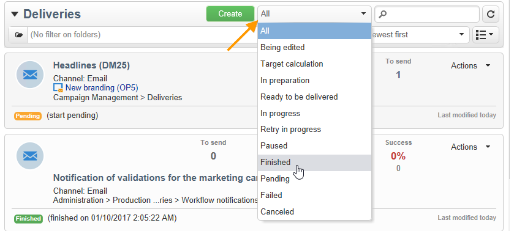
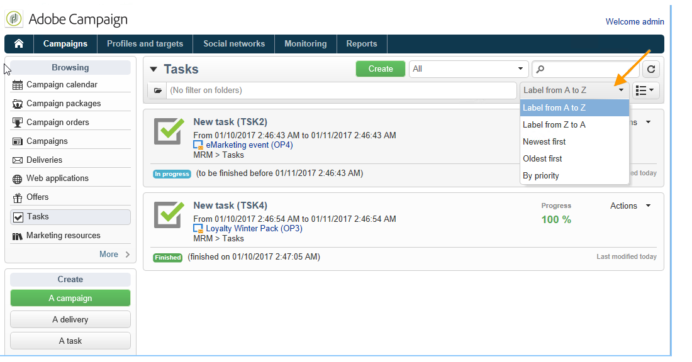

# Opzioni di filtro{#filtering-options}

## Informazioni sul filtro {#about-filtering}

Per impostazione predefinita, Adobe Campaign visualizza tutti i dati nel database per i quali l’operatore interessato dispone dei diritti di lettura.

Questi dati possono essere filtrati tramite le opzioni che si trovano nella sezione superiore della finestra del browser.

Esistono diversi modi per filtrare i dati da visualizzare. Se necessario, possono essere utilizzati insieme:

* Filtra in base alle cartelle, fare riferimento a [Filtra per cartella](#filter-by-folder),
* Filtra per stato, fare riferimento a [Filtra per stato](#filter-by-status),
* Ordinamento dei dati, fare riferimento a [Ordina per](#order-by),
* Cerca, fai riferimento a [Ricerca rapida](#quick-search).

## Filtra per cartella {#filter-by-folder}

Fare clic sull&#39;icona **[!UICONTROL Folder]** per selezionare la cartella contenente i dati da visualizzare.

Verranno visualizzati solo i profili presenti nella cartella:

Utilizza la croce a destra del campo di selezione della cartella per tornare alla modalità di visualizzazione predefinita.

## Filtra per stato {#filter-by-status}

A seconda del tipo di informazioni visualizzate, è possibile applicare un filtro in base allo stato o allo stato. Ad esempio, per le consegne, puoi scegliere di visualizzare solo le consegne finite come mostrato di seguito:

## Ordina per {#order-by}

Puoi selezionare l’ordinamento dei dati offerti sulle pagine tramite l’elenco a discesa a destra del campo di filtro &quot;per cartella&quot;. Il contenuto di questo campo dipende dal tipo di dati nella pagina.

È ad esempio possibile ordinare le attività in base alla priorità, alla data di creazione o all&#39;ordine alfabetico.

## Ricerca rapida {#quick-search}

Utilizza il campo di ricerca per accedere rapidamente all’elemento che stai cercando: inserisci i caratteri inclusi nell’etichetta o nel nome interno dell’elemento che desideri visualizzare, quindi conferma l’applicazione di un filtro automatico ai dati della pagina.

Per visualizzare di nuovo tutti gli elementi, fai clic sulla croce per eliminare il contenuto del campo di ricerca.
