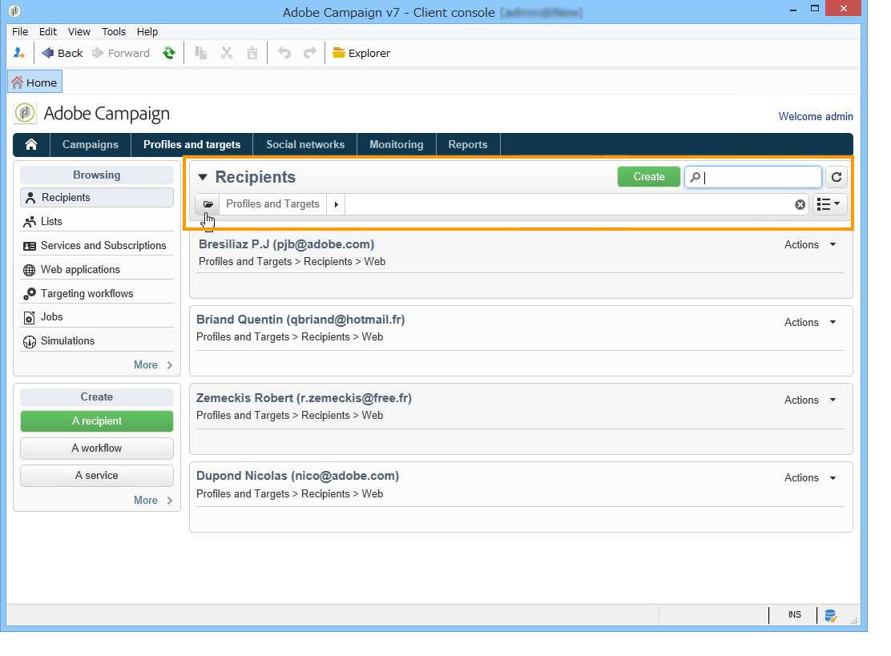

# Opzioni di filtro{#filtering-options}

## Informazioni sui filtri {#about-filtering}

Per impostazione predefinita,  Adobe Campaign visualizza tutti i dati nel database per i quali l&#39;operatore interessato dispone di diritti di lettura.

Questi dati possono essere filtrati tramite le opzioni presenti nella sezione superiore della finestra del browser.

Esistono diversi modi per filtrare i dati da visualizzare. Se necessario, possono essere utilizzati insieme:

* Filtrare le cartelle, fare riferimento a [Filtra per cartella](#filter-by-folder),
* Filtrare per stato, fare riferimento a [Filtra per stato](#filter-by-status),
* Ordinamento dei dati, fare riferimento a [Ordine per](#order-by),
* Consultate Ricerca [rapida](#quick-search).

## Filtrare per cartella {#filter-by-folder}

Fate clic sull’ **[!UICONTROL Folder]** icona per selezionare la cartella contenente i dati da visualizzare.

Vengono visualizzati solo i profili presenti nella cartella:

Usate la croce a destra del campo di selezione della cartella per tornare alla modalità di visualizzazione predefinita.

## Filtrare per stato {#filter-by-status}

A seconda del tipo di informazioni visualizzate, potete applicare un filtro per stato o stato. Ad esempio, per le consegne, potete scegliere di visualizzare solo le consegne completate come illustrato di seguito:

## Ordina per {#order-by}

È possibile selezionare l&#39;ordine di ordinamento dei dati offerti sulle pagine tramite l&#39;elenco a discesa a destra del campo di filtro &#39;per cartella&#39;. Il contenuto di questo campo dipende dal tipo di dati sulla pagina.

Ad esempio, è possibile ordinare le attività per priorità, data di creazione o ordine alfabetico.

## Ricerca rapida {#quick-search}

Utilizzate il campo di ricerca per accedere rapidamente all’elemento che state cercando: immettere i caratteri inclusi nell&#39;etichetta o nel nome interno dell&#39;elemento che si desidera visualizzare, quindi confermare di applicare un filtro automatico ai dati della pagina.

Per visualizzare di nuovo tutti gli elementi, fate clic sulla croce per eliminare il contenuto del campo di ricerca.
