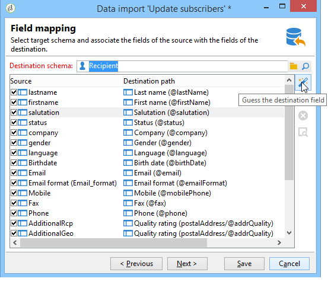
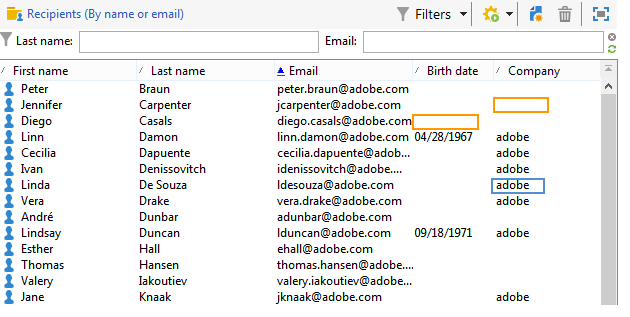
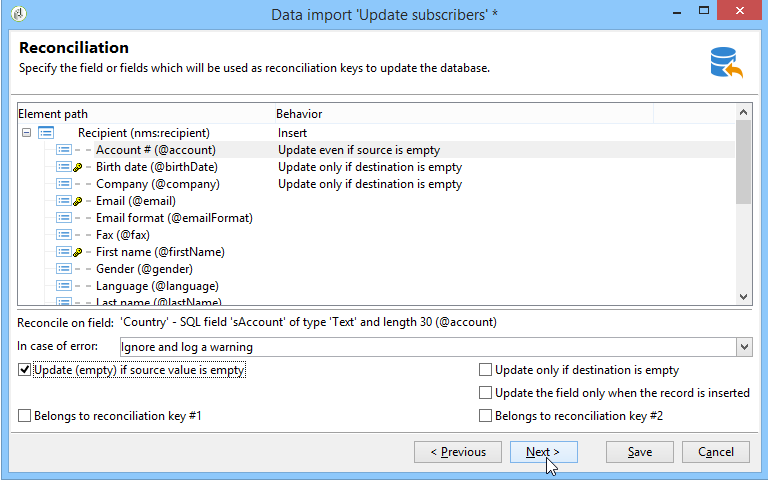

# Esempi di importazione generica {#import-operations-samples}

## Importa da un elenco di destinatari {#example--import-from-a-list-of-recipients}

Per creare e fornire un elenco di destinatari dalla panoramica degli elenchi, attieniti alla seguente procedura:

1. Creazione dell’elenco

   * Fai clic su **[!UICONTROL Lists]** collegamento in **[!UICONTROL Profiles and targets]** nella home page di Adobe Campaign.
   * Fai clic su **[!UICONTROL Create]** e quindi il **[!UICONTROL Import a list]** pulsante.

1. Selezione del file da importare

   Fai clic sulla cartella a destra della **[!UICONTROL Local file]** e selezionare il file contenente l&#39;elenco da importare.

   

1. Nome elenco e archiviazione

   Immettere il nome dell&#39;elenco e selezionare la directory in cui deve essere salvato.

   

1. Avvio dell’importazione

   Clic **[!UICONTROL Next]** e poi **[!UICONTROL Start]** per avviare l&#39;importazione dell&#39;elenco.

   

## Importare nuovi record da un file di testo {#example--import-new-records-from-a-text-file-}

Per importare nel database di Adobe Campaign nuovi profili dei destinatari memorizzati in un file di testo, effettua le seguenti operazioni:

1. Scelta di un modello

   * Dalla pagina Home di Adobe Campaign, fai clic su **[!UICONTROL Profiles and targets]** collegamento, quindi **[!UICONTROL Jobs]**. Sopra l’elenco dei processi, fai clic su **[!UICONTROL New import]**.
   * Mantieni **[!UICONTROL New text import]** modello selezionato per impostazione predefinita.
   * Modifica l’etichetta e la descrizione.
   * Seleziona **[!UICONTROL Simple import]**.
   * Mantieni la cartella dei processi predefinita.
   * Clic **[!UICONTROL Advanced parameters]** e seleziona la **[!UICONTROL Tracking mode]** per visualizzare i dettagli dell’importazione durante l’esecuzione.

1. Selezione del file da importare

   Fai clic sulla cartella a destra della **[!UICONTROL Local file]** e selezionare il file da importare.

   

1. Associazione di campi

   Fai clic su **[!UICONTROL Guess the destination fields]** per mappare automaticamente gli schemi di origine e di destinazione. Controllare le informazioni in questa finestra prima di fare clic su **[!UICONTROL Next]**.

   

1. Riconciliazione

   * Vai a **Destinatari (nms:recipient)** tabella.
   * Seleziona la **[!UICONTROL Insertion]** e lasciare i valori predefiniti negli altri campi.

     

1. Importazione dei destinatari

   * Se necessario, specificare una cartella in cui importare i record.

     

1. Avvio dell’importazione

   * Fai clic su **[!UICONTROL Start]**.

     Nell’area centrale dell’editor, puoi verificare che l’operazione di importazione sia stata eseguita correttamente e visualizzare il numero di record elaborati.

     

     Il **[!UICONTROL Tracking]** modalità consente di tenere traccia dei dettagli dell’importazione per ciascun record nel file sorgente. A questo scopo, dalla pagina Home fai clic su **[!UICONTROL Profiles and Targets]** allora **[!UICONTROL Processes]**, selezionare l&#39;importazione pertinente e cercare **[!UICONTROL General]**, **[!UICONTROL Journal]** e **[!UICONTROL Rejects]** schede.

      * Verifica dello stato di avanzamento dell’importazione

        

      * Elabora visualizzazione per ogni record

        

## Aggiornare e inserire destinatari {#example--update-and-insert-recipients}

Si desidera aggiornare i record esistenti nel database e crearne di nuovi da un file di testo. Ecco un esempio della procedura:

1. Scelta di un modello

   Ripeti i passaggi descritti nell’esempio 2 precedente.

1. File da importare

   Selezionare il file da importare.

   Nel nostro esempio, la panoramica delle prime righe del file mostra che il file contiene aggiornamenti per tre record e la creazione di un record.

   

1. Associazione di campi

   Applicare la procedura descritta nell&#39;esempio 2 precedente.

1. Riconciliazione

   * Mantieni **[!UICONTROL Update or insert]** selezionato per impostazione predefinita.
   * Mantieni l’opzione **[!UICONTROL Management of duplicates]** in **[!UICONTROL Update]** in modo che i record esistenti nel database vengano modificati con i dati del file di testo.
   * Seleziona i campi **[!UICONTROL Birth date]**, **[!UICONTROL Name]** e **[!UICONTROL Company]** e assegna loro una chiave di riconciliazione.

     

1. Avvio dell’importazione

   * Fai clic su **[!UICONTROL Start]**.

     Nella finestra di rilevamento, è possibile verificare che l&#39;importazione sia stata eseguita correttamente e visualizzare il numero di record elaborati.

     

   * Controllare che i record siano stati modificati da questa operazione nella tabella dei destinatari.

     

## Arricchisci i valori con quelli di un file esterno {#example--enrich-the-values-with-those-of-an-external-file}

Si desidera modificare alcuni campi di una tabella di database da un file di testo, dando priorità ai valori contenuti nel database.

In questo esempio, è possibile vedere che alcuni campi nel file di testo hanno un valore, mentre i campi corrispondenti nel database sono vuoti. Altri campi contengono un valore diverso da quello contenuto nel database.

* Contenuto del file di testo da importare.

  

* Stato del database prima dell’importazione

  

Applica i seguenti passaggi:

1. Scelta di un modello

   Applicare la procedura descritta nell&#39;esempio 2 precedente.

1. File da importare

   Selezionare il file da importare.

1. Associazione di campi

   Applicare la procedura descritta nell&#39;esempio 2 precedente.

   Nell&#39;anteprima delle prime righe del file è possibile vedere che il file contiene aggiornamenti per determinati record.

1. Riconciliazione

   * Vai alla tabella e seleziona la **[!UICONTROL Update]** operazione.
   * Seleziona l’opzione **[!UICONTROL Reject entity]** per **[!UICONTROL Management of doubles]** campo.
   * Mantieni l’opzione **[!UICONTROL Management of duplicates]** in **[!UICONTROL Update]** in modo che i record esistenti nel database vengano modificati con i dati del file di testo.
   * Posizionare il cursore sul **[!UICONTROL Last name (@lastName)]** e seleziona la **[!UICONTROL Update only if destination is empty]** opzione.
   * Ripeti questa operazione per **[!UICONTROL Company (@company)]** nodo.
   * Assegnare una chiave di riconciliazione ai campi **[!UICONTROL Birth date]**, **[!UICONTROL Email]** e **[!UICONTROL First name]**.

     

1. Avvio dell’importazione

   Fai clic su **[!UICONTROL Start]**.

   Controllare che i record siano stati modificati dall&#39;importazione nella tabella dei destinatari.

   

   Solo i valori vuoti sono stati sostituiti dai valori del file di testo, ma il valore esistente nel database non è stato sovrascritto dal valore del file di importazione.

## Aggiorna e arricchisci i valori da quelli in un file esterno {#example--update-and-enrich-the-values-from-those-in-an-external-file}

Si desidera modificare alcuni campi di una tabella di database da un file di testo, dando priorità ai valori contenuti nel file di testo.

In questo esempio, si noterà che alcuni campi nel file di testo hanno un valore vuoto, mentre i campi corrispondenti nel database non sono vuoti. Altri campi contengono un valore diverso da quello del database.

* Contenuto del file di testo da importare.

  

* Stato del database prima dell’importazione

  

1. Scelta di un modello

   Applicare la procedura descritta nell&#39;esempio 2 precedente.

1. File da importare

   Selezionare il file da importare.

   Nell&#39;anteprima delle prime righe del file è possibile vedere che il file contiene campi vuoti e aggiornamenti per determinati record.

1. Associazione di campi

   Applicare la procedura descritta nell&#39;esempio 2 precedente.

1. Riconciliazione

   * Vai alla tabella e seleziona **[!UICONTROL Update]**.
   * Seleziona l’opzione **[!UICONTROL Reject entity]** per **[!UICONTROL Management of doubles]** campo.
   * Lascia l’opzione **[!UICONTROL Management of duplicates]** in **[!UICONTROL Update]** modalità di modifica dei record esistenti nel database con i dati del file di testo.
   * Posizionare il cursore sul **[!UICONTROL Account number (@account)]** e seleziona l’opzione **[!UICONTROL Take empty values into account]**.
   * Seleziona i campi **[!UICONTROL Birth date]**, **[!UICONTROL Email]** e **[!UICONTROL First name]** e assegna loro una chiave di riconciliazione.

     

1. Avvio dell’importazione

   * Fai clic su **[!UICONTROL Start]**.
   * Controllare che i record siano stati modificati dall&#39;operazione nella tabella dei destinatari.

     

     I valori del file di testo vuoti hanno sovrascritto quelli presenti nel database. I valori esistenti nel database sono stati aggiornati con quelli nel file di importazione in conformità con **[!UICONTROL Update]** opzione selezionata per i duplicati al punto 4.
