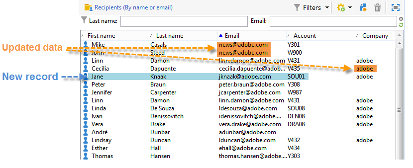

# Esempi di importazione generica {#import-operations-samples}

## Importa da un elenco di destinatari {#example--import-from-a-list-of-recipients}

Per creare e fornire un elenco di destinatari dalla panoramica degli elenchi, effettua le seguenti operazioni:

1. Creazione dell’elenco

   * Fai clic sul collegamento **[!UICONTROL Lists]** nel menu **[!UICONTROL Profiles and targets]** della home page di Adobe Campaign.
   * Fare clic sul pulsante **[!UICONTROL Create]** e quindi sul pulsante **[!UICONTROL Import a list]**.

1. Selezione del file da importare

   Fai clic sulla cartella a destra del campo **[!UICONTROL Local file]** e seleziona il file contenente l’elenco da importare.

   

1. Nome elenco e archiviazione

   Immettere il nome dell&#39;elenco e selezionare la directory in cui salvare.

   

1. Avvio dell’importazione

   Fare clic su **[!UICONTROL Next]** e quindi su **[!UICONTROL Start]** per iniziare a importare l&#39;elenco.

   

## Importare nuovi record da un file di testo {#example--import-new-records-from-a-text-file-}

Per importare nel database Adobe Campaign i nuovi profili dei destinatari memorizzati in un file di testo, procedi come segue:

1. Scelta di un modello

   * Dalla home page di Adobe Campaign, fai clic sul collegamento **[!UICONTROL Profiles and targets]** , quindi **[!UICONTROL Jobs]**. Sopra l’elenco dei processi, fai clic su **[!UICONTROL New import]**.
   * Mantieni il modello **[!UICONTROL New text import]** selezionato per impostazione predefinita.
   * Modifica l’etichetta e la descrizione.
   * Seleziona **[!UICONTROL Simple import]**.
   * Mantenere la cartella di lavoro predefinita.
   * Fai clic su **[!UICONTROL Advanced parameters]** e seleziona l’opzione **[!UICONTROL Tracking mode]** per visualizzare i dettagli dell’importazione durante l’esecuzione.

1. Selezione del file da importare

   Fai clic sulla cartella a destra del campo **[!UICONTROL Local file]** e seleziona il file da importare.

   

1. Associazione dei campi

   Fai clic sull’icona **[!UICONTROL Guess the destination fields]** per mappare automaticamente gli schemi di origine e di destinazione. Controlla le informazioni in questa finestra prima di fare clic su **[!UICONTROL Next]**.

   

1. Reconciliation

   * Vai alla tabella **Destinatari (nms:recipient)** .
   * Seleziona l’operazione **[!UICONTROL Insertion]** e lascia i valori predefiniti negli altri campi.

      

1. Importazione dei destinatari

   * Se necessario, specifica una cartella in cui importare i record.

      

1. Avvio dell’importazione

   * Fai clic su **[!UICONTROL Start]**.

      Nell’area centrale dell’editor, puoi verificare che l’operazione di importazione sia riuscita e visualizzare il numero di record elaborati.

      

      La modalità **[!UICONTROL Tracking]** ti consente di tenere traccia dei dettagli dell’importazione per ogni record del file di origine. A questo scopo, dalla home page fai clic su **[!UICONTROL Profiles and Targets]** e quindi su **[!UICONTROL Processes]**, seleziona l’importazione pertinente e cerca le schede **[!UICONTROL General]**, **[!UICONTROL Journal]** e **[!UICONTROL Rejects]**.

      * Verifica dell&#39;avanzamento dell&#39;importazione

         

      * Visualizzazione del processo per ogni record

         

## Aggiornare e inserire i destinatari {#example--update-and-insert-recipients}

Vogliamo aggiornare i record esistenti nel database e crearne di nuovi da un file di testo. Esempio di procedura:

1. Scelta di un modello

   Ripetere i passaggi descritti nell&#39;esempio 2 precedente.

1. File da importare

   Selezionare il file da importare.

   Nel nostro esempio, la panoramica delle prime righe del file mostra che il file contiene aggiornamenti per tre record e la creazione di un record.

   

1. Associazione dei campi

   Applicare la procedura di cui all&#39;esempio 2 precedente.

1. Reconciliation

   * Mantieni **[!UICONTROL Update or insert]** selezionato per impostazione predefinita.
   * Mantieni l&#39;opzione **[!UICONTROL Management of duplicates]** in modalità **[!UICONTROL Update]** in modo che i record esistenti nel database vengano modificati con i dati del file di testo.
   * Seleziona i campi **[!UICONTROL Birth date]**, **[!UICONTROL Name]** e **[!UICONTROL Company]** e assegna loro una chiave di riconciliazione.

      

1. Avvio dell’importazione

   * Fai clic su **[!UICONTROL Start]**.

      Nella finestra di tracciamento, puoi verificare che l’importazione sia riuscita e visualizzare il numero di record elaborati.

      

   * Consultare la tabella dei destinatari per verificare che i record siano stati modificati da questa operazione.

      

## Arricchisci i valori con quelli di un file esterno {#example--enrich-the-values-with-those-of-an-external-file}

Vogliamo modificare alcuni campi di una tabella di database da un file di testo, dando priorità ai valori contenuti nel database.

In questo esempio, è possibile vedere che alcuni campi nel file di testo hanno un valore, mentre i campi corrispondenti nel database sono vuoti. Altri campi contengono un valore diverso da quello contenuto nel database.

* Contenuto del file di testo da importare.

   

* Stato del database prima dell&#39;importazione

   

Applica i seguenti passaggi:

1. Scelta di un modello

   Applicare la procedura di cui all&#39;esempio 2 precedente.

1. File da importare

   Selezionare il file da importare.

1. Associazione dei campi

   Applicare la procedura di cui all&#39;esempio 2 precedente.

   Nell&#39;anteprima delle prime righe del file, puoi vedere che il file contiene aggiornamenti per alcuni record.

1. Reconciliation

   * Vai alla tabella e seleziona l&#39;operazione **[!UICONTROL Update]**.
   * Selezionare l&#39;opzione **[!UICONTROL Reject entity]** per il campo **[!UICONTROL Management of doubles]**.
   * Mantieni l&#39;opzione **[!UICONTROL Management of duplicates]** in modalità **[!UICONTROL Update]** in modo che i record esistenti nel database vengano modificati con i dati del file di testo.
   * Posizionare il cursore sul nodo **[!UICONTROL Last name (@lastName)]** e selezionare l&#39;opzione **[!UICONTROL Update only if destination is empty]**.
   * Ripeti questa operazione per il nodo **[!UICONTROL Company (@company)]**.
   * Assegna una chiave di riconciliazione ai campi **[!UICONTROL Birth date]**, **[!UICONTROL E-mail]** e **[!UICONTROL First name]**.

      

1. Avvio dell’importazione

   Fai clic su **[!UICONTROL Start]**.

   Consultare la tabella dei destinatari per verificare che i record siano stati modificati dall’importazione.

   

   Solo i valori vuoti sono stati sostituiti dai valori del file di testo, ma il valore esistente nel database non è stato sovrascritto dal valore del file di importazione.

## Aggiornare e arricchire i valori da quelli contenuti in un file esterno {#example--update-and-enrich-the-values-from-those-in-an-external-file}

Vogliamo modificare alcuni campi di una tabella di database da un file di testo, dando priorità ai valori contenuti nel file di testo.

In questo esempio, alcuni campi nel file di testo hanno un valore vuoto, mentre i campi corrispondenti nel database non sono vuoti. Altri campi contengono un valore diverso da quello del database.

* Contenuto del file di testo da importare.

   

* Stato del database prima dell&#39;importazione

   

1. Scelta di un modello

   Applicare la procedura di cui all&#39;esempio 2 precedente.

1. File da importare

   Selezionare il file da importare.

   Nell’anteprima delle prime righe del file, puoi vedere che il file contiene campi vuoti e aggiornamenti per alcuni record.

1. Associazione dei campi

   Applicare la procedura di cui all&#39;esempio 2 precedente.

1. Reconciliation

   * Vai alla tabella e seleziona **[!UICONTROL Update]**.
   * Selezionare l&#39;opzione **[!UICONTROL Reject entity]** per il campo **[!UICONTROL Management of doubles]**.
   * Lasciare l&#39;opzione **[!UICONTROL Management of duplicates]** in modalità **[!UICONTROL Update]** per modificare i record esistenti nel database con i dati del file di testo.
   * Posizionare il cursore sul nodo **[!UICONTROL Account number (@account)]** e selezionare l&#39;opzione **[!UICONTROL Take empty values into account]**.
   * Seleziona i campi **[!UICONTROL Birth date]**, **[!UICONTROL E-mail]** e **[!UICONTROL First name]** e assegna loro una chiave di riconciliazione.

      

1. Avvio dell’importazione

   * Fai clic su **[!UICONTROL Start]**.
   * Consultare la tabella dei destinatari per verificare che i record siano stati modificati dall&#39;operazione.

      

      I valori del file di testo vuoto sono stati sovrascritti nel database. I valori esistenti nel database sono stati aggiornati con quelli nel file di importazione in linea con l’opzione **[!UICONTROL Update]** selezionata per i duplicati al passaggio 4.
