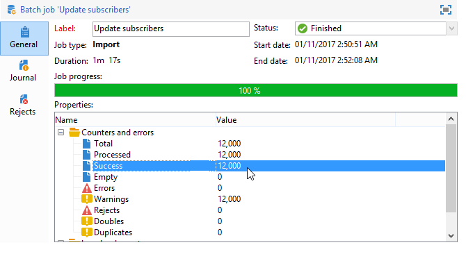

# Campioni di importazione generici {#import-operations-samples}

## Importa da un elenco di destinatari {#example--import-from-a-list-of-recipients}

Per creare e fornire un elenco di destinatari dalla panoramica degli elenchi, procedere come segue:

1. Creazione dell’elenco

   * Fare clic sul collegamento **[!UICONTROL Lists]** nel menu **[!UICONTROL Profiles and targets]** della home page di Adobe Campaign .
   * Fare clic su **[!UICONTROL Create]**, quindi sul pulsante **[!UICONTROL Import a list]**.

1. Selezione del file da importare

   Fate clic sulla cartella a destra del campo **[!UICONTROL Local file]** e selezionate il file contenente l&#39;elenco da importare.

   

1. Nome elenco e archiviazione

   Immettere il nome dell&#39;elenco e selezionare la directory in cui salvarlo.

   

1. Avvio dell&#39;importazione

   Fare clic su **[!UICONTROL Next]**, quindi su **[!UICONTROL Start]** per iniziare a importare l&#39;elenco.

   

## Importare nuovi record da un file di testo {#example--import-new-records-from-a-text-file-}

Per importare nel database Adobe Campaign  nuovi profili di destinatari memorizzati in un file di testo, procedere come segue:

1. Scelta di un modello

   * Dalla home page di  Adobe Campaign, fare clic sul collegamento **[!UICONTROL Profiles and targets]**, quindi **[!UICONTROL Jobs]**. Sopra l’elenco dei processi, fate clic su **[!UICONTROL New import]**.
   * Mantenere il modello **[!UICONTROL New text import]** selezionato per impostazione predefinita.
   * Modificate l’etichetta e la descrizione.
   * Seleziona **[!UICONTROL Simple import]**.
   * Mantenete la cartella di processo predefinita.
   * Fare clic su **[!UICONTROL Advanced parameters]** e selezionare l&#39;opzione **[!UICONTROL Tracking mode]** per visualizzare i dettagli dell&#39;importazione durante l&#39;esecuzione.

1. Selezione del file da importare

   Fate clic sulla cartella a destra del campo **[!UICONTROL Local file]** e selezionate il file da importare.

   

1. Associazione di campi

   Fate clic sull&#39;icona **[!UICONTROL Guess the destination fields]** per mappare automaticamente gli schemi di origine e di destinazione. Controllare le informazioni in questa finestra prima di fare clic su **[!UICONTROL Next]**.

   

1. Reconciliation

   * Vai alla tabella **Destinatari (nms:destinatario)**.
   * Selezionare l&#39;operazione **[!UICONTROL Insertion]** e lasciare i valori predefiniti negli altri campi.

      

1. Importazione dei destinatari

   * Se necessario, specificate una cartella in cui importare i record.

      

1. Avvio dell&#39;importazione

   * Fai clic su **[!UICONTROL Start]**.

      Nell’area centrale dell’editor, potete verificare che l’operazione di importazione sia stata completata e visualizzare il numero di record elaborati.

      

      La modalità **[!UICONTROL Tracking]** consente di tenere traccia dei dettagli dell&#39;importazione per ciascun record nel file di origine. A questo scopo, nella home page fare clic su **[!UICONTROL Profiles and Targets]**, quindi su **[!UICONTROL Processes]**, selezionare l&#39;importazione desiderata, quindi consultare le schede **[!UICONTROL General]**, **[!UICONTROL Journal]** e **[!UICONTROL Rejects]**.

      * Verifica dell&#39;avanzamento dell&#39;importazione

         

      * Processo di visualizzazione per ciascun record

         

## Aggiornare e inserire i destinatari {#example--update-and-insert-recipients}

Vogliamo aggiornare i record esistenti nel database e crearne di nuovi da un file di testo. Esempio di procedura:

1. Scelta di un modello

   Ripetere i passaggi descritti nell&#39;esempio 2 precedente.

1. File da importare

   Selezionate il file da importare.

   Nel nostro esempio, la panoramica delle prime righe del file mostra che il file contiene aggiornamenti per tre record e la creazione di un record.

   

1. Associazione di campi

   Applicate la procedura descritta nell&#39;esempio 2 precedente.

1. Riconciliazione

   * Mantieni **[!UICONTROL Update or insert]** selezionato per impostazione predefinita.
   * Tenere l&#39;opzione **[!UICONTROL Management of duplicates]** in modalità **[!UICONTROL Update]** in modo che i record esistenti nel database vengano modificati con i dati del file di testo.
   * Selezionare i campi **[!UICONTROL Birth date]**, **[!UICONTROL Name]** e **[!UICONTROL Company]** e assegnare loro una chiave di riconciliazione.

      

1. Avvio dell&#39;importazione

   * Fai clic su **[!UICONTROL Start]**.

      Nella finestra di tracciamento, puoi verificare che l’importazione sia riuscita e visualizzare il numero di record elaborati.

      

   * Nella tabella dei destinatari verificare che i record siano stati modificati dall&#39;operazione.

      

## Arricchite i valori con quelli di un file esterno {#example--enrich-the-values-with-those-of-an-external-file}

È necessario modificare alcuni campi di una tabella di database da un file di testo, dando priorità ai valori contenuti nel database.

In questo esempio, è possibile vedere che alcuni campi nel file di testo hanno un valore, mentre i campi corrispondenti nel database sono vuoti. Altri campi contengono un valore diverso da quello contenuto nel database.

* Contenuto del file di testo da importare.

   

* Stato del database prima dell&#39;importazione

   

Effettuate le seguenti operazioni:

1. Scelta di un modello

   Applicate la procedura descritta nell&#39;esempio 2 precedente.

1. File da importare

   Selezionate il file da importare.

1. Associazione di campi

   Applicate la procedura descritta nell&#39;esempio 2 precedente.

   Nell&#39;anteprima delle prime righe del file, è possibile vedere che il file contiene aggiornamenti per alcuni record.

1. Riconciliazione

   * Passate alla tabella e selezionate l&#39;operazione **[!UICONTROL Update]**.
   * Selezionare l&#39;opzione **[!UICONTROL Reject entity]** per il campo **[!UICONTROL Management of doubles]**.
   * Tenere l&#39;opzione **[!UICONTROL Management of duplicates]** in modalità **[!UICONTROL Update]** in modo che i record esistenti nel database vengano modificati con i dati del file di testo.
   * Posizionare il cursore sul nodo **[!UICONTROL Last name (@lastName)]** e selezionare l&#39;opzione **[!UICONTROL Update only if destination is empty]**.
   * Ripetere questa operazione per il nodo **[!UICONTROL Company (@company)]**.
   * Assegnare una chiave di riconciliazione ai campi **[!UICONTROL Birth date]**, **[!UICONTROL E-mail]** e **[!UICONTROL First name]**.

      

1. Avvio dell&#39;importazione

   Fai clic su **[!UICONTROL Start]**.

   Consultare la tabella dei destinatari per verificare che i record siano stati modificati dall&#39;importazione.

   

   Solo i valori vuoti sono stati sostituiti dai valori del file di testo, ma il valore esistente nel database non è stato sovrascritto dal valore del file di importazione.

## Aggiornare e arricchire i valori da quelli di un file esterno {#example--update-and-enrich-the-values-from-those-in-an-external-file}

È necessario modificare alcuni campi di una tabella di database da un file di testo, dando priorità ai valori contenuti nel file di testo.

In questo esempio, alcuni campi nel file di testo hanno un valore vuoto, mentre i campi corrispondenti nel database non sono vuoti. Altri campi contengono un valore diverso da quello del database.

* Contenuto del file di testo da importare.

   

* Stato del database prima dell&#39;importazione

   

1. Scelta di un modello

   Applicate la procedura descritta nell&#39;esempio 2 precedente.

1. File da importare

   Selezionate il file da importare.

   Nell&#39;anteprima delle prime righe del file, è possibile vedere che il file contiene campi vuoti e aggiornamenti per alcuni record.

1. Associazione di campi

   Applicate la procedura descritta nell&#39;esempio 2 precedente.

1. Riconciliazione

   * Passate alla tabella e selezionate **[!UICONTROL Update]**.
   * Selezionare l&#39;opzione **[!UICONTROL Reject entity]** per il campo **[!UICONTROL Management of doubles]**.
   * Lasciare l&#39;opzione **[!UICONTROL Management of duplicates]** in modalità **[!UICONTROL Update]** per i record esistenti nel database da modificare con i dati del file di testo.
   * Posizionare il cursore sul nodo **[!UICONTROL Account number (@account)]** e selezionare l&#39;opzione **[!UICONTROL Take empty values into account]**.
   * Selezionare i campi **[!UICONTROL Birth date]**, **[!UICONTROL E-mail]** e **[!UICONTROL First name]** e assegnare loro una chiave di riconciliazione.

      

1. Avvio dell&#39;importazione

   * Fai clic su **[!UICONTROL Start]**.
   * Consultare la tabella dei destinatari per verificare che i record siano stati modificati dall&#39;operazione.

      

      I valori del file di testo vuoto hanno sovrascritto quelli presenti nel database. I valori esistenti nel database sono stati aggiornati con quelli nel file di importazione in linea con l&#39;opzione **[!UICONTROL Update]** selezionata per i duplicati al punto 4.
