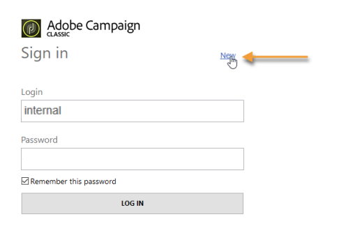

# Avviare Adobe Campaign{#launching-adobe-campaign}

La console client di Campaign è un client avanzato che consente di connettersi ai server applicazioni di Campaign. Scopri come scaricare e configurare la console client in [questa pagina](../../installation/using/installing-the-client-console.md).

>[!CAUTION]
>
>Verifica la compatibilità del sistema e degli strumenti con Adobe Campaign Client Console nella [Matrice di compatibilità](../../rn/using/compatibility-matrix.md#ClientConsoleoperatingsystems)

## Avvia Adobe Campaign {#starting-adobe-campaign}

Per avviare Adobe Campaign, seleziona **[!UICONTROL Start / All Programs / Adobe Campaign v.X / Adobe Campaign client console]**.

La finestra di connessione della console client consente di selezionare o configurare i database esistenti e di connettersi ad essi utilizzando un nome utente e una password:

## Connessione ad Adobe Campaign {#connecting-to-adobe-campaign}

Puoi connetterti ad Adobe Campaign utilizzando il tuo Adobe ID. Per ulteriori informazioni, consulta [questa pagina](../../integrations/using/about-adobe-id.md).

Puoi anche connetterti con un login/password dedicato:

1. Immettere l&#39;identificatore dell&#39;account operatore in **[!UICONTROL Login]** campo.

   L’identificatore viene fornito dall’amministratore della piattaforma Adobe Campaign.

1. Immettere la password in **[!UICONTROL Password]** campo.

   La prima volta che si accede al database, la password è quella fornita dall&#39;amministratore. Una volta effettuata la connessione, è possibile modificare la password tramite **[!UICONTROL Tools > Change password...]** menu. I dettagli sugli operatori e sulle connessioni sono disponibili in [Gestione degli accessi](../../platform/using/access-management.md).

1. Clic **[!UICONTROL LOG IN]** per confermare.<!--You can also press the **Enter** key to launch connection.-->

Ora puoi accedere a [Area di lavoro di Adobe Campaign](../../platform/using/adobe-campaign-workspace.md).

Alcune scelte rapide da tastiera sono disponibili sul **[!UICONTROL Sign in screen]**:
* Tutti gli elementi utilizzabili sono selezionabili tramite **Linguetta** (dall&#39;alto verso il basso) o **Linguetta** + **Maiusc** tasti (dal basso verso l&#39;alto).
* Per avviare la connessione, puoi anche premere il tasto **Invio** chiave.
* È possibile utilizzare **Escape** chiave per ripristinare **[!UICONTROL Login]** e **[!UICONTROL Password]** campi agli ultimi valori di connessione riusciti.

## Configurare le connessioni {#setting-up-connections}

È possibile accedere alle impostazioni di connessione al server tramite il collegamento sopra l&#39;area di input.

In **[!UICONTROL Connections]** finestra, fai clic su **[!UICONTROL Add > Connection]**.

È quindi necessario definire le impostazioni di connessione. Per eseguire questa operazione:

1. Immetti un **[!UICONTROL Label]** per assegnare un nome alla connessione al database.

1. Aggiungere l&#39;indirizzo del server applicazioni in **[!UICONTROL URL]** campo. Se non conosci l’URL di connessione, contatta l’amministratore.

1. Verifica **[!UICONTROL Connect with an Adobe ID]** affinché gli operatori si connettano alla console utilizzando il proprio Adobe ID. Per ulteriori informazioni, consulta [questa pagina](../../integrations/using/about-adobe-id.md).

1. Clic **[!UICONTROL OK]** da convalidare.

## Operatori e autorizzazioni {#operators-and-permissions}

Gli identificatori e le password degli operatori con accesso al software e le relative autorizzazioni sono definiti dall’amministratore di sistema Adobe Campaign in **[!UICONTROL Administration > Access management > Operators]** della struttura Adobe Campaign.

Questa funzionalità è descritta in [Gestione degli accessi](../../platform/using/access-management.md) sezione.

## Disconnetti da Adobe Campaign {#disconnecting-from-adobe-campaign}

Per disconnettersi da Adobe Campaign, utilizza la prima icona nella barra delle icone.

>[!NOTE]
>
>È inoltre possibile chiudere l&#39;applicazione senza disconnettersi.

## Scarica la versione Adobe Campaign {#getting-your-campaign-version}

Il **[!UICONTROL Help > About...]** consente di accedere alle seguenti informazioni:

* **version** numero per la console client e il server applicazioni di Campaign
* **build** numero per la console client e il server applicazioni di Campaign
* un collegamento per contattare l’Assistenza clienti di Adobe
* collegamenti alla Policy per i cookie, alle Condizioni d’uso e all’Informativa sulla privacy di Adobe

Quando ti rivolgi al team di assistenza clienti Adobe, devi fornire il numero di versione e di build della console client e del server applicazioni Adobe Campaign.

**Argomenti correlati**:

* [Opzioni di assistenza e supporto per Adobe Campaign](../../support.md)
* [Distribuzione di software di Adobe Campaign](https://experience.adobe.com/#/downloads/content/software-distribution/it/campaign.html)
* [Supporto Adobe Experience Cloud e sessioni con gli esperti](https://helpx.adobe.com/it/enterprise/admin-guide.html/enterprise/using/support-for-experience-cloud.ug.html)
