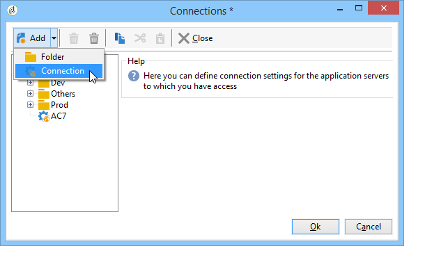

# Avvio  Adobe Campaign{#launching-adobe-campaign}

La console Client campagna è un client avanzato che consente di connettersi ai server delle applicazioni Campaign. Scoprite come scaricare e configurare la console client in [questa pagina](../../installation/using/installing-the-client-console.md).

## Avvio  Adobe Campaign {#starting-adobe-campaign}

Potete iniziare  Adobe Campaign selezionando **[!UICONTROL Start / All Programs / Adobe Campaign v.X / Adobe Campaign client console]**.

La finestra di connessione della console client consente di selezionare o configurare i database esistenti e di collegarli utilizzando un nome utente e una password:

## Collegamento al Adobe Campaign  {#connecting-to-adobe-campaign}

È possibile connettersi a  Adobe Campaign utilizzando il Adobe ID . For more on this, refer to [this page](../../integrations/using/about-adobe-id.md).

È inoltre possibile connettersi con un login/password dedicato:

1. Immettete l&#39;identificatore dell&#39;account dell&#39;operatore nel **[!UICONTROL login]** campo.

   L’identificatore viene fornito dall’amministratore della piattaforma  Adobe Campaign.

1. Immettere la password nel **[!UICONTROL Password]** campo.

   La prima volta che accedete al database, la password è quella fornita dall&#39;amministratore. Una volta connessi, potete cambiare la password tramite il **[!UICONTROL Tools > Change password...]** menu. I dettagli relativi agli operatori e alle connessioni sono disponibili in Gestione accesso.

1. Fate clic **[!UICONTROL Log in]** per confermare.

Ora potete accedere a [area di lavoro](../../platform/using/adobe-campaign-workspace.md)Adobe Campaign.

## Configurazione delle connessioni {#setting-up-connections}

È possibile accedere alle impostazioni di connessione del server tramite il collegamento situato sopra la zona di input.

Nella **[!UICONTROL Connections]** finestra, fate clic su **[!UICONTROL Add > Connection]**.

È quindi necessario definire le impostazioni di connessione. Per eseguire questa operazione:

1. Immettete un nome **[!UICONTROL Label]** da assegnare alla connessione al database.

1. Aggiungete l&#39;indirizzo del server applicazione nel **[!UICONTROL URL]** campo. Se non conoscete l’URL della connessione, rivolgetevi all’amministratore.

1. Verificare **[!UICONTROL Connect with an Adobe ID]** che gli operatori possano connettersi alla console utilizzando il proprio Adobe ID . For more on this, refer to [this page](../../integrations/using/about-adobe-id.md).

1. Fare clic **[!UICONTROL OK]** per eseguire la convalida.

## Operatori e autorizzazioni {#operators-and-permissions}

Gli identificatori e le password degli operatori che hanno accesso al software e le rispettive autorizzazioni sono definiti dall&#39;amministratore di Adobe Campaign  nel **[!UICONTROL Administration > Access management > Operators]** nodo della struttura del Adobe Campaign .

Questa funzionalità è descritta in dettaglio nella sezione Gestione [degli](../../platform/using/access-management.md) accessi.

## Disconnessione da  Adobe Campaign {#disconnecting-from-adobe-campaign}

Per disconnettersi da  Adobe Campaign, utilizzate la prima icona nella barra delle icone.

>[!NOTE]
>
>È inoltre possibile chiudere l&#39;applicazione senza prima disconnettersi.

## Ottenimento della versione di Campaign {#getting-your-campaign-version}

Il **[!UICONTROL Help > About...]** menu consente di accedere alle informazioni seguenti:

* **numero di versione** ,
* **numero build** ,
* un collegamento per contattare  supporto del Adobe Campaign.

   >[!CAUTION]
   >
   >Ogni volta che contattate il team di assistenza Adobe, dovete fornire il numero di versione e il numero di build della console client e del server applicazione di Campaign.

