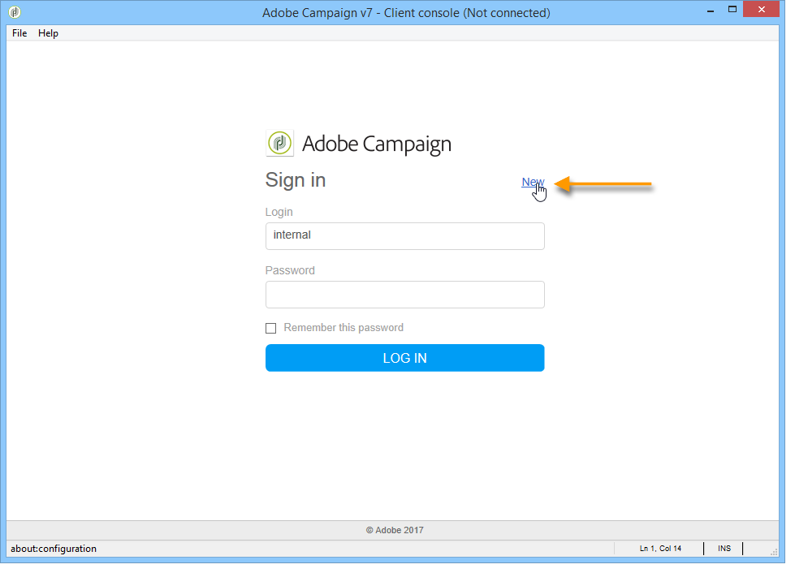
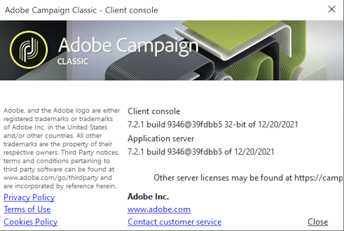

# Avviare Adobe Campaign {#launching-adobe-campaign}

La console client di Campaign è un client avanzato che consente di connettersi ai server applicazioni di Campaign. Scopri come scaricare e configurare la console client in [questa pagina](../../installation/using/installing-the-client-console.md).

>[!CAUTION]
>
>Verifica la compatibilità del sistema e degli strumenti con Adobe Campaign Client Console nella [Matrice di compatibilità](../../rn/using/compatibility-matrix.md#ClientConsoleoperatingsystems)

## Avvia Adobe Campaign {#starting-adobe-campaign}

È possibile avviare Adobe Campaign selezionando **[!UICONTROL Start / All Programs / Adobe Campaign v.X / Adobe Campaign client console]**.

La finestra di connessione della console client consente di selezionare o configurare i database esistenti e di connettersi ad essi utilizzando un nome utente e una password:

## Connessione ad Adobe Campaign {#connecting-to-adobe-campaign}

### Connettersi con il tuo Adobe ID

Gli utenti di Campaign si connettono alla console di Adobe Campaign utilizzando il proprio Adobe ID, tramite Adobe Identity Management System (IMS). Possono utilizzare lo stesso ID per tutte le soluzioni Adobe. Quando si utilizza Adobe Campaign con altre soluzioni la connessione viene salvata. Ulteriori informazioni su Adobe IMS [in questa pagina](https://helpx.adobe.com/it/enterprise/using/identity.html).

Per configurare la connessione Campaign Classic v7 con Adobe Identity Management Service (IMS), consulta [questa pagina](../../integrations/using/about-adobe-id.md).

Al termine della configurazione, scopri come connetterti a Campaign con il tuo Adobe ID nella [documentazione di Campaign v8 (console)](https://experienceleague.adobe.com/en/docs/campaign/campaign-v8/new/connect){target=_blank}.

### Connettersi con login/password

Puoi anche connetterti con un login/password dedicato. Questa connessione è nota come &quot;Autenticazione nativa&quot; della campagna:

1. Immettere l&#39;identificatore dell&#39;account operatore nel campo **[!UICONTROL Login]**.

   L’identificatore viene fornito dall’amministratore della piattaforma Adobe Campaign.

1. Immettere la password nel campo **[!UICONTROL Password]**.

   La prima volta che si accede al database, la password è quella fornita dall&#39;amministratore. Una volta effettuata la connessione, è possibile modificare la password tramite il menu **[!UICONTROL Tools > Change password...]**. I dettagli sugli operatori e sulle connessioni sono disponibili in [Gestione degli accessi](../../platform/using/access-management.md).

1. Fai clic su **[!UICONTROL LOG IN]** per confermare.

È ora possibile accedere all&#39;[area di lavoro Adobe Campaign](../../platform/using/adobe-campaign-workspace.md).

## Configurare le connessioni {#setting-up-connections}

È possibile accedere alle impostazioni di connessione al server tramite il collegamento sopra l&#39;area di input.

Scopri come impostare le connessioni nella [documentazione di Campaign v8 (console)](https://experienceleague.adobe.com/en/docs/campaign/campaign-v8/new/connect#create-your-connection){target=_blank}.

## Operatori e autorizzazioni {#operators-and-permissions}

Gli identificatori e le password degli operatori con accesso al software e le rispettive autorizzazioni sono definiti dall&#39;amministratore di sistema Adobe Campaign nel nodo **[!UICONTROL Administration > Access management > Operators]** della struttura Adobe Campaign.

Questa funzionalità è descritta nella sezione [Gestione degli accessi](../../platform/using/access-management.md).

## Scarica la versione Adobe Campaign {#getting-your-campaign-version}

Il menu **[!UICONTROL Help > About...]** consente di accedere alle seguenti informazioni:

* Numero **versione** per la console client di Campaign e il server applicazioni
* Numero **build** per la console client di Campaign e il server applicazioni
* un collegamento per contattare l’Assistenza clienti di Adobe
* collegamenti alla Policy per i cookie, alle Condizioni d’uso e all’Informativa sulla privacy di Adobe

Ogni volta che contatti il team di Assistenza clienti di Adobe, devi fornire il numero di versione e il numero di build della console client e del server applicazioni di Adobe Campaign.

