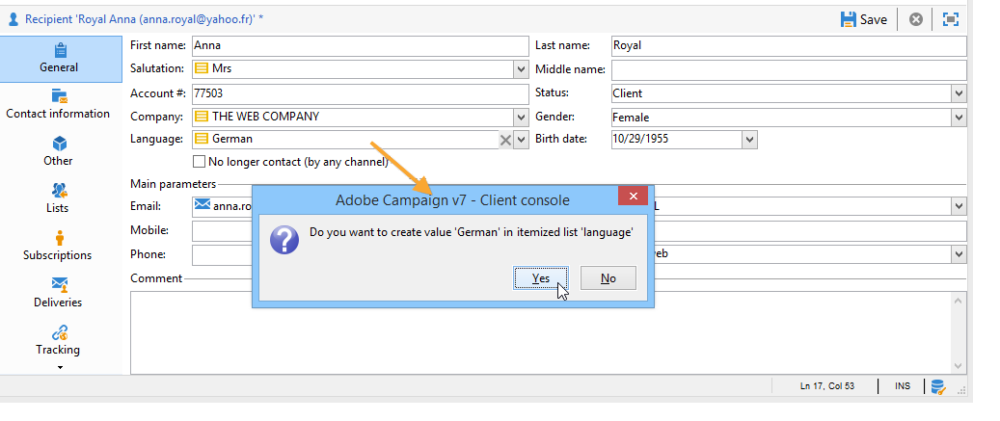

# Gestire le enumerazioni{#managing-enumerations}

Un&#39;enumerazione (nota anche come &#39;elenco dettagliato&#39;) è un elenco di valori suggeriti dal sistema per compilare alcuni campi. Le enumerazioni consentono di standardizzare i valori di questi campi e di semplificare l&#39;immissione di dati o l&#39;utilizzo all&#39;interno di query.

L&#39;elenco di valori viene visualizzato come elenco a discesa dal quale è possibile selezionare il valore da immettere nel campo. L’elenco a discesa consente inoltre l’input predittivo, in cui l’operatore immette le prime lettere e l’applicazione compila il resto.

Alcuni campi della console sono stati definiti con questo tipo di enumerazioni. Le enumerazioni sono denominate &quot;open&quot; se è possibile aggiungere valori tramite input diretto nel campo corrispondente.

## Accesso ai valori {#access-to-values}

I valori per questo tipo di campo sono definiti e l&#39;amministrazione complessiva di questi campi (aggiunta/eliminazione di un valore) viene eseguita tramite il nodo **[!UICONTROL Administration > Platform > Enumerations]** della struttura.

* La sezione superiore offre un elenco di campi per i quali è stato definito un elenco dettagliato.
* Nella sezione inferiore sono elencati i valori proposti. Questi valori verranno ripetuti negli editor che utilizzano questo campo.

  

  Per creare un nuovo valore di enumerazione, scegliere **[!UICONTROL Add]**.

  

  Se è selezionata l&#39;opzione **[!UICONTROL Open]**, l&#39;utente può aggiungere un nuovo valore di elenco dettagliato direttamente nel campo corrispondente. Un messaggio di conferma ti consente di creare questo valore.

  

* Se l&#39;opzione **[!UICONTROL Closed]** è selezionata, gli utenti non potranno creare nuovi valori, ma potranno semplicemente scegliere tra quelli disponibili.

## Standardizzare i dati {#standardizing-data}

### Informazioni sulla pulizia degli alias {#about-alias-cleansing}

Nei campi elenco dettagliati è possibile immettere valori diversi da quelli di enumerazione. Questi possono essere memorizzati così come sono o essere puliti.

>[!CAUTION]
>
>La pulizia dei dati è un processo critico che influisce sui dati presenti nel database. Adobe Campaign esegue aggiornamenti di massa dei dati, che potrebbero causare l’eliminazione di alcuni valori. Questa operazione è pertanto riservata agli utenti esperti.

Il valore immesso è quindi:

* Aggiunto ai valori dell&#39;elenco dettagliati: in questo caso è necessario selezionare l&#39;opzione **[!UICONTROL Open]**,
* o automaticamente sostituito dal relativo alias corrispondente: in questo caso, il caso deve essere definito nella scheda **[!UICONTROL Alias]** dell&#39;elenco dettagliato,
* o viene memorizzato nell’elenco degli alias: gli verrà successivamente assegnato un alias.

  >[!NOTE]
  >
  >Se devi utilizzare le funzionalità di pulizia dati, seleziona l&#39;opzione **[!UICONTROL Alias cleansing]** nell&#39;elenco dettagliato.

### Utilizzo degli alias {#using-aliases}

L&#39;opzione **[!UICONTROL Alias cleansing]** consente di utilizzare alias per l&#39;elenco dettagliato selezionato. Quando questa opzione è selezionata, nella parte inferiore della finestra viene visualizzata la scheda **[!UICONTROL Alias]**.

#### Creare un alias {#creating-an-alias}

Per creare un alias, scegliere **[!UICONTROL Add]**.

Immettere l&#39;alias che si desidera convertire e il valore da applicare e fare clic su **[!UICONTROL Ok]**.

Controlla i parametri prima di confermare questa operazione.

>[!CAUTION]
>
>Una volta confermata questa fase, i valori precedentemente immessi potrebbero non essere recuperati: sono stati sostituiti.

Pertanto, quando un utente immette il valore **NEILSEN** in un campo &quot;company&quot; (nella console Adobe Campaign o in un modulo), verrà automaticamente sostituito dal valore **NIELSEN Ltd**. Il valore viene sostituito dal flusso di lavoro **Pulizia alias**. Consulta [Eseguire la pulizia dei dati](#running-data-cleansing).

#### Conversione di valori in alias {#converting-values-into-aliases}

Per convertire un valore di enumerazione in un alias, fare clic con il pulsante destro del mouse nell&#39;elenco di valori e scegliere **[!UICONTROL Convert values into aliases...]**.

Scegliere i valori da convertire e fare clic su **[!UICONTROL Next]**.

Fare clic su **[!UICONTROL Start]** per eseguire la conversione.

Al termine dell’esecuzione, l’alias viene aggiunto all’elenco degli alias.

#### Recuperare gli hit alias {#retrieving-alias-hits}

I valori immessi dagli utenti possono essere convertiti in alias. In effetti, quando l&#39;utente immette un valore non incluso nell&#39;elenco dettagliato, il valore viene memorizzato nella scheda **[!UICONTROL Alias]**.

Il flusso di lavoro tecnico **Pulizia alias** recupera questi valori ogni notte per aggiornare l&#39;elenco dettagliato. Fai riferimento a [Eseguire la pulizia dei dati](#running-data-cleansing)

Se necessario, la colonna **[!UICONTROL Hits]** può visualizzare il numero di volte in cui questo valore è stato immesso. Il calcolo di questo valore può richiedere tempo e memoria. Per ulteriori informazioni, consulta [Calcolare le occorrenze della voce](#calculating-entry-occurrences).

### Esegui pulizia dati {#running-data-cleansing}

La pulizia dei dati viene eseguita dal flusso di lavoro tecnico **[!UICONTROL Alias cleansing]**. Le configurazioni definite per le enumerazioni vengono applicate durante l’esecuzione. Consulta [Flusso di lavoro di pulizia alias](#alias-cleansing-workflow).

La pulizia può essere attivata tramite il collegamento **[!UICONTROL Cleanse values...]**.

Il collegamento **[!UICONTROL Advanced parameters...]** consente di impostare la data a partire dalla quale i valori raccolti vengono presi in considerazione.

Fare clic sul pulsante **[!UICONTROL Start]** per eseguire la pulizia dei dati.

#### Calcola occorrenze voce {#calculating-entry-occurrences}

Nella scheda secondaria **[!UICONTROL Alias]** di un elenco dettagliato è possibile visualizzare il numero di occorrenze di un alias tra tutti i valori immessi. Queste informazioni sono una stima e verranno visualizzate nella colonna **[!UICONTROL Hits]**.

>[!CAUTION]
>
>Il calcolo delle occorrenze della voce alias può richiedere molto tempo. Per questo motivo è necessario prestare attenzione quando si utilizza questa funzione.

Puoi eseguire il calcolo degli hit manualmente tramite il collegamento **[!UICONTROL Cleanse values...]**. A tale scopo, fare clic sul collegamento **[!UICONTROL Advanced parameters...]** e selezionare le opzioni desiderate.

* **[!UICONTROL Update the number of alias hits]**: consente di aggiornare gli hit già calcolati in base alla data immessa.
* **[!UICONTROL Recalculate the number of alias hits from the start]**: consente di eseguire calcoli sull&#39;intera piattaforma Adobe Campaign.

Puoi anche creare un flusso di lavoro dedicato per consentire l’esecuzione automatica del calcolo per un determinato periodo, ad esempio una volta alla settimana.

Per eseguire questa operazione, creare una copia del flusso di lavoro **[!UICONTROL Alias cleansing]**, modificare la pianificazione e utilizzare le impostazioni seguenti nell&#39;attività **[!UICONTROL Enumeration value cleansing]**:

* **-updateHits** per aggiornare il numero di hit alias,
* **-updateHits:full** per ricalcolare tutti gli hit alias.

#### Flusso di lavoro di pulizia degli alias {#alias-cleansing-workflow}

Il flusso di lavoro **Pulizia alias** esegue la pulizia dei valori delle enumerazioni. Per impostazione predefinita, viene eseguito su base giornaliera.

È accessibile tramite il nodo **[!UICONTROL Administration > Production > Technical workflows]**.

