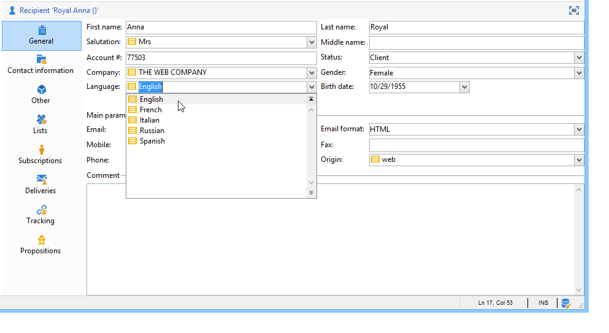

# Gestione delle enumerazioni{#managing-enumerations}

## Informazioni sulle enumerazioni {#about-enumerations}

Un&#39;enumerazione (nota anche come &#39;elenco dettagliato&#39;) è un elenco di valori suggeriti dal sistema per compilare alcuni campi. Le enumerazioni consentono di standardizzare i valori di questi campi e aiutano nell&#39;immissione o nell&#39;uso dei dati all&#39;interno delle query.

L&#39;elenco di valori viene visualizzato come elenco a discesa dal quale è possibile selezionare il valore da immettere nel campo. L&#39;elenco a discesa consente inoltre l&#39;input predittivo, in cui l&#39;operatore immette le prime lettere, e l&#39;applicazione completa il resto.

Alcuni dei campi della console sono stati definiti con questo tipo di enumerazioni. Le enumerazioni sono denominate &quot;open&quot; se è possibile aggiungere valori mediante immissione diretta nel campo corrispondente.

## Accesso ai valori {#access-to-values}

I valori per questo tipo di campo sono definiti e l&#39;amministrazione globale di questi campi (aggiunta/eliminazione di un valore) viene eseguita tramite il nodo **[!UICONTROL Administration > Platform > Enumerations]** della struttura.

* Nella sezione superiore è disponibile un elenco di campi per i quali è stato definito un elenco dettagliato.
* Nella sezione inferiore sono elencati i valori proposti. Questi valori verranno ripetuti negli editor che utilizzano questo campo.

   

   Per creare un nuovo valore di enumerazione, fare clic su **[!UICONTROL Add]**.

   

   Se l&#39;opzione **[!UICONTROL Open]** è selezionata, l&#39;utente può aggiungere un nuovo valore di elenco dettagliato direttamente nel campo corrispondente. Un messaggio di conferma consente di creare questo valore.

   

* Se l&#39;opzione **[!UICONTROL Closed]** è selezionata, gli utenti non saranno in grado di creare nuovi valori, ma semplicemente di scegliere tra i valori disponibili.

## Standardizzazione dei dati {#standardizing-data}

### Informazioni sulla pulizia degli alias {#about-alias-cleansing}

Nei campi elenco dettagliati è possibile immettere valori diversi dai valori di enumerazione. Possono essere memorizzati così come sono o essere puliti.

>[!CAUTION]
>
>La pulizia dei dati è un processo critico che interessa i dati presenti nel database.  Adobe Campaign esegue aggiornamenti di massa dei dati, che potrebbero causare l&#39;eliminazione di alcuni valori. Questa operazione è pertanto riservata agli utenti esperti.

Il valore immesso può essere:

* Aggiunto ai valori elenco dettagliati: in questo caso, l&#39;opzione **[!UICONTROL Open]** deve essere selezionata,
* o sostituito automaticamente dal relativo alias corrispondente: In questo caso, questo caso deve essere definito nella scheda **[!UICONTROL Alias]** dell&#39;elenco dettagliato,
* o è memorizzato nell&#39;elenco degli alias: un alias verrà assegnato successivamente.

   >[!NOTE]
   >
   >Per utilizzare le funzionalità di pulizia dei dati, selezionare l&#39;opzione **[!UICONTROL Alias cleansing]** nell&#39;elenco dettagliato.

### Utilizzo degli alias {#using-aliases}

L&#39;opzione **[!UICONTROL Alias cleansing]** consente di utilizzare gli alias per l&#39;elenco di elementi selezionato. Quando questa opzione è selezionata, la scheda **[!UICONTROL Alias]** viene visualizzata nella parte inferiore della finestra.

#### Creazione di un alias {#creating-an-alias}

Per creare un alias, fare clic su **[!UICONTROL Add]**.

Immettere l&#39;alias da convertire e il valore da applicare e fare clic su **[!UICONTROL Ok]**.

Controllare i parametri prima di confermare l&#39;operazione.

>[!CAUTION]
>
>Una volta confermata questa fase, i valori precedentemente inseriti non possono essere recuperati: sono stati sostituiti.

Pertanto, quando un utente immette il valore **NEILSEN** in un campo &quot;società&quot; (nella console  Adobe Campaign o in un modulo), verrà automaticamente sostituito dal valore **NIELSEN Ltd**. La sostituzione del valore viene eseguita dal flusso di lavoro **Pulizia alias**. Fare riferimento a [Esecuzione della pulizia dei dati](#running-data-cleansing).

#### Conversione di valori in alias {#converting-values-into-aliases}

Per convertire un valore di enumerazione in un alias, fare clic con il pulsante destro del mouse nell&#39;elenco dei valori e scegliere **[!UICONTROL Convert values into aliases...]**.

Scegliete i valori da convertire e fate clic su **[!UICONTROL Next]**.

Fare clic su **[!UICONTROL Start]** per eseguire la conversione.

Una volta completata l&#39;esecuzione, l&#39;alias viene aggiunto all&#39;elenco degli alias.

#### Recupero di hit alias {#retrieving-alias-hits}

I valori immessi dagli utenti possono essere convertiti in alias. In effetti, quando l&#39;utente immette un valore che non è incluso nell&#39;elenco dettagliato, il valore viene memorizzato nella scheda **[!UICONTROL Alias]**.

Il flusso di lavoro tecnico **Pulizia alias** recupera questi valori ogni notte per aggiornare l&#39;elenco dettagliato. Fare riferimento a [Esecuzione della pulizia dei dati](#running-data-cleansing)

Se necessario, la colonna **[!UICONTROL Hits]** può visualizzare il numero di volte in cui è stato immesso questo valore. Il calcolo di questo valore può richiedere tempo e memoria. Per ulteriori informazioni, vedere [Calcolo delle occorrenze delle voci](#calculating-entry-occurrences).

### Esecuzione della pulizia dei dati {#running-data-cleansing}

La pulizia dei dati viene eseguita dal **[!UICONTROL Alias cleansing]** flusso di lavoro tecnico. Le configurazioni definite per le enumerazioni vengono applicate durante l&#39;esecuzione. Fare riferimento al [Flusso di lavoro di pulizia alias](#alias-cleansing-workflow).

La pulizia può essere attivata tramite il collegamento **[!UICONTROL Cleanse values...]**.

Il collegamento **[!UICONTROL Advanced parameters...]** consente di impostare la data a partire dalla quale vengono presi in considerazione i valori raccolti.

Fare clic sul pulsante **[!UICONTROL Start]** per eseguire la pulizia dei dati.

#### Calcolo delle occorrenze delle voci {#calculating-entry-occurrences}

La sottoscheda **[!UICONTROL Alias]** di un elenco dettagliato può visualizzare il numero di occorrenze di un alias tra tutti i valori immessi. Queste informazioni sono una stima e verranno visualizzate nella colonna **[!UICONTROL Hits]**.

>[!CAUTION]
>
>Il calcolo delle occorrenze delle voci di alias può richiedere molto tempo. È per questo che occorre prestare attenzione quando si utilizza questa funzione.

Puoi eseguire il calcolo degli hit manualmente tramite il collegamento **[!UICONTROL Cleanse values...]**. A tal fine, fate clic sul collegamento **[!UICONTROL Advanced parameters...]** e selezionate le opzioni desiderate.

* **[!UICONTROL Update the number of alias hits]**: questo consente di aggiornare gli hit già calcolati, in base alla data immessa.
* **[!UICONTROL Recalculate the number of alias hits from the start]**: consente di eseguire il calcolo sull&#39;intera piattaforma  Adobe Campaign.

È inoltre possibile creare un flusso di lavoro dedicato per consentire l&#39;esecuzione automatica del calcolo per un determinato periodo, ad esempio una volta alla settimana.

A tal fine, create una copia del flusso di lavoro **[!UICONTROL Alias cleansing]**, modificate il pianificatore e utilizzate le seguenti impostazioni nell&#39;attività **[!UICONTROL Enumeration value cleansing]**:

* **-** updateHitper aggiornare il numero di hit di alias,
* **-updateHits:** fullto ricalcolare tutti gli hit di alias.

#### Flusso di lavoro di pulizia alias {#alias-cleansing-workflow}

Il flusso di lavoro **Pulizia alias** esegue la pulizia dei valori di enumerazione. Per impostazione predefinita, viene eseguito su base giornaliera.

È accessibile tramite il nodo **[!UICONTROL Administration > Production > Technical workflows]**.

