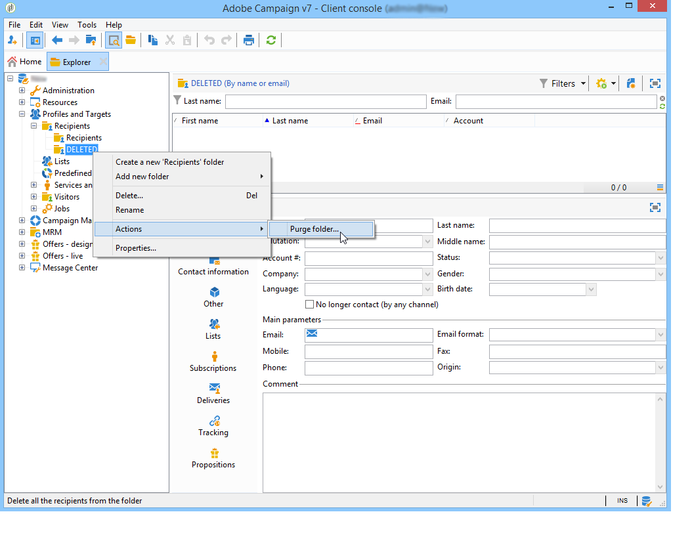

# Gestione dei profili{#managing-profiles}

## Struttura destinatari {#recipient-tree}

Per accedere alle funzionalità avanzate di gestione dei destinatari, è necessario modificare la struttura  Adobe Campaign. A tale scopo, fare clic sul pulsante **[!UICONTROL Explorer]** nella barra degli strumenti.

Per impostazione predefinita, i destinatari sono memorizzati nel nodo **[!UICONTROL Profiles and targets]** della struttura di Adobe Campaign . Dallo stesso nodo, puoi creare una o più cartelle e sottocartelle per memorizzare i profili dei destinatari.

Ogni nodo coincide con una cartella. I dati di ciascuna cartella devono essere considerati partizionati l&#39;uno dall&#39;altro. Ciò significa che la gestione dei duplicati sarà più complessa per più cartelle di destinatari.

>[!NOTE]
>
>Per visualizzare l&#39;elenco di tutti i destinatari nel database, è necessario creare una visualizzazione. Fare riferimento a [Cartelle e viste](../../platform/using/access-management.md#folders-and-views).

## Spostamento dei destinatari {#moving-recipients}

Puoi selezionare uno o più destinatari, trascinarli dall’elenco dei destinatari e rilasciarli nella cartella desiderata. Viene visualizzato un messaggio di avviso che richiede di confermare l’azione.

## Copia di un destinatario {#copying-a-recipient}

Per copiare un destinatario nella stessa cartella, fai clic con il pulsante destro del mouse sul destinatario desiderato e seleziona **[!UICONTROL Copy]**.

## Eliminazione dei destinatari {#deleting-recipients}

Per eliminare i destinatari, spostateli in una cartella specifica, quindi rimuovete il contenuto di questa cartella. È **vivamente consigliato non utilizzare** l&#39;opzione **[!UICONTROL Delete]** in questo caso.

Per eliminare una cartella, utilizzate il menu **[!UICONTROL Actions > Purge folder]**, a cui si accede facendo clic con il pulsante destro del mouse sulla cartella desiderata.

Fare clic su **[!UICONTROL Start]** per avviare l&#39;operazione. Nella sezione centrale della finestra viene visualizzato lo stato di avanzamento, come illustrato di seguito:

