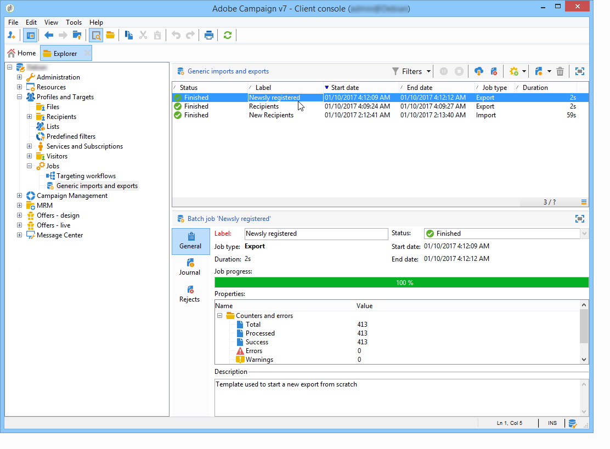

# Monitorare l’esecuzione dei processi {#monitoring-job-execution}

È possibile tenere traccia dell&#39;esecuzione dei processi di importazione ed esportazione direttamente dall&#39;elenco dei processi di importazione/esportazione.

* La scheda **[!UICONTROL Journal]** consente di esaminare i messaggi di registro relativi all&#39;esecuzione.
* La scheda **[!UICONTROL Rejects]** contiene i record rifiutati. Consulta [questa sezione](../../platform/using/executing-import-jobs.md#behavior-in-the-event-of-an-error).

Nella scheda **[!UICONTROL General]**, il campo **[!UICONTROL Status]** indica lo stato corrente di un processo.

Ogni stato è rappresentato da un’icona e un’etichetta speciali. Gli stati e le relative icone sono elencati di seguito:

* **Modifica in corso**

  Il processo è in fase di creazione.

* **Esecuzione in corso**

  Il processo è in esecuzione.

* **Annulla**

  Fare clic sul pulsante **[!UICONTROL Cancel]**: il processo in corso viene annullato.

* **Annullamento in corso**

  Il comando di annullamento è stato preso in considerazione e il processo è stato annullato.

* **Pausa in corso**

  Fare clic su **[!UICONTROL Pause]**: processo sospeso.

* **In pausa**

  Fare clic su **[!UICONTROL Pause]**: il processo è sospeso. È possibile riavviarlo facendo clic su **[!UICONTROL Start]**.

* **Completato**

  Esecuzione del processo completata.

* **Completato con errore**

  Il processo non è stato eseguito a causa di un errore tecnico.

* **Arresto del server in corso**

  Il processo in corso è stato interrotto perché il server Adobe Campaign è stato arrestato.
