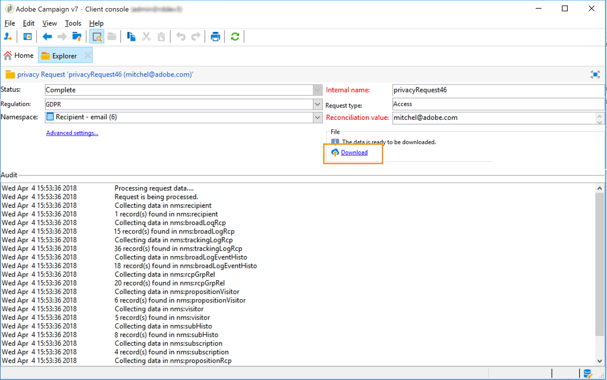
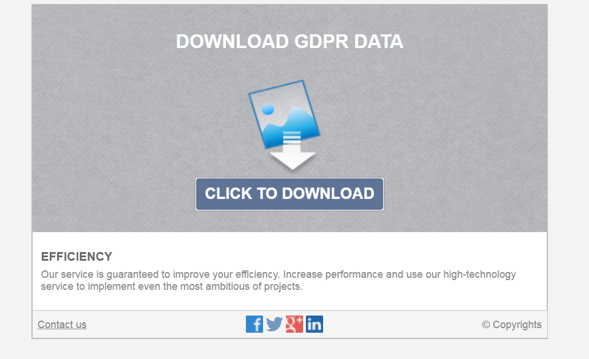

# Creare e gestire richieste di accesso a dati personali {#privacy-request-ui}


Questa sezione descrive come creare le richieste di accesso ed eliminazione e come Adobe Campaign le elabora.

## Creare una richiesta di accesso a dati personali {#create-privacy-request-ui}

L’**interfaccia di Adobe Campaign** consente di creare le richieste di accesso ai dati personali e di tracciarne l’evoluzione. Per creare una nuova richiesta di accesso a dati personali, segui queste istruzioni:

1. Accedi alla cartella della richiesta di accesso a dati personali in **[!UICONTROL Administration]** > **[!UICONTROL Platform]** > **[!UICONTROL Privacy Requests]**.

   

1. Questa schermata ti consente di visualizzare tutte le richieste di accesso a deati personali correnti, il loro stato e i registri. Fai clic su **[!UICONTROL New]** per creare una richiesta di accesso a dati personali.

   

1. Seleziona **[!UICONTROL Regulation]** (RGPD, CCPA, PDPA o LGPD), **[!UICONTROL Request type]** (accesso o eliminazione), seleziona un **[!UICONTROL Namespace]** e immetti il **[!UICONTROL Reconciliation value]**. Se utilizzi l’e-mail come namespace, digita l’e-mail dell’interessato.

   

I flussi di lavoro tecnici per la privacy vengono eseguiti una volta al giorno ed elaborano ogni nuova richiesta:

* Richiesta di eliminazione: i dati del destinatario memorizzati in Adobe Campaign vengono cancellati.
* Richiesta di accesso: i dati del destinatario memorizzati in Adobe Campaign vengono generati e resi disponibili come file XML nella parte sinistra della schermata di richiesta.



## Elenco delle tabelle {#list-of-tables}

Durante l’esecuzione di una richiesta di eliminazione o di accesso ai dati personali, Adobe Campaign cerca tutti i dati dell’interessato in base al **[!UICONTROL Reconciliation value]** in tutte le tabelle che presentano un collegamento alla tabella dei destinatari (di tipo proprio).

Di seguito è riportato l’elenco delle tabelle pronte all’uso prese in considerazione per l’esecuzione delle richieste di accesso a dati personali:

* Destinatari (recipient)
* Registro delle consegne ai destinatari (broadLogRcp)
* Registro di tracciamento dei destinatari (trackingLogRcp)
* Registro di consegna degli eventi archiviati (broadLogEventHisto)
* Contenuto dell’elenco destinatari (rcpGrpRel)
* Proposta di offerta del visitatore (propositionVisitor)
* Visitatori (visitor)
* Storico abbonamenti (subHisto)
* Abbonamenti (subscription)
* Proposta di offerta del destinatario (propositionRcp)

Se hai creato tabelle personalizzate con un collegamento alla tabella dei profili (di tipo proprio), anche queste verranno considerate. Ad esempio, se disponi di una tabella di transazioni collegata alla tabella dei destinatari e una tabella di dettagli delle transazioni collegata alla tabella delle transazioni, verranno entrambe considerate.

>[!IMPORTANT]
>
>Se esegui richieste batch di accesso a dati personali utilizzando flussi di lavoro per l’eliminazione del profilo, tieni presente le seguenti osservazioni:
>* L’eliminazione del profilo tramite flussi di lavoro non elabora eventuali tabelle secondarie.
>* È necessario gestire l’eliminazione per tutte le tabelle secondarie.
>* Adobe consiglia di creare un flusso di lavoro ETL che aggiunga le righe da eliminare nella tabella di accesso ai dati personali e consenta al flusso di lavoro **[!UICONTROL Delete privacy requests data]** di eseguire l’eliminazione. Consigliamo di limitare l’eliminazione a 200 profili al giorno, per motivi di prestazioni.

## Stati delle richieste di accesso a dati personali {#privacy-request-statuses}

Di seguito sono riportati i diversi stati delle richieste di accesso a dati personali:

* **[!UICONTROL New]** / **[!UICONTROL Retry pending]**: in corso, il flusso di lavoro non ha ancora elaborato la richiesta.
* **[!UICONTROL Processing]** / **[!UICONTROL Retry in progress]**: il flusso di lavoro sta elaborando la richiesta.
* **[!UICONTROL Delete pending]**: il flusso di lavoro ha identificato tutti i dati del destinatario da eliminare.
* **[!UICONTROL Delete in progress]**: il flusso di lavoro sta elaborando l’eliminazione.
* **[!UICONTROL Delete Confirmation Pending]** (richiesta di eliminazione in modalità di processo in due fasi): il flusso di lavoro ha elaborato la richiesta di accesso. Per eseguire l’eliminazione, è richiesta una conferma manuale. Il pulsante è disponibile per 15 giorni.
* **[!UICONTROL Complete]**: l’elaborazione della richiesta è andata a buon fine.
* **[!UICONTROL Error]**: il flusso di lavoro ha rilevato un errore. Il motivo viene visualizzato nell’elenco delle richieste di accesso a dati personali nella colonna **[!UICONTROL Request status]**. Ad esempio, **[!UICONTROL Error data not found]** significa che nel database non è stato trovato nessun dato del destinatario corrispondente al **[!UICONTROL Reconciliation value]** dell’interessato.

## Processo in due fasi {#two-step-process}

Il **processo in due fasi** è attivato per impostazione predefinita. Quando crei una nuova richiesta di eliminazione utilizzando questa modalità, Adobe Campaign esegue sempre prima una richiesta di accesso. Questo ti consente di controllare i dati prima di confermarne l’eliminazione.

Puoi modificare questa modalità dalla schermata di modifica della richiesta di accesso a dati personali. Fai clic su **[!UICONTROL Advanced settings]**.


Attivando la modalità in 2 passaggi, lo stato di una nuova richiesta di eliminazione diventa **[!UICONTROL Confirm Delete Pending]**. Scarica il file XML generato dalla schermata di richiesta di accesso a dati personali e controlla i dati. Per confermare la cancellazione dei dati, fai clic sul pulsante **[!UICONTROL Confirm delete data]**.


## URL JSSP {#jspp-url}

Quando si elaborano le richieste di accesso, Adobe Campaign genera un JSSP che recupera i dati del destinatario dal database ed li esporta in un file XML memorizzato nel computer locale. L’URL JSSP è definito come segue:

```
"$(serverUrl)+'/nms/gdpr.jssp?id='+@id"
```

dove @id è l’ID della richiesta di accesso a dati personali.

Questo URL viene memorizzato nel campo **[!UICONTROL "File location" (@urlFile)]** dello schema **[!UICONTROL Privacy Requests (gdprRequest)]**.

Le informazioni sono disponibili nel database per 90 giorni. Una volta pulita la richiesta dal flusso di lavoro tecnico, le informazioni vengono rimosse dal database e l’URL diventa obsoleto. Controlla che l’URL sia ancora valido prima di scaricare i dati da una pagina web.

Ecco un esempio del file di dati dell’interessato:


I titolari del trattamento dei dati possono creare facilmente un’applicazione web che includa l’URL JSSP corrispondente per rendere disponibile il file di dati dell’interessato da una pagina web.



Questo è uno snippet di codice che puoi utilizzare come esempio nell’attività **[!UICONTROL Page]** dell’applicazione web .


```
<!DOCTYPE html PUBLIC "-//W3C//DTD XHTML 1.0 Transitional//EN" "http://www.w3.org/TR/xhtml1/DTD/xhtml1-transitional.dtd"> <html xmlns="http://www.w3.org/1999/xhtml"> <head> <meta http-equiv="Content-Language" content="en"> <meta http-equiv="Content-Type" content="text/html; charset=utf-8" /> <link rel="stylesheet" type="text/css" href="/nl/webForms/landingPage.css"/> <title>Clickthrough</title> <style type="text/css" media="all"> /* override formulary area */ .formulary { top: 200px; position: absolute; left: 0; } </style> </head> <body style="" class="">
<center>
<div id="wrap">
<div id="header">
<div class="header-title center-title">DOWNLOAD GDPR DATA</div>
<div class="formulary center-formulary"><form>
<div class="button large-button"><a href=[SERVER_URL]/nms/gdpr.jssp?id=13000" data-nl-type="externalLink">CLICK TO DOWNLOAD</a></div>
</form></div>
</div>
<div id="content">
<div class="row">
<div class="info">
<div class="desc">
<div class="title">EFFICIENCY</div>
<div class="desc">Our service is guaranteed to improve your efficiency. Increase performance and use our high-technology service to implement even the most ambitious of projects.</div>
</div>
</div>
</div>
</div>
<div id="footer">
<div style="text-align: center;">
<div style="float: left;"><a href="#">Contact us</a></div>
<div style="float: right;">&copy; Copyrights</div>
<div><a href="#"></a> <a href="#"></a> <a href="#"></a> <a href="#"></a></div>
</div>
</div>
</div>
</center>
</body> </html>
```

Poiché l’accesso al file di dati dell’interessato è limitato, l’accesso anonimo alla pagina web deve essere disattivato. Solo gli operatori che dispongono delle autorizzazioni denominate **[!UICONTROL Privacy Data Right]** possono accedere alla pagina e scaricare i dati.
