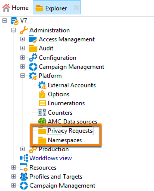
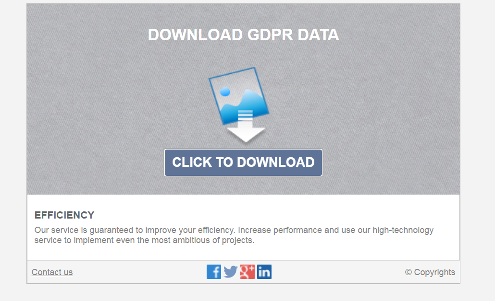

# Gestione delle richieste di privacy {#privacy-requests}

Per una presentazione generale sulla gestione della privacy, consulta [questa sezione](../../platform/using/privacy-management.md).

Queste informazioni si applicano alle normative GDPR, CCPA, PDPA e LGPD. Per ulteriori informazioni su tali normative, consulta [questa sezione](../../platform/using/privacy-management.md#privacy-management-regulations).

La rinuncia alla vendita di informazioni personali, specifica del CCPA, è spiegata in [questa sezione](#sale-of-personal-information-ccpa).

<!--Installation procedures described in this document are applicable starting Campaign Classic 18.4 (build 8931+). If you are running on a previous version, refer to this [technote](https://helpx.adobe.com/campaign/kb/how-to-install-gdpr-package-on-legacy-versions.html).-->

## Informazioni sulle richieste di privacy {#about-privacy-requests}

Per aiutarti a garantire l’idoneità alle normative sulla privacy, Adobe Campaign consente di gestire le richieste di accesso ed eliminazione. Il **diritto di accesso** e il **diritto all’oblio** (richiesta di eliminazione) sono illustrati in [questa sezione](../../platform/using/privacy-management.md#right-access-forgotten).

Vediamo come creare le richieste di accesso ed eliminazione e come Adobe Campaign le elabora.

### Principi {#principles}

Adobe Campaign offre ai titolari del trattamento dei dati due possibilità per eseguire le richieste di accesso e cancellazione per la privacy:

* Tramite l&#39; **interfaccia Adobe Campaign**: per ogni richiesta di accesso a dati personali, il titolare del trattamento crea una nuova richiesta di accesso a dati personali in Adobe Campaign. Vedi [questa sezione](#create-privacy-request-ui).
* Tramite **API**: Adobe Campaign fornisce un’API che consente il processo automatico delle richieste di Privacy utilizzando SOAP. Vedi [questa sezione](#automatic-privacy-request-api).

>[!NOTE]
>
>Per ulteriori informazioni sui dati personali e sulle diverse entità che gestiscono i dati (titolare del trattamento, responsabile del trattamento e interessato), consulta [Dati personali e utenti tipo](../../platform/using/privacy-and-recommendations.md#personal-data).

### Prerequisiti {#prerequesites}

 Adobe Campaign offre ai titolari del trattamento strumenti per creare ed elaborare richieste di accesso a dati personali per i dati memorizzati in Adobe Campaign. La gestione del rapporto con l’interessato (tramite e-mail, assistenza clienti o un portale web) rimane tuttavia responsabilità del titolare del trattamento.

In qualità di titolare del trattamento, avrai pertanto la responsabilità di confermare l’identità dell’interessato che presenta la richiesta e confermare che i dati restituiti al richiedente riguardano l’interessato.

### Installazione del pacchetto Privacy {#install-privacy-package}

Per utilizzare questa funzione, è necessario installare il pacchetto **[!UICONTROL Privacy Data Protection Regulation]** tramite il menu **[!UICONTROL Tools]** > **[!UICONTROL Advanced]** > **[!UICONTROL Import package]** > **[!UICONTROL Adobe Campaign Package]**. Per ulteriori informazioni su come installare i pacchetti, consulta la [documentazione dettagliata](../../installation/using/installing-campaign-standard-packages.md).

Due nuove cartelle, specifiche di Privacy, vengono create in **[!UICONTROL Administration]** > **[!UICONTROL Platform]**:

* **[!UICONTROL Privacy Requests]**: qui puoi creare le richieste di Privacy e tracciarne l’evoluzione.
* **[!UICONTROL Namespaces]**: in questo punto puoi definire il campo che verrà utilizzato per identificare l’interessato nel database di Adobe Campaign.



In **[!UICONTROL Administration]** > **[!UICONTROL Production]** > **[!UICONTROL Technical workflows]**, tre flussi di lavoro tecnici vengono eseguiti ogni giorno per elaborare le richieste di accesso a dati personali.


* **[!UICONTROL Collect privacy requests]**: questo flusso di lavoro genera i dati del destinatario memorizzati in Adobe Campaign e li rende disponibili per il download nella schermata della richiesta di accesso a dati personali.
* **[!UICONTROL Delete privacy requests data]**: questo flusso di lavoro elimina i dati del destinatario memorizzati in Adobe Campaign.
* **[!UICONTROL Privacy request cleanup]**: questo flusso di lavoro cancella i file di richiesta di accesso che sono più vecchi di 90 giorni.

In **[!UICONTROL Administration]** > **[!UICONTROL Access Management]** > **[!UICONTROL Named rights]** è stato aggiunto il **[!UICONTROL Privacy Data Right]** diritto denominato . Questo diritto denominato è necessario per i titolari del trattamento dei dati al fine di consentire loro di utilizzare gli strumenti per la privacy. Questo consente loro di creare nuove richieste, tracciare la loro evoluzione, utilizzare l’API, ecc.


### Spazi dei nomi {#namesspaces}

Prima di creare le richieste di accesso a dati personali, è necessario definire lo spazio dei nomi che verrà utilizzato. Questa è la chiave che verrà utilizzata per identificare l’interessato nel database di Adobe Campaign.

Sono disponibili tre spazi dei nomi predefiniti: e-mail, telefono e cellulare. Se hai bisogno di un namespace diverso (ad esempio un campo personalizzato destinatario), puoi crearne uno nuovo da **[!UICONTROL Administration]** > **[!UICONTROL Platform]** > **[!UICONTROL Namespaces]**.

## Creazione di una richiesta di accesso a dati personali {#create-privacy-request-ui}

L’ **interfaccia Adobe Campaign** ti consente di creare le richieste di accesso a dati personali e di tracciarne l’evoluzione. Per creare una nuova richiesta di accesso a dati personali, segui queste istruzioni:

1. Accedi alla cartella della richiesta di accesso a dati personali in **[!UICONTROL Administration]** > **[!UICONTROL Platform]** > **[!UICONTROL Privacy Requests]**.

   

1. Questa schermata ti consente di visualizzare tutte le richieste di Privacy correnti, il loro stato e i registri. Fai clic su **[!UICONTROL New]** per creare una richiesta di accesso a dati personali.

   

1. Seleziona **[!UICONTROL Regulation]** (RGPD, CCPA, PDPA o LGPD), **[!UICONTROL Request type]** (Accesso o eliminazione), seleziona un **[!UICONTROL Namespace]** e immetti il valore **[!UICONTROL Reconciliation value]**. Se utilizzi l’e-mail come namespace, digita l’e-mail dell’interessato.

   

I flussi di lavoro tecnici per la privacy vengono eseguiti una volta al giorno ed elaborano ogni nuova richiesta:

* Elimina richiesta: i dati del destinatario memorizzati in Adobe Campaign vengono cancellati.
* Richieste di accesso: i dati del destinatario memorizzati in Adobe Campaign vengono generati e resi disponibili come file XML nella parte sinistra della schermata di richiesta.


### Elenco delle tabelle {#list-of-tables}

Quando si esegue una richiesta di cancellazione o accesso a dati personali, Adobe Campaign cerca tutti i dati dell’interessato in base al **[!UICONTROL Reconciliation value]** in tutte le tabelle che hanno un collegamento alla tabella dei destinatari (tipo proprio).

Elenco delle tabelle predefinite prese in considerazione durante l’esecuzione delle richieste di accesso a dati personali:

* Destinatari (destinatario)
* Registro consegne destinatario (wideLogRcp)
* Registro di tracciamento dei destinatari (trackingLogRcp)
* Registro di consegna degli eventi archiviati (wideLogEventHisto)
* Contenuto dell’elenco destinatari (rcpGrpRel)
* Proposta di offerta del visitatore (propositionVisitor)
* Visitatori (visitor)
* Storico sottoscrizioni (subHisto)
* Abbonamenti (abbonamento)
* Proposta di offerta del destinatario (propositionRcp)

Se hai creato tabelle personalizzate con un collegamento alla tabella dei destinatari (tipo proprio), verranno prese in considerazione anche queste. Ad esempio, se hai una tabella di transazioni collegata alla tabella dei destinatari e una tabella di dettagli delle transazioni collegata alla tabella delle transazioni, entrambe verranno prese in considerazione.

>[!IMPORTANT]
>
>Se esegui richieste batch di Privacy utilizzando i flussi di lavoro di eliminazione del profilo, tieni presente le seguenti osservazioni:
>* L’eliminazione del profilo tramite flussi di lavoro non elabora tabelle figlio.
>* È necessario gestire l&#39;eliminazione per tutte le tabelle figlio.
>* Adobe consiglia di creare un flusso di lavoro ETL che aggiunga le righe da eliminare nella tabella Accesso alla privacy e consenta al flusso di lavoro **[!UICONTROL Delete privacy requests data]** di eseguire l’eliminazione. Suggeriamo di limitare a 200 profili al giorno da eliminare per motivi di prestazioni.


### Stati delle richieste di accesso a dati personali {#privacy-request-statuses}

Di seguito sono riportati i diversi stati delle richieste di accesso a dati personali:

* **[!UICONTROL New]** / **[!UICONTROL Retry pending]**: in corso, il flusso di lavoro non ha ancora elaborato la richiesta.
* **[!UICONTROL Processing]** / **[!UICONTROL Retry in progress]**: il flusso di lavoro sta elaborando la richiesta.
* **[!UICONTROL Delete pending]**: il flusso di lavoro ha identificato tutti i dati del destinatario da eliminare.
* **[!UICONTROL Delete in progress]**: il flusso di lavoro sta elaborando l’eliminazione.
* **[!UICONTROL Delete Confirmation Pending]** (Elimina la richiesta in modalità di processo in due fasi): il flusso di lavoro ha elaborato la richiesta di accesso. Per eseguire l’eliminazione, è richiesta una conferma manuale. Il pulsante è disponibile per 15 giorni.
* **[!UICONTROL Complete]**: l’elaborazione della richiesta è andata a buon fine.
* **[!UICONTROL Error]**: il flusso di lavoro ha rilevato un errore. Il motivo viene visualizzato nell’elenco delle richieste di accesso a dati personali nella colonna **[!UICONTROL Request status]** . Ad esempio, **[!UICONTROL Error data not found]** significa che nel database non è stato trovato nessun dato del destinatario corrispondente al **[!UICONTROL Reconciliation value]** dell’interessato.

### Processo in due fasi {#two-step-process}

Per impostazione predefinita, il **processo a 2 fasi** è attivato. Quando crei una nuova richiesta di eliminazione utilizzando questa modalità, Adobe Campaign esegue sempre una richiesta di accesso. Questo ti consente di controllare i dati prima di confermare l’eliminazione.

Puoi modificare questa modalità dalla schermata di modifica della richiesta di accesso a dati personali. Fai clic su **[!UICONTROL Advanced settings]**.


Attivando la modalità in 2 passaggi, lo stato di una nuova richiesta di cancellazione cambia in **[!UICONTROL Confirm Delete Pending]**. Scarica il file XML generato dalla schermata di richiesta della privacy e controlla i dati. Per confermare la cancellazione dei dati, fare clic sul pulsante **[!UICONTROL Confirm delete data]** .


### URL JSSP {#jspp-url}

Quando si elaborano le richieste di accesso, Adobe Campaign genera un JSSP che recupera i dati del destinatario dal database ed li esporta in un file XML memorizzato nel computer locale. L’URL JSSP è definito come segue:

```
"$(serverUrl)+'/nms/gdpr.jssp?id='+@id"
```

dove @id è l’ID della richiesta di accesso a dati personali.

Questo URL viene memorizzato nel campo **[!UICONTROL "File location" (@urlFile)]** dello schema **[!UICONTROL Privacy Requests (gdprRequest)]** .

Le informazioni sono disponibili nel database per 90 giorni. Una volta pulita la richiesta dal flusso di lavoro tecnico, le informazioni vengono rimosse dal database e l’URL diventa obsoleto. Controlla che l&#39;URL sia ancora valido prima di scaricare i dati da una pagina web.

Ecco un esempio del file di dati dell’interessato:


I titolari del trattamento dei dati possono creare facilmente un’applicazione web che include l’URL JSSP corrispondente per rendere disponibile il file di dati dell’interessato da una pagina web.



Questo è uno snippet di codice che puoi utilizzare come esempio nell’attività dell’applicazione web **[!UICONTROL Page]** .


```
<!DOCTYPE html PUBLIC "-//W3C//DTD XHTML 1.0 Transitional//EN" "http://www.w3.org/TR/xhtml1/DTD/xhtml1-transitional.dtd"> <html xmlns="http://www.w3.org/1999/xhtml"> <head> <meta http-equiv="Content-Language" content="en"> <meta http-equiv="Content-Type" content="text/html; charset=utf-8" /> <link rel="stylesheet" type="text/css" href="/nl/webForms/landingPage.css"/> <title>Clickthrough</title> <style type="text/css" media="all"> /* override formulary area */ .formulary { top: 200px; position: absolute; left: 0; } </style> </head> <body style="" class="">
<center>
<div id="wrap">
<div id="header">
<div class="header-title center-title">DOWNLOAD GDPR DATA</div>
<div class="formulary center-formulary"><form>
<div class="button large-button"><a href=[SERVER_URL]/nms/gdpr.jssp?id=13000" data-nl-type="externalLink">CLICK TO DOWNLOAD</a></div>
</form></div>
</div>
<div id="content">
<div class="row">
<div class="info">
<div class="desc">
<div class="title">EFFICIENCY</div>
<div class="desc">Our service is guaranteed to improve your efficiency. Increase performance and use our high-technology service to implement even the most ambitious of projects.</div>
</div>
</div>
</div>
</div>
<div id="footer">
<div style="text-align: center;">
<div style="float: left;"><a href="#">Contact us</a></div>
<div style="float: right;">&copy; Copyrights</div>
<div><a href="#"></a> <a href="#"></a> <a href="#"></a> <a href="#"></a></div>
</div>
</div>
</div>
</center>
</body> </html>
```

Poiché l’accesso al file di dati dell’interessato è limitato, l’accesso anonimo alla pagina web deve essere disattivato. Solo l’operatore con il nome **[!UICONTROL Privacy Data Right]** con il nome giusto può accedere alla pagina e scaricare i dati.

## Processo di richiesta di privacy automatica {#automatic-privacy-request-api}

Adobe Campaign fornisce un **API** che ti consente di impostare un processo di richiesta automatica di accesso a dati personali.

Con l&#39;API, il processo generale di Privacy è lo stesso di [utilizzando l&#39;interfaccia](#create-privacy-request-ui). L’unica differenza è la creazione della richiesta di accesso a dati personali. Invece di creare la richiesta in Adobe Campaign, viene inviato a Campaign un POST contenente le informazioni sulla richiesta. Per ogni richiesta, viene aggiunta una nuova voce nella schermata **[!UICONTROL Privacy Requests]** . I flussi di lavoro tecnici per la privacy elaborano quindi la richiesta, come per una richiesta aggiunta utilizzando l’interfaccia .

Se utilizzi l’API per inviare richieste di Privacy, ti consigliamo di lasciare attivata la procedura **2 passaggi** per le prime richieste di eliminazione, al fine di verificare i dati restituiti. Al termine dei test, puoi disattivare il processo in due fasi in modo che il processo di richiesta di eliminazione possa essere eseguito automaticamente.

L&#39;API **[!UICONTROL CreateRequestByName]** JS è definita come segue.

>[!NOTE]
>
>Se stavi utilizzando l&#39;API **gdprRequest**, puoi comunque utilizzarla ma è consigliabile utilizzare la nuova API **privacyRequest**.

>[!IMPORTANT]
>
>Per utilizzare l’API è necessario il diritto **[!UICONTROL Privacy Data Right]** denominato .

```
<method library="nms:gdpr.js" name="CreateRequestByName" static="true">
 <help>Create a new GDPR Request using namespace internal name</help>
 <parameters>
  <param name="namespaceName" type="string" desc="Namespace internal name"/>
  <param name="reconciliationValue" type="string" desc="Reconciliation value"/>
  <param name="type" type="long" desc="Reconciliation value"/>
  <param name="confirmDeletePending" type="boolean" desc="Request confirm before deleting data"/>
  <param name="regulation" type="long" desc="regulation of newly created request"/>
  <param name="id" type="long" inout="out" desc="ID of newly created request"/>
 </parameters>
</method>
```

>[!NOTE]
>
>Il campo &quot;regulation&quot; è disponibile solo se si utilizza Campaign Classic 20.2 (build 9178+).
>
>Se stai eseguendo la migrazione alla versione 20.2 e se stavi già utilizzando l’API, devi aggiungere il campo &quot;regulation&quot; come mostrato in precedenza. Se utilizzi una build precedente, puoi continuare a utilizzare l’API senza il campo &quot;regulation&quot;.

### Richiamare l’API esternamente {#invoking-api-externally}

Ecco un esempio di come richiamare l’API esternamente (autenticazione tramite l’API e dettagli specifici sull’API Privacy). Per ulteriori informazioni sull&#39;API Privacy, consulta la [documentazione API](https://docs.adobe.com/content/help/en/campaign-classic/technicalresources/api/s-nms-privacyRequest.html). È inoltre possibile consultare la [documentazione sulle chiamate al servizio Web](../../configuration/using/web-service-calls.md).

Innanzitutto, devi eseguire l’autenticazione tramite l’API:

1. Scarica il file WSDL **xtk:session** tramite questo URL: **`<server url>`/nl/jsp/schemawsdl.jsp?schema=xtk:session**.

1. Utilizza il metodo &quot;Logon&quot; e passa un nome utente e una password come parametri nella richiesta. Riceverai una risposta contenente un token di sessione. Ecco un esempio che utilizza SoapUI.

   

1. Utilizza il Token di sessione restituito come autenticazione per tutte le chiamate API successive. Scade dopo 24 ore.

Quindi invoca l’API Privacy:

1. Scarica la WSDL da questo URL: **`<server url>`/nl/jsp/schemawsdl.jsp?schema=nms:privacyRequest**.

1. Utilizza **[!UICONTROL CreateRequestByName]** per creare una richiesta di accesso a dati personali specifica.

   Di seguito è riportato un esempio che utilizza l’ **[!UICONTROL CreateRequestByName]**. Come si utilizza il token di sessione fornito in precedenza come autenticazione. La risposta è l’ID della richiesta creata.

   

   Per aiutarti a eseguire i passaggi precedenti, considera quanto segue:

   * È possibile utilizzare uno schema **queryDef** nello schema **nms:gdprRequest** per controllare lo stato della richiesta di Access.
   * È possibile utilizzare uno schema **queryDef** su **nms:gdprRequestData** per ottenere il risultato della richiesta di Access.
   * Per scaricare il file XML da **&quot;$(serverUrl)&#39;/nms/gdpr.jssp?id=&#39;@id&quot;**, è necessario aver effettuato l&#39;accesso e accedervi da un IP inserito nella whitelist. A questo scopo, crea un’applicazione web che ti consenta di accedere al file generato da JSSP.

### Richiamare l’API da un JS {#invoking-api-from-js}

Ecco un esempio di come richiamare l’API da un JS all’interno di Campaign Classic.

>[!NOTE]
>
>Il campo &quot;regulation&quot; è disponibile solo se si utilizza Campaign Classic 20.2 (build 9178+).
>
>Se stai eseguendo la migrazione alla versione 20.2 e se stavi già utilizzando l’API, devi aggiungere il campo &quot;regulation&quot;. Se utilizzi una build precedente, puoi continuare a utilizzare l’API senza il campo &quot;regulation&quot;.

* Se utilizzi **una build precedente (con pacchetto RGPD)**, puoi continuare a utilizzare l’API senza il campo &quot;regulation&quot; come mostrato di seguito:

   ```
   loadLibrary("nms:gdpr.js");
   /**************************** 
   This code calls an API to create new Privay request on the DB.
   It requires 4 parameters below.
   Feel free to change parameter values.
   ****************************/
   // 1. Namespace internal name
   var namespaceName = "defaultNamespace1";
   // 2. Reconciliation value for privacy request
   var reconciliationValue = "example@adobe.com";
   // 3. Privacy request type
   // GDPR_REQUEST_TYPE_ACCESS = 1;
   // GDPR_REQUEST_TYPE_DELETE = 2;
   var requestType = GDPR_REQUEST_TYPE_ACCESS;
   // 4. Confirm deleting data required.
   // value : true or false
   var ConfirmDeletePending = true;
   // BEGIN
   var requestId = nms.privacyRequest.CreateRequestByName(namespaceName, reconciliationValue, requestType, ConfirmDeletePending);
   // User can use a simple queryDef with requestID as a parameter to check request status.
   ```

* Se stai **eseguendo la migrazione a 20.2** e se stavi già utilizzando l&#39;API, devi aggiungere il campo &quot;regulation&quot; come mostrato di seguito:

   ```
   loadLibrary("nms:gdpr.js");
   /**************************** 
   This code calls an API to create new Privay request on the DB.
   It requires 5 parameters below.
   Feel free to change parameter values.
   ****************************/
   // 1. Namespace internal name
   var namespaceName = "defaultNamespace1";
   // 2. Reconciliation value for privacy request
   var reconciliationValue = "example@adobe.com";
   // 3. Privacy request type
   // PRIVACY_REQUEST_TYPE_ACCESS = 1;
   // PRIVACY_REQUEST_TYPE_DELETE = 2;
   var requestType = PRIVACY_REQUEST_TYPE_ACCESS;
   // 4. Confirm deleting data required.
   // value : true or false
   var ConfirmDeletePending = true;
   // 5. Specify which regulation applies to newly created request. This is mandatory parameter.
   // GDPR = 1
   // CCPA = 2
   // PDPA = 3
   // LGPD = 4
   var regulation = 1;
   // BEGIN
   var requestId = nms.privacyRequest.CreateRequestByName(namespaceName, reconciliationValue, requestType, ConfirmDeletePending, regulation);
   // User can use a simple queryDef with requestID as a parameter to check request status.
   ```

* Se utilizzi **Campaign Classic 20.2 (build 9178+) o versione successiva**, il campo &quot;regulation&quot; è facoltativo, come illustrato di seguito:

   ```
   loadLibrary("nms:gdpr.js");
   /**************************** 
   This code calls an API to create new Privay request on the DB.
   It requires 5 parameters below.
   Feel free to change parameter values 
   ****************************/
   // 1. Namespace internal name
   var namespaceName = "defaultNamespace1";
   // 2. Reconciliation value for privacy request
   var reconciliationValue = "example@adobe.com";
   // 3. Privacy request type
   // PRIVACY_REQUEST_TYPE_ACCESS = 1;
   // PRIVACY_REQUEST_TYPE_DELETE = 2;
   var requestType = PRIVACY_REQUEST_TYPE_ACCESS;
   // 4. Confirm deleting data required.
   // value : true or false
   var ConfirmDeletePending = true;
   // 5. Specify which regulation applies to newly created request. This is optional parameter.
   // GDPR = 1
   // CCPA = 2
   // PDPA = 3
   // LGPD = 4
   var regulation = 1;
   // BEGIN
   var requestId = nms.privacyRequest.CreateRequestByName(namespaceName, reconciliationValue, requestType, ConfirmDeletePending, regulation);
   // User can use a simple queryDef with requestID as a parameter to check request status.
   ```

## Rinuncia alla vendita di informazioni personali (CCPA) {#sale-of-personal-information-ccpa}

Il **California Consumer Privacy Act** (CCPA) fornisce ai residenti della California nuovi diritti in merito alle loro informazioni personali e impone responsabilità in materia di protezione dei dati a determinate entità che conducono attività commerciali in California.

La configurazione e l’utilizzo delle richieste di accesso ed eliminazione sono comuni sia al GDPR che al CCPA. Questa sezione presenta la rinuncia alla vendita di dati personali, specifica del CCPA.

Oltre agli strumenti [Gestione del consenso](../../platform/using/privacy-management.md#consent-management) forniti da Adobe Campaign, puoi verificare se un consumatore ha rinunciato alla vendita di Informazioni personali.

Un consumatore decide, attraverso il tuo sistema, di non dare il consenso per la vendita dei propri dati personali a terzi. In Adobe Campaign, potrai archiviare e tenere traccia di questo tipo di informazioni.

Affinché ciò funzioni, devi estendere la tabella Profili e aggiungere un campo **[!UICONTROL Opt-Out for CCPA]** .

>[!IMPORTANT]
>
>In qualità di titolare del trattamento è tua responsabilità ricevere la richiesta dell’interessato e tenere traccia delle date della richiesta in conformità con il CCPA. In qualità di fornitore di tecnologia, ci limitiamo a offrire un modo per esprimere la rinuncia. Per ulteriori informazioni sul tuo ruolo in quanto titolare del trattamento, consulta [Dati personali e utenti tipo](../../platform/using/privacy-and-recommendations.md#personal-data).

### Prerequisito {#ccpa-prerequisite}

Per sfruttare queste informazioni, devi creare questo campo in Adobe Campaign Classic. A questo scopo, aggiungi un campo booleano alla tabella **[!UICONTROL Recipient]**. Quando viene creato un nuovo campo, questo viene automaticamente supportato dall’API di Campaign.

Se utilizzi una tabella dei destinatari personalizzata, devi eseguire anche questa operazione.

Per informazioni più dettagliate su come creare un nuovo campo, consulta la [documentazione sull&#39;edizione dello schema](../../configuration/using/about-schema-edition.md).

>[!IMPORTANT]
>
>La modifica degli schemi è un’operazione sensibile che deve essere eseguita solo da utenti esperti.

1. Vai a **[!UICONTROL Tools]** > **[!UICONTROL Advanced]** > **[!UICONTROL Add new fields]**, seleziona **[!UICONTROL Recipients]** come **[!UICONTROL Document type]** e fai clic su **[!UICONTROL Next]**. Per ulteriori informazioni sull’aggiunta di campi a una tabella, consulta [questa sezione](../../configuration/using/new-field-wizard.md).

   

1. Per il **[!UICONTROL Field type]**, selezionare **[!UICONTROL SQL field]**. Per Etichetta, utilizza **[!UICONTROL Opt-Out for CCPA]**. Seleziona il tipo **[!UICONTROL 8-bit integer (boolean)]** e definisci il seguente univoco **[!UICONTROL Relative path]**: @OPTOUTCCPA. Fai clic su **[!UICONTROL Finish]**.

   

   Questo estenderà o creerà lo schema **[!UICONTROL Recipient (cus)]**. Fai clic su di esso per verificare che il campo sia stato aggiunto correttamente.

   

1. Fai clic sul nodo **[!UICONTROL Configuration]** > **[!UICONTROL Input forms]** dell&#39;esploratore. In **[!UICONTROL Recipient (nms)]**, in &quot;Pacchetto generale&quot;, aggiungi un elemento `<input>` e utilizza, per il valore xpath, il percorso relativo definito nel passaggio 2. Per ulteriori informazioni sull&#39;identificazione di un modulo, vedere [questa sezione](../../configuration/using/identifying-a-form.md).

   ```
   <input  colspan="2" type="checkbox" xpath="@OPTOUTCCPA"/>
   ```

   

1. Disconnetti e riconnettiti. Segui i passaggi descritti nella sezione successiva per verificare che il campo sia disponibile nei dettagli di un destinatario.

### Utilizzo {#usage}

Compilare il valore del campo e seguire le linee guida e le regole del CCPA relative alla vendita dei dati è responsabilità del titolare del trattamento.

Sono disponibili diversi metodi per compilare i valori:

* Utilizzo dell’interfaccia di Campaign modificando i dettagli del destinatario
* Utilizzo dell’API
* Mediante un flusso di lavoro di importazione dati

Accertati di non vendere mai a terzi le informazioni personali dei profili che hanno espresso la rinuncia.

1. Per modificare lo stato di rinuncia, vai su **[!UICONTROL Profiles and Target]** > **[!UICONTROL Recipients]** e seleziona un destinatario. Nella scheda **[!UICONTROL General]** viene visualizzato il campo configurato nella sezione precedente.

   

1. Configura l’elenco dei destinatari per visualizzare la colonna a comparsa. Per informazioni su come configurare gli elenchi, consulta la [documentazione dettagliata](../../platform/using/adobe-campaign-workspace.md#configuring-lists).

   

1. Fai clic sulla colonna per ordinare i destinatari in base alle informazioni di rinuncia. Puoi anche creare un filtro per visualizzare solo i destinatari che hanno rinunciato. Per ulteriori informazioni sulla creazione dei filtri, consulta [questa sezione](../../platform/using/creating-filters.md).

   
