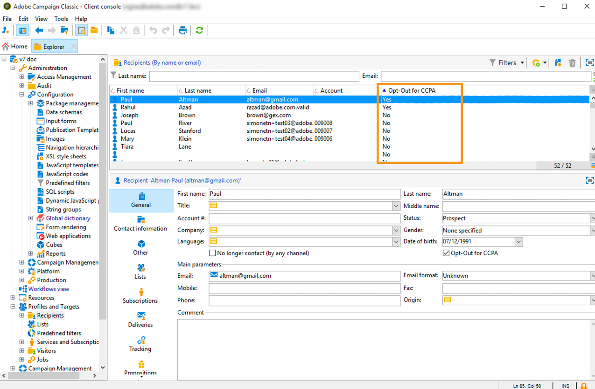

# Gestione delle richieste di privacy {#privacy-requests}

Per una presentazione generale sulla gestione della privacy, consultare [questa sezione](../../platform/using/privacy-management.md).

Queste informazioni si applicano a GDPR, CCPA, PDPA e LGPD. For more on these regulations, see [this section](../../platform/using/privacy-management.md#privacy-management-regulations).

La rinuncia alla vendita di informazioni personali, che è specifica dell&#39;CCPA, è spiegata in [questa sezione](#sale-of-personal-information-ccpa).

>[!IMPORTANT]
>
>Le procedure di installazione descritte in questo documento sono applicabili a partire dal Campaign Classic 18.4 (build 8931+). Se si utilizza una versione precedente, fare riferimento a questa [nota tecnica](https://helpx.adobe.com/it/campaign/kb/how-to-install-gdpr-package-on-legacy-versions.html).

## Informazioni sulle richieste di privacy {#about-privacy-requests}

Per facilitare la preparazione alla privacy,  Adobe Campaign consente di gestire le richieste di accesso ed eliminazione. In **questa sezione** sono descritti il **Diritto di accesso** e il [Diritto di essere Dimenticato](../../platform/using/privacy-management.md#right-access-forgotten)(richiesta di eliminazione).

Vediamo come creare le richieste di accesso ed eliminazione, nonché come  Adobe Campaign le elabora.

### Principi {#principles}

 Adobe Campaign offre ai Data Controller due possibilità per eseguire le richieste di accesso ed eliminazione alla privacy:

* Tramite l&#39;interfaccia **** Adobe Campaign: per ogni richiesta di privacy, il Data Controller crea una nuova richiesta di privacy in  Adobe Campaign. Vedi [questa sezione](#create-privacy-request-ui).
* Tramite l&#39; **API**:  Adobe Campaign fornisce un&#39;API che consente il processo automatico delle richieste di privacy utilizzando SOAP. Vedi [questa sezione](#automatic-privacy-request-api).

>[!NOTE]
>
>Per ulteriori informazioni sui dati personali e sulle diverse entità che gestiscono i dati (Titolare del trattamento dei dati, Processore dati e Oggetto dati), consulta Dati [personali e Personas](../../platform/using/privacy-and-recommendations.md#personal-data).

### Prerequisiti {#prerequesites}

 Adobe Campaign offre strumenti per il controllo dei dati per creare ed elaborare richieste di privacy per i dati memorizzati  Adobe Campaign. È tuttavia responsabilità del Titolare del Trattamento dei Dati gestire il rapporto con l&#39;Oggetto dei Dati (e-mail, assistenza clienti o un portale Web).

È pertanto responsabilità dell&#39;utente in qualità di titolare del trattamento confermare l&#39;identità dell&#39;interessato che presenta la richiesta e confermare che i dati restituiti al richiedente riguardano l&#39;interessato.

### Installazione del pacchetto Privacy {#install-privacy-package}

Per utilizzare questa funzione, è necessario installare il **[!UICONTROL Privacy Data Protection Regulation]** pacchetto tramite il **[!UICONTROL Tools]** > **[!UICONTROL Advanced]** > **[!UICONTROL Import package]** > **[!UICONTROL Adobe Campaign Package]** menu. Per ulteriori informazioni su come installare i pacchetti, consulta la documentazione [](../../installation/using/installing-campaign-standard-packages.md)dettagliata.

In **[!UICONTROL Administration]** > **[!UICONTROL Platform]** vengono create due nuove cartelle, specifiche di Privacy:

* **[!UICONTROL Privacy Requests]**: qui potrai creare le tue richieste sulla privacy e seguirne l&#39;evoluzione.
* **[!UICONTROL Namespaces]**: in questa area verrà definito il campo che verrà utilizzato per identificare l&#39;oggetto dati nel database Adobe Campaign .


In **[!UICONTROL Administration]** > **[!UICONTROL Production]** > **[!UICONTROL Technical workflows]**, ogni giorno vengono eseguiti tre flussi di lavoro tecnici per l&#39;elaborazione delle richieste di privacy.


* **[!UICONTROL Collect privacy requests]**: questo flusso di lavoro genera i dati del destinatario memorizzati in  Adobe Campaign e li rende disponibili per il download nella schermata della richiesta di privacy.
* **[!UICONTROL Delete privacy requests data]**: questo flusso di lavoro elimina i dati del destinatario memorizzati in  Adobe Campaign.
* **[!UICONTROL Privacy request cleanup]**: questo flusso di lavoro cancella i file di richiesta di accesso che hanno più di 90 giorni.

In **[!UICONTROL Administration]** > **[!UICONTROL Access Management]** > **[!UICONTROL Named rights]**, è stato aggiunto il **[!UICONTROL Privacy Data Right]** nome right. Questo diritto denominato è richiesto ai Controllori dei dati per poter utilizzare gli strumenti per la privacy. Questo consente loro di creare nuove richieste, tenere traccia della loro evoluzione, utilizzare l&#39;API, ecc.


### Spazi dei nomi {#namesspaces}

Prima di creare le richieste di privacy, è necessario definire lo spazio dei nomi che verrà utilizzato. Questa è la chiave che verrà utilizzata per identificare l&#39;oggetto dati nel database Adobe Campaign .

Sono disponibili tre spazi di nomi out-of-the-box: email, telefono e cellulare. Se è necessario un altro spazio nomi (ad esempio un campo personalizzato del destinatario), è possibile crearne uno nuovo da **[!UICONTROL Administration]** > **[!UICONTROL Platform]** > **[!UICONTROL Namespaces]**.

## Creating a Privacy request {#create-privacy-request-ui}

L&#39;interfaccia **Adobe Campaign** consente di creare le richieste sulla privacy e di seguirne l&#39;evoluzione. Per creare una nuova richiesta di privacy, segui le istruzioni seguenti:

1. Accedete alla cartella della richiesta per la privacy in **[!UICONTROL Administration]** > **[!UICONTROL Platform]** > **[!UICONTROL Privacy Requests]**.

   

1. Questa schermata consente di visualizzare tutte le richieste di privacy correnti, il relativo stato e i registri. Fate clic **[!UICONTROL New]** per creare una richiesta per la privacy.

   

1. Selezionare **[!UICONTROL Regulation]** (GDPR, CCPA, PDPA o LGPD), **[!UICONTROL Request type]** (Access o Delete), selezionare una **[!UICONTROL Namespace]** e immettere **[!UICONTROL Reconciliation value]**. Se si utilizza email come namespace, digitare nell&#39;e-mail dell&#39;oggetto dati.

   

I flussi di lavoro tecnici sulla privacy vengono eseguiti una volta al giorno ed elaborano ogni nuova richiesta:

* Elimina richiesta: i dati del destinatario memorizzati in  Adobe Campaign vengono cancellati.
* Richieste di accesso: i dati del destinatario memorizzati in  Adobe Campaign vengono generati e resi disponibili come file XML nella parte sinistra della schermata della richiesta.


### Elenco delle tabelle {#list-of-tables}

Durante l&#39;esecuzione di una richiesta di eliminazione o di accesso alla privacy,  Adobe Campaign cerca tutti i dati dell&#39;oggetto dati in base al contenuto **[!UICONTROL Reconciliation value]** in tutte le tabelle che hanno un collegamento alla tabella del destinatario (tipo proprio).

Di seguito è riportato l&#39;elenco delle tabelle pronte all&#39;uso che vengono prese in considerazione per l&#39;esecuzione delle richieste di privacy:

* Destinatari (destinatario)
* Registro delle consegne del destinatario (wideLogRcp)
* Registro di tracciamento destinatari (trackingLogRcp)
* Registro di consegna eventi archiviato (wideLogEventHisto)
* Contenuto elenco destinatari (rcpGrpRel)
* Proposta di offerta del visitatore (propositionVisitor)
* Visitatori (visitatore)
* Cronologia iscrizioni (subHisto)
* Iscrizioni (iscrizione)
* Proposta di offerta del destinatario (propositionRcp)

Se sono state create tabelle personalizzate con un collegamento alla tabella dei destinatari (tipo proprio), verranno prese in considerazione. Ad esempio, se hai una tabella di transazione collegata alla tabella del destinatario e una tabella dei dettagli della transazione collegata alla tabella delle transazioni, entrambi vengono presi in considerazione.

>[!IMPORTANT]
>
>Se esegui richieste batch di privacy utilizzando i flussi di lavoro di eliminazione del profilo, prendi in considerazione le seguenti osservazioni:
>* L&#39;eliminazione del profilo tramite flussi di lavoro non elabora le tabelle figlio.
>* È necessario gestire l&#39;eliminazione per tutte le tabelle figlio.
>*  Adobe consiglia di creare un flusso di lavoro ETL che aggiunga le righe da eliminare nella tabella Accesso alla privacy e consenta al **[!UICONTROL Delete privacy requests data]** flusso di lavoro di eseguire l&#39;eliminazione. Suggeriamo di limitare a 200 profili al giorno da eliminare per motivi di prestazioni.


### Stati della richiesta di privacy {#privacy-request-statuses}

Di seguito sono riportati i diversi stati per le richieste di privacy:

* **[!UICONTROL New]** / **[!UICONTROL Retry pending]**: in corso, il flusso di lavoro non ha ancora elaborato la richiesta.
* **[!UICONTROL Processing]** / **[!UICONTROL Retry in progress]**: il flusso di lavoro sta elaborando la richiesta.
* **[!UICONTROL Delete pending]**: il flusso di lavoro ha identificato tutti i dati del destinatario da eliminare.
* **[!UICONTROL Delete in progress]**: il flusso di lavoro sta elaborando l&#39;eliminazione.
* **[!UICONTROL Delete Confirmation Pending]** (Elimina richiesta in modalità di processo in due fasi): il flusso di lavoro ha elaborato la richiesta di accesso. È richiesta la conferma manuale per eseguire l&#39;eliminazione. Il pulsante è disponibile per 15 giorni.
* **[!UICONTROL Complete]**: l&#39;elaborazione della richiesta è terminata senza un errore.
* **[!UICONTROL Error]**: errore rilevato dal flusso di lavoro. Il motivo compare nell’elenco delle richieste di privacy nella **[!UICONTROL Request status]** colonna. Ad esempio, **[!UICONTROL Error data not found]** significa che nel database non **[!UICONTROL Reconciliation value]** è stato trovato alcun dato destinatario corrispondente a quello dell&#39;oggetto dati.

### Processo in due fasi {#two-step-process}

Per impostazione predefinita, viene attivato il processo **in** due fasi. Quando create una nuova richiesta di eliminazione in questa modalità,  Adobe Campaign esegue sempre prima una richiesta di accesso. Questo consente di controllare i dati prima di confermare l&#39;eliminazione.

Potete modificare questa modalità dalla schermata della versione per la richiesta della privacy. Fai clic su **[!UICONTROL Advanced settings]**.


Con la modalità a due fasi attivata, lo stato di una nuova richiesta di eliminazione cambia in **[!UICONTROL Confirm Delete Pending]**. Scaricate il file XML generato dalla schermata di richiesta della privacy e verificate i dati. Per confermare la cancellazione dei dati, fare clic sul **[!UICONTROL Confirm delete data]** pulsante.


### URL JSSP {#jspp-url}

Durante l&#39;elaborazione delle richieste di Access,  Adobe Campaign genera un JSSP che recupera i dati del destinatario dal database ed li esporta in un file XML memorizzato nel computer locale. L&#39;URL JSSP è definito come segue:

```
"$(serverUrl)+'/nms/gdpr.jssp?id='+@id"
```

dove @id è l’ID della richiesta di privacy.

Questo URL viene memorizzato nel **[!UICONTROL "File location" (@urlFile)]** campo dello **[!UICONTROL Privacy Requests (gdprRequest)]** schema.

Le informazioni sono disponibili nel database per 90 giorni. Una volta ripulita la richiesta dal flusso di lavoro tecnico, le informazioni vengono rimosse dal database e l’URL diventa obsoleto. Verificare che l&#39;URL sia ancora valido prima di scaricare i dati da una pagina Web.

Di seguito è riportato un esempio del file di dati dell&#39;oggetto dati:


I controller dei dati possono creare facilmente un&#39;applicazione Web con l&#39;URL JSSP corrispondente per rendere disponibile il file dei dati dell&#39;oggetto dati da una pagina Web.


Segue uno snippet di codice che potete utilizzare come esempio nell&#39;attività dell&#39;applicazione Web **[!UICONTROL Page]** .


```
<!DOCTYPE html PUBLIC "-//W3C//DTD XHTML 1.0 Transitional//EN" "http://www.w3.org/TR/xhtml1/DTD/xhtml1-transitional.dtd"> <html xmlns="http://www.w3.org/1999/xhtml"> <head> <meta http-equiv="Content-Language" content="en"> <meta http-equiv="Content-Type" content="text/html; charset=utf-8" /> <link rel="stylesheet" type="text/css" href="/nl/webForms/landingPage.css"/> <title>Clickthrough</title> <style type="text/css" media="all"> /* override formulary area */ .formulary { top: 200px; position: absolute; left: 0; } </style> </head> <body style="" class="">
<center>
<div id="wrap">
<div id="header">
<div class="header-title center-title">DOWNLOAD GDPR DATA</div>
<div class="formulary center-formulary"><form>
<div class="button large-button"><a href=[SERVER_URL]/nms/gdpr.jssp?id=13000" data-nl-type="externalLink">CLICK TO DOWNLOAD</a></div>
</form></div>
</div>
<div id="content">
<div class="row">
<div class="info">
<div class="desc">
<div class="title">EFFICIENCY</div>
<div class="desc">Our service is guaranteed to improve your efficiency. Increase performance and use our high-technology service to implement even the most ambitious of projects.</div>
</div>
</div>
</div>
</div>
<div id="footer">
<div style="text-align: center;">
<div style="float: left;"><a href="#">Contact us</a></div>
<div style="float: right;">&copy; Copyrights</div>
<div><a href="#"></a> <a href="#"></a> <a href="#"></a> <a href="#"></a></div>
</div>
</div>
</div>
</center>
</body> </html>
```

Poiché l&#39;accesso al file di dati dell&#39;oggetto dati è limitato, l&#39;accesso anonimo alla pagina Web deve essere disattivato. Solo l&#39;operatore con il **[!UICONTROL Privacy Data Right]** nome right può accedere alla pagina e scaricare i dati.

## Processo di richiesta della privacy automatica {#automatic-privacy-request-api}

 Adobe Campaign fornisce un&#39; **API** che consente di impostare un processo automatico di richiesta della privacy.

Con l&#39;API, il processo di privacy generale è lo stesso dell&#39; [utilizzo dell&#39;interfaccia](#create-privacy-request-ui). L&#39;unica differenza è la creazione della richiesta per la privacy. Invece di creare la richiesta in  Adobe Campaign, un POST contenente le informazioni sulla richiesta viene inviato a Campaign. Per ogni richiesta, viene aggiunta una nuova voce nella **[!UICONTROL Privacy Requests]** schermata. I flussi di lavoro tecnici sulla Privacy elaborano quindi la richiesta, allo stesso modo di una richiesta aggiunta utilizzando l&#39;interfaccia.

Se utilizzate l&#39;API per inviare richieste di privacy, vi consigliamo di lasciare attivata la procedura **in** 2 fasi per le prime richieste di eliminazione, al fine di verificare i dati restituiti. Al termine dei test, potete disattivare il processo in due fasi in modo che il processo di richiesta Delete possa essere eseguito automaticamente.

L&#39;API **[!UICONTROL CreateRequestByName]** JS è definita come segue.

>[!NOTE]
>
>Se utilizzate l&#39;API **gdprRequest** , potete comunque utilizzarla, ma si consiglia di utilizzare la nuova API **privacyRequest** .

>[!IMPORTANT]
>
>Per utilizzare l&#39;API è necessario il **[!UICONTROL Privacy Data Right]** diritto denominato.

```
<method library="nms:gdpr.js" name="CreateRequestByName" static="true">
 <help>Create a new GDPR Request using namespace internal name</help>
 <parameters>
  <param name="namespaceName" type="string" desc="Namespace internal name"/>
  <param name="reconciliationValue" type="string" desc="Reconciliation value"/>
  <param name="type" type="long" desc="Reconciliation value"/>
  <param name="confirmDeletePending" type="boolean" desc="Request confirm before deleting data"/>
  <param name="regulation" type="long" desc="regulation of newly created request"/>
  <param name="id" type="long" inout="out" desc="ID of newly created request"/>
 </parameters>
</method>
```

>[!NOTE]
>
>Il campo &#39;Regulation&#39; è disponibile solo se si utilizza Campaign Classic 20.2 (build 9178+).
>
>Se state effettuando la migrazione alla versione 20.2 e se state già utilizzando l&#39;API, dovete aggiungere il campo &quot;Regulation&quot; come mostrato sopra. Se utilizzate una build precedente, potete continuare a utilizzare l&#39;API senza il campo &quot;Regulation&quot;.

### Chiamata esterna dell&#39;API {#invoking-api-externally}

Di seguito è riportato un esempio di come è possibile richiamare l&#39;API esternamente (autenticazione tramite l&#39;API e dettagli specifici sull&#39;API Privacy). Per ulteriori informazioni sull&#39;API Privacy, consulta la documentazione [](https://docs.adobe.com/content/help/en/campaign-classic/technicalresources/api/s-nms-privacyRequest.html)API. È inoltre possibile consultare la documentazione relativa alle chiamate al servizio [Web](../../configuration/using/web-service-calls.md).

Innanzitutto, è necessario eseguire l&#39;autenticazione tramite l&#39;API:

1. Scaricate il WSDL **xtk:session** tramite questo URL: **`<server url>`/nl/jsp/schemawsdl.jsp?schema=xtk:session**.

1. Utilizzate il metodo &quot;Logon&quot; e passate un nome utente e una password come parametri nella richiesta. Riceverete una risposta contenente un token di sessione. Ecco un esempio che utilizza SoapUI.

   

1. Utilizzate il token di sessione restituito come autenticazione per tutte le chiamate API successive. Scade dopo 24 ore.

Quindi richiamate l&#39;API Privacy:

1. Scaricate il WSDL dall&#39;URL seguente: **`<server url>`/nl/jsp/schemawsdl.jsp?schema=nms:privacyRequest**.

1. Utilizzare **[!UICONTROL CreateRequestByName]** per creare una richiesta per la privacy specifica.

   Di seguito è riportato un esempio che utilizza l&#39; **[!UICONTROL CreateRequestByName]**. Tenete presente che usiamo il token di sessione fornito sopra come autenticazione. La risposta è l’ID della richiesta creata.

   

   Per facilitare l&#39;esecuzione dei passaggi descritti qui sopra, considera quanto segue:

   * È possibile utilizzare una **queryDef** sullo schema **nms:gdprRequest** per controllare lo stato della richiesta di Access.
   * Per ottenere il risultato della richiesta di Access, è possibile utilizzare un **queryDef** sullo schema **nms:gdprRequestData** .
   * Per poter scaricare il file XML da **&quot;$(serverUrl)&#39;/nms/gdpr.jssp?id=&#39;@id&quot;**, è necessario aver effettuato l&#39;accesso e accedervi da un IP inserito nella lista bianca. A tal fine, create un&#39;applicazione Web che consenta di accedere al file generato dalla JSSP.

### Chiamata dell&#39;API da un JS {#invoking-api-from-js}

Di seguito è riportato un esempio di come richiamare l&#39;API da un JS all&#39;interno di un Campaign Classic.

>[!NOTE]
>
>Il campo &#39;Regulation&#39; è disponibile solo se si utilizza Campaign Classic 20.2 (build 9178+).
>
>Se state effettuando la migrazione alla versione 20.2 e se state già utilizzando l&#39;API, dovete aggiungere il campo &quot;Regulation&quot; (Regola). Se utilizzate una build precedente, potete continuare a utilizzare l&#39;API senza il campo &quot;Regulation&quot;.

* Se state **utilizzando una build precedente (con il pacchetto GDPR)**, potete continuare a utilizzare l&#39;API senza il campo &quot;Regulation&quot; come mostrato di seguito:

   ```
   loadLibrary("nms:gdpr.js");
   /**************************** 
   This code calls an API to create new Privay request on the DB.
   It requires 4 parameters below.
   Feel free to change parameter values.
   ****************************/
   // 1. Namespace internal name
   var namespaceName = "defaultNamespace1";
   // 2. Reconciliation value for privacy request
   var reconciliationValue = "example@adobe.com";
   // 3. Privacy request type
   // GDPR_REQUEST_TYPE_ACCESS = 1;
   // GDPR_REQUEST_TYPE_DELETE = 2;
   var requestType = GDPR_REQUEST_TYPE_ACCESS;
   // 4. Confirm deleting data required.
   // value : true or false
   var ConfirmDeletePending = true;
   // BEGIN
   var requestId = nms.privacyRequest.CreateRequestByName(namespaceName, reconciliationValue, requestType, ConfirmDeletePending);
   // User can use a simple queryDef with requestID as a parameter to check request status.
   ```

* Se state **eseguendo la migrazione alla versione 20.2** e se state già utilizzando l&#39;API, dovete aggiungere il campo &quot;Regulation&quot; come illustrato di seguito:

   ```
   loadLibrary("nms:gdpr.js");
   /**************************** 
   This code calls an API to create new Privay request on the DB.
   It requires 5 parameters below.
   Feel free to change parameter values.
   ****************************/
   // 1. Namespace internal name
   var namespaceName = "defaultNamespace1";
   // 2. Reconciliation value for privacy request
   var reconciliationValue = "example@adobe.com";
   // 3. Privacy request type
   // PRIVACY_REQUEST_TYPE_ACCESS = 1;
   // PRIVACY_REQUEST_TYPE_DELETE = 2;
   var requestType = PRIVACY_REQUEST_TYPE_ACCESS;
   // 4. Confirm deleting data required.
   // value : true or false
   var ConfirmDeletePending = true;
   // 5. Specify which regulation applies to newly created request. This is mandatory parameter.
   // GDPR = 1
   // CCPA = 2
   // PDPA = 3
   // LGPD = 4
   var regulation = 1;
   // BEGIN
   var requestId = nms.privacyRequest.CreateRequestByName(namespaceName, reconciliationValue, requestType, ConfirmDeletePending, regulation);
   // User can use a simple queryDef with requestID as a parameter to check request status.
   ```

* Se si **utilizza il Campaign Classic 20.2 (build 9178+) o versione successiva**, il campo &quot;Regulation&quot; è facoltativo, come illustrato di seguito:

   ```
   loadLibrary("nms:gdpr.js");
   /**************************** 
   This code calls an API to create new Privay request on the DB.
   It requires 5 parameters below.
   Feel free to change parameter values 
   ****************************/
   // 1. Namespace internal name
   var namespaceName = "defaultNamespace1";
   // 2. Reconciliation value for privacy request
   var reconciliationValue = "example@adobe.com";
   // 3. Privacy request type
   // PRIVACY_REQUEST_TYPE_ACCESS = 1;
   // PRIVACY_REQUEST_TYPE_DELETE = 2;
   var requestType = PRIVACY_REQUEST_TYPE_ACCESS;
   // 4. Confirm deleting data required.
   // value : true or false
   var ConfirmDeletePending = true;
   // 5. Specify which regulation applies to newly created request. This is optional parameter.
   // GDPR = 1
   // CCPA = 2
   // PDPA = 3
   // LGPD = 4
   var regulation = 1;
   // BEGIN
   var requestId = nms.privacyRequest.CreateRequestByName(namespaceName, reconciliationValue, requestType, ConfirmDeletePending, regulation);
   // User can use a simple queryDef with requestID as a parameter to check request status.
   ```

## Rinuncia alla vendita di informazioni personali (CCPA) {#sale-of-personal-information-ccpa}

The **California Consumer Privacy Act** (CCPA) provides California residents new rights in regards to their personal information and imposes data protection responsibilities on certain entities whom conduct business in California.

La configurazione e l’utilizzo delle richieste di accesso ed eliminazione sono comuni sia al GDPR che all’APP. Questa sezione presenta la rinuncia alla vendita di dati personali, che è specifica dell&#39;CCPA.

Oltre agli strumenti di gestione [del](../../platform/using/privacy-management.md#consent-management) consenso forniti da  Adobe Campaign, è possibile verificare se un consumatore ha rinunciato alla vendita di Dati Personali.

Un consumatore decide, attraverso il tuo sistema, di non consentire la vendita dei suoi dati personali a terzi. In  Adobe Campaign, potrete archiviare e tenere traccia di queste informazioni.

Affinché questo funzioni, è necessario estendere la tabella Profili e aggiungere un **[!UICONTROL Opt-Out for CCPA]** campo.

>[!IMPORTANT]
>
>In qualità di titolare del trattamento è responsabilità dell&#39;utente ricevere la richiesta dell&#39;interessato e tenere traccia delle date della richiesta per l&#39;accordo CCPA. In qualità di fornitore di tecnologia, forniamo solo un modo per rifiutare. Per ulteriori informazioni sul tuo ruolo di Controller dati, consulta Dati [personali e Personas](../../platform/using/privacy-and-recommendations.md#personal-data).

### Prerequisito {#ccpa-prerequisite}

Per sfruttare queste informazioni, è necessario creare questo campo in Adobe Campaign Classic. A questo scopo, alla **[!UICONTROL Recipient]** tabella verrà aggiunto un campo booleano. Quando viene creato un nuovo campo, questo viene automaticamente supportato dall&#39;API Campaign.

Se utilizzi una tabella di destinatari personalizzata, devi eseguire anche questa operazione.

Per informazioni più dettagliate su come creare un nuovo campo, consultare la documentazione [relativa all&#39;edizione](../../configuration/using/about-schema-edition.md)Schema.

>[!IMPORTANT]
>
>La modifica degli schemi è un’operazione sensibile che deve essere eseguita solo da utenti esperti.

1. Vai a **[!UICONTROL Tools]** > **[!UICONTROL Advanced]** > **[!UICONTROL Add new fields]**, seleziona **[!UICONTROL Recipients]** come **[!UICONTROL Document type]** e fai clic su **[!UICONTROL Next]**. Per ulteriori informazioni sull&#39;aggiunta di campi a una tabella, vedere [questa sezione](../../configuration/using/new-field-wizard.md).

   

1. Per l&#39;opzione **[!UICONTROL Field type]**, selezionare **[!UICONTROL SQL field]**. Per Etichetta, utilizzate **[!UICONTROL Opt-Out for CCPA]**. Selezionate il **[!UICONTROL 8-bit integer (boolean)]** tipo e definite le seguenti univoche **[!UICONTROL Relative path]**: @OPTOUTCCPA. Fai clic su **[!UICONTROL Finish]**.

   

   In questo modo si estende o si crea lo **[!UICONTROL Recipient (cus)]** schema. Fare clic su di esso per verificare che il campo sia stato aggiunto correttamente.

   

1. Fate clic sul nodo **[!UICONTROL Configuration]** > **[!UICONTROL Input forms]** dell&#39;elenco di cartelle. In **[!UICONTROL Recipient (nms)]**, in &quot;Pacchetto generale&quot;, aggiungete un `<input>` elemento e utilizzate, per il valore xpath, il percorso relativo definito al punto 2. Per ulteriori informazioni sull&#39;identificazione di un modulo, vedere [questa sezione](../../configuration/using/identifying-a-form.md).

   ```
   <input  colspan="2" type="checkbox" xpath="@OPTOUTCCPA"/>
   ```

   

1. Disconnetti e ricollega. Segui i passaggi descritti nella sezione successiva per verificare che il campo sia disponibile nei dettagli di un destinatario.

### Utilizzo {#usage}

È responsabilità del titolare del trattamento compilare il valore del campo e seguire le linee guida e le regole CCPA relative alla vendita dei dati.

Per compilare i valori, è possibile utilizzare diversi metodi:

* Utilizzo dell&#39;interfaccia di Campaign modificando i dettagli del destinatario
* Utilizzo dell&#39;API
* Mediante un flusso di lavoro di importazione dei dati

Devi accertarti di non vendere mai a terzi le informazioni personali dei profili che hanno rinunciato.

1. Per modificare lo stato di rifiuto, andate a **[!UICONTROL Profiles and Target]** > **[!UICONTROL Recipients]** e selezionate un destinatario. Nella **[!UICONTROL General]** scheda viene visualizzato il campo configurato nella sezione precedente.

   

1. Configurare l&#39;elenco destinatari per visualizzare la colonna a comparsa. Per informazioni su come configurare gli elenchi, consultare la documentazione [](../../platform/using/adobe-campaign-workspace.md#configuring-lists)dettagliata.

   

1. Potete fare clic sulla colonna per ordinare i destinatari in base alle informazioni di rifiuto. Potete anche creare un filtro per visualizzare solo i destinatari che hanno rinunciato. For more on creating filters, see [this section](../../platform/using/creating-filters.md).

   
