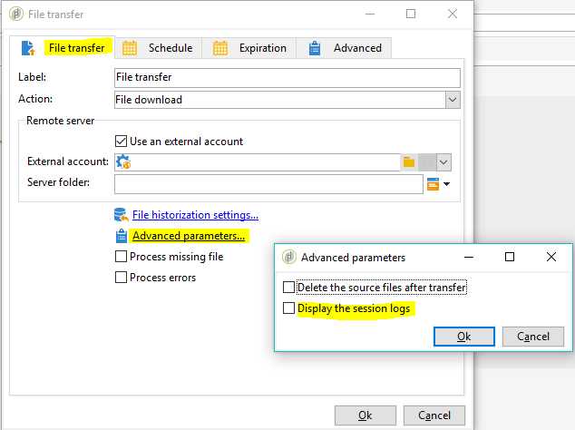

# Best practice e risoluzione dei problemi per il server SFTP {#sftp-server-usage}

## Best practice per i server SFTP {#sftp-server-best-practices}

Quando gestisci file e dati per un processo di ETL, questi file vengono memorizzati in un server SFTP in hosting fornito da Adobe. Questo SFTP è progettato per essere uno spazio di archiviazione temporaneo su cui puoi controllare la conservazione e l’eliminazione dei file.

Se non utilizzato o monitorato correttamente, questo spazio può riempire rapidamente lo spazio fisico disponibile sul server e causare il troncamento dei file nei successivi caricamenti. Una volta saturo lo spazio, la rimozione automatica può attivare e cancellare i file più vecchi dallo storage SFTP.

Per evitare tali problemi,  Adobe raccomanda di seguire le best practice riportate di seguito.

>[!NOTE]
>
>Se l&#39;istanza è ospitata su AWS, potete monitorare l&#39;archiviazione del server SFTP con il [Pannello di controllo Campaign](https://docs.adobe.com/content/help/en/control-panel/using/sftp-management/sftp-storage-management.html)Campaign Classic.
>
>Per verificare se l’istanza è ospitata su AWS, segui i passaggi descritti in [questa sezione](https://docs.adobe.com/content/help/it-IT/control-panel/using/faq.html#ims-org-id) .

* Le dimensioni del server variano a seconda della licenza. In ogni caso, mantenete i dati minimi possibili e mantenete i dati per tutto il tempo necessario (15 giorni è il limite massimo).
* Per evitare la scadenza della password, utilizzare l&#39;autenticazione basata sulle chiavi anziché l&#39;autenticazione tramite password (le password hanno un periodo di validità di 90 giorni). Inoltre, l&#39;autenticazione basata sulle chiavi consente di generare più chiavi, ad esempio per la gestione di più entità. Al contrario, l&#39;autenticazione tramite password richiede la condivisione della password con tutte le entità gestite.

   Il formato chiave supportato è SSH-2 RSA 2048. Le chiavi possono essere generate con strumenti come PyTTY (Windows) o ssh-keygen (Unix). Dovrete fornire la chiave pubblica per  team di supporto del Adobe tramite un ticket [di](https://support.neolane.net) supporto per consentirne il caricamento sul server Campaign.

* Utilizza i flussi di lavoro per eliminare correttamente i dati (gestisci la conservazione dai flussi di lavoro che consumano i dati).
* Utilizza la suddivisione in batch nei caricamenti SFTP e nei flussi di lavoro.
* Gestisci gli errori/le eccezioni.
* Di tanto in tanto, effettua l’accesso a SFTP per verificare direttamente ciò che vi si trova.
* Ricorda che la gestione del disco SFTP è principalmente una tua responsabilità.
* Per impostazione predefinita, tutte le cartelle create sono in modalità di lettura/scrittura solo per l’identificatore. Quando create delle cartelle a cui Campaign deve accedere, accertatevi di configurarle con diritti di lettura/scrittura per l&#39;intero gruppo. In caso contrario, i flussi di lavoro potrebbero non essere in grado di creare/eliminare file in quanto vengono eseguiti con un identificatore diverso all’interno dello stesso gruppo per motivi di sicurezza.
* Gli IP pubblici da cui si sta tentando di avviare la connessione SFTP devono essere aggiunti al elenco consentiti  nell&#39;istanza Campaign. L&#39;aggiunta di indirizzi IP al elenco consentiti  può essere richiesta tramite un ticket [di](https://support.neolane.net)supporto.

>[!CAUTION]
>
>Se utilizzate il vostro server SFTP, accertatevi di seguire il più possibile le raccomandazioni sopra riportate.

## Problemi di connessione con  server SFTP ospitato dal Adobe {#sftp-server-troubleshooting}

Nella sezione seguente sono elencate le informazioni da verificare e fornire al team di supporto del Adobe  tramite un ticket [di](https://support.neolane.net) assistenza in caso di problemi di connessione con  server SFTP ospitati dal Adobe.

1. Verificare che l&#39;istanza sia in esecuzione. A questo scopo, aprite il browser, quindi effettuate una **[!UICONTROL GET]** chiamata all’endpoint dell’istanza **[!UICONTROL /r/test]** :

   ```
   https://instanceUrl/r/test
   ```

   Se l&#39;istanza è in esecuzione, è necessario ottenere questo tipo di risposta:

   ```
   <redir status='OK' date='YYYY-MM-DD HH:MM:SS' build='XXXX' instance='instanceName'
   sourceIP='AAA.BB.CCC.DD' host='instanceUrl' localHost='instanceName'/>
   ```

   In ogni caso, fornite la risposta del comando nel ticket di supporto.

1. Verificate che la porta in uscita 22 sia aperta sul sito da cui state tentando di avviare la connessione SFTP. A questo scopo, utilizzate il comando seguente:

   ```
   bash-3.2$ nc -vz <SFTP_URL> 22
   # Replace the SFTP_URL with actual SFTP instance URL
   # If the port 22 is opened you will see output similar to the below one
   # for e.g. the  output for the command on myCompany-stage-sftp.neolane.net after ssh-out, will give
   bash-3.2$ nc -vz myCompagny-stage-sftp.neolane.net 22
   myCompany-stage-sftp.neolane.net [AAA.BBB.CCC.D] 22 (ssh) open
   ```

   >[!NOTE]
   >
   >Lo strumento Rete consente di gestire facilmente le connessioni di rete su vari sistemi operativi (vedere [https://eternallybored.org/misc/netcat/](https://eternallybored.org/misc/netcat/)).

   Se la porta non è aperta, accertatevi di aprire le connessioni in uscita sul vostro lato, quindi riprovate. Se i problemi di connessione persistono, condividete l&#39;output del comando con  team di supporto del Adobe.

1. Verificare che l&#39;IP pubblico da cui si sta tentando di avviare la connessione SFTP sia quello fornito al supporto del Adobe  per il elenco consentiti .
1. Se utilizzate un&#39;autenticazione basata su password, la password potrebbe essere scaduta (le password hanno un periodo di validità di 90 giorni). È quindi vivamente consigliato l&#39;utilizzo di un&#39;autenticazione basata sulle chiavi (consultate Best practice [per il server](#sftp-server-best-practices)SFTP).
1. Se utilizzate un&#39;autenticazione basata su chiave, verificate che la chiave utilizzata sia la stessa fornita al team di supporto del Adobe  per la configurazione dell&#39;istanza.
1. Se si utilizza FileZilla o uno strumento FTP equivalente, fornire i dettagli dei log di connessione nel ticket di supporto.

## Errore &quot;Impossibile risolvere il nome host&quot;. Errore di caricamento in cURL

Questa sezione fornisce informazioni sui controlli e sulle azioni da eseguire quando viene richiesto &quot;Impossibile risolvere il nome host&quot;. errore dopo la connessione al server FTP dal Campaign Classic.

Il giornale di registrazione del flusso di lavoro mostra i seguenti registri:

```
16/05/2016 12:49:03    fileTransfer    Upload error in cURL
16/05/2016 12:49:03    fileTransfer    Couldn't resolve host name
16/05/2016 12:49:03    fileTransfer    Couldn't resolve host name
16/05/2016 12:49:03    fileTransfer    Starting transfer of '/usr/local/neolane/nl6/var/williamreed/export/Recipients' to 'ftp://213.253.61.250/Recipients'
16/05/2016 12:49:03    fileTransfer    1 file(s) to transfer
```

Questo errore si verifica quando si tenta di collegare il server FTP da un flusso di lavoro e si scaricano i file dal server, mentre si è ancora in grado di connettersi tramite FTP utilizzando FileZilla o WinSCP.

Questo errore indica che il nome di dominio del server FTP non è stato risolto correttamente. Per risolvere i problemi, effettuate le seguenti operazioni:

1. Risoluzione dei problemi relativi alla configurazione **del server** DNS:

   1. Verificare che il nome del server sia stato aggiunto al server DNS locale.
   1. In caso affermativo, eseguite il seguente comando  server Adobe Campaign per ottenere l’indirizzo IP:

   `nslookup <server domain name>`

   Questo conferma il funzionamento del server FTP e la sua raggiungibilità da  server applicazioni Adobe Campaign.

1. Risoluzione dei problemi relativi ai registri **** delle sessioni:

   1. Nel flusso di lavoro, fate doppio clic sull&#39;attività di trasferimento [dei](../../workflow/using/file-transfer.md) file.
   1. Vai alla **[!UICONTROL File Transfer]** scheda, quindi fai clic su **[!UICONTROL Advanced Parameters]**.
   1. Seleziona l’opzione **[!UICONTROL Display the session logs]**.

   

   1. Andate al controllo del flusso di lavoro e verificate che nei registri sia visualizzato l&#39;errore &#39;Impossibile risolvere il nome host&#39;.

   Se il server SFTP è ospitato da  Adobe, controlla se l&#39;IP viene aggiunto al elenco consentiti  contattando l&#39;Assistenza clienti.

   In caso contrario, convalida:

   * La password non contiene &#39;@&#39;. La connessione non è riuscita se è presente &#39;@&#39; nella password.
   * Non esistono problemi di firewall che possono ostacolare la comunicazione tra  server dell&#39;applicazione Adobe Campaign e il server SFTP.
   * Eseguite i comandi tracert e telnet dal server della campagna all&#39;sftp per verificare se sono presenti problemi di connessione.
   * Non esistono problemi relativi al protocollo di comunicazione.
   * La porta è aperta.
