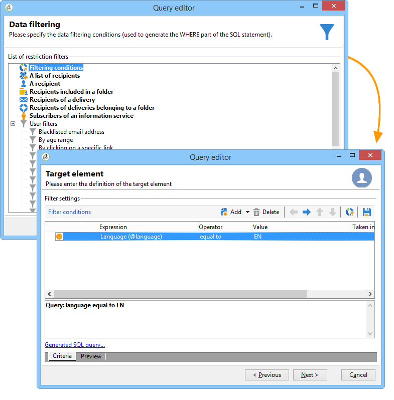

# Passaggi per creare una query{#steps-to-create-a-query}

I passaggi per creare una query in Adobe Campaign sono i seguenti:

1. Selezionare la tabella di lavoro. Fai riferimento a [Passaggio 1: scegliere una tabella](#step-1---choose-a-table).
1. Seleziona i dati da estrarre. Fai riferimento a [Passaggio 2: scegliere i dati da estrarre](#step-2---choose-data-to-extract).
1. Definire la sequenza di ordinamento dei dati. Fai riferimento a [Passaggio 3 - Ordinare i dati](#step-3---sort-data).
1. Filtrare i dati. Fai riferimento a [Passaggio 4: filtrare i dati](#step-4---filter-data).
1. Formatta i dati. Fai riferimento a [Passaggio 5: formattare i dati](#step-5---format-data).
1. Visualizza il risultato. Fai riferimento a [Passaggio 6 - Anteprima dei dati](#step-6---preview-data).

>[!NOTE]
>
>Tutti questi passaggi sono disponibili nell’editor di query generico. Quando una query viene creata in un altro contesto, alcuni passaggi possono essere omessi.\
>L’attività Query è presentata in [questa sezione](../../workflow/using/query.md).

## Passaggio 1: scegliere una tabella {#step-1---choose-a-table}

Seleziona la tabella contenente i dati da eseguire nella **[!UICONTROL Document type]** finestra. Se necessario, filtra i dati utilizzando il campo filtro o la **[!UICONTROL Filters]** pulsante .

## Passaggio 2: scegliere i dati da estrarre {#step-2---choose-data-to-extract}

In **[!UICONTROL Data to extract]** selezionare i dati da visualizzare: questi campi costituiranno le colonne di output.

Ad esempio, seleziona **[!UICONTROL Age]**, **[!UICONTROL Primary key]**, **[!UICONTROL Email domain]** e **[!UICONTROL City]**. I risultati saranno organizzati in base a questa selezione. Utilizza le frecce blu a destra della finestra per modificare l’ordine delle colonne.

È possibile modificare un&#39;espressione inserendo una formula o eseguendo un processo su una funzione di aggregazione. A questo scopo, fai clic sul pulsante **[!UICONTROL Expression]** campo colonna, quindi seleziona **[!UICONTROL Edit expression]**.

È possibile raggruppare i dati della colonna di output: per fare questo, controlla **[!UICONTROL Yes]** in **[!UICONTROL Group]** della colonna **[!UICONTROL Data to extract]** finestra. Questa funzione genera un risultato intorno all&#39;asse di raggruppamento selezionato. Un esempio di query con raggruppamento è disponibile in [questa sezione](../../workflow/using/querying-delivery-information.md).

* La **[!UICONTROL Handle groupings (GROUP BY + HAVING)]** La funzione ti consente di &quot;raggruppare per&quot; e selezionare ciò che è stato raggruppato (&quot;avere&quot;). Questa funzione si applica a tutti i campi della colonna di output. Ad esempio, questa opzione ti consente di raggruppare tutte le scelte di una colonna di output e recuperare un tipo specifico di informazioni, ad esempio i destinatari compresi tra 35 e 50.

   Per ulteriori informazioni al riguardo, consulta [questa sezione](../../workflow/using/querying-using-grouping-management.md).

* La **[!UICONTROL Remove duplicate rows (DISTINCT)]** consente di deduplicare risultati identici ottenuti nella colonna di output. Ad esempio, se scegli un censimento selezionando i campi Cognome, Nome e E-mail nella colonna di output, quelli con dati identici verranno eliminati, poiché significa che lo stesso contatto è stato inserito più volte nel database: verrà preso in considerazione un solo risultato.

## Passaggio 3 - Ordinare i dati {#step-3---sort-data}

La **[!UICONTROL Sorting]** window consente di ordinare il contenuto delle colonne. Utilizza le frecce per modificare l’ordine delle colonne:

* La **[!UICONTROL Sorting]** consente un ordinamento semplice e dispone il contenuto delle colonne da A a Z o in ordine crescente.
* La **[!UICONTROL Descending sort]** dispone il contenuto da Z a A e in ordine decrescente. Questo è utile per visualizzare le vendite record, ad esempio: le cifre più alte sono riportate in cima all’elenco.

In questo esempio, i dati vengono ordinati in ordine crescente in base all’età del destinatario.

## Passaggio 4: filtrare i dati {#step-4---filter-data}

L’editor delle query ti consente di filtrare i dati per perfezionare la ricerca.

I filtri offerti dipendono dalla tabella di cui si occupa la query.

Una volta selezionato il **[!UICONTROL Filtering conditions]** accederà al **[!UICONTROL Target elements]** sezione: questo ti consente di definire come filtrare i dati da raccogliere.

* Per creare un nuovo filtro, selezionare i campi, gli operatori e i valori necessari per la creazione della formula da verificare per la selezione dei dati. È possibile combinare diverse condizioni (per ulteriori informazioni, consulta [Definizione delle condizioni di filtro](../../platform/using/defining-filter-conditions.md)).
* Per utilizzare filtri salvati in precedenza, apri l’elenco a discesa facendo clic sul pulsante **[!UICONTROL Add]** pulsante, fai clic su **[!UICONTROL Predefined filter]** e selezionare quello desiderato.

   

* I filtri creati nella **[!UICONTROL Generic query editor]** sono disponibili in altre applicazioni di query e viceversa. Per salvare un filtro, fai clic sul pulsante **[!UICONTROL Save]** icona.

   >[!NOTE]
   >
   >Per ulteriori informazioni sulla creazione e l’utilizzo dei filtri, consulta [Opzioni di filtro](../../platform/using/filtering-options.md).

Come mostrato nell’esempio seguente, per recuperare tutti i destinatari di lingua inglese, seleziona: &quot;lingua del destinatario **uguale a** IT&quot;.

>[!NOTE]
>
>Puoi accedere direttamente a un’opzione digitando la seguente formula nel **Valore** campo: **$(options:OPTION_NAME)**.

Fai clic sul pulsante **[!UICONTROL Preview]** per visualizzare il risultato della condizione di filtro. In questo caso, tutti i destinatari che parlano inglese vengono visualizzati con il loro nome, nome e indirizzo e-mail.

Gli utenti che conoscono SQL Language possono fare clic su **[!UICONTROL Generate SQL query]** per visualizzare la query in SQL.

## Passaggio 5: formattare i dati {#step-5---format-data}

Dopo aver configurato i filtri di restrizione, potrai accedere al **[!UICONTROL Data formatting]** finestra. Questa finestra consente di ridisporre le colonne di output, trasformare i dati e modificare le lettere maiuscole e minuscole delle etichette delle colonne. Consente inoltre di applicare una formula al risultato finale utilizzando un campo calcolato.

>[!NOTE]
>
>Per ulteriori informazioni sui tipi di campi calcolati, consulta [Creazione di campi calcolati](../../platform/using/defining-filter-conditions.md#creating-calculated-fields).

Le colonne non selezionate non vengono visualizzate nella finestra di anteprima dati.

La **[!UICONTROL Transformation]** consente di modificare l’etichetta di una colonna in maiuscolo o minuscolo. Seleziona la colonna e fai clic su nella **[!UICONTROL Transformation]** colonna. Puoi scegliere:

* **[!UICONTROL Switch to lower case]**,
* **[!UICONTROL Switch to upper case]**,
* **[!UICONTROL First letter in upper case]**.

## Passaggio 6 - Anteprima dei dati {#step-6---preview-data}

La **[!UICONTROL Data preview]** La finestra è l&#39;ultimo stadio. Fai clic su **[!UICONTROL Start the preview of the data]** per ottenere il risultato della query. È disponibile in colonne o in formato XML. Fai clic sul pulsante **[!UICONTROL Generated SQL queries]** scheda per visualizzare la query in formato SQL.

In questo esempio, i dati vengono ordinati in ordine crescente in base all’età del destinatario.

>[!NOTE]
>
>Per impostazione predefinita, solo le prime 200 righe sono visualizzate nel **[!UICONTROL Data preview]** finestra. Per modificare questa impostazione, immetti un numero nella **[!UICONTROL Lines to display]** e fai clic su **[!UICONTROL Start the preview of the data]**.
