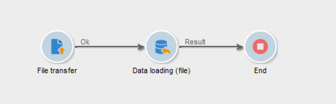

# Decomprimere o decrittografare un file {#unzipping-or-decrypting-a-file-before-processing}

Adobe Campaign consente di importare file compressi o crittografati. Prima di poter essere letti in un [Caricamento dati (file)](../../workflow/using/data-loading-file.md) attività, puoi definire una pre-elaborazione per decomprimere o decrittografare il file.

>[!IMPORTANT]
>
>Non è possibile decomprimere file compressi di dimensioni superiori a 4 Gb.

Per poterlo fare:

1. Utilizza il [Pannello di controllo Campaign](https://experienceleague.adobe.com/docs/control-panel/using/instances-settings/gpg-keys-management.html#decrypting-data) per generare una coppia di chiavi pubblica/privata al fine di consentire la decrittografia dei file.

   >[!NOTE]
   >
   >Il Pannello di controllo è accessibile a tutti gli utenti amministratori. I passaggi per concedere a un utente l’accesso come amministratore sono descritti in[questa pagina](https://experienceleague.adobe.com/docs/control-panel/using/discover-control-panel/managing-permissions.html?lang=it#discover-control-panel).
   >
   >La tua istanza deve essere ospitata su AWS e aggiornata con [build GA più recente](../../rn/using/rn-overview.md). Scopri come controllare la versione in [questa sezione](../../platform/using/launching-adobe-campaign.md#getting-your-campaign-version). Per verificare se l’istanza è ospitata su AWS, segui i passaggi descritti in [questa sezione](https://experienceleague.adobe.com/docs/control-panel/using/faq.html?lang=it).

1. Se l’installazione di Adobe Campaign è on-premise, installa l’utility che desideri utilizzare (ad esempio: GPG, GZIP) nonché le chiavi necessarie (chiave di crittografia) sul server applicazioni.

   Se l’installazione di Adobe Campaign è ospitata da Adobe, contatta [Assistenza clienti Adobe](https://helpx.adobe.com/it/enterprise/admin-guide.html/enterprise/using/support-for-experience-cloud.ug.html) per installare le utility necessarie sul server.

Puoi quindi utilizzare nei flussi di lavoro i comandi di pre-elaborazione desiderati:

1. Aggiungere e configurare un **[!UICONTROL File transfer]** attività nel flusso di lavoro.
1. Aggiungi un **[!UICONTROL Data loading (file)]** e definire il formato del file.
1. Seleziona l’opzione **[!UICONTROL Pre-process the file]**.
1. Selezionare il comando di pre-elaborazione da applicare.
1. Aggiungi altre attività per gestire i dati provenienti dal file.
1. Salva ed esegui il flusso di lavoro.

Un esempio è presentato nel caso d’uso seguente.

**Argomenti correlati:**

* [Attività di caricamento dati (file)](../../workflow/using/data-loading-file.md).
* [Comprimere o crittografare un file](../../workflow/using/how-to-use-workflow-data.md#zipping-or-encrypting-a-file).

## Caso d’uso: importare dati crittografati utilizzando una chiave generata dal Pannello di controllo Campaign {#use-case-gpg-decrypt}

In questo caso d’uso, creeremo un flusso di lavoro per importare dati che sono stati crittografati in un sistema esterno, utilizzando una chiave generata nel Pannello di controllo Campaign.

 [Guarda il video su questa funzione](#video)

I passaggi per eseguire questo caso d’uso sono i seguenti:

1. Utilizza il Pannello di controllo Campaign per generare una coppia di chiavi (pubblica/privata). I passaggi dettagliati sono disponibili in [Documentazione del Pannello di controllo Campaign](https://experienceleague.adobe.com/docs/control-panel/using/instances-settings/gpg-keys-management.html#decrypting-data).

   * La chiave pubblica verrà condivisa con il sistema esterno, che la utilizzerà per crittografare i dati da inviare a Campaign.
   * La chiave privata verrà utilizzata da Campaign Classic per decrittografare i dati crittografati in arrivo.

   

1. Nel Pannello di controllo Campaign esterno, utilizza la chiave pubblica scaricata dal sistema per crittografare i dati da importare in Campaign Classic.

1. In Campaign Classic, crea un flusso di lavoro per importare i dati crittografati e decrittografarli utilizzando la chiave privata installata tramite il Pannello di controllo Campaign. A tal fine, verrà creato un flusso di lavoro come segue:

   

   * **[!UICONTROL File transfer]** attività: trasferisce il file da un’origine esterna a Campaign Classic. In questo esempio, vogliamo trasferire il file da un server SFTP.
   * **[!UICONTROL Data loading (file)]** activity (attività): carica i dati dal file nel database e li decrittografa utilizzando la chiave privata generata nel Pannello di controllo Campaign.

1. Apri **[!UICONTROL File transfer]** attività, quindi specifica l’account esterno da cui desideri importare il file .gpg crittografato.

   

   I concetti globali su come configurare l’attività sono disponibili in [questa sezione](../../workflow/using/file-transfer.md).

1. Apri **[!UICONTROL Data loading (file)]** e configurarlo in base alle tue esigenze. I concetti globali su come configurare l’attività sono disponibili in [questa sezione](../../workflow/using/data-loading-file.md).

   Aggiungi una fase di pre-elaborazione all’attività per decrittografare i dati in arrivo. A questo scopo, seleziona la **[!UICONTROL Pre-process the file]** , quindi seleziona **[!UICONTROL Decrypt]** dal **[!UICONTROL Command]** elenco a discesa:

   

   >[!NOTE]
   >
   >Se sono necessarie modifiche ai comandi disponibili, è possibile contattare [Assistenza clienti Adobe](https://helpx.adobe.com/it/enterprise/admin-guide.html/enterprise/using/support-for-experience-cloud.ug.html) per regolare le impostazioni di preProcessCommand.
   >
   >Se si utilizza una distribuzione ibrida, è possibile configurare questi comandi direttamente dal file di configurazione del server (serverConf.xml). [Scopri come configurare i comandi di pre-elaborazione nel file di configurazione del server](../../installation/using/the-server-configuration-file.md#preprocesscommand)

1. Clic **[!UICONTROL OK]** per confermare la configurazione dell’attività.

1. Ora puoi eseguire il flusso di lavoro. Una volta eseguita, puoi verificare nei registri del flusso di lavoro che la decrittografia è stata eseguita e che i dati del file sono stati importati.

   

## Video tutorial {#video}

Questo video mostra come utilizzare una chiave GPG per decrittografare i dati.

>[!VIDEO](https://video.tv.adobe.com/v/36482?quality=12)

Sono disponibili altri video dimostrativi sui Campaign Classic [qui](https://experienceleague.adobe.com/docs/campaign-classic-learn/tutorials/overview.html?lang=it).
