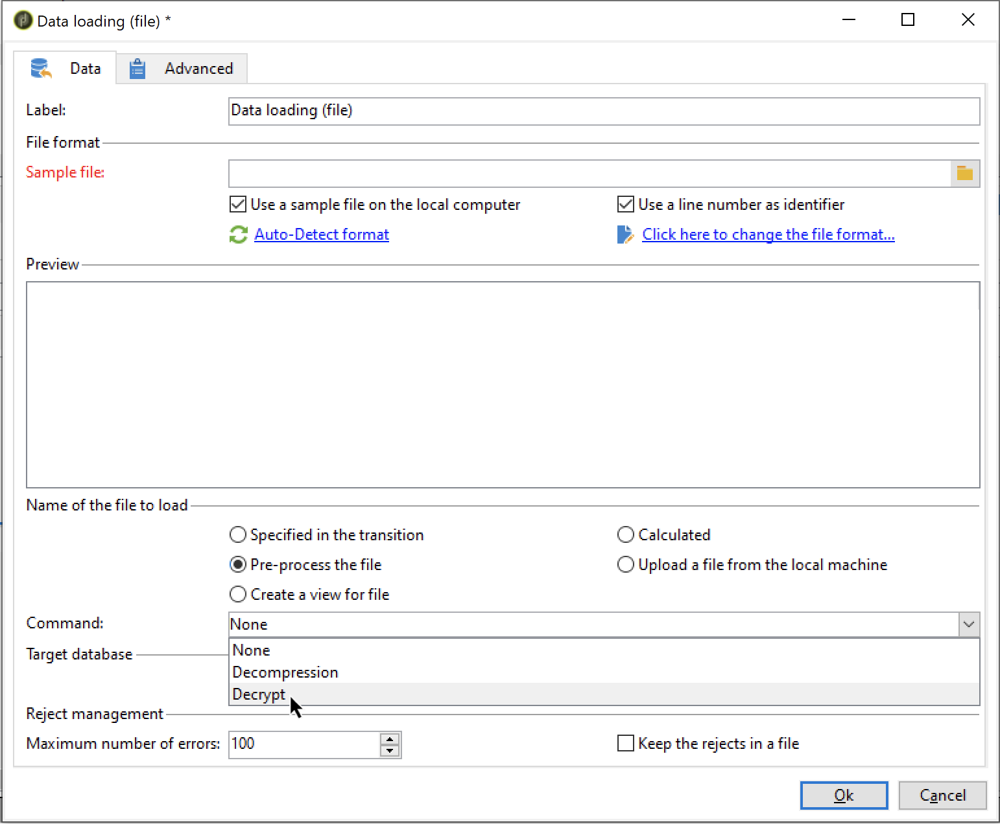

# Annullamento o decrittografia di un file {#unzipping-or-decrypting-a-file-before-processing}

 Adobe Campaign consente di importare file compressi o crittografati. Prima di poter essere letti in un&#39;attività [Caricamento dati (file)](../../workflow/using/data-loading--file-.md), è possibile definire una pre-elaborazione per decomprimere o decrittografare il file.

Per essere in grado di effettuare le seguenti operazioni:

1. Utilizzate [Pannello di controllo Campaign](https://docs.adobe.com/content/help/en/control-panel/using/instances-settings/gpg-keys-management.html#decrypting-data) per generare una coppia di chiavi pubblica/privata.

   >[!NOTE]
   >
   >Il Pannello di controllo Campaign è disponibile per tutti i clienti ospitati su AWS (ad eccezione dei clienti che ospitano le proprie istanze di marketing in sede).

1. Se l&#39;installazione di  Adobe Campaign è ospitata da  Adobe, contattate l&#39;[ Assistenza clienti](https://helpx.adobe.com/enterprise/admin-guide.html/enterprise/using/support-for-experience-cloud.ug.html) Adobe per avere installato sul server le utility necessarie.
1. Se l&#39;installazione di  Adobe Campaign è in sede, installate l&#39;utility da utilizzare (ad esempio: GPG, GZIP) e le chiavi necessarie (chiave di crittografia) sul server dell&#39;applicazione.

Potete quindi usare i comandi di pre-elaborazione desiderati nei flussi di lavoro:

1. Aggiungi e configura un&#39;attività **[!UICONTROL File transfer]** nel flusso di lavoro.
1. Aggiungete un&#39;attività **[!UICONTROL Data loading (file)]** e definite il formato del file.
1. Seleziona l’opzione **[!UICONTROL Pre-process the file]**.
1. Specificate il comando di pre-elaborazione da applicare.
1. Aggiungere altre attività per gestire i dati provenienti dal file.
1. Salvate ed eseguite il flusso di lavoro.

Un esempio è illustrato nel caso di utilizzo riportato di seguito.

**Argomenti correlati:**

* [Attività](../../workflow/using/data-loading--file-.md) di caricamento dei dati (file).
* [Estrazione o cifratura di un file](../../workflow/using/how-to-use-workflow-data.md#zipping-or-encrypting-a-file).

## Caso di utilizzo: Importazione di dati crittografati con una chiave generata dal Pannello di controllo Campaign {#use-case-gpg-decrypt}

In questo caso, verrà creato un flusso di lavoro per importare i dati crittografati in un sistema esterno, utilizzando una chiave generata nel Pannello di controllo Campaign.

 [Scopri questa funzione nel video](#video)

Le operazioni da eseguire per questo caso di utilizzo sono le seguenti:

1. Utilizzate il Pannello di controllo Campaign per generare una coppia di chiavi (pubblica/privata). I passaggi dettagliati sono disponibili nella [documentazione del Pannello di controllo Campaign](https://docs.adobe.com/content/help/en/control-panel/using/instances-settings/gpg-keys-management.html#decrypting-data).

   * La chiave pubblica verrà condivisa con il sistema esterno, che la utilizzerà per crittografare i dati da inviare a Campaign.
   * La chiave privata verrà utilizzata dal Campaign Classic per decrittografare i dati crittografati in arrivo.

   

1. Nel sistema esterno, utilizzare la chiave pubblica scaricata dal Pannello di controllo Campaign per cifrare i dati da importare in Campaign Classic.

1. In Campaign Classic, creare un flusso di lavoro per importare i dati crittografati e decifrarlo utilizzando la chiave privata installata tramite il Pannello di controllo Campaign. A tal fine, verrà creato un flusso di lavoro come segue:

   

   * **[!UICONTROL File transfer]** activity: Trasferisce il file da un&#39;origine esterna a un Campaign Classic. In questo esempio, vogliamo trasferire il file da un server SFTP.
   * **[!UICONTROL Data loading (file)]** activity: Carica i dati dal file nel database e decrittografalo utilizzando la chiave privata generata nel Pannello di controllo Campaign.

1. Aprite l&#39;attività **[!UICONTROL File transfer]**, quindi specificate l&#39;account esterno da cui desiderate importare il file .gpg crittografato.

   

   I concetti globali su come configurare l&#39;attività sono disponibili in [questa sezione](../../workflow/using/file-transfer.md).

1. Apri l&#39;attività **[!UICONTROL Data loading (file)]**, quindi configurala in base alle tue esigenze. I concetti globali su come configurare l&#39;attività sono disponibili in [questa sezione](../../workflow/using/data-loading--file-.md).

   Aggiungete una fase di pre-elaborazione all&#39;attività, per decifrare i dati in arrivo. A questo scopo, selezionare l&#39;opzione **[!UICONTROL Pre-process the file]**, quindi copiare e incollare questo comando di decrittazione nel campo **[!UICONTROL Command]** :

   `gpg --batch --passphrase passphrase --decrypt <%=vars.filename%>`

   

   >[!CAUTION]
   >
   >In questo esempio, utilizziamo la passphrase utilizzata per impostazione predefinita dal Pannello di controllo Campaign, che è &quot;passphrase&quot;.
   >
   >Se in passato avete già installato chiavi GPG nell&#39;istanza tramite una richiesta dell&#39;Assistenza clienti, la passphrase potrebbe essere stata modificata e per impostazione predefinita è diversa da quella.

1. Fate clic su **[!UICONTROL OK]** per confermare la configurazione dell&#39;attività.

1. Ora puoi eseguire il flusso di lavoro. Una volta eseguita, potete controllare nei registri del flusso di lavoro che la decrittazione è stata eseguita e che i dati del file sono stati importati.

   

## Video di esercitazione {#video}

In questo video viene illustrato come utilizzare un codice GPG per decrittografare i dati.

>[!VIDEO](https://video.tv.adobe.com/v/36482?quality=12)

Ulteriori video dimostrativi sui Campaign Classic sono disponibili [qui](https://experienceleague.adobe.com/docs/campaign-classic-learn/tutorials/overview.html?lang=it).
