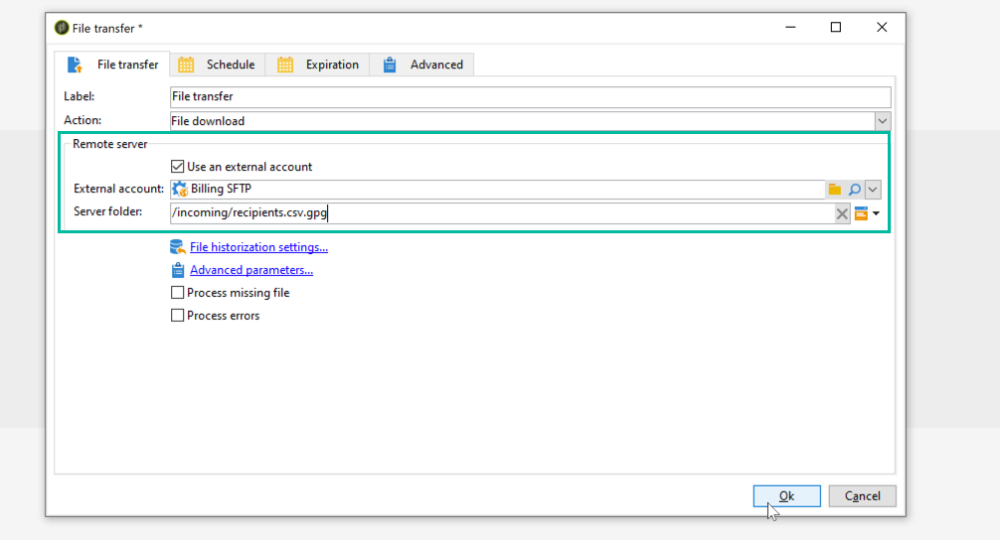

# Decrittografia o decompressione di un file {#unzipping-or-decrypting-a-file-before-processing}

Adobe Campaign consente di importare file compressi o crittografati. Prima di poter essere letti in un&#39;attività [Caricamento dati (file)](../../workflow/using/data-loading--file-.md), puoi definire una pre-elaborazione per decomprimere o decrittografare il file.

Per poterlo fare:

1. Utilizza il [Pannello di controllo Campaign](https://docs.adobe.com/content/help/en/control-panel/using/instances-settings/gpg-keys-management.html#decrypting-data) per generare una coppia di chiavi pubblica/privata.

   >[!NOTE]
   >
   >Il Pannello di controllo Campaign è accessibile a tutti gli utenti amministratori. I passaggi per concedere a un utente l’accesso come amministratore sono descritti in[questa pagina](https://experienceleague.adobe.com/docs/control-panel/using/discover-control-panel/managing-permissions.html?lang=it#discover-control-panel).
   >
   >Tieni presente che l’istanza deve essere ospitata su AWS e aggiornata con la build [Gold Standard](../../rn/using/gs-overview.md) più recente o con la build [GA più recente (21.1)](../../rn/using/latest-release.md). Scopri come controllare la versione in [questa sezione](../../platform/using/launching-adobe-campaign.md#getting-your-campaign-version). Per verificare se l’istanza è ospitata su AWS, segui i passaggi descritti in [questa sezione](https://experienceleague.adobe.com/docs/control-panel/using/faq.html).

1. Se l&#39;installazione di Adobe Campaign è ospitata per Adobe, contatta l&#39; [Assistenza clienti di Adobe](https://helpx.adobe.com/it/enterprise/admin-guide.html/enterprise/using/support-for-experience-cloud.ug.html) per avere le utility necessarie installate sul server.
1. Se l&#39;installazione di Adobe Campaign è on-premise, installare l&#39;utility da utilizzare (ad esempio: GPG, GZIP) e le chiavi necessarie (chiave di crittografia) sul server dell&#39;applicazione.

Puoi quindi utilizzare i comandi di preelaborazione desiderati nei flussi di lavoro:

1. Aggiungi e configura un’attività **[!UICONTROL File transfer]** nel flusso di lavoro.
1. Aggiungi un’attività **[!UICONTROL Data loading (file)]** e definisci il formato del file.
1. Seleziona l’opzione **[!UICONTROL Pre-process the file]**.
1. Specificare il comando di pre-elaborazione che si desidera applicare.
1. Aggiungi altre attività per gestire i dati provenienti dal file .
1. Salva ed esegui il flusso di lavoro.

Un esempio è presentato nel caso d’uso seguente.

**Argomenti correlati:**

* [Attività](../../workflow/using/data-loading--file-.md) di caricamento dei dati (file).
* [ZIP o crittografare un file](../../workflow/using/how-to-use-workflow-data.md#zipping-or-encrypting-a-file).

## Caso di utilizzo: Importa dati crittografati utilizzando una chiave generata dal Pannello di controllo Campaign {#use-case-gpg-decrypt}

In questo caso d’uso, creeremo un flusso di lavoro per importare i dati crittografati in un sistema esterno, utilizzando una chiave generata nel Pannello di controllo Campaign.

 [Scopri questa funzione nel video](#video)

I passaggi per eseguire questo caso d’uso sono i seguenti:

1. Utilizza il Pannello di controllo Campaign per generare una coppia di chiavi (pubblica/privata). I passaggi dettagliati sono disponibili nella [documentazione del Pannello di controllo Campaign](https://docs.adobe.com/content/help/en/control-panel/using/instances-settings/gpg-keys-management.html#decrypting-data).

   * La chiave pubblica verrà condivisa con il sistema esterno, che lo utilizzerà per crittografare i dati da inviare a Campaign.
   * La chiave privata verrà utilizzata da Campaign Classic per decrittografare i dati crittografati in arrivo.

   

1. Nel sistema esterno, utilizza la chiave pubblica scaricata dal Pannello di controllo Campaign per crittografare i dati da importare in Campaign Classic.

1. In Campaign Classic, crea un flusso di lavoro per importare i dati crittografati e decrittografarli utilizzando la chiave privata installata tramite il Pannello di controllo Campaign. A questo scopo, verrà creato un flusso di lavoro come segue:

   

   * **[!UICONTROL File transfer]** attività: Trasferisce il file da un’origine esterna a Campaign Classic. In questo esempio, vogliamo trasferire il file da un server SFTP.
   * **[!UICONTROL Data loading (file)]** attività: Carica i dati dal file nel database e decrittografalo utilizzando la chiave privata generata nel Pannello di controllo Campaign.

1. Apri l’attività **[!UICONTROL File transfer]** , quindi specifica l’account esterno da cui vuoi importare il file .gpg crittografato.

   

   I concetti globali su come configurare l&#39;attività sono disponibili in [questa sezione](../../workflow/using/file-transfer.md).

1. Apri l’attività **[!UICONTROL Data loading (file)]** , quindi configurala in base alle tue esigenze. I concetti globali su come configurare l&#39;attività sono disponibili in [questa sezione](../../workflow/using/data-loading--file-.md).

   Aggiungi una fase di pre-elaborazione all’attività per decrittografare i dati in arrivo. A questo scopo, seleziona l’opzione **[!UICONTROL Pre-process the file]** , quindi copia-incolla questo comando di decrittografia nel campo **[!UICONTROL Command]** :

   `gpg --batch --passphrase passphrase --decrypt <%=vars.filename%>`

   

   >[!CAUTION]
   >
   >In questo esempio, utilizziamo la passphrase utilizzata per impostazione predefinita dal Pannello di controllo Campaign, che è &quot;passphrase&quot;.
   >
   >Se in passato hai già installato chiavi GPG nella tua istanza tramite una richiesta dell’Assistenza clienti, la passphrase potrebbe essere stata modificata ed essere diversa da quella di default.

1. Fai clic su **[!UICONTROL OK]** per confermare la configurazione dell’attività.

1. Ora puoi eseguire il flusso di lavoro. Una volta eseguito, puoi controllare nei registri del flusso di lavoro che la decrittografia è stata eseguita e che i dati del file sono stati importati.

   

## Video tutorial {#video}

Questo video mostra come utilizzare una chiave GPG per decrittografare i dati.

>[!VIDEO](https://video.tv.adobe.com/v/36482?quality=12)

Sono disponibili ulteriori video dimostrativi su Campaign Classic [qui](https://experienceleague.adobe.com/docs/campaign-classic-learn/tutorials/overview.html?lang=it).
