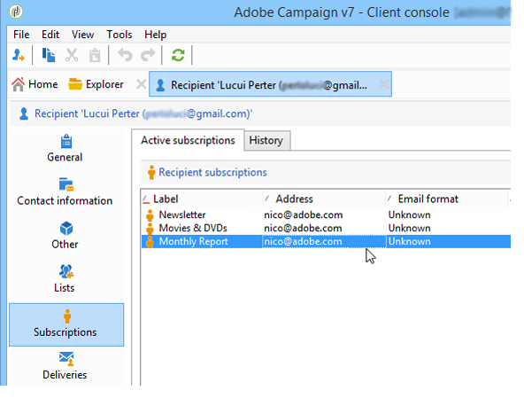

# Attività Update data{#updating-data}

I dati collegati al profilo di un destinatario possono essere aggiornati manualmente o automaticamente.

## Imposta un aggiornamento automatico {#setting-up-an-automatic-update}

Un aggiornamento automatico può essere configurato tramite un flusso di lavoro. Per ulteriori informazioni al riguardo, consulta [questa sezione](../../workflow/using/update-data.md).

## Eseguire un aggiornamento di massa {#performing-a-mass-update}

Per eseguire aggiornamenti manuali, fai clic con il pulsante destro del mouse sui destinatari selezionati per utilizzare il **[!UICONTROL Actions]** il menu di scelta rapida o utilizza **[!UICONTROL Actions]** icona.

Esistono due tipi di aggiornamenti: aggiornamento di massa per un set di destinatari e unione dei dati tra due profili. Per ogni azione, una procedura guidata consente di configurare l’aggiornamento.

### Aggiornamento di massa {#mass-update}

Per l&#39;aggiornamento di massa, utilizzare **[!UICONTROL Action > Mass update of selected lines...]**. La procedura guidata consente di configurare ed eseguire l’aggiornamento.

Il primo passaggio della procedura guidata consiste nel specificare i campi da aggiornare.

Nella sezione a sinistra della procedura guidata viene visualizzato l’elenco dei campi disponibili. Utilizza la **[!UICONTROL Find]** per eseguire una ricerca di questi campi. Premere **Invio** per sfogliare l’elenco. I nomi dei campi corrispondenti alla voce vengono visualizzati in grassetto, come illustrato di seguito.

Fai doppio clic sui campi da aggiornare per visualizzarli nella sezione a destra della procedura guidata.

In caso di errore, utilizza il **[!UICONTROL Delete]** per eliminare un campo dall’elenco dei campi da aggiornare.

Seleziona o immetti i valori da applicare ai profili da aggiornare.

Puoi fare clic su **[!UICONTROL Distribution of values]** per visualizzare la distribuzione dei valori del campo selezionato per i destinatari presenti nella cartella corrente (non solo per i destinatari interessati dall’aggiornamento).

È possibile definire filtri per visualizzare la distribuzione dei valori in questa finestra o modificare la cartella corrente per visualizzare la distribuzione dei valori in un&#39;altra cartella. Si tratta di azioni di sola lettura; non influiscono sulla configurazione dell’aggiornamento in fase di definizione.

Chiudi questa finestra e fai clic su **[!UICONTROL Next]** per visualizzare il secondo passaggio della procedura guidata di aggiornamento. In questo passaggio, puoi avviare l&#39;aggiornamento facendo clic su **[!UICONTROL Start]**.

Le informazioni relative all’esecuzione dell’aggiornamento vengono visualizzate nella sezione superiore della procedura guidata.

La **[!UICONTROL Stop]** consente di annullare l&#39;aggiornamento, ma alcuni record potrebbero essere stati aggiornati e l&#39;arresto del processo non annullerà questi aggiornamenti. La barra di avanzamento mostra lo stato di avanzamento dell’operazione.

### Unisci dati {#merge-data}

Seleziona **[!UICONTROL Merge selected lines...]** per avviare l’unione di due profili destinatario. I profili da unire devono essere selezionati prima di selezionare l’opzione . L&#39;unione viene configurata e avviata utilizzando una procedura guidata.

La procedura guidata visualizza i valori da recuperare per ogni campo completato in uno o più dei profili di origine. Se uno o più campi dei profili da unire hanno valori diversi, vengono visualizzati nella **[!UICONTROL List of conflicts]** sezione . Puoi quindi selezionare il profilo predefinito utilizzando i pulsanti di scelta sotto l’elenco, come nell’esempio seguente:

Fai clic su **[!UICONTROL Compute]** per visualizzare il risultato desiderato.

Controlla la **[!UICONTROL Result]** colonne di entrambe le sezioni della finestra e fare clic su **[!UICONTROL Finish]** per eseguire l&#39;unione.

## Esportare i dati {#exporting-data}

È possibile esportare il contenuto di un elenco. Per configurare ed eseguire l’esportazione:

1. Selezionare i record da esportare.
1. Fai clic con il pulsante destro del mouse e seleziona **[!UICONTROL Export...]**.

   

1. Quindi seleziona i dati da estrarre. Per impostazione predefinita, tutte le colonne visualizzate vengono aggiunte alle colonne di output.

   

   Per ulteriori informazioni su come configurare la procedura guidata di esportazione, consulta [questa sezione](../../platform/using/executing-export-jobs.md).

## Iscriviti a un servizio {#subscribing-to-a-service}

Nella maggior parte dei casi, i destinatari si abbonano a una newsletter tramite una pagina di destinazione dedicata, come spiegato in [questa sezione](../../delivery/using/managing-subscriptions.md). Tuttavia, i profili dei destinatari filtrati possono essere abbonati manualmente a un servizio (newsletter o servizio virtuale). Per eseguire questa operazione:

1. Seleziona i destinatari che desideri sottoscrivere e fai clic con il pulsante destro del mouse su di essi.
1. Seleziona **[!UICONTROL Actions > Subscribe selection to a service]**.

   

1. Seleziona il servizio desiderato e fai clic su **[!UICONTROL Next]**:

   

   >[!NOTE]
   >
   >Questo editor consente di creare un nuovo servizio: fai clic su **[!UICONTROL Create]** pulsante .

1. È possibile **[!UICONTROL Send a confirmation message]** ai destinatari. Il contenuto di questo messaggio può essere configurato nello scenario di abbonamento collegato al servizio selezionato.
1. Fai clic sul pulsante **[!UICONTROL Start]** per eseguire il processo di abbonamento.

   

La sezione superiore della finestra consente di monitorare il processo di esecuzione. La **[!UICONTROL Stop]** consente di interrompere il processo. Tuttavia, i destinatari già elaborati verranno sottoscritti.

Se deselezioni **[!UICONTROL Do not keep a trace of this job in the database]** è possibile selezionare (o creare) la cartella di esecuzione in cui verranno memorizzate le informazioni sul processo.

Per controllare il processo, vai alla **[!UICONTROL Subscriptions]** scheda sui profili dei destinatari interessati dall&#39;operazione o **[!UICONTROL Subscriptions]** scheda accessibile tramite **[!UICONTROL Profiles and Targets > Services and Subscriptions]** nodo.

>[!NOTE]
>
>Per ulteriori informazioni sulla creazione e la configurazione dei servizi di informazione, consulta [questa pagina](../../delivery/using/managing-subscriptions.md).
