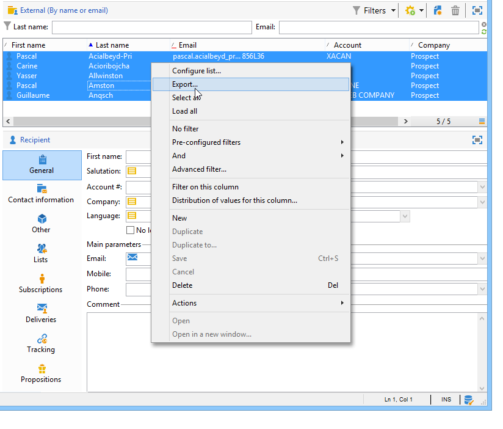

# Aggiornamenti dei dati{#updating-data}

I dati collegati al profilo di un destinatario possono essere aggiornati manualmente o automaticamente.

## Impostazione di un aggiornamento automatico {#setting-up-an-automatic-update}

Un aggiornamento automatico può essere configurato tramite un flusso di lavoro. Per ulteriori informazioni al riguardo, consulta [questa sezione](../../workflow/using/update-data.md).

## Esecuzione di un aggiornamento di massa {#performing-a-mass-update}

Per eseguire aggiornamenti manuali, fare clic con il pulsante destro del mouse sui destinatari selezionati per utilizzare il menu di **[!UICONTROL Actions]** scelta rapida, oppure utilizzare l&#39; **[!UICONTROL Actions]** icona.

Esistono due tipi di aggiornamenti: aggiornamento di massa per un set di destinatari e unione dei dati tra due profili. Per ogni azione, una procedura guidata consente di configurare l’aggiornamento.

### Aggiornamento di massa {#mass-update}

Per l&#39;aggiornamento di massa, utilizzare **[!UICONTROL Action > Mass update of selected lines...]**. La procedura guidata consente di configurare ed eseguire l&#39;aggiornamento.

Il primo passaggio della procedura guidata consiste nel specificare i campi da aggiornare.

Nella sezione a sinistra della procedura guidata viene visualizzato l’elenco dei campi disponibili. Utilizzare il **[!UICONTROL Find]** campo per eseguire una ricerca in questi campi. Premere il tasto **Invio** per scorrere l&#39;elenco. I nomi dei campi corrispondenti alla voce vengono visualizzati in grassetto, come illustrato di seguito.

Fare doppio clic sui campi da aggiornare per visualizzarli nella sezione destra della procedura guidata.

In caso di errore, utilizzare il **[!UICONTROL Delete]** pulsante per eliminare un campo dall&#39;elenco dei campi da aggiornare.

Selezionate o immettete i valori da applicare ai profili da aggiornare.

Potete fare clic **[!UICONTROL Distribution of values]** per visualizzare la distribuzione dei valori del campo selezionato per i destinatari presenti nella cartella corrente (non solo per i destinatari interessati dall&#39;aggiornamento).

È possibile definire filtri per visualizzare la distribuzione dei valori in questa finestra o modificare la cartella corrente per visualizzare la distribuzione dei valori in un&#39;altra cartella. Si tratta di azioni di sola lettura; non influiscono sulla configurazione dell’aggiornamento in fase di definizione.

Chiudi questa finestra e fai clic **[!UICONTROL Next]** per visualizzare il secondo passaggio della procedura guidata di aggiornamento. In questo passaggio, puoi avviare l&#39;aggiornamento facendo clic su **[!UICONTROL Start]**.

Le informazioni relative all&#39;esecuzione dell&#39;aggiornamento sono visualizzate nella sezione superiore della procedura guidata.

Consente di **[!UICONTROL Stop]** annullare l&#39;aggiornamento, ma alcuni record potrebbero essere stati aggiornati e l&#39;arresto del processo non annullerà questi aggiornamenti. La barra di avanzamento mostra l’avanzamento dell’operazione.

### Unisci dati {#merge-data}

Seleziona **[!UICONTROL Merge selected lines...]** per avviare l&#39;unione di due profili di destinatari. I profili da unire devono essere selezionati prima di selezionare l&#39;opzione. L&#39;unione viene configurata e avviata utilizzando una procedura guidata.

La procedura guidata visualizza i valori da recuperare per ogni campo completato in uno o più dei profili di origine. Se uno o più campi nei profili da unire hanno valori diversi, vengono visualizzati nella **[!UICONTROL List of conflicts]** sezione. È quindi possibile selezionare il profilo predefinito utilizzando i pulsanti di scelta sotto l&#39;elenco, come nell&#39;esempio seguente:

Fate clic **[!UICONTROL Compute]** per visualizzare il risultato della scelta.

Controllare le **[!UICONTROL Result]** colonne di entrambe le sezioni della finestra e fare clic **[!UICONTROL Finish]** per eseguire l&#39;unione.

## Esportazione di dati {#exporting-data}

È possibile esportare il contenuto di un elenco. Per configurare ed eseguire l&#39;esportazione:

1. Selezionare i record da esportare.
1. Fare clic con il pulsante destro del mouse e selezionare **[!UICONTROL Export...]**.

   

1. Quindi selezionate i dati da estrarre. Per impostazione predefinita, tutte le colonne visualizzate vengono aggiunte alle colonne di output.

   

   Per ulteriori informazioni su come configurare la procedura guidata di esportazione, vedere [Esportazione guidata](../../platform/using/exporting-data.md#export-wizard).

## Iscrizione a un servizio {#subscribing-to-a-service}

Nella maggior parte dei casi, i destinatari si iscrivono a una newsletter tramite una pagina di destinazione dedicata, come illustrato in [questa sezione](../../delivery/using/managing-subscriptions.md). Tuttavia, i profili dei destinatari filtrati possono essere sottoscritti manualmente a un servizio (Newsletter o Viral service). Per eseguire questa operazione:

1. Selezionate i destinatari che desiderate sottoscrivere e fate clic con il pulsante destro del mouse.
1. Seleziona **[!UICONTROL Actions > Subscribe selection to a service]**.

   

1. Selezionate il servizio desiderato e fate clic su **[!UICONTROL Next]**:

   

   >[!NOTE]
   >
   >Questo editor consente di creare un nuovo servizio: fare clic sul **[!UICONTROL Create]** pulsante.

1. È possibile **[!UICONTROL Send a confirmation message]** indirizzare i destinatari. Il contenuto di questo messaggio può essere configurato nello scenario di iscrizione collegato al servizio selezionato.
1. Fate clic sul **[!UICONTROL Start]** pulsante per eseguire il processo di iscrizione.

   

La sezione superiore della finestra consente di monitorare il processo di esecuzione. Il **[!UICONTROL Stop]** pulsante consente di interrompere il processo. Tuttavia, i destinatari già elaborati verranno sottoscritti.

Se deselezionate l’ **[!UICONTROL Do not keep a trace of this job in the database]** opzione, potete selezionare (o creare) la cartella di esecuzione in cui verranno memorizzate le informazioni su questo processo.

Per controllare il processo, passare alla **[!UICONTROL Subscriptions]** scheda sui profili dei destinatari interessati dall&#39;operazione oppure alla **[!UICONTROL Subscriptions]** scheda a cui si accede tramite il **[!UICONTROL Profiles and Targets > Services and Subscriptions]** nodo.

>[!NOTE]
>
>Per ulteriori informazioni sulla creazione e la configurazione dei servizi di informazione, consultate [questa pagina](../../delivery/using/managing-subscriptions.md).

