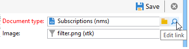

# Caso d’uso{#use-case}

## Creare un filtro per il formato e-mail degli abbonati {#creating-a-filter-on-the-email-format-of-subscribers}

Questo caso d’uso illustra come creare un filtro per ordinare le iscrizioni alle newsletter in base al formato e-mail del destinatario.

A questo scopo, è necessario utilizzare un filtro predefinito: questi filtri sono collegati a un tipo di documento e sono accessibili tramite **[!UICONTROL Administration > Configuration > Predefined filters]** nodo. Questi filtri dati possono essere utilizzati per ogni tipo di editor (o documento) nell’applicazione.

I filtri dati vengono creati nello stesso modo dei filtri predefiniti, ma è disponibile un campo aggiuntivo per selezionare il tipo di documento a cui applicare il filtro.

Applica i seguenti passaggi:

1. Creare un nuovo filtro tramite **[!UICONTROL Administration > Configuration > Predefined filters]** nodo.
1. Fai clic su **[!UICONTROL Select link]** per selezionare il documento interessato:

   

1. Seleziona lo schema di abbonamento (nms:subscription) e fai clic su **[!UICONTROL OK]**.

   

1. Clic **[!UICONTROL Edit link]** per visualizzare i campi del documento selezionato.

   

   È quindi possibile visualizzare il contenuto del documento selezionato:

   

   Puoi accedere a questi campi per definire le condizioni del filtro nel corpo dell’editor di filtri. Un filtro di applicazione viene definito esattamente nello stesso modo di un filtro avanzato. Consulta [Creare un filtro avanzato](../../platform/using/creating-filters.md#creating-an-advanced-filter).

1. Crea un nuovo filtro per gli abbonamenti per visualizzare solo gli abbonamenti con un formato e-mail non definito:

   

1. Clic **[!UICONTROL Save]** per aggiungere un filtro ai filtri predefiniti per questo tipo di elenco.
1. Ora puoi utilizzare questo filtro nel **[!UICONTROL Subscriptions]** del profilo del destinatario; puoi accedere al filtro &quot;Formato e-mail sconosciuto&quot; facendo clic sul pulsante **[!UICONTROL Filters]** pulsante.

   

   Il nome del filtro corrente viene visualizzato sopra l&#39;elenco. Per annullare il filtro, fai clic su **[!UICONTROL Delete this filter]** icona.

   
