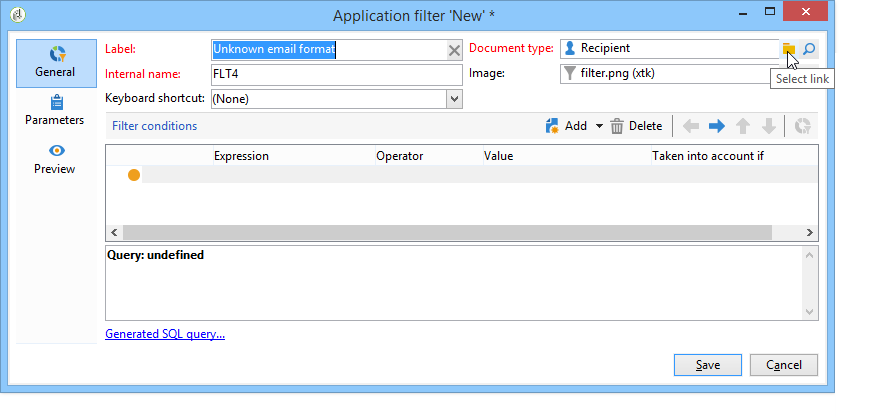
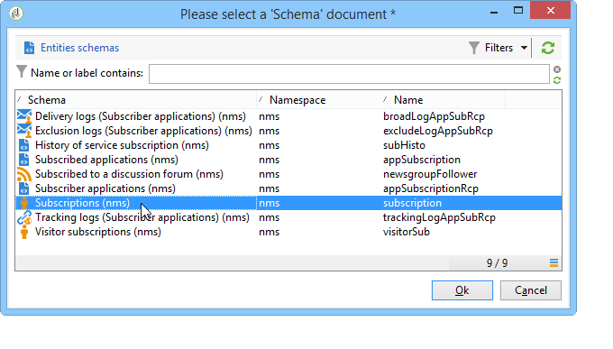

# Caso d’uso{#use-case}

## Creare un filtro per il formato e-mail degli abbonati {#creating-a-filter-on-the-email-format-of-subscribers}

Questo caso d’uso illustra come creare un filtro per ordinare le iscrizioni alle newsletter in base al formato e-mail del destinatario.

A questo scopo, è necessario utilizzare un filtro predefinito: questi filtri sono collegati a un tipo di documento e sono accessibili tramite il nodo **[!UICONTROL Administration > Configuration > Predefined filters]**. Questi filtri dati possono essere utilizzati per ogni tipo di editor (o documento) nell’applicazione.

I filtri dati vengono creati nello stesso modo dei filtri predefiniti, ma è disponibile un campo aggiuntivo per selezionare il tipo di documento a cui applicare il filtro.

Applica i seguenti passaggi:

1. Creare un nuovo filtro tramite il nodo **[!UICONTROL Administration > Configuration > Predefined filters]**.
1. Fare clic sull&#39;icona **[!UICONTROL Select link]** per selezionare il documento interessato:

   

1. Selezionare lo schema di sottoscrizione (nms:subscription) e fare clic su **[!UICONTROL OK]**.

   

1. Fare clic su **[!UICONTROL Edit link]** per visualizzare i campi del documento selezionato.

   

   È quindi possibile visualizzare il contenuto del documento selezionato:

   

   Puoi accedere a questi campi per definire le condizioni del filtro nel corpo dell’editor di filtri. Un filtro di applicazione viene definito esattamente nello stesso modo di un filtro avanzato. Per ulteriori informazioni sui filtri, consulta la [documentazione di Campaign v8 (console)](https://experienceleague.adobe.com/en/docs/campaign/campaign-v8/audience/create-filters){target=_blank}.

1. Crea un nuovo filtro per gli abbonamenti per visualizzare solo gli abbonamenti con un formato e-mail non definito:

   

1. Fare clic su **[!UICONTROL Save]** per aggiungere un filtro ai filtri predefiniti per questo tipo di elenco.
1. È ora possibile utilizzare questo filtro nella scheda **[!UICONTROL Subscriptions]** del profilo del destinatario; è possibile accedere al filtro &quot;Formato e-mail sconosciuto&quot; facendo clic sul pulsante **[!UICONTROL Filters]**.

   

   Il nome del filtro corrente viene visualizzato sopra l&#39;elenco. Per annullare il filtro, fare clic sull&#39;icona **[!UICONTROL Delete this filter]**.

   
