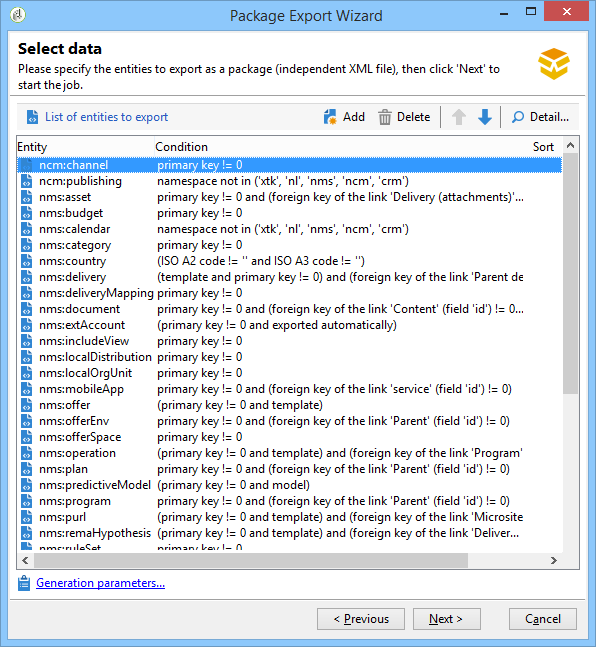
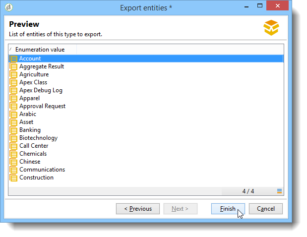
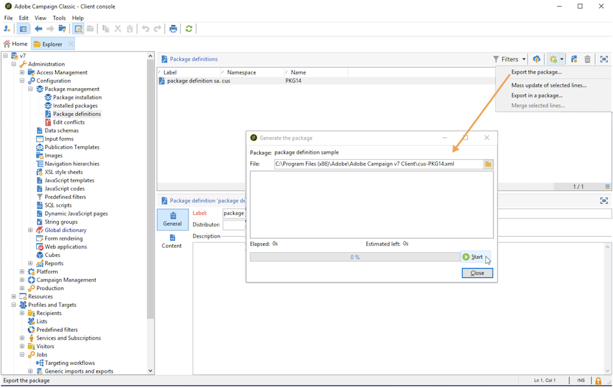
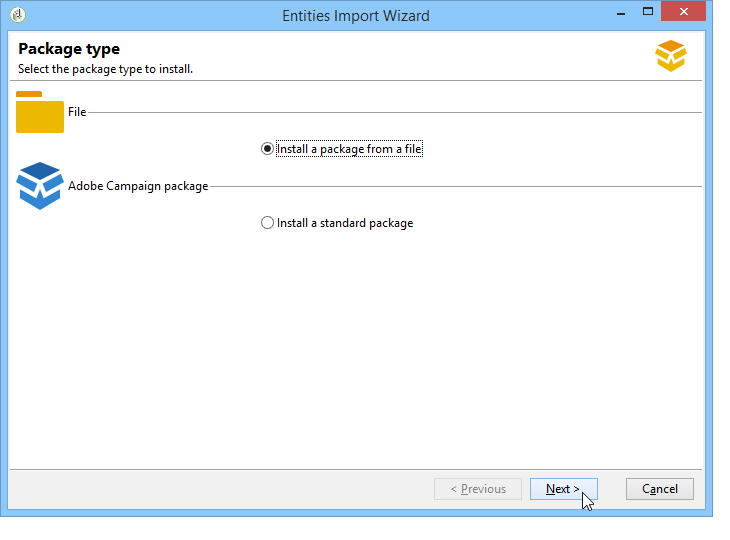

# Utilizzare i pacchetti di dati{#working-with-data-packages}


## Informazioni sui pacchetti di dati {#about-data-packages}

 Adobe Campaign ti consente di esportare o importare la configurazione e i dati della piattaforma attraverso un sistema di pacchetti. I pacchetti possono contenere diversi tipi di configurazioni, elementi filtrati o meno.

I pacchetti di dati consentono la visualizzazione delle entità del database di Adobe Campaign tramite file in formato XML. Ogni entità contenuta in un pacchetto viene rappresentata con tutti i suoi dati.

Il principio di **pacchetti di dati** consiste nell&#39;esportare una configurazione di dati e integrarla in un altro sistema Adobe Campaign. Scopri come mantenere un set coerente di pacchetti di dati in questa [sezione](#data-package-best-practices).

### Tipi di pacchetti {#types-of-packages}

Esistono tre tipi di pacchetti esportabili: pacchetti utente, pacchetti piattaforma e pacchetti amministratore.

* **Pacchetto utente**: consente di selezionare l&#39;elenco di entità da esportare. Questo tipo di pacchetto gestisce le dipendenze e verifica gli errori.
* **Pacchetto Platform**: include tutte le risorse tecniche aggiunte (non standard): schemi, codice JavaScript, ecc.

  

* **Pacchetto di amministrazione**: include tutti i modelli e gli oggetti business aggiunti (non standard): modelli, librerie, ecc.

  

>[!CAUTION]
>
>I tipi **platform** e **admin** contengono un elenco predefinito di entità da esportare. Ogni entità è collegata a condizioni di filtro che consentono di rimuovere le risorse pronte all’uso del pacchetto creato.

## Struttura dei dati {#data-structure}

La descrizione di un pacchetto di dati è un documento XML strutturato conforme alla grammatica dello schema di dati **xrk:navtree**.

Esempio di pacchetto dati:

```
<package>
  <entities schema="nms:recipient">
    <recipient email="john.smith@adobe.com" lastName="Smith" firstName="John">      
      <folder _operation="none" name="nmsRootFolder"/>      
      <company _operation="none" name="Adobe"/>
    </recipient>
  </entities>
  <entities schema="sfa:company">
    <company name="Adobe">
      location city="London" zipCode="W11 2BQ"/>
    </company>
  </entities>
</package>
```

Il documento XML deve iniziare e terminare con l&#39;elemento **`<package>`**. Tutti gli elementi **`<entities>`** che seguono distribuiscono i dati per tipo di documento.

Un elemento **`<entities>`** contiene i dati del pacchetto nel formato dello schema dati immesso nell&#39;attributo **schema**.

I dati di un pacchetto non devono contenere chiavi interne non compatibili tra le basi, ad esempio chiavi generate automaticamente (**autopk** opzione).

Nel nostro esempio, i join sui collegamenti &quot;cartella&quot; e &quot;azienda&quot; sono stati sostituiti dai tasti &quot;di alto livello&quot; sulle tabelle di destinazione:

```
<recipient>
  <folder _operation="none" name="nmsRootFolder"/>
  <company _operation="none" name="Adobe"/>
</recipient>
```

L&#39;attributo **`operation`** con il valore &quot;none&quot; definisce un collegamento di riconciliazione.

Un pacchetto di dati può essere costruito manualmente da qualsiasi editor di testo. Assicurati semplicemente che la struttura del documento XML sia conforme allo schema di dati &quot;xtk:navtree&quot;. La console Adobe Campaign dispone di un modulo di esportazione e importazione del pacchetto di dati.

## Esporta pacchetti {#exporting-packages}

### Informazioni sull’esportazione di pacchetti {#about-package-export}

I pacchetti possono essere esportati in tre modi diversi:

* **[!UICONTROL Package Export Assistant]** consente di esportare un set di oggetti in un singolo pacchetto. Per ulteriori informazioni, consulta [Esportare un set di oggetti in un pacchetto](#exporting-a-set-of-objects-in-a-package)
* È possibile esportare un **oggetto singolo** in un pacchetto facendo clic con il pulsante destro del mouse su di esso e selezionando **[!UICONTROL Actions > Export in a package]**.
* **Le definizioni dei pacchetti** ti consentono di creare una struttura di pacchetti in cui aggiungere oggetti che verranno esportati successivamente in un pacchetto. Per ulteriori informazioni, consulta [Gestire le definizioni dei pacchetti](#managing-package-definitions)

Una volta esportato un pacchetto, potrai importarlo e tutte le entità aggiunte in un’altra istanza di Campaign.

### Esportare un set di oggetti in un pacchetto {#exporting-a-set-of-objects-in-a-package}

L&#39;Assistente all&#39;esportazione del pacchetto è accessibile tramite il menu **[!UICONTROL Tools > Advanced > Export package...]** della console client di Adobe Campaign.


Per i tre tipi di pacchetti, l’assistente offre i seguenti passaggi:

1. Elencare le entità da esportare per tipo di documento:

   

   >[!CAUTION]
   >
   >Se si esporta una cartella di tipo **[!UICONTROL Offer category]**, **[!UICONTROL Offer environment]**, **[!UICONTROL Program]** o **[!UICONTROL Plan]**, non selezionare mai la cartella **xtk:folder** poiché alcuni dati potrebbero andare persi. Selezionare l&#39;entità che corrisponde alla cartella: **nms:offerCategory** per le categorie di offerta, **nms:offerEnv** per gli ambienti di offerta, **nms:program** per i programmi e **nms:plan** per i piani.

   La gestione degli elenchi consente di aggiungere o eliminare entità da esportare dalla configurazione. Fare clic su **[!UICONTROL Add]** per selezionare una nuova entità.

   Il pulsante **[!UICONTROL Detail]** modifica la configurazione selezionata.

   >[!NOTE]
   >
   >Il meccanismo di dipendenza controlla la sequenza di esportazione delle entità. Per ulteriori informazioni, consulta [Gestione delle dipendenze](#managing-dependencies).

1. La schermata di configurazione dell’entità definisce la query del filtro in base al tipo di documento da estrarre.

   È necessario configurare la clausola di filtro per l&#39;estrazione dei dati.

   

   >[!NOTE]
   >
   >L&#39;editor delle query è presentato in [questa sezione](../../platform/using/about-queries-in-campaign.md).

1. Fare clic su **[!UICONTROL Next]** e selezionare le colonne di ordinamento per ordinare i dati durante l&#39;estrazione:

   

1. Visualizzare l&#39;anteprima dei dati da estrarre prima di eseguire l&#39;esportazione.

   

1. L’ultima pagina dell’assistente all’esportazione del pacchetto ti consente di avviare l’esportazione. I dati verranno memorizzati nel file indicato nel campo **[!UICONTROL File]**.

   

### Gestire le dipendenze {#managing-dependencies}

Il meccanismo di esportazione consente ad Adobe Campaign di tenere traccia dei collegamenti tra i vari elementi esportati.

Questo meccanismo è definito da due regole:

* gli oggetti collegati a un collegamento con integrità di tipo **own** o **owncopy** vengono esportati nello stesso pacchetto dell&#39;oggetto esportato.
* gli oggetti collegati a un collegamento con integrità di tipo **neutral** o **define** (collegamento definito) devono essere esportati separatamente.

>[!NOTE]
>
>I tipi di integrità collegati agli elementi dello schema sono definiti in [questa sezione](../../configuration/using/database-mapping.md#links--relation-between-tables).

#### Esportare una campagna {#exporting-a-campaign}

Ecco un esempio su come esportare una campagna. La campagna di marketing da esportare contiene un’attività (etichetta: &quot;MyTask&quot;) e un flusso di lavoro (etichetta: &quot;CampaignWorkflow&quot;) in una cartella &quot;MyWorkflow&quot; (nodo: Amministrazione / Produzione / Flussi di lavoro tecnici / Processi campagna / MyWorkflow).

L’attività e il flusso di lavoro vengono esportati nello stesso pacchetto della campagna, in quanto gli schemi corrispondenti sono collegati da collegamenti con integrità di tipo &quot;propria&quot;.

Contenuto pacchetto:

```
<?xml version='1.0'?>
<package author="Administrator (admin)" buildNumber="7974" buildVersion="7.1" img=""
label="" name="" namespace="" vendor="">
 <desc></desc>
 <version buildDate="AAAA-MM-DD HH:MM:SS.954Z"/>
 <entities schema="nms:operation">
  <operation duration="432000" end="AAAA-MM-DD" internalName="OP1" label="MyCampaign"
  modelName="opEmpty" start="AAAA-MM-DD">
   <controlGroup>
    <where filteringSchema=""/>
   </controlGroup>
   <seedList>
    <where filteringSchema="nms:seedMember"></where>
    <seedMember internalName="SDM1"></seedMember>
   </seedList>
   <parameter useAsset="1" useBudget="1" useControlGroup="1" useDeliveryOutline="1"
   useDocument="1" useFCPValidation="0" useSeedMember="1" useTask="1"
   useValidation="1" useWorkflow="1"></parameter>
   <fcpSeed>
    <where filteringSchema="nms:seedMember"></where>
   </fcpSeed>
   <owner _operation="none" name="admin" type="0"/>
   <program _operation="none" name="nmsOperations"/>
   <task end="2023-01-17 10:07:51.000Z" label="MyTask" name="TSK2" start="2023-01-16 10:07:51.000Z"
   status="1">
    <owner _operation="none" name="admin" type="0"/>
    <operation _operation="none" internalName="OP1"/>
    <folder _operation="none" name="nmsTask"/>
   </task>
   <workflow internalName="WKF12" label="CampaignWorkflow" modelName="newOpEmpty"
   order="8982" scenario-cs="Notification of the workflow supervisor (notifySupervisor)"
   schema="nms:recipient">
    <scenario internalName="notifySupervisor"/>
    <desc></desc>
    <folder _operation="none" name="Folder4"/>
    <operation _operation="none" internalName="OP1"/>
   </workflow>
  </operation>
 </entities>
</package>   
```

L&#39;affiliazione a un tipo di pacchetto è definita in uno schema con gli attributi **@pkgAdmin e @pkgPlatform**. Entrambi questi attributi ricevono un’espressione XTK che definisce le condizioni di affiliazione al pacchetto.

```
<element name="offerEnv" img="nms:offerEnv.png" 
template="xtk:folder" pkgAdmin="@id != 0">
```

Infine, l&#39;attributo **@pkgStatus** consente di definire le regole di esportazione per questi elementi o attributi. A seconda del valore dell’attributo, l’elemento o l’attributo si trova nel pacchetto esportato. I tre valori possibili per questo attributo sono:

* **mai**: non esporta il campo o il collegamento
* **always**: forza l&#39;esportazione per questo campo
* **preCreate**: autorizza la creazione dell&#39;entità collegata

>[!NOTE]
>
>Il valore **preCreate** è ammesso solo per eventi di tipo collegamento. Ti autorizza a creare o puntare a un’entità non ancora caricata nel pacchetto esportato.

## Gestire le definizioni dei pacchetti {#managing-package-definitions}

Le definizioni dei pacchetti consentono di creare una struttura di pacchetti in cui aggiungere entità che verranno esportate successivamente in un singolo pacchetto. Potrai quindi importare questo pacchetto e tutte le entità aggiunte in un’altra istanza di Campaign.

**Argomenti correlati:**

* [Creare una definizione di pacchetto](#creating-a-package-definition)
* [Aggiungere entità a una definizione di pacchetto](#adding-entities-to-a-package-definition)
* [Configurare la generazione delle definizioni dei pacchetti](#configuring-package-definitions-generation)
* [Esportare pacchetti da una definizione di pacchetto](#exporting-packages-from-a-package-definition)

### Creare una definizione di pacchetto {#creating-a-package-definition}

È possibile accedere alle definizioni dei pacchetti dal menu **[!UICONTROL Administration > Configuration > Package management > Package definitions]**.

Per creare una definizione di pacchetto, fare clic sul pulsante **[!UICONTROL New]**, quindi inserire le informazioni generali sulla definizione del pacchetto.


È quindi possibile aggiungere entità alla definizione del pacchetto ed esportarla in un pacchetto di file XML.

**Argomenti correlati:**

* [Aggiungere entità a una definizione di pacchetto](#adding-entities-to-a-package-definition)
* [Configurare la generazione delle definizioni dei pacchetti](#configuring-package-definitions-generation)
* [Esportare pacchetti da una definizione di pacchetto](#exporting-packages-from-a-package-definition)

### Aggiungere entità a una definizione di pacchetto {#adding-entities-to-a-package-definition}

Nella scheda **[!UICONTROL Content]**, fare clic sul pulsante **[!UICONTROL Add]** per selezionare le entità da esportare con il pacchetto. Le best practice per la selezione delle entità sono presentate nella sezione [questa sezione](#exporting-a-set-of-objects-in-a-package).


Le entità possono essere aggiunte a una definizione di pacchetto direttamente dalla loro posizione nell’istanza. A questo scopo, segui la procedura indicata di seguito:

1. Fare clic con il pulsante destro del mouse sull&#39;entità desiderata, quindi selezionare **[!UICONTROL Actions > Export in a package]**.

   

1. Selezionare **[!UICONTROL Add to a package definition]**, quindi selezionare la definizione del pacchetto a cui si desidera aggiungere l&#39;entità.

   

1. L&#39;entità viene aggiunta alla definizione del pacchetto e verrà esportata con il pacchetto (vedere [questa sezione](#exporting-packages-from-a-package-definition)).

   

### Configurare la generazione delle definizioni dei pacchetti {#configuring-package-definitions-generation}

La generazione del pacchetto può essere configurata dalla scheda Definizione pacchetto **[!UICONTROL Content]**. A tale scopo, fare clic sul collegamento **[!UICONTROL Generation parameters]**.


* **[!UICONTROL Include the definition]**: include la definizione attualmente utilizzata nella definizione del pacchetto.
* **[!UICONTROL Include an installation script]**: consente di aggiungere uno script javascript da eseguire all&#39;importazione del pacchetto. Se selezionata, nella schermata di definizione del pacchetto viene aggiunta una scheda **[!UICONTROL Script]**.
* **[!UICONTROL Include default values]**: aggiunge al pacchetto i valori di tutti gli attributi delle entità.

  Questa opzione non è selezionata per impostazione predefinita, al fine di evitare lunghe esportazioni. Ciò significa che gli attributi delle entità con valori predefiniti (&quot;stringa vuota&quot;, &quot;0&quot; e &quot;false&quot; se non sono definiti altrimenti nello schema) non verranno aggiunti al pacchetto e pertanto non verranno esportati.

  >[!CAUTION]
  >
  >Deselezionando questa opzione si può ottenere un’unione di versioni locali e importate.
  >
  >Se l’istanza in cui viene importato il pacchetto contiene entità identiche a quelle del pacchetto (ad esempio con lo stesso ID esterno), i relativi attributi non verranno aggiornati. Ciò può verificarsi se gli attributi dell’istanza precedente dispongono di valori predefiniti, in quanto non sono inclusi nel pacchetto.
  >
  >In tal caso, la selezione dell&#39;opzione **[!UICONTROL Include default values]** impedirebbe l&#39;unione delle versioni, in quanto tutti gli attributi dell&#39;istanza precedente verrebbero esportati con il pacchetto.

### Esportare pacchetti da una definizione di pacchetto {#exporting-packages-from-a-package-definition}

Per esportare un pacchetto da una definizione di pacchetto, effettua le seguenti operazioni:

1. Selezionare la definizione del pacchetto da esportare, quindi fare clic sul pulsante **[!UICONTROL Actions]** e selezionare **[!UICONTROL Export the package]**.
1. Per impostazione predefinita, viene selezionato un file XML corrispondente al pacchetto esportato. Viene denominato in base allo spazio dei nomi e al nome della definizione del pacchetto.
1. Una volta definiti il nome e il percorso del pacchetto, fare clic sul pulsante **[!UICONTROL Start]** per avviare l&#39;esportazione.

   

## Importazione dei pacchetti {#importing-packages}

L&#39;Assistente all&#39;importazione del pacchetto è accessibile tramite il menu principale **[!UICONTROL Tools > Advanced > Import package]** della console client di Adobe Campaign.

Puoi importare un pacchetto da un&#39;esportazione eseguita in precedenza, ad esempio da un&#39;altra istanza di Adobe Campaign, o da un [pacchetto incorporato](../../installation/using/installing-campaign-standard-packages.md), a seconda dei termini della licenza.



### Installare un pacchetto da un file {#installing-a-package-from-a-file}

Per importare un pacchetto di dati esistente, selezionare il file XML e fare clic su **[!UICONTROL Open]**.


Il contenuto del pacchetto da importare viene quindi visualizzato nella sezione centrale dell’editor.

Fare clic su **[!UICONTROL Next]** e **[!UICONTROL Start]** per avviare l&#39;importazione.


### Installare un pacchetto integrato {#installing-a-standard-package}

I pacchetti standard sono pacchetti incorporati, installati quando è configurato Adobe Campaign. A seconda delle autorizzazioni e del modello di distribuzione in uso, è possibile importare nuovi pacchetti standard se si acquisiscono nuove opzioni o componenti aggiuntivi oppure se si esegue l&#39;aggiornamento a una nuova offerta.

Fare riferimento al contratto di licenza per verificare quali pacchetti è possibile installare.

Per ulteriori informazioni sui pacchetti incorporati, fare riferimento a [questa pagina](../../installation/using/installing-campaign-standard-packages.md).

## Best practice relative ai pacchetti dati {#data-package-best-practices}

Questa sezione descrive come organizzare i pacchetti di dati in modo coerente per l’intera durata del progetto.

I pacchetti possono contenere diversi tipi di configurazioni ed elementi, filtrati o meno. Se salti alcuni elementi o non importi elementi/pacchetti nell’ordine corretto, la configurazione della piattaforma può interrompersi.

Inoltre, con diverse persone che lavorano sulla stessa piattaforma con molte funzioni diverse, la cartella delle specifiche del pacchetto può diventare rapidamente complessa.

Anche se non è obbligatorio, questa sezione offre una soluzione per organizzare e utilizzare i pacchetti in Adobe Campaign per progetti su larga scala.

I principali vincoli sono i seguenti:
* Organizzare i pacchetti e tenere traccia di ciò che viene modificato e quando
* Se una configurazione viene aggiornata, riduci al minimo il rischio di interruzione di un elemento non direttamente collegato all’aggiornamento

>[!NOTE]
>
>Per ulteriori informazioni sulla configurazione di un flusso di lavoro per l&#39;esportazione automatica dei pacchetti, vedere [questa pagina](https://helpx.adobe.com/campaign/kb/export-packages-automatically.html).

### Raccomandazioni {#data-package-recommendations}

Importa sempre all’interno della stessa versione della piattaforma. Devi verificare di distribuire i pacchetti tra due istanze che hanno la stessa build. Non forzare mai l’importazione e aggiorna sempre prima la piattaforma (se la build è diversa).

>[!IMPORTANT]
>
>L’importazione tra versioni diverse non è supportata da Adobe.
<!--This is not allowed. Importing from 6.02 to 6.1, for example, is prohibited. If you do so, R&D won't be able to help you resolve any issues you encounter.-->

Presta attenzione allo schema e alla struttura del database. L’importazione del pacchetto con schema deve essere seguita dalla generazione dello schema.

### Soluzione {#data-package-solution}

#### Tipi di pacchetti {#package-types}

Per iniziare, definisci diversi tipi di pacchetti. Verranno utilizzati solo quattro tipi:

**Entità**
* Tutti gli elementi specifici &quot;xtk&quot; e &quot;nms&quot; in Adobe Campaign come schemi, moduli, cartelle, modelli di consegna, ecc.
* Puoi considerare un’entità sia come elemento &quot;admin&quot; che come elemento &quot;platform&quot;.
* Non includere più di un’entità in un pacchetto durante il caricamento in un’istanza Campaign.

<!--Nothing "works" alone. An entity package does not have a specific role or objective.-->

Se devi distribuire la configurazione su una nuova istanza, puoi importare tutti i pacchetti di entità.

**Caratteristiche**

Questo tipo di pacchetto:
* Risponde a un requisito/specifica del cliente.
* Contiene una o più funzionalità.
* Deve contenere tutte le dipendenze per poter eseguire la funzionalità senza altri pacchetti.

**Campagne**

Questo pacchetto non è obbligatorio. A volte è utile creare un tipo specifico per tutte le campagne, anche se una campagna può essere vista come una funzione.

**Aggiornamenti**

Una volta configurata, una funzione può essere esportata in un altro ambiente. Ad esempio, il pacchetto può essere esportato da un ambiente di sviluppo a un ambiente di test. In questo test, viene rilevato un difetto. Innanzitutto, deve essere corretto nell’ambiente di sviluppo. Applicare quindi il cerotto sulla piattaforma di prova.

La prima soluzione consiste nell&#39;esportare di nuovo l&#39;intera funzionalità. Tuttavia, per evitare qualsiasi rischio (aggiornamento di elementi indesiderati), è più sicuro disporre di un pacchetto contenente solo la correzione.

Ecco perché consigliamo di creare un pacchetto di &quot;aggiornamento&quot; contenente un solo tipo di entità della funzione.

Un aggiornamento potrebbe non essere solo una correzione, ma anche un nuovo elemento del pacchetto entità/funzione/campagna. Per evitare di distribuire l’intero pacchetto, puoi esportare un pacchetto di aggiornamento.

### Convenzioni di denominazione {#data-package-naming}

Ora che i tipi sono definiti, è necessario specificare una convenzione di denominazione. Adobe Campaign non consente di creare sottocartelle per le specifiche dei pacchetti, il che significa che i numeri sono la soluzione migliore per rimanere organizzati. I numeri precedono i nomi dei pacchetti. Puoi utilizzare la seguente convenzione:

* Entità: da 1 a 99
* Effigie: da 100 a 199
* Campagna: da 200 a 299
* Aggiornamento: da 5000 a 5999

### Pacchetti {#data-packages}

>[!NOTE]
>
>È meglio impostare regole per definire il numero corretto di pacchetti.

#### Ordine pacchetti entità {#entity-packages-order}

Per facilitare l’importazione, i pacchetti di entità devono essere ordinati durante l’importazione. Ad esempio:
* 001 - Schema
* 002 - Modulo
* 003 - Immagini
* ecc.

>[!NOTE]
>
>Forms deve essere importato solo dopo gli aggiornamenti dello schema.

#### Pacchetto 200 {#package-200}

Il numero di pacchetto &quot;200&quot; non deve essere utilizzato per una campagna specifica: questo numero verrà utilizzato per aggiornare qualcosa che riguarda tutte le campagne.

#### Aggiorna pacchetto {#update-package}

L&#39;ultimo punto riguarda la numerazione dei pacchetti di aggiornamento. Si tratta del numero del pacchetto (entità, funzione o campagna) con il prefisso &quot;5&quot;. Ad esempio:
* 5001 per aggiornare uno schema
* 5200 per aggiornare tutte le campagne
* 5101 per aggiornare la funzionalità 101

Il pacchetto di aggiornamento deve contenere solo un’entità specifica, per essere facilmente riutilizzabile. Per dividerli, aggiungi un nuovo numero (inizia da 1). Non esistono regole di ordinamento specifiche per questi pacchetti. Per capire meglio, immagina di avere una funzione 101, un&#39;applicazione social:
* Contiene una webApp e un account esterno.
   * L’etichetta del pacchetto è: 101 - Applicazione sociale (socialApplication).
* Si è verificato un difetto in WebApp.
   * WepApp viene corretto.
   * È necessario creare un pacchetto di correzione con il seguente nome: 5101 - 1 - WebApp per applicazione social (socialApplication_webApp).
* È necessario aggiungere un nuovo account esterno per la funzione social.
   * Account esterno creato.
   * Il nuovo pacchetto è: 5101 - 2 - Account esterno dell’applicazione social (socialApplication_extAccount).
   * Parallelamente, il pacchetto 101 viene aggiornato per essere aggiunto all’account esterno, ma non viene distribuito.

     

#### Documentazione del pacchetto {#package-documentation}

Quando aggiorni un pacchetto, devi sempre inserire un commento nel campo di descrizione per descrivere nel dettaglio eventuali modifiche e motivi (ad esempio, &quot;aggiungere un nuovo schema&quot; o &quot;correggere un difetto&quot;).


Devi anche datare il commento. Segnala sempre il commento su un pacchetto di aggiornamento al &quot;genitore&quot; (pacchetto senza il prefisso 5).

>[!IMPORTANT]
>
>Il campo descrizione può contenere solo un massimo di 2.000 caratteri.
