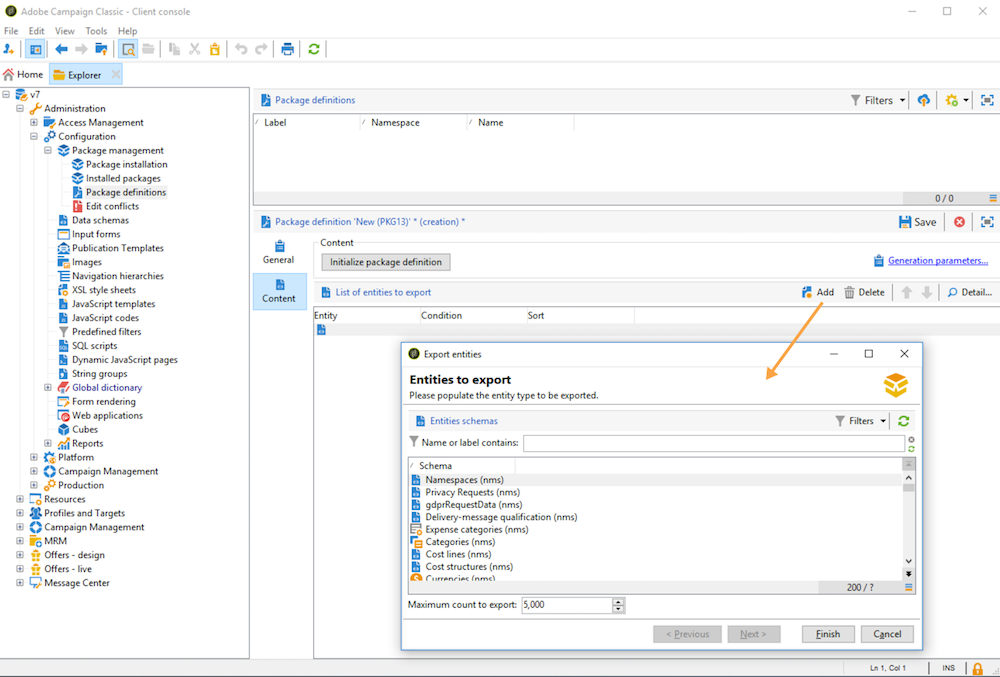
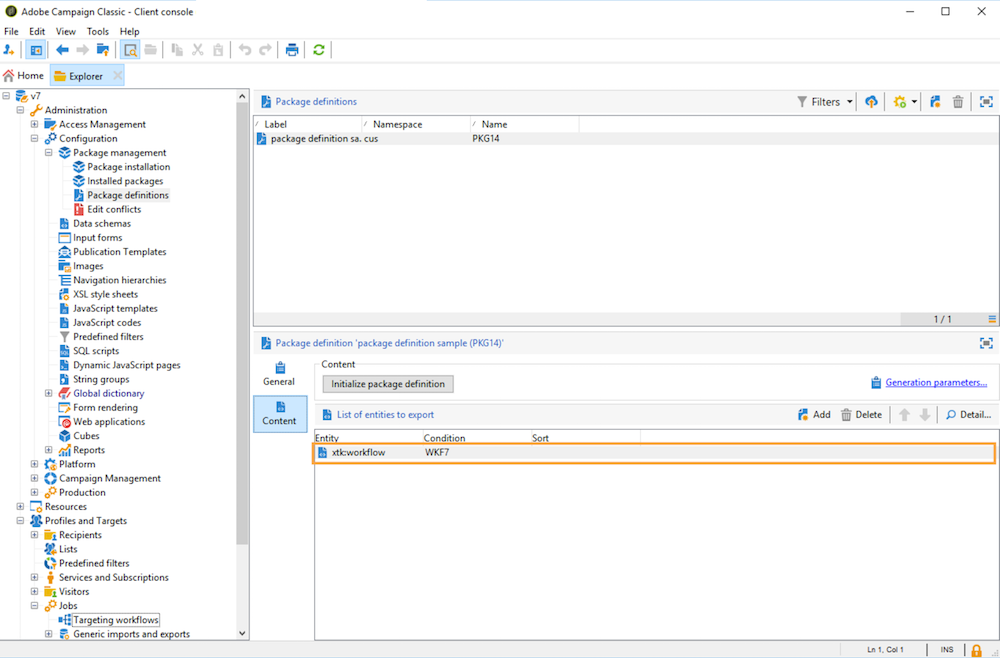

# Utilizzare i pacchetti di dati{#working-with-data-packages}


## Informazioni sui pacchetti di dati {#about-data-packages}

 Adobe Campaign ti consente di esportare o importare la configurazione e i dati della piattaforma attraverso un sistema di pacchetti. I pacchetti possono contenere diversi tipi di configurazioni, elementi, filtrati o meno.

I pacchetti di dati consentono la visualizzazione delle entità del database di Adobe Campaign tramite file in formato XML. Ogni entità contenuta in un pacchetto viene rappresentata con tutti i suoi dati.

Il principio **pacchetti di dati** consente di esportare una configurazione di dati e di integrarla in un altro sistema Adobe Campaign. Scopri come mantenere un set coerente di pacchetti di dati in questo [sezione](#data-package-best-practices).

### Tipi di pacchetti {#types-of-packages}

Esistono tre tipi di pacchetti esportabili: pacchetti utente, pacchetti piattaforma e pacchetti amministrativi.

* **Pacchetto utente**: consente di selezionare l’elenco di entità da esportare. Questo tipo di pacchetto gestisce le dipendenze e verifica gli errori.
* **Pacchetto piattaforma**: include tutte le risorse tecniche aggiunte (non standard): schemi, codice JavaScript, ecc.

   

* **Pacchetto di amministrazione**: include tutti i modelli e gli oggetti business aggiunti (non standard): modelli, librerie, ecc.

   

>[!CAUTION]
>
>La **piattaforma** e **admin** I tipi contengono un elenco predefinito di entità da esportare. Ogni entità è collegata a condizioni di filtro che ti consentono di rimuovere le risorse predefinite del pacchetto creato.

## Struttura dati {#data-structure}

La descrizione di un pacchetto di dati è un documento XML strutturato conforme alla grammatica del **xrk:navtree** schema dati.

Esempio del pacchetto dati:

```
<package>
  <entities schema="nms:recipient">
    <recipient email="john.smith@adobe.com" lastName="Smith" firstName="John">      
      <folder _operation="none" name="nmsRootFolder"/>      
      <company _operation="none" name="Adobe"/>
    </recipient>
  </entities>
  <entities schema="sfa:company">
    <company name="Adobe">
      location city="London" zipCode="W11 2BQ"/>
    </company>
  </entities>
</package>
```

Il documento XML deve iniziare e terminare con **`<package>`** elemento. Qualsiasi **`<entities>`** gli elementi che seguono distribuiscono i dati per tipo di documento.

Un **`<entities>`** contiene i dati del pacchetto nel formato dello schema dati immesso nel **schema** attributo.

I dati in un pacchetto non devono contenere chiavi interne non compatibili tra le basi, ad esempio chiavi generate automaticamente (**autopk** ).

Nel nostro esempio, i join sui collegamenti &quot;cartella&quot; e &quot;azienda&quot; sono stati sostituiti dai cosiddetti tasti &quot;di alto livello&quot; sulle tabelle di destinazione:

```
<recipient>
  <folder _operation="none" name="nmsRootFolder"/>
  <company _operation="none" name="Adobe"/>
</recipient>
```

La **`operation`** con il valore &quot;none&quot; definisce un collegamento di riconciliazione.

Un pacchetto di dati può essere costruito manualmente da qualsiasi editor di testo. Assicurati semplicemente che la struttura del documento XML sia conforme allo schema dati &quot;xtk:navtree&quot;. La console Adobe Campaign dispone di un modulo di esportazione e importazione del pacchetto dati.

## Pacchetti di esportazione {#exporting-packages}

### Informazioni sull’esportazione dei pacchetti {#about-package-export}

I pacchetti possono essere esportati in tre modi diversi:

* La **[!UICONTROL Package Export Wizard]** consente di esportare un set di oggetti in un singolo pacchetto. Per ulteriori informazioni, consulta [Esportare un set di oggetti in un pacchetto](#exporting-a-set-of-objects-in-a-package)
* A **oggetto singolo** può essere esportato in un pacchetto direttamente facendo clic con il pulsante destro del mouse e selezionando **[!UICONTROL Actions > Export in a package]**.
* **Definizioni dei pacchetti** consente di creare una struttura di pacchetto in cui aggiungere oggetti che verranno esportati in un secondo momento in un pacchetto. Per ulteriori informazioni, consulta [Gestire le definizioni dei pacchetti](#managing-package-definitions)

Una volta esportato un pacchetto, potrai importarlo e tutte le entità aggiunte in un’altra istanza Campaign.

### Esportare un set di oggetti in un pacchetto {#exporting-a-set-of-objects-in-a-package}

La procedura guidata di esportazione del pacchetto è accessibile tramite **[!UICONTROL Tools > Advanced > Export package...]** del menu della console client di Adobe Campaign.


Per i tre tipi di pacchetti, la procedura guidata offre i seguenti passaggi:

1. Elencare le entità da esportare per tipo di documento:

   

   >[!CAUTION]
   >
   >Se esporti un **[!UICONTROL Offer category]**, **[!UICONTROL Offer environment]**, **[!UICONTROL Program]** o **[!UICONTROL Plan]** digita la cartella, non selezionare mai il **xtk:folder** come potresti perdere alcuni dati. Seleziona l’entità che corrisponde alla cartella: **nms:offerCategory** per le categorie di offerta, **nms:offerEnv** per gli ambienti di offerta, **nms:program** per i programmi e **nms:plan** per i piani.

   La gestione degli elenchi consente di aggiungere o eliminare entità per l’esportazione dalla configurazione. Fai clic su **[!UICONTROL Add]** per selezionare una nuova entità.

   La **[!UICONTROL Detail]** modifica la configurazione selezionata.

   >[!NOTE]
   >
   >Il meccanismo di dipendenza controlla la sequenza di esportazione delle entità. Per ulteriori informazioni, consulta [Gestione delle dipendenze](#managing-dependencies).

1. La schermata di configurazione dell’entità definisce la query del filtro sul tipo di documento da estrarre.

   Devi configurare la clausola di filtro per l’estrazione dei dati.

   

   >[!NOTE]
   >
   >L’editor delle query è presentato in [questa sezione](../../platform/using/about-queries-in-campaign.md).

1. Fai clic su **[!UICONTROL Next]** e seleziona le colonne di ordinamento per ordinare i dati durante l’estrazione:

   

1. Visualizza in anteprima i dati da estrarre prima di eseguire l’esportazione.

   

1. L’ultima pagina della procedura guidata di esportazione del pacchetto consente di avviare l’esportazione. I dati saranno memorizzati nel file indicato nella **[!UICONTROL File]** campo .

   

### Gestire le dipendenze {#managing-dependencies}

Il meccanismo di esportazione consente ad Adobe Campaign di tenere traccia dei collegamenti tra i vari elementi esportati.

Questo meccanismo è definito da due regole:

* oggetti collegati a un collegamento con un **proprio** o **copia** l’integrità del tipo viene esportata nello stesso pacchetto dell’oggetto esportato.
* oggetti collegati a un collegamento con un **neutro** o **definire** l’integrità del tipo (collegamento definito) deve essere esportata separatamente.

>[!NOTE]
>
>I tipi di integrità collegati agli elementi dello schema sono definiti in [questa sezione](../../configuration/using/database-mapping.md#links--relation-between-tables).

#### Esportare una campagna {#exporting-a-campaign}

Ecco un esempio su come esportare una campagna. La campagna di marketing da esportare contiene un’attività (etichetta: &quot;MyTask&quot;) e un flusso di lavoro (etichetta: &quot;CampaignWorkflow&quot;) in una cartella &quot;MyWorkflow&quot; (nodo: Amministrazione/produzione/flussi di lavoro tecnici/processi di Campaign/MyWorkflow).

L’attività e il flusso di lavoro vengono esportati nello stesso pacchetto della campagna, in quanto gli schemi corrispondenti sono collegati da collegamenti con un’integrità di tipo &quot;own&quot;.

Contenuto del pacchetto:

```
<?xml version='1.0'?>
<package author="Administrator (admin)" buildNumber="7974" buildVersion="6.1" img=""
label="" name="" namespace="" vendor="">
 <desc></desc>
 <version buildDate="2013-01-09 10:30:18.954Z"/>
 <entities schema="nms:operation">
  <operation duration="432000" end="2013-01-14" internalName="OP1" label="MyCampaign"
  modelName="opEmpty" start="2013-01-09">
   <controlGroup>
    <where filteringSchema=""/>
   </controlGroup>
   <seedList>
    <where filteringSchema="nms:seedMember"></where>
    <seedMember internalName="SDM1"></seedMember>
   </seedList>
   <parameter useAsset="1" useBudget="1" useControlGroup="1" useDeliveryOutline="1"
   useDocument="1" useFCPValidation="0" useSeedMember="1" useTask="1"
   useValidation="1" useWorkflow="1"></parameter>
   <fcpSeed>
    <where filteringSchema="nms:seedMember"></where>
   </fcpSeed>
   <owner _operation="none" name="admin" type="0"/>
   <program _operation="none" name="nmsOperations"/>
   <task end="2013-01-17 10:07:51.000Z" label="MyTask" name="TSK2" start="2013-01-16 10:07:51.000Z"
   status="1">
    <owner _operation="none" name="admin" type="0"/>
    <operation _operation="none" internalName="OP1"/>
    <folder _operation="none" name="nmsTask"/>
   </task>
   <workflow internalName="WKF12" label="CampaignWorkflow" modelName="newOpEmpty"
   order="8982" scenario-cs="Notification of the workflow supervisor (notifySupervisor)"
   schema="nms:recipient">
    <scenario internalName="notifySupervisor"/>
    <desc></desc>
    <folder _operation="none" name="Folder4"/>
    <operation _operation="none" internalName="OP1"/>
   </workflow>
  </operation>
 </entities>
</package>   
```

L&#39;affiliazione a un tipo di pacchetto è definita in uno schema con **@pkgAdmin e @pkgPlatform** attributo. Entrambi questi attributi ricevono un&#39;espressione XTK che definisce le condizioni di affiliazione al pacchetto.

```
<element name="offerEnv" img="nms:offerEnv.png" 
template="xtk:folder" pkgAdmin="@id != 0">
```

Infine, la **@pkgStatus** Attributo consente di definire le regole di esportazione per questi elementi o attributi. A seconda del valore dell’attributo, l’elemento o l’attributo si troverà nel pacchetto esportato. I tre valori possibili per questo attributo sono:

* **mai**: non esporta il campo o il collegamento
* **sempre**: forza l&#39;esportazione per questo campo
* **preCreate**: autorizza la creazione dell&#39;entità collegata

>[!NOTE]
>
>La **preCreate** è ammesso solo per eventi di tipo collegamento. Ti consente di creare o indirizzare verso un’entità non ancora caricata nel pacchetto esportato.

## Gestire le definizioni dei pacchetti {#managing-package-definitions}

Le definizioni dei pacchetti consentono di creare una struttura di pacchetti in cui aggiungere entità che verranno esportate in un secondo momento in un unico pacchetto. Potrai quindi importare questo pacchetto e tutte le entità aggiunte in un’altra istanza Campaign.

**Argomenti correlati:**

* [Creare una definizione di pacchetto](#creating-a-package-definition)
* [Aggiungere entità a una definizione di pacchetto](#adding-entities-to-a-package-definition)
* [Configura la generazione delle definizioni dei pacchetti](#configuring-package-definitions-generation)
* [Esportare pacchetti da una definizione di pacchetto](#exporting-packages-from-a-package-definition)

### Creare una definizione di pacchetto {#creating-a-package-definition}

È possibile accedere alle definizioni dei pacchetti da **[!UICONTROL Administration > Configuration > Package management > Package definitions]** menu.

Per creare una definizione di pacchetto, fai clic sul pulsante **[!UICONTROL New]** quindi compila le informazioni generali sulla definizione del pacchetto.


Puoi quindi aggiungere entità alla definizione del pacchetto ed esportarla in un pacchetto di file XML.

**Argomenti correlati:**

* [Aggiungere entità a una definizione di pacchetto](#adding-entities-to-a-package-definition)
* [Configura la generazione delle definizioni dei pacchetti](#configuring-package-definitions-generation)
* [Esportare pacchetti da una definizione di pacchetto](#exporting-packages-from-a-package-definition)

### Aggiungere entità a una definizione di pacchetto {#adding-entities-to-a-package-definition}

In **[!UICONTROL Content]** fai clic sulla scheda **[!UICONTROL Add]** per selezionare le entità da esportare con il pacchetto. Le best practice per la selezione delle entità sono presentate nel [questa sezione](#exporting-a-set-of-objects-in-a-package) sezione .



Le entità possono essere aggiunte a una definizione di pacchetto direttamente dalla loro posizione nell’istanza. A tale scopo, segui la procedura indicata di seguito:

1. Fai clic con il pulsante destro del mouse sull’entità desiderata, quindi seleziona **[!UICONTROL Actions > Export in a package]**.

   

1. Seleziona **[!UICONTROL Add to a package definition]**, quindi seleziona la definizione del pacchetto a cui desideri aggiungere l’entità.

   

1. L’entità viene aggiunta alla definizione del pacchetto, verrà esportata con il pacchetto (vedi [questa sezione](#exporting-packages-from-a-package-definition)).

   

### Configura la generazione delle definizioni dei pacchetti {#configuring-package-definitions-generation}

La generazione del pacchetto può essere configurata dalla definizione del pacchetto **[!UICONTROL Content]** scheda . A questo scopo, fai clic sul pulsante **[!UICONTROL Generation parameters]** link.


* **[!UICONTROL Include the definition]**: include la definizione attualmente utilizzata nella definizione del pacchetto.
* **[!UICONTROL Include an installation script]**: consente di aggiungere uno script javascript da eseguire all’importazione del pacchetto. Quando è selezionata, una **[!UICONTROL Script]** viene aggiunta la scheda nella schermata di definizione del pacchetto.
* **[!UICONTROL Include default values]**: aggiunge al pacchetto i valori di tutti gli attributi delle entità.

   Questa opzione non è selezionata per impostazione predefinita, per evitare esportazioni prolungate. Ciò significa che gli attributi delle entità con valori predefiniti (&quot;stringa vuota&quot;, &quot;0&quot; e &quot;false&quot; se non definiti diversamente nello schema) non verranno aggiunti al pacchetto e pertanto non verranno esportati.

   >[!CAUTION]
   >
   >Se si deseleziona questa opzione è possibile unire le versioni locali e importate.
   >
   >Se l’istanza in cui viene importato il pacchetto contiene entità identiche a quelle del pacchetto (ad esempio con lo stesso ID esterno), i relativi attributi non verranno aggiornati. Questo può verificarsi se gli attributi della precedente istanza hanno valori predefiniti, in quanto non sono inclusi nel pacchetto.
   >
   >In tal caso, seleziona la **[!UICONTROL Include default values]** Questa opzione impedisce l’unione delle versioni, in quanto tutti gli attributi dell’istanza precedente vengono esportati con il pacchetto.

### Esportare pacchetti da una definizione di pacchetto {#exporting-packages-from-a-package-definition}

Per esportare un pacchetto dalla definizione di un pacchetto, segui i passaggi seguenti:

1. Seleziona la definizione del pacchetto da esportare, quindi fai clic sul pulsante **[!UICONTROL Actions]** e seleziona **[!UICONTROL Export the package]**.
1. Per impostazione predefinita, viene selezionato un file XML corrispondente al pacchetto esportato. Viene denominato in base allo spazio dei nomi e al nome della definizione del pacchetto.
1. Una volta definiti il nome e la posizione del pacchetto, fai clic sul pulsante **[!UICONTROL Start]** per avviare l’esportazione.

   

## Pacchetti di importazione {#importing-packages}

La procedura guidata di importazione del pacchetto è accessibile tramite il menu principale **[!UICONTROL Tools > Advanced > Import package]** della console client di Adobe Campaign.

Puoi importare un pacchetto da un’esportazione eseguita in precedenza, ad esempio da un’altra istanza di Adobe Campaign, o da un [pacchetto integrato](../../installation/using/installing-campaign-standard-packages.md), a seconda dei termini della licenza.


### Installare un pacchetto da un file {#installing-a-package-from-a-file}

Per importare un pacchetto dati esistente, selezionare il file XML e fare clic su **[!UICONTROL Open]**.


Il contenuto del pacchetto da importare viene quindi visualizzato nella sezione centrale dell’editor.

Fai clic su **[!UICONTROL Next]** e **[!UICONTROL Start]** per avviare l’importazione.


### Installare un pacchetto incorporato {#installing-a-standard-package}

I pacchetti standard sono pacchetti incorporati, installati quando Adobe Campaign è configurato. A seconda delle autorizzazioni e del modello di distribuzione, è possibile importare nuovi pacchetti standard se si acquisiscono nuove opzioni o componenti aggiuntivi o se si esegue l’aggiornamento a una nuova offerta.

Fai riferimento al contratto di licenza per verificare quali pacchetti puoi installare.

Per ulteriori informazioni sui pacchetti incorporati, consulta [questa pagina](../../installation/using/installing-campaign-standard-packages.md).

## Best practice per i pacchetti di dati {#data-package-best-practices}

Questa sezione descrive come organizzare i pacchetti di dati in modo coerente per tutta la durata del progetto.

I pacchetti possono contenere diversi tipi di configurazioni ed elementi, filtrati o meno. Se manchi alcuni elementi o non importi elementi/pacchetti nell’ordine corretto, la configurazione della piattaforma può interrompersi.

Inoltre, con diverse persone che lavorano sulla stessa piattaforma con molte caratteristiche diverse, la cartella delle specifiche del pacchetto può diventare rapidamente complessa.

Anche se non è obbligatorio, questa sezione offre una soluzione per organizzare e utilizzare i pacchetti in Adobe Campaign per progetti su larga scala.

I principali vincoli sono i seguenti:
* Organizzare i pacchetti e tenere traccia di ciò che viene modificato e di quando
* Se una configurazione viene aggiornata, riduci al minimo il rischio di interrompere qualcosa che non è collegato direttamente all’aggiornamento

>[!NOTE]
>
>Per ulteriori informazioni sulla configurazione di un flusso di lavoro per l’esportazione automatica dei pacchetti, consulta [questa pagina](https://helpx.adobe.com/campaign/kb/export-packages-automatically.html).

### Raccomandazioni {#data-package-recommendations}

Importa sempre all’interno della stessa versione della piattaforma. Devi verificare di distribuire i pacchetti tra due istanze che hanno la stessa build. Non forzare mai l’importazione e aggiornare sempre prima la piattaforma (se la build è diversa).

>[!IMPORTANT]
>
>L’importazione tra versioni diverse non è supportata da Adobe.
<!--This is not allowed. Importing from 6.02 to 6.1, for example, is prohibited. If you do so, R&D won’t be able to help you resolve any issues you encounter.-->

Presta attenzione allo schema e alla struttura del database. L&#39;importazione del pacchetto con schema deve essere seguita dalla generazione dello schema.

### Soluzione {#data-package-solution}

#### Tipi di pacchetti {#package-types}

Inizia definendo diversi tipi di pacchetti. Verranno utilizzati solo quattro tipi:

**Entità**
* Tutti gli elementi specifici &quot;xtk&quot; e &quot;nms&quot; in Adobe Campaign come schemi, moduli, cartelle, modelli di consegna, ecc.
* Puoi considerare un’entità sia come elemento &quot;amministratore&quot; che come elemento &quot;piattaforma&quot;.
* Non devi includere più di un’entità in un pacchetto quando lo carichi in un’istanza Campaign.

<!--Nothing “works” alone. An entity package does not have a specific role or objective.-->

Se devi distribuire la configurazione in una nuova istanza, puoi importare tutti i pacchetti di entità.

**Funzioni**

Questo tipo di pacchetto:
* Risponde a un requisito o a una specifica client.
* Contiene una o più funzionalità.
* Deve contenere tutte le dipendenze per essere in grado di eseguire la funzionalità senza alcun altro pacchetto.

**Campagne**

Questo pacchetto non è obbligatorio. A volte è utile creare un tipo specifico per tutte le campagne, anche se una campagna può essere vista come una funzione.

**Aggiornamenti**

Una volta configurata, una funzione può essere esportata in un altro ambiente. Ad esempio, il pacchetto può essere esportato da un ambiente di sviluppo a un ambiente di test. In questo test viene rivelato un difetto. In primo luogo, deve essere fissato sull&#39;ambiente di sviluppo. Quindi, applicare la patch alla piattaforma di test.

La prima soluzione sarebbe esportare nuovamente l&#39;intera funzionalità. Ma, per evitare qualsiasi rischio (aggiornamento degli elementi indesiderati), è più sicuro avere un pacchetto contenente solo la correzione.

Ecco perché consigliamo di creare un pacchetto &quot;update&quot;, contenente un solo tipo di entità della funzione.

Un aggiornamento non può essere solo una correzione, ma anche un nuovo elemento del pacchetto entità/funzione/campagna. Per evitare di distribuire l’intero pacchetto, puoi esportare un pacchetto di aggiornamento.

### Convenzioni di denominazione {#data-package-naming}

Ora che i tipi sono definiti, è necessario specificare una convenzione di denominazione. Adobe Campaign non consente di creare sottocartelle per le specifiche dei pacchetti, il che significa che i numeri sono la soluzione migliore per rimanere organizzati. I numeri prefisso i nomi dei pacchetti. È possibile utilizzare la convenzione seguente:

* Entità: dall&#39;1 al 99
* Funzionalità: dal 100 al 199
* Campagna: dal 200 al 299
* Aggiorna: da 5000 a 5999

### Pacchetti {#data-packages}

>[!NOTE]
>
>È meglio impostare regole per definire il numero corretto di pacchetti.

#### Ordine dei pacchetti di entità {#entity-packages-order}

Per facilitare l’importazione, i pacchetti di entità devono essere ordinati in base all’ordine in cui verranno importati. Ad esempio:
* 001 - Schema
* 002 - Modulo
* 003 - Immagini
* ecc.

>[!NOTE]
>
>Forms deve essere importato solo dopo gli aggiornamenti dello schema.

#### Pacchetto 200 {#package-200}

Il numero di pacchetto &quot;200&quot; non deve essere utilizzato per una campagna specifica: questo numero verrà utilizzato per aggiornare qualcosa che riguarda tutte le campagne.

#### Aggiorna il pacchetto {#update-package}

L&#39;ultimo punto riguarda la numerazione dei pacchetti di aggiornamento. È il numero del pacchetto (entità, funzione o campagna) con un prefisso &quot;5&quot;. Ad esempio:
* 5001 per aggiornare uno schema
* 5200 per aggiornare tutte le campagne
* 5101 per aggiornare la funzione 101

Il pacchetto di aggiornamento deve contenere una sola entità specifica per essere facilmente riutilizzabile. Per dividerli, aggiungi un nuovo numero (inizia da 1). Non esistono regole di ordinamento specifiche per questi pacchetti. Per capire meglio, immaginate di avere una caratteristica 101, un&#39;applicazione sociale:
* Contiene un webApp e un account esterno.
   * L&#39;etichetta del pacchetto è: 101 - Applicazione sociale (socialApplication).
* C&#39;è un difetto su webApp.
   * L&#39;app wepApp viene corretta.
   * È necessario creare un pacchetto di correzione, con il seguente nome: 5101 - 1 - Applicazione social webApp (socialApplication_webApp).
* È necessario aggiungere un nuovo account esterno per la funzione social.
   * Viene creato un account esterno.
   * Il nuovo pacchetto è: 5101 - 2 - Account esterno per applicazioni social (socialApplication_extAccount).
   * Parallelamente, il pacchetto 101 viene aggiornato per essere aggiunto all’account esterno, ma non viene distribuito.
      

#### Documentazione del pacchetto {#package-documentation}

Quando aggiorni un pacchetto, devi sempre inserire un commento nel campo di descrizione per specificare tutte le modifiche e i motivi (ad esempio, &quot;aggiungi un nuovo schema&quot; o &quot;correggi un difetto&quot;).


Il commento deve anche essere datato. Segnala sempre il tuo commento su un pacchetto di aggiornamento al &quot;padre&quot; (pacchetto senza il prefisso 5).

>[!IMPORTANT]
>
>Il campo di descrizione può contenere solo fino a 2.000 caratteri.
