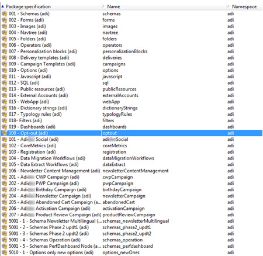

# Utilizzo dei pacchetti di dati{#working-with-data-packages}

## Informazioni sui pacchetti di dati {#about-data-packages}

Adobe Campaign consente di esportare o importare la configurazione della piattaforma e i dati attraverso un sistema di pacchetti. I pacchetti possono contenere diversi tipi di configurazioni, elementi, filtrati o meno.

I pacchetti di dati consentono la visualizzazione delle entità del database Adobe Campaign tramite file in formato XML. Ogni entità contenuta in un pacchetto è rappresentata da tutti i suoi dati.

Il principio dei pacchetti **di** dati è esportare una configurazione di dati e integrarla in un altro sistema Adobe Campaign. Per ulteriori informazioni su come mantenere un insieme coerente di pacchetti di dati, consulta questa [nota tecnica](https://docs.campaign.adobe.com/doc/AC/en/technicalResources/Technotes/AdobeCampaign_How_to_maintain_a_consistent_set_of_data_packages.pdf).

### Tipi di pacchetti {#types-of-packages}

Esistono tre tipi di pacchetti esportabili: pacchetti utente, pacchetti di piattaforma e pacchetti di amministrazione.

* **Pacchetto** utente: consente di selezionare l&#39;elenco delle entità da esportare. Questo tipo di pacchetto gestisce le dipendenze e verifica gli errori.
* **Pacchetto** piattaforma: include tutte le risorse tecniche aggiunte (non standard): schemi, codice JavaScript, ecc.

   

* **Pacchetto** amministratore: include tutti i modelli e gli oggetti business aggiunti (non standard): modelli, librerie ecc.

   

>[!CAUTION]
>
>I tipi di **piattaforma** e **amministratore** contengono un elenco predefinito di entità da esportare. Ogni entità è collegata a condizioni di filtraggio che consentono di rimuovere le risorse pronte all&#39;uso del pacchetto creato.

## Struttura dei dati {#data-structure}

La descrizione di un pacchetto di dati è un documento XML strutturato conforme alla grammatica dello schema di dati **xrk:navtree** .

Esempio di pacchetto dati:

```
<package>
  <entities schema="nms:recipient">
    <recipient email="john.smith@adobe.com" lastName="Smith" firstName="John">      
      <folder _operation="none" name="nmsRootFolder"/>      
      <company _operation="none" name="Adobe"/>
    </recipient>
  </entities>
  <entities schema="sfa:company">
    <company name="Adobe">
      location city="London" zipCode="W11 2BQ"/>
    </company>
  </entities>
</package>
```

Il documento XML deve iniziare e terminare con l&#39; **`<package>`** elemento . Tutti **`<entities>`** gli elementi che seguono distribuiscono i dati per tipo di documento.

Un **`<entities>`** elemento contiene i dati del pacchetto nel formato dello schema dati immesso nell&#39;attributo **schema** .

I dati contenuti in un pacchetto non devono contenere chiavi interne non compatibili tra le basi, come chiavi generate automaticamente (opzione **autopk** ).

Nel nostro esempio, i join sui collegamenti &quot;cartella&quot; e &quot;società&quot; sono stati sostituiti dai cosiddetti tasti &quot;di alto livello&quot; sulle tabelle di destinazione:

```
<recipient>
  <folder _operation="none" name="nmsRootFolder"/>
  <company _operation="none" name="Adobe"/>
</recipient>
```

L&#39; **`operation`** attributo con il valore &quot;none&quot; definisce un collegamento di riconciliazione.

Un pacchetto di dati può essere costruito manualmente da qualsiasi editor di testo. È sufficiente assicurarsi che la struttura del documento XML sia conforme allo schema di dati &quot;xtk:navtree&quot;. La console di Adobe Campaign dispone di un modulo di esportazione e importazione per i pacchetti di dati.

## Esportazione di pacchetti {#exporting-packages}

### Informazioni sull&#39;esportazione dei pacchetti {#about-package-export}

I pacchetti possono essere esportati in tre modi diversi:

* Consente di **[!UICONTROL Package Export Wizard]** esportare un set di oggetti in un singolo pacchetto. Per ulteriori informazioni, consultate [Esportazione di un set di oggetti in un pacchetto](#exporting-a-set-of-objects-in-a-package)
* Un **singolo oggetto** può essere esportato direttamente in un pacchetto facendo clic con il pulsante destro del mouse su di esso e selezionando **[!UICONTROL Actions > Export in a package]**.
* **Le definizioni** dei pacchetti consentono di creare una struttura di pacchetti in cui aggiungere gli oggetti che verranno esportati in un secondo momento in un pacchetto. Per ulteriori informazioni, consultate [Gestione delle definizioni dei pacchetti](#managing-package-definitions)

Una volta esportato un pacchetto, potrete importarlo e tutte le entità aggiunte in un&#39;altra istanza di Campaign.

### Esportazione di un set di oggetti in un pacchetto {#exporting-a-set-of-objects-in-a-package}

La procedura guidata di esportazione del pacchetto è accessibile dal **[!UICONTROL Tools > Advanced > Export package...]** menu della console client Adobe Campaign.


Per i tre tipi di pacchetti, la procedura guidata offre i seguenti passaggi:

1. Elenca le entità da esportare per tipo di documento:

   

   >[!CAUTION]
   >
   >Se esportate una cartella **[!UICONTROL Offer category]**, **[!UICONTROL Offer environment]** o **[!UICONTROL Program]** digitate, non selezionate mai la cartella **[!UICONTROL Plan]** xtk:folder **** in quanto potreste perdere alcuni dati. Selezionate l&#39;entità che corrisponde alla cartella: **nms:offerCategory** per le categorie di offerte, **nms:offerEnv** per gli ambienti di offerte, **nms:program** per i programmi e **nms:plan** per i piani.

   Gestione elenchi consente di aggiungere o eliminare entità per l&#39;esportazione dalla configurazione. Fate clic **[!UICONTROL Add]** per selezionare una nuova entità.

   Il **[!UICONTROL Detail]** pulsante modifica la configurazione selezionata.

   >[!NOTE]
   >
   >Il meccanismo di dipendenza controlla la sequenza di esportazione delle entità. Per ulteriori informazioni, vedere [Gestione delle dipendenze](#managing-dependencies).

1. La schermata di configurazione dell&#39;entità definisce la query del filtro per il tipo di documento da estrarre.

   È necessario configurare la clausola di filtraggio per l&#39;estrazione dei dati.

   

   >[!NOTE]
   >
   >L&#39;editor di query viene presentato in [questa sezione](../../platform/using/about-queries-in-campaign.md).

1. Fare clic **[!UICONTROL Next]** e selezionare le colonne di ordinamento per ordinare i dati durante l&#39;estrazione:

   

1. Visualizzare l&#39;anteprima dei dati da estrarre prima di eseguire l&#39;esportazione.

   

1. L’ultima pagina della procedura guidata di esportazione del pacchetto consente di avviare l’esportazione. I dati saranno memorizzati nel file indicato nel **[!UICONTROL File]** campo.

   

### Gestione delle dipendenze {#managing-dependencies}

Il meccanismo di esportazione consente ad Adobe Campaign di tenere traccia dei collegamenti tra i vari elementi esportati.

Tale meccanismo è definito da due regole:

* gli oggetti collegati a un collegamento con un&#39;integrità **propria** o di tipo **proprietario** vengono esportati nello stesso pacchetto dell&#39;oggetto esportato.
* gli oggetti collegati a un collegamento con un collegamento **neutro** o **definire** l&#39;integrità del tipo (collegamento definito) devono essere esportati separatamente.

>[!NOTE]
>
>I tipi di integrità collegati agli elementi dello schema sono definiti in [questa sezione](../../configuration/using/database-mapping.md#links--relation-between-tables).

#### Esportazione di una campagna {#exporting-a-campaign}

Di seguito è riportato un esempio di come esportare una campagna. La campagna marketing da esportare contiene un&#39;attività (etichetta: &quot;MyTask&quot;) e un flusso di lavoro (etichetta: &quot;CampaignWorkflow&quot;) in una cartella &quot;MyWorkflow&quot; (nodo: Amministrazione/Produzione/Flussi di lavoro tecnici/Processi campagna/MyWorkflow).

L’attività e il flusso di lavoro vengono esportati nello stesso pacchetto della campagna, poiché gli schemi corrispondenti sono collegati da collegamenti con un’integrità del tipo &quot;propria&quot;.

Contenuto pacchetto:

```
<?xml version='1.0'?>
<package author="Administrator (admin)" buildNumber="7974" buildVersion="6.1" img=""
label="" name="" namespace="" vendor="">
 <desc></desc>
 <version buildDate="2013-01-09 10:30:18.954Z"/>
 <entities schema="nms:operation">
  <operation duration="432000" end="2013-01-14" internalName="OP1" label="MyCampaign"
  modelName="opEmpty" start="2013-01-09">
   <controlGroup>
    <where filteringSchema=""/>
   </controlGroup>
   <seedList>
    <where filteringSchema="nms:seedMember"></where>
    <seedMember internalName="SDM1"></seedMember>
   </seedList>
   <parameter useAsset="1" useBudget="1" useControlGroup="1" useDeliveryOutline="1"
   useDocument="1" useFCPValidation="0" useSeedMember="1" useTask="1"
   useValidation="1" useWorkflow="1"></parameter>
   <fcpSeed>
    <where filteringSchema="nms:seedMember"></where>
   </fcpSeed>
   <owner _operation="none" name="admin" type="0"/>
   <program _operation="none" name="nmsOperations"/>
   <task end="2013-01-17 10:07:51.000Z" label="MyTask" name="TSK2" start="2013-01-16 10:07:51.000Z"
   status="1">
    <owner _operation="none" name="admin" type="0"/>
    <operation _operation="none" internalName="OP1"/>
    <folder _operation="none" name="nmsTask"/>
   </task>
   <workflow internalName="WKF12" label="CampaignWorkflow" modelName="newOpEmpty"
   order="8982" scenario-cs="Notification of the workflow supervisor (notifySupervisor)"
   schema="nms:recipient">
    <scenario internalName="notifySupervisor"/>
    <desc></desc>
    <folder _operation="none" name="Folder4"/>
    <operation _operation="none" internalName="OP1"/>
   </workflow>
  </operation>
 </entities>
</package>   
```

L&#39;affiliazione a un tipo di pacchetto è definita in uno schema con l&#39;attributo **@pkgAdmin e @pkgPlatform** . Entrambi questi attributi ricevono un&#39;espressione XTK che definisce le condizioni di affiliazione al pacchetto.

```
<element name="offerEnv" img="nms:offerEnv.png" 
template="xtk:folder" pkgAdmin="@id != 0">
```

Infine, l&#39;attributo **@pkgStatus** consente di definire le regole di esportazione per questi elementi o attributi. A seconda del valore dell’attributo, l’elemento o l’attributo si trova nel pacchetto esportato. I tre valori possibili per questo attributo sono:

* **never**: non esporta il campo o il collegamento
* **always**: forza l&#39;esportazione per questo campo
* **preCreate**: autorizza la creazione dell&#39;entità collegata

>[!NOTE]
>
>Il valore **preCreate** è ammesso solo per gli eventi dei tipi di collegamento. Consente di creare o indirizzare un&#39;entità non ancora caricata nel pacchetto esportato.

## Gestione delle definizioni dei pacchetti {#managing-package-definitions}

### Informazioni sulle definizioni dei pacchetti {#about-package-definitions}

Le definizioni dei pacchetti consentono di creare una struttura di pacchetti in cui aggiungere entità che verranno esportate in un secondo momento in un singolo pacchetto. Potrete quindi importare il pacchetto e tutte le entità aggiunte in un&#39;altra istanza di Campaign.

**Argomenti correlati:**

* [Creazione di una definizione di pacchetto](#creating-a-package-definition)
* [Aggiunta di entità a una definizione di pacchetto](#adding-entities-to-a-package-definition)
* [Configurazione della generazione delle definizioni dei pacchetti](#configuring-package-definitions-generation)
* [Esportazione di pacchetti da una definizione di pacchetto](#exporting-packages-from-a-package-definition)

### Creazione di una definizione di pacchetto {#creating-a-package-definition}

Le definizioni dei pacchetti sono accessibili dal **[!UICONTROL Administration > Configuration > Package management > Package definitions]** menu.

Per creare una definizione di pacchetto, fate clic sul **[!UICONTROL New]** pulsante, quindi compilate le informazioni generali sulla definizione del pacchetto.


Potete quindi aggiungere entità alla definizione del pacchetto ed esportarla in un pacchetto di file XML.

**Argomenti correlati:**

* [Aggiunta di entità a una definizione di pacchetto](#adding-entities-to-a-package-definition)
* [Configurazione della generazione delle definizioni dei pacchetti](#configuring-package-definitions-generation)
* [Esportazione di pacchetti da una definizione di pacchetto](#exporting-packages-from-a-package-definition)

### Aggiunta di entità a una definizione di pacchetto {#adding-entities-to-a-package-definition}

Nella **[!UICONTROL Content]** scheda, fate clic sul **[!UICONTROL Add]** pulsante per selezionare le entità da esportare con il pacchetto. Le procedure ottimali per la selezione delle entità sono illustrate nella sezione [Esportazione di un set di oggetti in una sezione di pacchetto](#exporting-a-set-of-objects-in-a-package) .


Le entità possono essere aggiunte a una definizione di pacchetto direttamente dalla loro posizione nell&#39;istanza. A questo scopo, attenetevi alla procedura seguente:

1. Fare clic con il pulsante destro del mouse sull&#39;entità desiderata, quindi selezionare **[!UICONTROL Actions > Export in a package]**.

   

1. Selezionate **[!UICONTROL Add to a package definition]**, quindi selezionate la definizione del pacchetto a cui desiderate aggiungere l&#39;entità.

   

1. L&#39;entità viene aggiunta alla definizione del pacchetto, verrà esportata con il pacchetto (consultate [Esportazione di pacchetti da una definizione](#exporting-packages-from-a-package-definition)di pacchetto).

   

### Configurazione della generazione delle definizioni dei pacchetti {#configuring-package-definitions-generation}

La generazione del pacchetto può essere configurata dalla **[!UICONTROL Content]** scheda di definizione del pacchetto. A tale scopo, fare clic sul **[!UICONTROL Generation parameters]** collegamento.


* **[!UICONTROL Include the definition]**: include la definizione attualmente utilizzata nella definizione del pacchetto.
* **[!UICONTROL Include an installation script]**: consente di aggiungere uno script javascript da eseguire durante l&#39;importazione del pacchetto. Quando è selezionata questa opzione, nella schermata di definizione del pacchetto viene aggiunta una **[!UICONTROL Script]** scheda.
* **[!UICONTROL Include default values]**: aggiunge al pacchetto i valori di tutti gli attributi delle entità.

   Questa opzione non è selezionata per impostazione predefinita, per evitare esportazioni troppo lunghe. Ciò significa che gli attributi delle entità con valori predefiniti (&#39;stringa vuota&#39;, &#39;0&#39; e &#39;false&#39; se non altrimenti definiti nello schema) non saranno aggiunti al pacchetto e quindi non saranno esportati.

   >[!CAUTION]
   >
   >Se si deseleziona questa opzione, è possibile che vengano unite le versioni locali e importate.
   >
   >Se l&#39;istanza in cui viene importato il pacchetto contiene entità identiche a quelle del pacchetto (ad esempio con lo stesso ID esterno), i loro attributi non saranno aggiornati. Ciò può verificarsi se gli attributi della precedente istanza hanno valori predefiniti, in quanto non sono inclusi nel pacchetto.
   >
   >In tal caso, la selezione dell&#39; **[!UICONTROL Include default values]** opzione impedirebbe l&#39;unione delle versioni, in quanto tutti gli attributi dell&#39;istanza precedente venivano esportati con il pacchetto.

### Esportazione di pacchetti da una definizione di pacchetto {#exporting-packages-from-a-package-definition}

Per esportare un pacchetto dalla definizione di un pacchetto, effettuate le seguenti operazioni:

1. Selezionate la definizione del pacchetto da esportare, quindi fate clic sul **[!UICONTROL Actions]** pulsante e selezionate **[!UICONTROL Export the package]**.
1. Per impostazione predefinita viene selezionato un file XML corrispondente al pacchetto esportato. Viene denominato in base allo spazio dei nomi e al nome della definizione del pacchetto.
1. Una volta definiti il nome e la posizione del pacchetto, fate clic sul **[!UICONTROL Start]** pulsante per avviare l&#39;esportazione.

   

## Importazione di pacchetti {#importing-packages}

### Informazioni sull&#39;importazione di pacchetti {#about-package-import}

La procedura guidata di importazione dei pacchetti è accessibile dal menu principale **[!UICONTROL Tools > Advanced > Package import...]** della console client Adobe Campaign.

Puoi importare un pacchetto da un&#39;esportazione eseguita in precedenza, ad esempio da un&#39;altra istanza di Adobe Campaign, o da un pacchetto standard, a seconda dei termini della licenza.


### Installazione di un pacchetto da un file {#installing-a-package-from-a-file}

Per importare un pacchetto di dati esistente, selezionate il file XML e fate clic su **[!UICONTROL Open]**.


Il contenuto del pacchetto da importare viene visualizzato nella sezione centrale dell&#39;editor.

Fate clic su **[!UICONTROL Next]** e **[!UICONTROL Start]** per avviare l&#39;importazione.


### Installazione di un pacchetto standard {#installing-a-standard-package}

I pacchetti standard vengono installati quando Adobe Campaign è configurato. A seconda delle autorizzazioni e del modello di distribuzione, potete importare nuovi pacchetti standard se acquisite nuove opzioni o componenti aggiuntivi o se effettuate l’aggiornamento a una nuova offerta.

Fate riferimento al contratto di licenza per verificare quali pacchetti è possibile installare.

Per ulteriori informazioni sui pacchetti standard, consultate [questa pagina](../../installation/using/installing-campaign-standard-packages.md).

## Best practice per i pacchetti di dati {#data-package-best-practices}

Questa sezione descrive come organizzare i pacchetti di dati in modo coerente per tutta la durata del progetto.

<!--Adobe Campaign allows you to export or import the platform configuration through a package system.-->

I pacchetti possono contenere diversi tipi di configurazioni ed elementi, filtrati o meno. Se mancano alcuni elementi o non importate elementi/pacchetti nell&#39;ordine corretto, la configurazione della piattaforma può interrompersi.

Inoltre, con molte persone che lavorano sulla stessa piattaforma con molte caratteristiche diverse, la cartella delle specifiche del pacchetto può rapidamente diventare complessa.

Anche se non è obbligatorio, questa sezione offre una soluzione per organizzare e utilizzare i pacchetti in Adobe Campaign per progetti su larga scala.

<!--This solution has been used with a project involving more than 10 consultants.-->

I principali vincoli sono i seguenti:
* Organizzare i pacchetti e tenere traccia delle modifiche e dei tempi
* Se una configurazione viene aggiornata, riducete il rischio di interrompere qualcosa che non è direttamente collegato all&#39;aggiornamento

>[!NOTE]
>
>Per ulteriori informazioni sulla configurazione di un flusso di lavoro per l&#39;esportazione automatica di pacchetti, consultate [questa pagina](https://helpx.adobe.com/campaign/kb/export-packages-automatically.html).

### Recommendations {#data-package-recommendations}

Importa sempre nella stessa versione della piattaforma. È necessario verificare di distribuire i pacchetti tra due istanze che hanno la stessa build. Non forzare mai l&#39;importazione e aggiornare sempre prima la piattaforma (se la build è diversa).

>[!IMPORTANT]
>
>L&#39;importazione tra versioni diverse non è supportata da Adobe.
<!--This is not allowed. Importing from 6.02 to 6.1, for example, is prohibited. If you do so, R&D won’t be able to help you resolve any issues you encounter.-->

Prestate attenzione allo schema e alla struttura del database. L&#39;importazione del pacchetto con schema deve essere seguita dalla generazione dello schema.

### Soluzione {#data-package-solution}

#### Tipi di pacchetti {#package-types}

Iniziate definendo diversi tipi di pacchetti. Saranno utilizzati solo quattro tipi:

**Entità**
* Tutti gli elementi specifici &quot;xtk&quot; e &quot;nms&quot; in Adobe Campaign come schemi, moduli, cartelle, modelli di consegna ecc.
* Potete considerare un&#39;entità come un elemento &quot;admin&quot; e &quot;platform&quot;.
* Non devi includere più di un&#39;entità in un pacchetto quando lo carichi su un&#39;istanza Campaign.

<!--Nothing “works” alone. An entity package does not have a specific role or objective.-->

Se è necessario distribuire la configurazione in una nuova istanza, è possibile importare tutti i pacchetti di entità.

**Caratteristiche**

Questo tipo di pacchetto:
* Risponde a un requisito o a una specifica client.
* Contiene una o più funzionalità.
* Deve contenere tutte le dipendenze per poter eseguire la funzionalità senza alcun altro pacchetto.

**Campagne**

Questo pacchetto non è obbligatorio. A volte è utile creare un tipo specifico per tutte le campagne, anche se una campagna può essere vista come una funzione.

**Aggiornamenti**

Una volta configurata, una funzione può essere esportata in un altro ambiente. Ad esempio, il pacchetto può essere esportato da un ambiente di sviluppo a un ambiente di test. In questo test viene rivelato un difetto. In primo luogo, deve essere fissato sull&#39;ambiente di sviluppo. Quindi, la patch deve essere applicata alla piattaforma di prova.

La prima soluzione consisterebbe nell&#39;esportare nuovamente l&#39;intera funzionalità. Ma, per evitare qualsiasi rischio (aggiornamento di elementi indesiderati), è più sicuro avere un pacchetto contenente solo la correzione.

È per questo che consigliamo di creare un pacchetto &quot;update&quot; contenente un solo tipo di entità della funzione.

Un aggiornamento non può essere solo una correzione, ma anche un nuovo elemento del pacchetto entità/funzione/campagna. Per evitare di distribuire l&#39;intero pacchetto, potete esportare un pacchetto di aggiornamento.

### Convenzioni di denominazione {#data-package-naming}

Ora che i tipi sono definiti, è necessario specificare una convenzione di denominazione. Adobe Campaign non consente di creare sottocartelle per le specifiche del pacchetto, il che significa che i numeri sono la soluzione migliore per rimanere organizzati. Numeri prefissi i nomi dei pacchetti. È possibile utilizzare la seguente convenzione:

* Entità: dall&#39;1 al 99
* Funzionalità: dal 100 al 1999
* Campaign: dal 200 al 299
* Aggiorna: da 5000 a 5999

### Pacchetti {#data-packages}

>[!NOTE]
>
>È meglio impostare regole per la definizione del numero corretto di pacchetti.

#### Ordine pacchetti entità {#entity-packages-order}

Per facilitare l&#39;importazione, i pacchetti di entità devono essere ordinati in base all&#39;ordine in cui verranno importati. Ad esempio:
* 001 - Schema
* 002 - Modulo
* 003 - Immagini
* ecc.

>[!NOTE]
>
>I moduli devono essere importati solo dopo gli aggiornamenti dello schema.

#### Pacchetto 200 {#package-200}

Il numero di pacchetto &quot;200&quot; non deve essere utilizzato per una campagna specifica: questo numero verrà utilizzato per aggiornare qualcosa che riguarda tutte le campagne.

#### Pacchetto di aggiornamento {#update-package}

L&#39;ultimo punto riguarda la numerazione del pacchetto di aggiornamento. È il numero del pacchetto (entità, funzione o campagna) con il prefisso &quot;5&quot;. Ad esempio:
* 5001 per aggiornare uno schema
* 5200 per aggiornare tutte le campagne
* 5101 per aggiornare la funzione 101

Il pacchetto di aggiornamento deve contenere una sola entità specifica, per essere facilmente riutilizzabile. Per dividerli, aggiungete un nuovo numero (iniziate da 1). Non esistono regole di ordine specifiche per questi pacchetti. Per capire meglio, immaginate di avere una caratteristica 101, un&#39;applicazione sociale:
* Contiene un&#39;app Web e un account esterno.
   * L&#39;etichetta del pacchetto è: 101 - Applicazione sociale (socialApplication).
* C&#39;è un difetto nell&#39;app Web.
   * L’app wepApp viene corretta.
   * È necessario creare un pacchetto di correzione, con il seguente nome: 5101 - 1 - Applicazione social webApp (socialApplication_webApp).
* È necessario aggiungere un nuovo account esterno per la funzione social.
   * Viene creato un account esterno.
   * Il nuovo pacchetto è: 5101 - 2 - Account esterno applicazione social (socialApplication_extAccount).
   * Parallelamente, il pacchetto 101 viene aggiornato per essere aggiunto all&#39;account esterno, ma non viene distribuito.
      

#### Documentazione del pacchetto {#package-documentation}

Quando aggiornate un pacchetto, inserite sempre un commento nel campo di descrizione per specificare le modifiche e i motivi (ad esempio, &quot;aggiungi un nuovo schema&quot; o &quot;correggi un difetto&quot;).


È inoltre necessario specificare la data del commento. Segnala sempre il tuo commento su un pacchetto di aggiornamento al &quot;principale&quot; (pacchetto senza il prefisso 5).

>[!IMPORTANT]
>
>Il campo di descrizione può contenere fino a 2.000 caratteri.