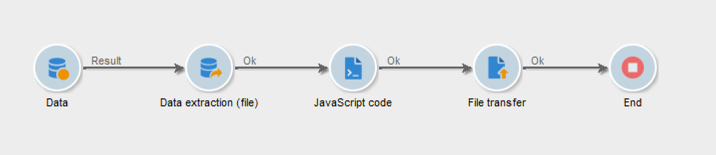

# ZIP o crittografare un file {#zipping-or-encrypting-a-file}

Adobe Campaign consente di esportare file compressi o crittografati. Quando definisci un’esportazione tramite un’attività **[!UICONTROL Data extraction (file)]**, puoi definire una post-elaborazione per lo zip o la cifratura del file.

Per poterlo fare:

1. Installa una coppia di chiavi GPG per la tua istanza utilizzando il [Pannello di controllo Campaign](https://docs.adobe.com/content/help/en/control-panel/using/instances-settings/gpg-keys-management.html#encrypting-data).

   >[!NOTE]
   >
   >Il Pannello di controllo Campaign è accessibile a tutti gli utenti amministratori. I passaggi per concedere all&#39;amministratore l&#39;accesso a un utente sono descritti in [questa pagina](https://experienceleague.adobe.com/docs/control-panel/using/discover-control-panel/managing-permissions.html?lang=en#discover-control-panel).
   >
   >Tieni presente che l’istanza deve essere ospitata su AWS e aggiornata con la build [Gold Standard](../../rn/using/gs-overview.md) più recente o con la build [GA più recente (21.1)](../../rn/using/latest-release.md). Scopri come controllare la versione in [questa sezione](../../platform/using/launching-adobe-campaign.md#getting-your-campaign-version). Per verificare se l&#39;istanza è ospitata su AWS, segui i passaggi descritti in [questa pagina](https://experienceleague.adobe.com/docs/control-panel/using/faq.html).

1. Se l&#39;installazione di Adobe Campaign è ospitata per Adobe, contatta l&#39; [Assistenza clienti di Adobe](https://helpx.adobe.com/enterprise/admin-guide.html/enterprise/using/support-for-experience-cloud.ug.html) per avere le utility necessarie installate sul server.
1. Se l&#39;installazione di Adobe Campaign è on-premise, installare l&#39;utility da utilizzare (ad esempio: GPG, GZIP) e le chiavi necessarie (chiave di crittografia) sul server dell&#39;applicazione.

Puoi quindi utilizzare i comandi o il codice nella scheda **[!UICONTROL Script]** dell’attività o in un’attività **[!UICONTROL JavaScript code]** . Un esempio è presentato nel caso d’uso seguente.

**Argomenti correlati:**

* [Decrittografia o decompressione di un file prima dell’elaborazione](../../platform/using/unzip-decrypt.md)
* [Attività](../../workflow/using/extraction--file-.md) di estrazione dei dati (file).

## Caso di utilizzo: Crittografa ed esporta i dati utilizzando una chiave installata sul Pannello di controllo Campaign {#use-case-gpg-encrypt}

In questo caso d’uso, creeremo un flusso di lavoro per crittografare ed esportare i dati utilizzando una chiave installata sul Pannello di controllo Campaign.

 [Scopri questa funzione nel video](#video)

I passaggi per eseguire questo caso d’uso sono i seguenti:

1. Genera una coppia di chiavi GPG (pubblica/privata) utilizzando un&#39;utility GPG, quindi installa la chiave pubblica sul Pannello di controllo Campaign. I passaggi dettagliati sono disponibili nella [documentazione del Pannello di controllo Campaign](https://docs.adobe.com/content/help/en/control-panel/using/instances-settings/gpg-keys-management.html#encrypting-data).

1. In Campaign Classic, crea un flusso di lavoro per esportare i dati e cifrarli utilizzando la chiave privata installata tramite il Pannello di controllo Campaign. A questo scopo, verrà creato un flusso di lavoro come segue:

   

   * **[!UICONTROL Query]** attività: In questo esempio, si desidera eseguire una query per eseguire il targeting dei dati del database che si desidera esportare.
   * **[!UICONTROL Data extraction (file)]** attività: Estrae i dati in un file .
   * **[!UICONTROL JavaScript code]** attività: Cifra i dati da estrarre.
   * **[!UICONTROL File transfer]** attività: Invia i dati a un’origine esterna (in questo esempio, un server SFTP).

1. Configura l’attività **[!UICONTROL Query]** per eseguire il targeting dei dati desiderati dal database. Per ulteriori informazioni al riguardo, consulta [questa sezione](../../workflow/using/query.md).

1. Apri l’attività **[!UICONTROL Data extraction (file)]** e configurala in base alle tue esigenze. I concetti globali su come configurare l&#39;attività sono disponibili in [questa sezione](../../workflow/using/extraction--file-.md).

   

1. Apri l’attività **[!UICONTROL JavaScript code]** , quindi copia e incolla il comando sottostante per crittografare i dati da estrarre.

   >[!IMPORTANT]
   >
   >Assicurati di sostituire il valore **impronta digitale** dal comando con l&#39;impronta digitale della chiave pubblica installata sul Pannello di controllo Campaign.

   ```
   var cmd='gpg ';
   cmd += ' --trust-model always';
   cmd += ' --batch --yes';
   cmd += ' --recipient fingerprint';
   cmd += ' --encrypt --output ' + vars.filename + '.gpg ' + vars.filename;
   execCommand(cmd,true);
   vars.filename=vars.filename + '.gpg'
   ```

   

1. Apri l’attività **[!UICONTROL File transfer]** , quindi specifica il server SFTP al quale vuoi inviare il file. I concetti globali su come configurare l&#39;attività sono disponibili in [questa sezione](../../workflow/using/file-transfer.md).

   

1. Ora puoi eseguire il flusso di lavoro. Una volta eseguito, il target dei dati dalla query verrà esportato nel server SFTP in un file .gpg crittografato.

## Video tutorial {#video}

Questo video mostra come utilizzare una chiave GPG per crittografare i dati è disponibile anche in

>[!VIDEO](https://video.tv.adobe.com/v/36399?quality=12)

Sono disponibili ulteriori video dimostrativi su Campaign Classic [qui](https://experienceleague.adobe.com/docs/campaign-classic-learn/tutorials/overview.html?lang=it).
