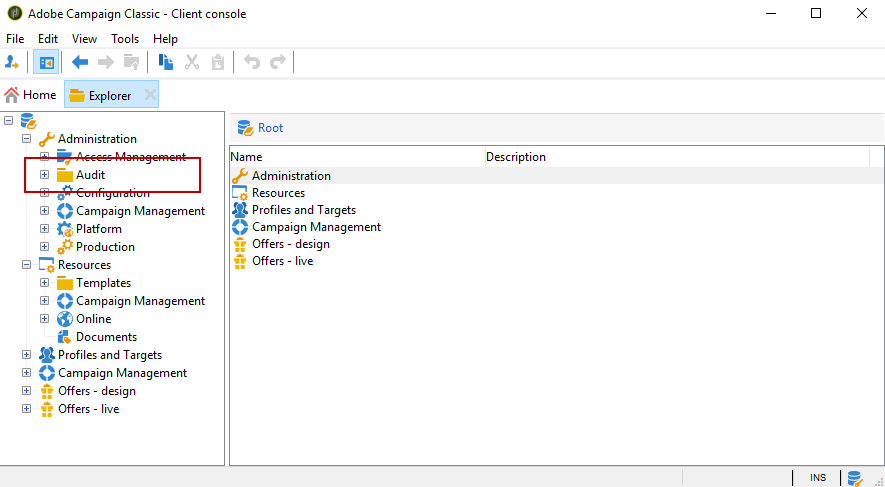

# Audit trail{#audit-trail}

In Adobe Campaign, la **[!UICONTROL Audit trail]** consente di accedere alla cronologia completa delle modifiche apportate all’interno dell’istanza.

**[!UICONTROL Audit trail]** acquisisce in tempo reale un elenco completo delle azioni e degli eventi che si verificano all’interno della tua istanza Adobe Campaign. Include un modo self-service per accedere alla cronologia dei dati e rispondere a domande quali: cosa è successo ai flussi di lavoro e chi li ha aggiornati per ultimo o cosa hanno fatto i tuoi utenti nell’istanza.

>[!NOTE]
>
>Adobe Campaign non controlla le modifiche apportate ai diritti utente, ai modelli, alla personalizzazione o alle campagne.\
>L’audit trail può essere gestito solo dagli amministratori dell’istanza.

Audit Trail è costituito da tre componenti:

* **Audit trail dello schema**: Controlla le attività e le ultime modifiche apportate agli schemi.

   Per ulteriori informazioni sugli schemi, consulta questo [page](../../configuration/using/data-schemas.md).

* **Audit trail del flusso di lavoro**: Controlla le attività e le ultime modifiche apportate ai flussi di lavoro e, inoltre, lo stato dei flussi di lavoro, come:

   * Inizio
   * Pausa
   * Interruzione
   * Riavvio
   * Pulizia uguale alla cronologia di eliminazione dell&#39;azione
   * Simula ciò che è uguale all&#39;azione Inizio in modalità di simulazione
   * Riattivazione uguale all&#39;azione Esegui subito le attività in sospeso
   * Arresto totale

   Per ulteriori informazioni sui flussi di lavoro, consulta questo [page](../../workflow/using/about-workflows.md).

   Per ulteriori informazioni su come monitorare i flussi di lavoro, consulta [sezione dedicata](../../workflow/using/monitoring-workflow-execution.md).

* **Percorso di controllo dell&#39;opzione**: Controlla le attività e le ultime modifiche apportate alle opzioni.

   Per ulteriori informazioni sulle opzioni, consulta questo [page](../../installation/using/configuring-campaign-options.md).

## Accesso a Audit trail {#accessing-audit-trail}

Per accedere alle **[!UICONTROL Audit trail]** :

1. Accedere al **[!UICONTROL Explorer]** del menu della tua istanza.
1. Sotto la **[!UICONTROL Administration]** menu, seleziona **[!UICONTROL Audit]** .

   

1. La **[!UICONTROL Audit trail]** viene visualizzata la finestra con l’elenco delle entità. Adobe Campaign controllerà le azioni di creazione, modifica ed eliminazione per flussi di lavoro, opzioni e schemi.

   Seleziona una delle entità per ulteriori informazioni sulle ultime modifiche.

   

1. La **[!UICONTROL Audit entity]** window fornisce informazioni più dettagliate sull’entità scelta, ad esempio:

   * **[!UICONTROL Type]** : Flusso di lavoro, opzioni o schemi.
   * **[!UICONTROL Entity]** : Nome interno delle attività.
   * **[!UICONTROL Modified by]** : Nome utente dell’ultima persona che ha modificato l’entità.
   * **[!UICONTROL Action]** : Ultima azione eseguita su questa entità, Creata, Modificata o Eliminata.
   * **[!UICONTROL Modification date]** : Data dell’ultima azione eseguita su questa entità.

   Il blocco di codice fornisce ulteriori informazioni sulle modifiche apportate esattamente nell’entità.

   

>[!NOTE]
>
>Per impostazione predefinita, il periodo di conservazione è impostato su 180 giorni per **[!UICONTROL Audit logs]** . Per ulteriori informazioni su come modificare il periodo di conservazione, consulta [page](../../production/using/database-cleanup-workflow.md#deployment-wizard).

## Attiva/disattiva traccia di audit {#enable-disable-audit-trail}

L&#39;audit trail può essere facilmente attivato o disattivato per una specifica attività se, ad esempio, si desidera risparmiare spazio sul database.

Per eseguire questa operazione:

1. Accedere al **[!UICONTROL Explorer]** del menu della tua istanza.
1. Sotto la **[!UICONTROL Administration]** menu, seleziona **[!UICONTROL Platform]** then **[!UICONTROL Options]** .

   

1. Seleziona una delle seguenti opzioni a seconda dell’entità da attivare/disattivare:

   * Per Flusso di lavoro: **[!UICONTROL XtkAudit_Workflows]**
   * Per gli schemi: **[!UICONTROL XtkAudit_DataSchema]**
   * Per le opzioni: **[!UICONTROL XtkAudit_Option]**
   * Per ogni entità: **[!UICONTROL XtkAudit_Enable_All]**

   

1. Modificare la **[!UICONTROL Value]** a 1 se desideri abilitare l’entità o a 0 se desideri disattivarla.

   

1. Fai clic su **[!UICONTROL Save]** .
