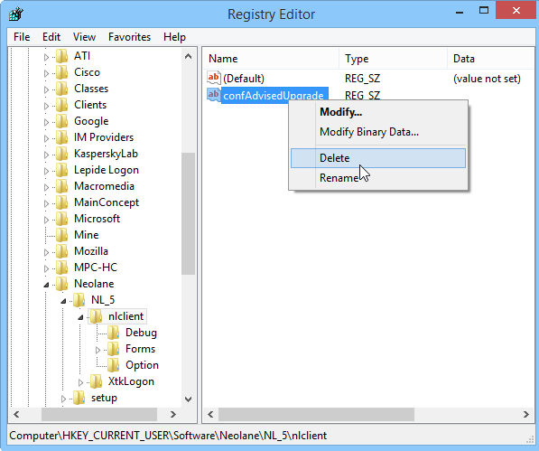

# Aggiornamento della console{#console-update}

Se è stata selezionata l&#39;opzione **[!UICONTROL Do not request console update]** e si desidera riattivare la richiesta di aggiornamento, attenersi alla procedura seguente:

1. Aprire l&#39;editor del database del Registro di sistema utilizzando il comando **regedit** nel menu di Windows **[!UICONTROL Start > Execute]**.

   

1. Nella struttura, visualizzare le opzioni del nodo **[!UICONTROL HKEY_CURRENT_USERSoftwareneolaneNL_6nlclient]**.
1. Eliminare la voce **[!UICONTROL confAdvisedUpgrade]** e chiudere l&#39;editor del Registro di sistema.

   
