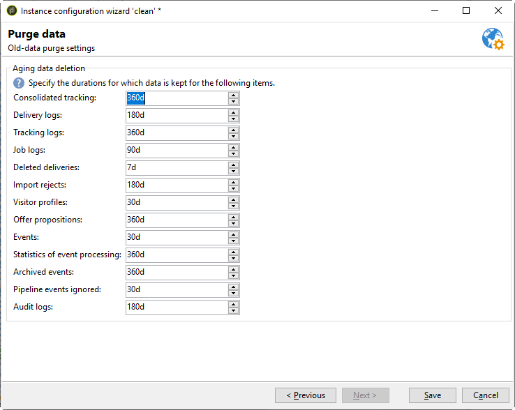

# Flusso di lavoro di pulizia del database{#database-cleanup-workflow}


## Introduzione {#introduction}

Il flusso di lavoro **[!UICONTROL Database cleanup]** accessibile tramite il nodo **[!UICONTROL Administration > Production > Technical workflows]** consente di eliminare i dati obsoleti per evitare una crescita esponenziale del database. Il flusso di lavoro viene attivato automaticamente senza l’intervento dell’utente.


## Configurazione {#configuration}

La pulizia del database è configurata su due livelli: nell’utilità di pianificazione del flusso di lavoro e nella procedura guidata di distribuzione.

### Pianificazione flusso di lavoro {#the-scheduler}

>[!NOTE]
>
>Per ulteriori informazioni sulla pianificazione, consulta la [documentazione di Campaign v8](https://experienceleague.adobe.com/docs/campaign/automation/workflows/wf-activities/flow-control-activities/scheduler.html?lang=it){target="_blank"}.

Per impostazione predefinita, il flusso di lavoro **[!UICONTROL Database cleanup]** è configurato per iniziare ogni giorno alle 4. La pianificazione consente di modificare la frequenza di attivazione del flusso di lavoro. Sono disponibili le seguenti frequenze:

* **[!UICONTROL Several times a day]**
* **[!UICONTROL Daily]**
* **[!UICONTROL Weekly]**
* **[!UICONTROL Once]**


>[!IMPORTANT]
>
>Affinché il flusso di lavoro **[!UICONTROL Database cleanup]** possa iniziare alla data e all&#39;ora definite nella pianificazione, è necessario avviare il motore del flusso di lavoro (wfserver).

### procedura guidata di distribuzione {#deployment-assistant}

Il **[!UICONTROL deployment wizard]**, accessibile tramite il menu **[!UICONTROL Tools > Advanced]**, consente di configurare la durata del salvataggio dei dati. I valori sono espressi in giorni. Se questi valori non vengono modificati, il flusso di lavoro utilizzerà i valori predefiniti.



I campi della finestra **[!UICONTROL Purge of data]** coincidono con le opzioni seguenti. Queste sono utilizzate da alcune delle attività eseguite dal flusso di lavoro **[!UICONTROL Database cleanup]**:

* Tracciamento consolidato: **NmsCleanup_TrackingStatPurgeDelay** (fai riferimento a [Pulizia dei registri di tracciamento](#cleanup-of-tracking-logs))
* Registri di consegna: **NmsCleanup_BroadLogPurgeDelay** (fai riferimento a [Pulizia dei registri di consegna](#cleanup-of-delivery-logs))
* Registri di tracciamento: **NmsCleanup_TrackingLogPurgeDelay** (fai riferimento a [Pulizia dei registri di tracciamento](#cleanup-of-tracking-logs))
* Consegne eliminate: **NmsCleanup_RecycledDeliveryPurgeDelay** (fai riferimento a [Pulizia delle consegne da eliminare o riciclare](#cleanup-of-deliveries-to-be-deleted-or-recycled))
* Rifiuti di importazione: **NmsCleanup_RejectsPurgeDelay** (fare riferimento a [Pulizia dei rifiuti generati dalle importazioni](#cleanup-of-rejects-generated-by-imports-))
* Profili dei visitatori: **NmsCleanup_VisitorPurgeDelay** (fai riferimento a [Pulizia dei visitatori](#cleanup-of-visitors))
* Proposte di offerta: **NmsCleanup_PropositionPurgeDelay** (fai riferimento a [Pulizia delle proposte](#cleanup-of-propositions))

  >[!NOTE]
  >
  >Il campo **[!UICONTROL Offer propositions]** è disponibile solo quando è installato il modulo **Interaction**.

* Eventi: **NmsCleanup_EventPurgeDelay** (fare riferimento a [Pulizia degli eventi scaduti](#cleansing-expired-events))
* Eventi archiviati: **NmsCleanup_EventHistoPurgeDelay** (fare riferimento a [Pulizia degli eventi scaduti](#cleansing-expired-events))

  >[!NOTE]
  >
  >I campi **[!UICONTROL Events]** e **[!UICONTROL Archived events]** sono disponibili solo se è installato il modulo **Centro messaggi**.

* Audit trail: **XtkCleanup_AuditTrailPurgeDelay** (fai riferimento a [Pulizia dell&#39;Audit trail](#cleanup-of-audit-trail))

Tutte le attività eseguite dal flusso di lavoro **[!UICONTROL Database cleanup]** sono descritte nella sezione seguente.

## Attività eseguite dal flusso di lavoro di pulizia del database {#tasks-carried-out-by-the-database-cleanup-workflow}

Alla data e all&#39;ora definite nell&#39;utilità di pianificazione del flusso di lavoro (fare riferimento a [Utilità di pianificazione](#the-scheduler)), il motore del flusso di lavoro avvia il processo di pulizia del database. La pulizia del database si connette al database ed esegue le attività nella sequenza mostrata di seguito.

>[!IMPORTANT]
>
>Se una di queste attività ha esito negativo, le attività successive non vengono eseguite.
>
>Le query SQL con un attributo **LIMIT** vengono eseguite ripetutamente fino all&#39;elaborazione di tutte le informazioni.


### Elenchi per eliminare la pulizia {#lists-to-delete-cleanup}

La prima attività eseguita dal flusso di lavoro **[!UICONTROL Database cleanup]** elimina tutti i gruppi con **deleteStatus!= attributo 0** da **NmsGroup**. Vengono eliminati anche i record collegati a questi gruppi e presenti in altre tabelle.

1. Gli elenchi da eliminare vengono recuperati utilizzando la seguente query SQL:

   ```sql
   SELECT iGroupId, sLabel, iType FROM NmsGroup WHERE iDeleteStatus <> 0 OR tsExpirationDate <= GetDate() 
   ```

1. Ogni elenco dispone di diversi collegamenti ad altre tabelle. Tutti questi collegamenti vengono eliminati in blocco utilizzando la query seguente:

   ```sql
   DELETE FROM $(relatedTable) WHERE iGroupId=$(l) IN (SELECT iGroupId FROM $(relatedTable) WHERE iGroupId=$(l) LIMIT 5000) 
   ```

   dove `$(relatedTable)` è una tabella correlata a **NmsGroup** e `$(l)` è l&#39;identificatore dell&#39;elenco.

1. Quando l&#39;elenco è di tipo &quot;Elenco&quot;, la tabella associata viene eliminata utilizzando la query seguente:

   ```sql
   DROP TABLE grp$(l)
   ```

1. Ogni elenco di tipi **Select** recuperato dall&#39;operazione viene eliminato tramite la seguente query:

   ```sql
   DELETE FROM NmsGroup WHERE iGroupId=$(l) 
   ```

   dove `$(l)` è l&#39;identificatore dell&#39;elenco

### Pulizia delle consegne da eliminare o riciclare {#cleanup-of-deliveries-to-be-deleted-or-recycled}

Questa attività elimina tutte le consegne da eliminare o riciclare.

1. Il flusso di lavoro **[!UICONTROL Database cleanup]** seleziona tutte le consegne per le quali il campo **deleteStatus** ha il valore **[!UICONTROL Yes]** o **[!UICONTROL Recycled]** e la cui data di eliminazione è precedente al periodo definito nel campo **[!UICONTROL Deleted deliveries]** (**NmsCleanup_RecycledDeliveryPurgeDelay**) della procedura guidata di distribuzione. Per ulteriori informazioni, vedere [distribuzione guidata](#deployment-assistant). Questo periodo viene calcolato in relazione alla data del server corrente.
1. Per ogni server di mid-sourcing, l’attività seleziona l’elenco delle consegne da eliminare.
1. Il flusso di lavoro **[!UICONTROL Database cleanup]** elimina i registri di consegna, gli allegati, le informazioni della pagina mirror e tutti gli altri dati correlati.
1. Prima di eliminare definitivamente la consegna, il flusso di lavoro elimina le informazioni collegate dalle tabelle seguenti:

   * Nella tabella di esclusione della consegna (**NmsDlvExclusion**) viene utilizzata la seguente query:

     ```sql
     DELETE FROM NmsDlvExclusion WHERE iDeliveryId=$(l)
     ```

     dove **$(l)** è l&#39;identificatore della consegna.

   * Nella tabella coupon (**NmsCouponValue**) viene utilizzata la seguente query (con eliminazioni di massa):

     ```sql
     DELETE FROM NmsCouponValue WHERE iMessageId IN (SELECT iMessageId FROM NmsCouponValue WHERE EXISTS (SELECT B.iBroadLogId FROM $(BroadLogTableName) B WHERE B.iDeliveryId = $(l) AND B.iBroadLogId = iMessageId ) LIMIT 5000)
     ```

     dove `$(l)` è l&#39;identificatore della consegna.

   * Nelle tabelle del registro di consegna (**NmsBroadlogXxx**), le eliminazioni di massa vengono eseguite in batch di 20.000 record.
   * Nelle tabelle delle proposte di offerta (**NmsPropositionXxx**), le eliminazioni di massa vengono eseguite in batch di 20.000 record.
   * Nelle tabelle del registro di tracciamento (**NmsTrackinglogXxx**) le eliminazioni di massa vengono eseguite in batch di 20.000 record.
   * Nella tabella dei frammenti di consegna (**NmsDeliveryPart**) le eliminazioni di massa vengono eseguite in batch di 500.000 record. Questa tabella contiene informazioni di personalizzazione sui messaggi rimanenti da recapitare.
   * Nella tabella dei frammenti di dati della pagina mirror (**NmsMirrorPageInfo**), le eliminazioni di massa vengono eseguite in batch di 20.000 record per parti di consegna scadute e per parti completate o annullate. Questa tabella contiene informazioni di personalizzazione su tutti i messaggi utilizzati per generare pagine mirror.
   * Nella tabella di ricerca delle pagine mirror (**NmsMirrorPageSearch**) le eliminazioni di massa vengono eseguite in batch di 20.000 record. Questa tabella è un indice di ricerca che consente di accedere alle informazioni di personalizzazione archiviate nella tabella **NmsMirrorPageInfo**.
   * Nella tabella del registro del processo batch (**XtkJobLog**), le eliminazioni di massa vengono eseguite in batch di 20.000 record. Questa tabella contiene il registro delle consegne da eliminare.
   * Nella tabella di tracciamento degli URL di consegna (**NmsTrackingUrl**) viene utilizzata la seguente query:

     ```sql
     DELETE FROM NmsTrackingUrl WHERE iDeliveryId=$(l)
     ```

     dove `$(l)` è l&#39;identificatore della consegna.

     Questa tabella contiene gli URL trovati nelle consegne da eliminare per abilitarne il tracciamento.

1. La consegna è stata eliminata dalla tabella di consegna (**NmsDelivery**):

   ```sql
   DELETE FROM NmsDelivery WHERE iDeliveryId = $(l)
   ```

   dove `$(l)` è l&#39;identificatore della consegna.

#### Consegne con mid-sourcing {#deliveries-using-mid-sourcing}

Il flusso di lavoro **[!UICONTROL Database cleanup]** elimina anche le consegne sui server di mid-sourcing.

1. A questo scopo, il flusso di lavoro controlla che ogni consegna sia inattiva (in base al suo stato). Se una consegna è attiva, verrà interrotta prima di essere eliminata. Il controllo viene eseguito eseguendo la seguente query:

   ```sql
   SELECT iState FROM NmsDelivery WHERE iDeliveryId = $(l) AND iState <> 100;
   ```

   dove **$(l)** è l&#39;identificatore della consegna.

1. Se il valore dello stato è **[!UICONTROL Start pending]** , **[!UICONTROL In progress]** , **[!UICONTROL Recovery pending]** , **[!UICONTROL Recovery in progress]** , **[!UICONTROL Pause requested]** , **[!UICONTROL Pause in progress]** o **[!UICONTROL Paused]** (valori 51, 55, 61, 62, 71, 72, 75), la consegna viene interrotta e l&#39;attività elimina le informazioni collegate.

### Pulizia delle consegne scadute {#cleanup-of-expired-deliveries}

Questa attività interrompe le consegne il cui periodo di validità è scaduto.

1. Il flusso di lavoro **[!UICONTROL Database cleanup]** crea l&#39;elenco delle consegne scadute. Questo elenco include tutte le consegne scadute con uno stato diverso da **[!UICONTROL Finished]**, nonché le consegne interrotte di recente con oltre 10.000 messaggi non elaborati. Viene utilizzata la seguente query:

   ```sql
   SELECT iDeliveryId, iState FROM NmsDelivery WHERE iDeleteStatus=0 AND iIsModel=0 AND iDeliveryMode=1 AND ( (iState >= 51 AND iState < 85 AND tsValidity IS NOT NULL AND tsValidity < $(currentDate) ) OR (iState = 85 AND DateMinusDays(15) < tsLastModified AND iToDeliver - iProcessed >= 10000 ))
   ```

   dove `delivery mode 1` corrisponde alla modalità **[!UICONTROL Mass delivery]**, `state 51` corrisponde allo stato **[!UICONTROL Start pending]**, `state 85` allo stato **[!UICONTROL Stopped]** e il numero più alto di registri di consegna aggiornati in massa sul server di consegna è pari a 10.000.

1. Il flusso di lavoro include quindi l’elenco delle consegne scadute di recente che utilizzano il mid-sourcing. Sono escluse le consegne per le quali non sono ancora stati recuperati registri di consegna tramite il server di mid-sourcing.

   Viene utilizzata la seguente query:

   ```sql
   SELECT iDeliveryId, tsValidity, iMidRemoteId, mData FROM NmsDelivery WHERE (iDeliveryMode = 4 AND (iState = 85 OR iState = 95) AND tsValidity IS NOT NULL AND (tsValidity < SubDays(GetDate() , 15) OR tsValidity < $(DateOfLastLogPullUp)) AND tsLastModified > SubDays(GetDate() , 15))
   ```

1. La seguente query viene utilizzata per rilevare se l’account esterno è ancora attivo o meno, per filtrare le consegne per data:

   ```sql
   SELECT iExtAccountId FROM NmsExtAccount WHERE iActive<>0 AND sName=$(providerName)
   ```

1. Nell&#39;elenco delle consegne scadute, i registri di consegna il cui stato è **[!UICONTROL Pending]** , passano a **[!UICONTROL Delivery cancelled]** e tutte le consegne in questo elenco passano a **[!UICONTROL Finished]**.

   Vengono utilizzate le seguenti query:

   ```sql
   UPDATE $(BroadLogTableName) SET tsLastModified=$(curdate), iStatus=7, iMsgId=$(bl) WHERE iDeliveryId=$(dl) AND iStatus=6
   ```

   dove `$(curdate)` è la data corrente del server di database, `$(bl)` è l&#39;identificatore del messaggio dei registri di consegna, `$(dl)` è l&#39;identificatore di consegna, `delivery status 6` corrisponde allo stato **[!UICONTROL Pending]** e `delivery status 7` corrisponde allo stato **[!UICONTROL Delivery cancelled]**.

   ```sql
   UPDATE NmsDelivery SET iState = 95, tsLastModified = $(curdate), tsBroadEnd = tsValidity WHERE iDeliveryId = $(dl)
   ```

   dove `delivery state 95` corrisponde allo stato **[!UICONTROL Finished]** e `$(dl)` è l&#39;identificatore della consegna.

1. Tutti i frammenti (**deliveryParts**) di consegne obsolete vengono eliminati e tutti i frammenti obsoleti di consegne di notifiche in corso vengono eliminati. L&#39;eliminazione di massa viene utilizzata per entrambe queste attività.

   Vengono utilizzate le seguenti query:

   ```sql
   DELETE FROM NmsDeliveryPart WHERE iDeliveryPartId IN (SELECT iDeliveryPartId FROM NmsDeliveryPart WHERE iDeliveryId IN (SELECT iDeliveryId FROM NmsDelivery WHERE iState=95 OR iState=85) LIMIT 5000)
   ```

   ```sql
   DELETE FROM NmsDeliveryPart WHERE iDeliveryPartId IN (SELECT iDeliveryPartId FROM NmsDeliveryPart WHERE tsValidity < $(curDate) LIMIT 500000)
   ```

   dove `delivery state 95` corrisponde allo stato **[!UICONTROL Finished]**, `delivery state 85` corrisponde allo stato **[!UICONTROL Stopped]** e `$(curDate)` è la data del server corrente.

### Pulizia delle pagine mirror {#cleanup-of-mirror-pages}

Questa attività elimina le risorse web (pagine mirror) utilizzate dalle consegne.

1. Innanzitutto, l’elenco delle consegne da eliminare viene recuperato utilizzando la seguente query:

   ```sql
   SELECT iDeliveryId, iNeedMirrorPage FROM NmsDelivery WHERE iWebResPurged = 0 AND tsWebValidity IS NOT NULL AND tsWebValidity < $(curdate)
   ```

   dove `$(curDate)` è la data del server corrente.

1. La tabella **NmsMirrorPageInfo** viene quindi eliminata, se necessario, utilizzando l&#39;identificatore della consegna recuperata in precedenza. L’eliminazione di massa viene utilizzata per generare le seguenti query:

   ```sql
   DELETE FROM NmsMirrorPageInfo WHERE iMirrorPageInfoId IN (SELECT iMirrorPageInfoId FROM NmsMirrorPageInfo WHERE iDeliveryId = $(dl)) LIMIT 5000
   ```

   ```sql
   DELETE FROM NmsMirrorPageSearch WHERE iMessageId IN (SELECT iMessageId FROM NmsMirrorPageSearch WHERE iDeliveryId = $(dl)) LIMIT 5000
   ```

   dove `$(dl)` è l&#39;identificatore della consegna.

1. Viene quindi aggiunta una voce al registro di consegna.
1. Le consegne eliminate vengono quindi identificate, per evitare di doverle rielaborare in un secondo momento. Viene eseguita la seguente query:

   ```sql
   UPDATE NmsDelivery SET iWebResPurged = 1 WHERE iDeliveryId IN ($(strIn))
   ```

   dove `$(strIn)` è l&#39;elenco degli identificatori di consegna.

### Pulizia delle tabelle di lavoro {#cleanup-of-work-tables}

Questa attività elimina dal database tutte le tabelle di lavoro che corrispondono a consegne il cui stato è **[!UICONTROL Being edited]** , **[!UICONTROL Stopped]** o **[!UICONTROL Deleted]** .

1. L&#39;elenco delle tabelle con nomi che iniziano con **wkDlv_** viene recuperato prima con la seguente query (postgresql):

   ```sql
   SELECT relname FROM pg_class WHERE relname LIKE Lower('wkDlv_%') ESCAPE E'\\' AND relkind IN ('r','v') AND pg_get_userbyid(relowner)<>'postgres'
   ```

1. Le tabelle utilizzate dai flussi di lavoro in corso vengono quindi escluse. A questo scopo, viene recuperato l’elenco delle consegne in corso utilizzando la seguente query:

   ```sql
   SELECT iDeliveryId FROM NmsDelivery WHERE iDeliveryId<>0 AND iDeleteStatus=0 AND iState NOT IN (0,85,100);
   ```

   dove `0` è il valore che corrisponde allo stato di consegna **[!UICONTROL Being edited]**, `85` corrisponde allo stato **[!UICONTROL Stopped]** e `100` allo stato **[!UICONTROL Deleted]**.

1. Le tabelle non più utilizzate verranno eliminate utilizzando la seguente query:

   ```sql
   DROP TABLE wkDlv_15487_1;
   ```

### Pulizia dei rifiuti generati dalle importazioni {#cleanup-of-rejects-generated-by-imports-}

Questo passaggio consente di eliminare i record per i quali non sono stati elaborati tutti i dati durante l’importazione.

1. Eliminazione di massa eseguita nella tabella **XtkReject** con la seguente query:

   ```sql
   DELETE FROM XtkReject WHERE iRejectId IN (SELECT iRejectId FROM XtkReject WHERE tsLog < $(curDate)) LIMIT $(l)
   ```

   dove `$(curDate)` è la data del server corrente da cui si sottrae il periodo definito per l&#39;opzione **NmsCleanup_RejectsPurgeDelay** (fare riferimento a [procedura guidata di distribuzione](#deployment-assistant)) e `$(l)` è il numero massimo di record da eliminare in massa.

1. Tutti i rifiuti orfani vengono quindi eliminati utilizzando la seguente query:

   ```sql
   DELETE FROM XtkReject WHERE iJobId NOT IN (SELECT iJobId FROM XtkJob)
   ```

### Pulizia delle istanze del flusso di lavoro {#cleanup-of-workflow-instances}

Questa attività elimina ogni istanza del flusso di lavoro utilizzando il relativo identificatore (**lWorkflowId**) e la cronologia (**lHistory**). Elimina le tabelle inattive eseguendo nuovamente l&#39;attività di pulizia delle tabelle di lavoro. La pulizia elimina anche tutte le tabelle di lavoro orfane (wkf% e wkfhisto%) dei flussi di lavoro eliminati.

>[!NOTE]
>
>La frequenza di eliminazione della cronologia è specificata per ogni flusso di lavoro nel campo **Cronologia in giorni** (valore predefinito: 30 giorni). Questo campo si trova nella scheda **Esecuzione** delle proprietà del flusso di lavoro. Per ulteriori informazioni al riguardo, consulta [questa sezione](../../workflow/using/workflow-properties.md#execution).

1. Per recuperare l’elenco dei flussi di lavoro da eliminare, viene utilizzata la seguente query:

   ```sql
   SELECT iWorkflowId, iHistory FROM XtkWorkflow WHERE iWorkflowId<>0
   ```

1. Questa query genera l’elenco dei flussi di lavoro che verranno utilizzati per eliminare tutti i registri collegati, le attività completate e gli eventi completati, utilizzando le query seguenti:

   ```sql
   DELETE FROM XtkWorkflowLog WHERE iWorkflowId=$(lworkflow) AND tsLog < DateMinusDays($(lhistory))
   ```

   ```sql
   DELETE FROM XtkWorkflowTask WHERE iWorkflowId=$(lworkflow) AND iStatus<>0 AND tsCompletion < DateMinusDays($(lhistory)) 
   ```

   ```sql
   DELETE FROM XtkWorkflowEvent WHERE iWorkflowId=$(l) AND iStatus>2 AND tsProcessing < DateMinusDays($(lHistory))
   ```

   dove `$(lworkflow)` è l&#39;identificatore del flusso di lavoro e `$(lhistory)` è l&#39;identificatore della cronologia.

1. Tutte le tabelle non utilizzate vengono eliminate. A questo scopo, tutte le tabelle vengono raccolte tramite una maschera di tipo **wkf%** utilizzando la seguente query (postgresql):

   ```sql
   SELECT relname FROM pg_class WHERE relname LIKE Lower('wkf%') ESCAPE E'\\' AND relkind IN ('r','v') AND pg_get_userbyid(relowner)<>'postgres'
   ```

1. Vengono quindi escluse tutte le tabelle utilizzate da un’istanza di flusso di lavoro in sospeso. L’elenco dei flussi di lavoro attivi viene recuperato utilizzando la seguente query:

   ```sql
   SELECT iWorkflowId FROM XtkWorkflow WHERE iWorkflowId<>0 AND iState<>20
   ```

1. Ogni identificatore del flusso di lavoro viene quindi recuperato per trovare il nome delle tabelle utilizzate dai flussi di lavoro in corso. Questi nomi sono esclusi dall’elenco delle tabelle recuperate in precedenza.
1. le tabelle di cronologia delle attività di tipo &quot;query incrementale&quot; vengono escluse utilizzando le query seguenti:

   ```sql
   SELECT relname FROM pg_class WHERE relname LIKE Lower('wkfhisto%') ESCAPE E'\\' AND relkind IN ('r','v') AND pg_get_userbyid(relowner)<>'postgres'
   ```

   ```sql
   SELECT iWorkflowId FROM XtkWorkflow WHERE iWorkflowId IN ($(strCondition))
   ```

   dove `$(strcondition)` è l&#39;elenco di tabelle che corrispondono alla maschera **wkfhisto%**.

1. Le tabelle rimanenti vengono eliminate mediante la seguente query:

   ```sql
   DROP TABLE wkf15487_12;
   ```

### Pulizia degli accessi al flusso di lavoro {#cleanup-of-workflow-logins}

Questa attività elimina gli accessi al flusso di lavoro utilizzando la query seguente:

```sql
DELETE FROM XtkWorkflowLogin WHERE iWorkflowId NOT IN (SELECT iWorkflowId FROM XtkWorkflow)
```

### Pulizia delle tabelle di lavoro orfane {#cleanup-of-orphan-work-tables}

Questa attività elimina le tabelle di lavoro orfane collegate ai gruppi. La tabella **NmsGroup** memorizza i gruppi da pulire (con un tipo diverso da 0). Il prefisso dei nomi di tabella è **grp**. Per identificare i gruppi da pulire, viene utilizzata la seguente query:

```sql
SELECT iGroupId FROM NmsGroup WHERE iType>0"
```

### Pulizia dei visitatori {#cleanup-of-visitors}

Questa attività elimina i record obsoleti dalla tabella dei visitatori mediante l’eliminazione di massa. I record obsoleti sono quelli per i quali l&#39;ultima modifica è precedente al periodo di conservazione definito nella procedura guidata di distribuzione (fare riferimento a [procedura guidata di distribuzione](#deployment-assistant)). Viene utilizzata la seguente query:

```sql
DELETE FROM NmsVisitor WHERE iVisitorId IN (SELECT iVisitorId FROM NmsVisitor WHERE iRecipientId = 0 AND tsLastModified < AddDays(GetDate(), -30) AND iOrigin = 0 LIMIT 20000)
```

dove `$(tsDate)` è la data del server corrente, da cui viene sottratto il periodo definito per l&#39;opzione **NmsCleanup_VisitorPurgeDelay**.

### Pulizia dell’NPAI {#cleanup-of-npai}

Questa attività consente di eliminare i record che corrispondono a indirizzi validi dalla tabella **NmsAddress**. La query seguente viene utilizzata per eseguire l&#39;eliminazione di massa:

```sql
DELETE FROM NmsAddress WHERE iAddressId IN (SELECT iAddressId FROM NmsAddress WHERE iStatus=2 AND tsLastModified < $(tsDate1) AND tsLastModified >= $(tsDate2) LIMIT 5000)
```

dove `status 2` corrisponde allo stato **[!UICONTROL Valid]**, `$(tsDate1)` è la data del server corrente e `$(tsDate2)` corrisponde all&#39;opzione **NmsCleanup_LastCleanup**.

### Pulizia degli abbonamenti {#cleanup-of-subscriptions-}

Questa attività elimina tutte le sottoscrizioni eliminate dall&#39;utente dalla tabella **NmsSubscription** tramite eliminazione di massa. Viene utilizzata la seguente query:

```sql
DELETE FROM NmsSubscription WHERE iDeleteStatus <>0
```

### Pulizia dei registri di tracciamento {#cleanup-of-tracking-logs}

Questa attività elimina i record obsoleti dalle tabelle di registro di tracciamento e di tracciamento web. I record obsoleti sono quelli precedenti al periodo di conservazione definito nella procedura guidata di distribuzione (fare riferimento a [procedura guidata di distribuzione](#deployment-assistant)).

1. Innanzitutto, l’elenco delle tabelle dei registri di tracciamento viene recuperato utilizzando la seguente query:

   ```sql
   SELECT distinct(sTrackingLogSchema) FROM NmsDeliveryMapping WHERE sTrackingLogSchema IS NOT NULL;
   ```

1. L’eliminazione di massa viene utilizzata per eliminare tutte le tabelle nell’elenco delle tabelle recuperate in precedenza. Viene utilizzata la seguente query:

   ```sql
   DELETE FROM NmsTrackingLogRcp WHERE iTrackingLogId IN (SELECT iTrackingLogId FROM NmsTrackingLogRcp WHERE tsLog < $(tsDate) LIMIT 5000) 
   ```

   dove `$(tsDate)` è la data del server corrente da cui si sottrae il periodo definito per l&#39;opzione **NmsCleanup_TrackingLogPurgeDelay**.

1. La tabella delle statistiche di tracciamento viene eliminata mediante l&#39;eliminazione di massa. Viene utilizzata la seguente query:

   ```sql
   DELETE FROM NmsTrackingStats WHERE iTrackingStatsId IN (SELECT iTrackingStatsId FROM NmsTrackingStats WHERE tsStart < $(tsDate) LIMIT 5000) 
   ```

   dove `$(tsDate)` è la data del server corrente da cui si sottrae il periodo definito per l&#39;opzione **NmsCleanup_TrackingStatPurgeDelay**.

### Pulizia dei registri di consegna {#cleanup-of-delivery-logs}

Questa attività ti consente di eliminare i registri di consegna memorizzati in varie tabelle.

1. A questo scopo, l’elenco degli schemi dei registri di consegna viene recuperato utilizzando la seguente query:

   ```sql
   SELECT distinct(sBroadLogSchema) FROM NmsDeliveryMapping WHERE sBroadLogSchema IS NOT NULL UNION SELECT distinct(sBroadLogExclSchema) FROM NmsDeliveryMapping WHERE sBroadLogExclSchema IS NOT NULL
   ```

1. Quando si utilizza il mid-sourcing, nelle mappature di consegna non viene fatto riferimento alla tabella **NmsBroadLogMid**. Lo schema **nms:broadLogMid** è stato aggiunto all&#39;elenco recuperato dalla query precedente.
1. Il flusso di lavoro **Database cleanup** rimuove quindi i dati obsoleti dalle tabelle recuperate in precedenza. Viene utilizzata la seguente query:

   ```sql
   DELETE FROM $(tableName) WHERE iBroadLogId IN (SELECT iBroadLogId FROM $(tableName) WHERE tsLastModified < $(option) LIMIT 5000) 
   ```

   dove `$(tableName)` è il nome di ogni tabella nell&#39;elenco degli schemi e `$(option)` è la data definita per l&#39;opzione **NmsCleanup_BroadLogPurgeDelay** (fare riferimento alla [procedura guidata di distribuzione](#deployment-assistant)).

1. Infine, il flusso di lavoro controlla se la tabella **NmsProviderMsgId** esiste. In tal caso, tutti i dati obsoleti vengono eliminati utilizzando la seguente query:

   ```sql
   DELETE FROM NmsProviderMsgId WHERE iBroadLogId IN (SELECT iBroadLogId FROM NmsProviderMsgId WHERE tsCreated < $(option) LIMIT 5000)
   ```

   dove `$(option)` corrisponde alla data definita per l&#39;opzione **NmsCleanup_BroadLogPurgeDelay** (fare riferimento alla [procedura guidata di distribuzione](#deployment-assistant)).

### Pulizia della tabella NmsEmailErrorStat {#cleanup-of-the-nmsemailerrorstat-table-}

Questa attività pulisce la tabella **NmsEmailErrorStat**. Il programma principale (**coalesceErrors**) definisce due date:

* **Data inizio**: data del processo successivo corrispondente all&#39;opzione **NmsLastErrorStatCoalesce** o alla data più recente della tabella.
* **Data di fine**: data server corrente.

Se la data di inizio è successiva o uguale alla data di fine, non verrà eseguito alcun processo. In questo caso viene visualizzato il messaggio **coalesceUpToDate**.

Se la data di inizio è precedente alla data di fine, la tabella **NmsEmailErrorStat** viene pulita.

Il numero totale di errori nella tabella **NmsEmailErrorStat**, tra le date di inizio e di fine, viene recuperato utilizzando la query seguente:

```sql
SELECT COUNT(*) FROM NmsEmailErrorStat WHERE tsDate>= $(start) AND tsDate< $(end)
```

dove `$end` e `$start` sono le date di inizio e di fine definite in precedenza.

Se il totale è maggiore di 0:

1. La seguente query viene eseguita per mantenere solo gli errori oltre una determinata soglia (che corrisponde a 20):

   ```sql
   SELECT iMXIP, iPublicId, SUM(iTotalConnections), SUM(iTotalErrors), SUM(iMessageErrors), SUM(iAbortedConnections), SUM(iFailedConnections), SUM(iRefusedConnections), SUM(iTimeoutConnections) FROM NmsEmailErrorStat WHERE tsDate>=$(start ) AND tsDate<$(end ) GROUP BY iMXIP, iPublicId HAVING SUM(iTotalErrors) >= 20
   ```

1. Viene visualizzato il messaggio **coalescingErrors**.
1. Viene creata una nuova connessione per eliminare tutti gli errori che si sono verificati tra le date di inizio e di fine. Viene utilizzata la seguente query:

   ```sql
   DELETE FROM NmsEmailErrorStat WHERE tsDate>=$(start) AND tsDate<$(end)
   ```

1. Ogni errore viene salvato nella tabella **NmsEmailErrorStat** utilizzando la query seguente:

   ```sql
   INSERT INTO NmsEmailErrorStat(iMXIP, iPublicId, tsDate, iTotalConnections, iTotalErrors, iTimeoutConnections, iRefusedConnections, iAbortedConnections, iFailedConnections, iMessageErrors) VALUES($(lmxip ), $(lpublicId ), $(tsstart ), $(lconnections ), $(lconnectionErrors ),$(ltimeoutConnections ), $(lrefusedConnections ), $(labortedConnections ), $(lfailedConnections ), $(lmessageErrors))
   ```

   dove ogni variabile corrisponde a un valore recuperato dalla query precedente.

1. La variabile **start** è stata aggiornata con i valori del processo precedente per completare il ciclo.

Il ciclo e l&#39;interruzione dell&#39;attività.

Le operazioni di pulizia vengono eseguite nelle tabelle **NmsEmailError** e **cleanupNmsMxDomain**.

### Pulizia della tabella NmsEmailError {#cleanup-of-the-nmsemailerror-table-}

Viene utilizzata la seguente query:

```sql
DELETE FROM NmsEmailError WHERE iMXIP NOT IN (SELECT DISTINCT iMXIP FROM NmsEmailErrorStat)
```

Questa query elimina tutte le righe senza record collegati nella tabella **NmsEmailErrorStat** dalla tabella **NmsEmailError**.

### Pulizia della tabella NmsMxDomain {#cleanup-of-the-nmsmxdomain-table-}

Viene utilizzata la seguente query:

```sql
DELETE FROM NmsMxDomain WHERE iMXIP NOT IN (SELECT DISTINCT iMXIP FROM NmsEmailErrorStat)
```

Questa query elimina tutte le righe senza un record collegato nella tabella **NmsEmailErrorStat** dalla tabella **NmsMxDomain**.

### Pulizia delle proposte {#cleanup-of-propositions}

Se è installato il modulo **Interaction**, questa attività viene eseguita per eliminare le tabelle **NmsPropositionXxx**.

L’elenco delle tabelle delle proposte viene recuperato e l’eliminazione di massa viene eseguita su ciascuna di esse, utilizzando la seguente query:

```sql
DELETE FROM NmsPropositionXxx WHERE iPropositionId IN (SELECT iPropositionId FROM NmsPropositionXxx WHERE tsLastModified < $(option) LIMIT 5000) 
```

dove `$(option)` è la data definita per l&#39;opzione **NmsCleanup_PropositionPurgeDelay** (fare riferimento alla [procedura guidata di distribuzione](#deployment-assistant)).

### Pulizia delle tabelle di simulazione {#cleanup-of-simulation-tables}

Questa attività consente di pulire le tabelle di simulazione orfane (che non sono più collegate a una simulazione di offerta o di consegna).

1. Per recuperare l’elenco delle simulazioni che richiedono la pulizia, viene utilizzata la seguente query:

   ```sql
   SELECT iSimulationId FROM NmsSimulation WHERE iSimulationId<>0
   ```

1. Il nome delle tabelle da eliminare è costituito dal prefisso **wkSimu_** seguito dall&#39;identificatore della simulazione (ad esempio: **wkSimu_456831_aggr**):

   ```sql
   DROP TABLE wkSimu_456831_aggr
   ```

### Pulizia di Audit trail {#cleanup-of-audit-trail}

Viene utilizzata la seguente query:

```sql
DELETE FROM XtkAudit WHERE tsChanged < $(tsDate)
```

dove **$(tsDate)** è la data del server corrente da cui viene sottratto il periodo definito per l&#39;opzione **XtkCleanup_AuditTrailPurgeDelay**.

### Pulizia di Nmsaddress {#cleanup-of-nmsaddress}

Viene utilizzata la seguente query:

```sql
DELETE FROM NmsAddress WHERE iAddressId IN (SELECT iAddressId FROM NmsAddress WHERE iStatus=STATUS_QUARANTINE AND tsLastModified < $(NmsCleanup_AppSubscriptionRcpPurgeDelay + 5d) AND iType IN (MESSAGETYPE_IOS, MESSAGETYPE_ANDROID ) LIMIT 5000)
```

Questa query elimina tutte le voci relative ad iOS e Android.

### Aggiornamento delle statistiche e ottimizzazione dello storage {#statistics-update}

L&#39;opzione **XtkCleanup_NoStats** consente di controllare il comportamento del passaggio di ottimizzazione dell&#39;archiviazione del flusso di lavoro di pulizia.

Se l&#39;opzione **XtkCleanup_NoStats** non esiste o se il valore è 0, l&#39;ottimizzazione dell&#39;archiviazione verrà eseguita in modalità dettagliata (VACUUM VERBOSE ANALYZE) su PostgreSQL e le statistiche verranno aggiornate su tutti gli altri database. Per assicurarsi che questo comando venga eseguito, controllare i registri PostgreSQL. VACUUM restituirà le righe nel formato `INFO: vacuuming "public.nmsactivecontact"` e ANALYZE restituirà le righe nel formato `INFO: analyzing "public.nmsactivecontact"`.

Se il valore dell’opzione è 1, l’aggiornamento delle statistiche non viene eseguito su alcun database. Nei registri del flusso di lavoro verrà visualizzata la seguente riga di registro: `Option 'XtkCleanup_NoStats' is set to '1'`.

Se il valore dell&#39;opzione è 2, l&#39;analisi della memoria verrà eseguita in modalità dettagliata (ANALYZE VERBOSE) su PostgreSQL e le statistiche verranno aggiornate su tutti gli altri database. Per assicurarsi che questo comando venga eseguito, controllare i registri PostgreSQL. L&#39;analisi restituirà le righe nel formato: `INFO: analyzing "public.nmsactivecontact"`.

### Pulizia abbonamento (NMAC) {#subscription-cleanup--nmac-}

Questa attività elimina tutti gli abbonamenti relativi ai servizi o alle applicazioni mobili eliminati.

Per recuperare l’elenco degli schemi broadlog, viene utilizzata la seguente query:

```sql
SELECT distinct(sBroadLogSchema) FROM NmsDeliveryMapping WHERE sBroadLogSchema IS NOT NULL
```

L&#39;attività recupera quindi i nomi delle tabelle collegate al collegamento **appSubscription** ed elimina queste tabelle.

Questo flusso di lavoro di pulizia elimina anche tutte le voci in cui idisabled = 1 che non sono state aggiornate dall&#39;ora impostata nell&#39;opzione **NmsCleanup_AppSubscriptionRcpPurgeDelay**.

### Pulizia delle informazioni sulla sessione {#cleansing-session-information}

Questa attività pulisce le informazioni dalla tabella **sessionInfo**. Viene utilizzata la seguente query:

```sql
DELETE FROM XtkSessionInfo WHERE tsexpiration < $(curdate) 
```

### Pulizia degli eventi scaduti {#cleansing-expired-events}

Questa attività consente di pulire gli eventi ricevuti e memorizzati nelle istanze di esecuzione e gli eventi archiviati in un&#39;istanza di controllo.

### Reazioni di pulizia {#cleansing-reactions}

Questa attività consente di pulire le reazioni (tabella **NmsRemaMatchRcp**) in cui sono state eliminate le ipotesi.
