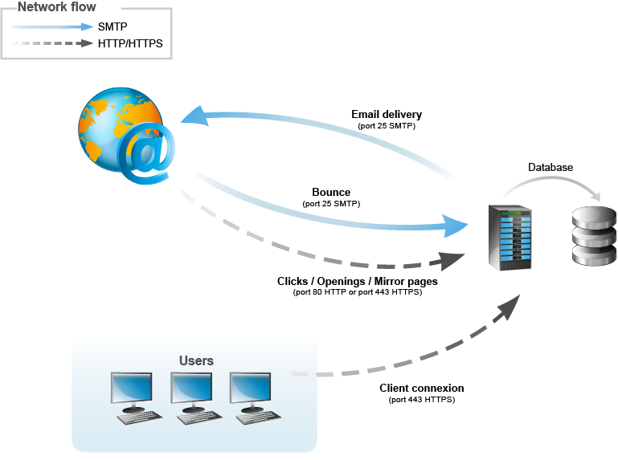
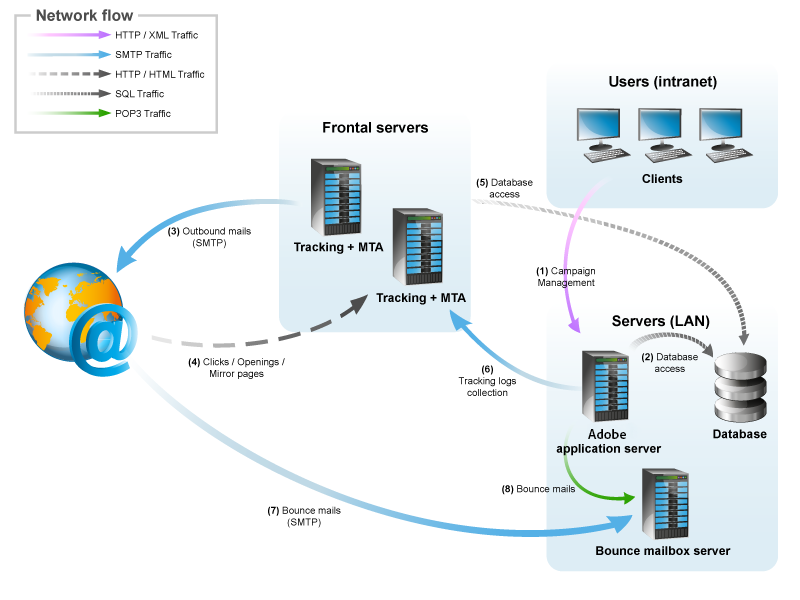

# Architettura generale{#general-architecture}

## Architettura minima {#minimum-architecture}

In una configurazione minima, Adobe Campaign funziona con:

* il server applicazioni Adobe Campaign,
* il database.

  

Questo diagramma mostra che l’unico traffico coinvolto nel contesto di un’architettura minima è:

1. traffico del protocollo HTTP verso il server Adobe Campaign via Internet,
1. Traffico del protocollo SMTP da e verso il server Adobe Campaign tramite Internet.

## Architettura distribuita {#distributed-architecture}

Adobe Campaign è costituito da più moduli che possono essere suddivisi su più computer. Questa modalità operativa presenta diversi vantaggi:

* bilanciamento del carico,
* impostazione della ridondanza del modulo,
* costruzione di un&#39;architettura suddivisa tra più fornitori di servizi (segmentazione dei servizi forniti).

La distribuzione dei moduli su più macchine offre una grande flessibilità di utilizzo e una migliore adattabilità.

>[!NOTE]
>
>Per ulteriori informazioni sulle varie architetture, consulta [questa sezione](../../installation/using/general-architecture.md).

## Elenco delle porte aperte {#list-of-open-ports}

| Numero di porta | Modulo o applicazione Adobe Campaign interessati | Configurabile |
|---|---|---|
| 443/tcp o 80/tcp | Server web (Apache/IIS) | SÌ |
| 6666/udp (locale) | Adobe Campaign: Syslogd | SÌ |
| 8005/tcp locale | Adobe Campaign: modulo web | SÌ |
| 8080/tcp | Adobe Campaign: modulo web (tomcat) | SÌ |
| 7777 | Server delle statistiche (server stat) | SÌ |
