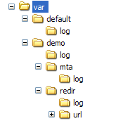

# File di registro{#log-files}

I file di registro sono organizzati come segue:

Ogni modulo **nlserver** genera un file di registro salvato nella seguente directory: **`<installation directory>`/var/`<instance>`/log/`<module>`.log**.

Il modulo **nlserver syslogd** salva i registri sul disco. Questo modulo è simile al daemon **syslog Unix**, ma è stato adattato per garantire la compatibilità tra Unix e Windows. Gli altri moduli Adobe Campaign non salvano i registri sul disco. L&#39;attività viene delegata al modulo **syslogd** inviando pacchetti UDP.

Per impostazione predefinita, nella piattaforma Adobe Campaign è installato il modulo **syslogd**, ma è possibile utilizzare un altro **syslog daemon**. Questo modulo crea i file di registro nella directory **log**.

I registri dei moduli a più istanze sono archiviati nella seguente directory: **`<installation directory>`/var/default/log/**. Lo stesso file di log è condiviso da tutte le istanze (ad esempio **web.log**).

I registri degli altri moduli vengono memorizzati in una sottocartella denominata in base all’istanza. Ogni istanza dispone di propri file di registro.

I file di registro a più istanze sono elencati nella tabella seguente:

| File | Descrizione |
|---|---|
| web.log | Registri dei moduli web (console client, rapporti, API SOAP, ecc.) |
| webmdl.log | Registri dal modulo di reindirizzamento |
| watchdog.log | Registri dal modulo di monitoraggio dei processi di Adobe Campaign |
| trackinglogd.log | Registri di tracciamento |

I file di registro mono-istanza sono elencati nella tabella seguente:

| File | Descrizione |
|---|---|
| mta.log | registri del modulo mta |
| mtachild.log | Registri di elaborazione della consegna dei messaggi |
| wfserver.log | Registri del modulo server del flusso di lavoro |
| runwf.log | Registri di esecuzione del flusso di lavoro |
| inMail.log | Registro moduli e-mail non recapitate |
| logins.log | Registra tutti i tentativi di accesso ad Adobe Campaign (riusciti o meno) |

>[!IMPORTANT]
>
>La directory **redir** esiste solo nei server di reindirizzamento. La sottodirectory **url** contiene le corrispondenze degli URL da reindirizzare e la sottodirectory **log** contiene i registri di tracciamento. Per generare i registri di tracciamento, il modulo **trackinglogd** deve essere in esecuzione.

Per ottimizzare le prestazioni e l&#39;archiviazione, il file logins.log viene suddiviso in più file, uno ogni giorno (logins.yy-mm-dd.log) con un massimo di 365 file conservati. Il numero di giorni può essere modificato in serverConf.xml, in syslogd (**maxNumberOfLoginsFiles** opzione). Consulta la documentazione sul [file di configurazione del server](../../installation/using/the-server-configuration-file.md#syslogd).

Per impostazione predefinita, i registri sono limitati a due file da 10 MB per modulo e per istanza. Il secondo file è denominato: **`<modulename>`_2.log**. La dimensione dei registri è quindi limitata a 2&#42;10 MB per modulo e per istanza.

È tuttavia possibile conservare file di dimensioni maggiori. Per abilitare questa impostazione, modificare il valore dell&#39;impostazione **maxFileSizeMb=&quot;10&quot;** nel nodo **syslogd** del file **conf/serverConf.xml**. Questo valore rappresenta la dimensione massima in MB di un file di registro.

Se desideri mantenere ulteriori livelli di dettaglio nei registri, puoi avviare i moduli Adobe Campaign con il parametro **-verbose**:

**nlserver start `<MODULE>`@`<INSTANCE>` -verbose**
