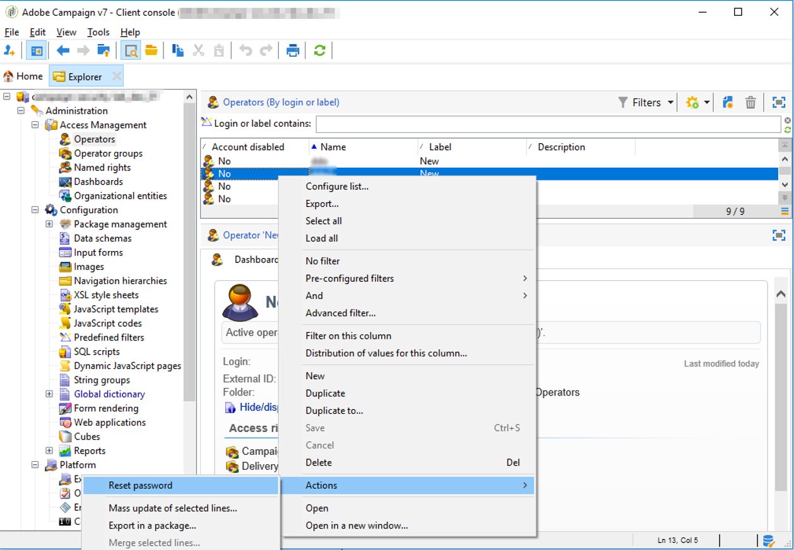

# Password persa{#lost-password}


È possibile modificare o recuperare una password persa.
Esistono due possibili scenari:

* [Password persa da un operatore Adobe Campaign](#password-lost-by-campaign-operator)
* [Password interna persa](#internal-password-lost) (solo clienti on-premise)

## Password persa da un operatore Campaign {#password-lost-by-campaign-operator}

Se un operatore Adobe Campaign perde la propria password, puoi modificarla.

>[!NOTE]
>
>Questa procedura si applica solo agli operatori che si connettono a Campaign con autenticazione nativa. Per l’autenticazione Adobe IMS, consulta [questa documentazione](https://helpx.adobe.com/ie/manage-account/using/change-or-reset-password.html){target="_blank"}.

Per reimpostare la password di una campagna, effettua le seguenti operazioni:

1. Connetti tramite un operatore con diritti di amministratore.
1. Fare clic con il pulsante destro del mouse su un operatore.
1. Seleziona **[!UICONTROL Actions]** > **[!UICONTROL Reset password]**.

   

1. Imposta la nuova password dell&#39;operatore. È consigliabile che l&#39;operatore modifichi la password alla prima riconnessione.

## Password interna persa {#internal-password-lost}

>[!NOTE]
>
>Questa sezione si applica solo ai clienti on-premise.

Se la password interna viene persa, è necessario reinizializzarla.

A tale scopo, attenersi alla procedura descritta di seguito.

1. Modifica il **/usr/local/neolane/nl6/conf/serverConf.xml** file.

1. Vai a **internalPassword** linea.

   ```xml
   <!-- XTK authentication mode internalPassword : Password of internal account -->
   <xtk internalPassword="myPassword"/>
   ```

1. Elimina la stringa tra virgolette, in questo caso: `myPassword`. Viene visualizzata la seguente riga:

   ```xml
   <!-- XTK authentication mode internalPassword : Password of internal account -->
   <xtk internalPassword=""/>
   ```

1. Salva le modifiche e chiudi il file.

1. Interrompi `nlserver` processo.

1. Configura la nuova password. A tale scopo, immetti i seguenti comandi:

   ```javascript
   nlserver config -internalpassword
   HH:MM:SS > Application server for Adobe Campaign Classic (7.X YY.R build XXX@SHA1) of DD/MM/YYYY
   Enter current password.
   Password: (empty)
   Enter the new password.
   Password: 
   Confirmation 
   ```

1. Avvia il `nlserver` processo.

1. Ora puoi usare la nuova password per connetterti a **Interno** modalità.
