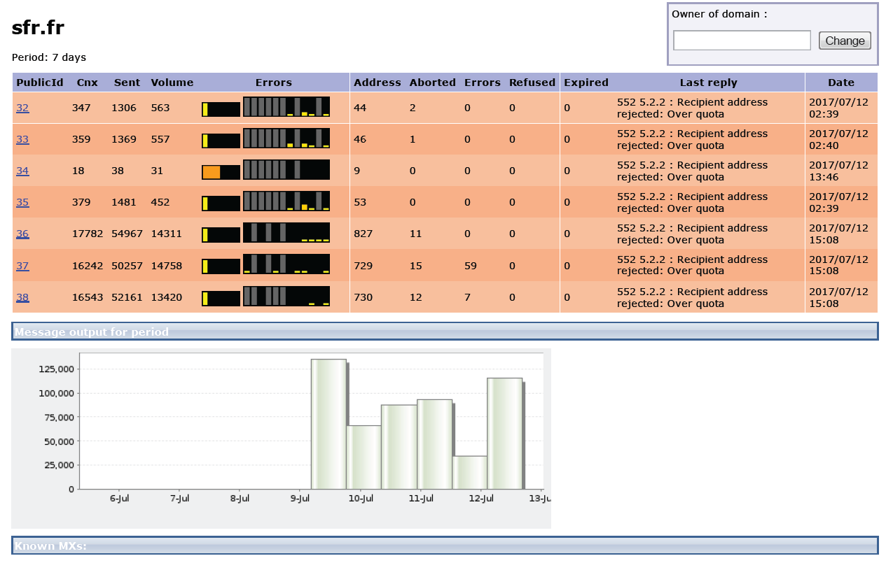

# Monitoraggio dei processi{#monitoring-processes}


Server applicazioni e server di reindirizzamento (**tracciamento**) può essere monitorata manualmente o automaticamente.

## Monitoraggio manuale {#manual-monitoring}

Per accedere alla pagina di monitoraggio dei processi di Adobe Campaign, passare alla **[!UICONTROL Monitoring]** e fare clic sul pulsante **[!UICONTROL Overview]** collegamento.


La pagina visualizzata consente di visualizzare lo stato dell’istanza connessa, ovvero:

* informazioni sull’istanza: versione, nome, motore di database, pacchetti installati, indicatori del sistema del server,
* l’elenco dei processi mancanti e delle informazioni di esecuzione (data di inizio, PID, ecc.),
* una visualizzazione dei flussi di lavoro e delle consegne.

Ulteriori modalità di monitoraggio dei processi di Campaign sono presentate in [questa pagina](../../production/using/monitoring-guidelines.md).

### Giornale di registrazione {#log-journal}

Per visualizzare il giornale di registrazione relativo a un processo, fare clic sul processo, **mta** ad esempio, quindi seleziona **[!UICONTROL Open the log journal]** .


### Indicatori di sistema {#system-indicators}

Selezionare l&#39;elenco degli indicatori di sistema per visualizzare le informazioni relative alla macchina, ad esempio la memoria fisica e virtuale, i processi attivi e lo spazio disponibile su disco. Gli indicatori sono diversi per i sistemi operativi Linux e Windows. Vai a **[!UICONTROL Instance Monitoring]** e fai clic su **[!UICONTROL Display]** per aprire l’elenco degli indicatori.

#### Windows {#in-windows}

* **[!UICONTROL Pending events queued]**: indicatore specifico di **Centro messaggi**. [Ulteriori informazioni](../../message-center/using/additional-configurations.md#monitoring-thresholds)

* **[!UICONTROL Memory]**: informazioni relative alla memoria fisica (RAM).

  **[!UICONTROL Current value]**: consumo di memoria corrente.

  **[!UICONTROL Max Value]**: quantità totale di memoria installata.

  **[!UICONTROL Available]**: memoria disponibile.

  **[!UICONTROL Warning]**: questo indicatore viene visualizzato quando il consumo di memoria raggiunge l’80% della quantità totale.

  **[!UICONTROL Alert]**: questo indicatore viene visualizzato quando il consumo di memoria raggiunge il 90% della quantità totale.

  Quando **[!UICONTROL Warning]** e **[!UICONTROL Alert]** vengono visualizzati gli indicatori, è possibile risolvere il problema aggiungendo RAM al computer in cui è installato il server Adobe Campaign. Puoi anche decidere di installare il server Adobe Campaign su un computer dedicato.

* **[!UICONTROL Swap Memory]**: informazioni relative alla memoria virtuale che corrisponde a un file di paging: un&#39;area del disco rigido utilizzata da Windows come se fosse RAM.

  **[!UICONTROL Current value]**: consumo effettivo di memoria.

  **[!UICONTROL Max Value]**: memoria totale.

  **[!UICONTROL Available]**: memoria disponibile.

  **[!UICONTROL Warning]**: questo indicatore viene visualizzato quando il consumo di memoria raggiunge l’80% della quantità totale.

  **[!UICONTROL Alert]**: questo indicatore viene visualizzato quando il consumo di memoria raggiunge il 90% della quantità totale.

  Quando **[!UICONTROL Warning]** e **[!UICONTROL Alert]** vengono visualizzati gli indicatori, è possibile risolvere il problema aumentando le dimensioni del file exchange nelle impostazioni avanzate di Windows.

* **[!UICONTROL Disk XXX]**: informazioni relative ai lettori di computer.

  **[!UICONTROL Current value]**: spazio su disco effettivamente utilizzato.

  **[!UICONTROL Max Value]**: capacità totale del disco.

  **[!UICONTROL Available]**: spazio su disco disponibile.

  **[!UICONTROL Used]**: percentuale del disco utilizzato.

  **[!UICONTROL Warning]**: questo indicatore viene visualizzato quando lo spazio disponibile su disco raggiunge l’80% della capacità totale.

  **[!UICONTROL Alert]**: questo indicatore viene visualizzato quando lo spazio disponibile su disco raggiunge il 90% della capacità totale.

* **[!UICONTROL Number of processes too old]**: informazioni relative ai processi di Adobe Campaign che sono stati attivi per più di un giorno.

  **[!UICONTROL Current value]**: numero di processi attualmente attivi.

  **[!UICONTROL Max Value]**: numero massimo di trattamenti autorizzati (1).

  **[!UICONTROL Alert]**: questo indicatore viene visualizzato se il numero di processi è uguale a 1.

  Quando **[!UICONTROL Alert]** viene visualizzato un indicatore, è possibile che il processo interessato sia bloccato dal motore di database SQL o che sia bloccato in un ciclo infinito. Il **watchdog** Il processo fornito da Adobe Campaign riavvia automaticamente tutti i processi ogni giorno e consente di risolvere questo problema. Tuttavia, puoi anche interrompere personalmente il processo in questione per forzare il riavvio.

#### Linux {#in-linux}


* **[!UICONTROL Pending events queued]**: indicatore specifico di **Centro messaggi**. Fai riferimento a [questa sezione](../../message-center/using/additional-configurations.md#monitoring-thresholds) per ulteriori informazioni.

* **[!UICONTROL Load average (1/5/15 minutes)]**: informazioni relative al carico, ovvero la velocità di utilizzo del processore da parte dei processi in esecuzione sul computer nell&#39;ultimo minuto, cinque minuti o quindici minuti

  **[!UICONTROL Current value]**: carico effettivo della macchina.

  **[!UICONTROL Max value]**: carico massimo di utilizzo dei processi nel computer

  **[!UICONTROL Warning]**: questo indicatore viene visualizzato quando il carico raggiunge l’80% del valore massimo autorizzato nell’ultimo minuto, cinque minuti o quindici minuti.

  **[!UICONTROL Alert]**: questo indicatore viene visualizzato quando il carico raggiunge il 90% del valore massimo autorizzato dell’ultimo minuto, cinque minuti o quindici minuti.

* **[!UICONTROL Memory]**  informazioni relative alla memoria fisica (RAM).

  **[!UICONTROL Current value]**: consumo effettivo di memoria.

  **[!UICONTROL Max Value]**: quantità totale di memoria installata.

  **[!UICONTROL Available]**: memoria disponibile.

  **[!UICONTROL Warning]**: questo indicatore viene visualizzato quando il consumo di memoria raggiunge l’80% della quantità totale.

  **[!UICONTROL Alert]**: questo indicatore viene visualizzato quando il consumo di memoria raggiunge il 90% della quantità totale.

  Quando **[!UICONTROL Warning]** e **[!UICONTROL Alert]** vengono visualizzati gli indicatori, è possibile risolvere il problema aggiungendo RAM al computer in cui è installato il server Adobe Campaign. Puoi anche decidere di installare il server Adobe Campaign su un computer dedicato.

* **[!UICONTROL Swap Memory]**: informazioni relative alla memoria virtuale che corrisponde a un file di paging: un&#39;area del disco rigido utilizzata da Windows come se fosse RAM.

  **[!UICONTROL Current value]**: consumo effettivo di memoria.

  **[!UICONTROL Max Value]**: memoria totale.

  **[!UICONTROL Available]**: memoria disponibile.

  **[!UICONTROL Warning]**: questo indicatore viene visualizzato quando il consumo di memoria raggiunge l’80% della quantità totale.

  **[!UICONTROL Alert]**: questo indicatore viene visualizzato quando il consumo di memoria raggiunge il 90% della quantità totale.

  Quando **[!UICONTROL Warning]** e **[!UICONTROL Alert]** vengono visualizzati gli indicatori, è possibile risolvere il problema aumentando le dimensioni del file exchange.

* **[!UICONTROL Core Files]**: informazioni relative ai file generati in seguito all’arresto anomalo di un processo Adobe Campaign. Questi file consentono di diagnosticare i motivi dell&#39;arresto anomalo.

  **[!UICONTROL Current Value]**: numero di file esistenti.

  **[!UICONTROL Max Value]**: numero massimo di file autorizzati (1).

  **[!UICONTROL Warning]**: questo indicatore viene visualizzato quando il numero di file si avvicina a 1.

  **[!UICONTROL Alert]**: questo indicatore viene visualizzato quando il numero di file è uguale a 1.

  Quando un processo non è presente a causa di un arresto anomalo, viene visualizzato in rosso nell’elenco dei processi e viene riavviato automaticamente da **watchdog** processo fornito da Adobe Campaign.

* **[!UICONTROL Number of shared memory segments]**: informazioni relative ai segmenti di memoria condivisi da tutti i processi di Adobe Campaign.

  **[!UICONTROL Current value]**: numero di segmenti di memoria attualmente in uso.

  **[!UICONTROL Max Value]**: numero massimo di segmenti di memoria autorizzati (2).

  **[!UICONTROL Warning]**: questo indicatore viene visualizzato quando il numero di segmenti di memoria raggiunge 1.

  **[!UICONTROL Alert]**: questo indicatore viene visualizzato quando il numero di segmenti di memoria raggiunge 2.

* **[!UICONTROL Number of processes too old]**: informazioni relative ai processi che sono stati attivi per più di un giorno.

  **[!UICONTROL Current value]**: numero di processi attualmente attivi.

  **[!UICONTROL Max Value]**: numero massimo di processi autorizzati.

  **[!UICONTROL Warning]**: questo indicatore viene visualizzato quando il numero di processi raggiunge l’80% della soglia autorizzata.

  **[!UICONTROL Alert]**: questo indicatore viene visualizzato quando il numero di processi raggiunge il 90% della soglia autorizzata.

* **[!UICONTROL File Handles]**: informazioni relative ai descrittori dei file, ovvero il numero di file aperti per processo.

  **[!UICONTROL Current value]**: numero corrente di descrittori di file.

  **[!UICONTROL Max Value]**: numero massimo di descrittori di file autorizzati dal sistema operativo.

  **[!UICONTROL Warning]**: questo indicatore viene visualizzato quando il numero di descrittori di file autorizzati raggiunge la soglia dell’80%.

  **[!UICONTROL Alert]**: questo indicatore viene visualizzato quando il numero di descrittori di file autorizzati raggiunge la soglia del 90%.

* **[!UICONTROL Processes]**: informazioni relative ai processi meccanici.

  **[!UICONTROL Current value]**: numero di processi attualmente attivi.

  **[!UICONTROL Max Value]**: numero massimo di processi autorizzati.

  **[!UICONTROL Active Processes]**: numero di processi attivi.

  **[!UICONTROL Inactive Processes]**: numero di processi inattivi.

  **[!UICONTROL Warning]**: questo indicatore viene visualizzato quando il numero di processi autorizzati raggiunge la soglia dell’80%.

  **[!UICONTROL Alert]**: questo indicatore viene visualizzato quando il numero di processi autorizzati raggiunge la soglia del 90%.

* **[!UICONTROL Zombie Processes]**: informazioni relative ai processi interrotti ma con un identificatore di processo (PID) che rimangono visibili nella tabella del processo.

  **[!UICONTROL Current value]**: numero di processi zombie attualmente attivi.

  **[!UICONTROL Max Value]**: numero massimo di processi zombie autorizzati (2).

  **[!UICONTROL Warning]**: questo indicatore viene visualizzato quando il numero di processi zombie si avvicina a 2.

  **[!UICONTROL Alert]**: questo indicatore viene visualizzato quando il numero di processi zombie raggiunge 2.

#### Personalizzare gli indicatori {#customized-indicators}

Adobe Campaign consente di personalizzare gli indicatori, come descritto di seguito:

1. Creare un **sh** file e denominarlo **[!UICONTROL cust_indicators.sh]** .
1. Aggiungi gli indicatori personalizzati a questo file. Ad esempio:

   ```
   #!/bin/bash 
   echo "<indicator name='Zombie Processes'>  
   <current label='Current Value' value='0' display=''/>  
   <warning value='2'/>  <alert value='2'/>  
   <max label='Max Value' value='2'/>
   </indicator>"
   ```

   o

   ```
   #!/bin/bash 
   echo "<indicator name='Availability'>  
   <current label='Last update of data' display='2012-09-03 10:00'/>  
   <current label='Availability last month' display='100.00%'/>  
   <current label='Availability this month' display='100.00%'/> 
   <current label='Recent downtime periods' display='2012-07-04 11:10:00 - 11:19:59'/>
   </indicator>"
   ```

1. Salva il file in **[!UICONTROL usr/local/neolane/nl6]** cartella.

Questo file viene richiamato da Adobe Campaign.

## Rapporti SMTP {#smtp-reports}

I rapporti di monitoraggio della consegna SMTP sono integrati nella piattaforma Adobe Campaign. È possibile accedervi tramite la console o utilizzando l’accesso web.

Questi rapporti visualizzano le statistiche di consegna SMTP e gli errori SMTP per dominio. Per accedervi, l’operatore deve disporre di **Amministrazione** diritti.

Sono raggruppati in **Monitorare** > &#39;Monitoraggio SMTP&#39;.


>[!IMPORTANT]
>
>* Le informazioni relative al monitoraggio SMTP sono disponibili solo se il canale e-mail è stato attivato.
>* Il **[!UICONTROL SMTP sending statistics]** sono disponibili solo se il server di statistiche è avviato sull’istanza.
>

### Statistiche di invio SMTP {#smtp-sending-statistics}

Il **[!UICONTROL SMTP sending statistics]** consente di controllare l&#39;attività del server. Visualizza una sintesi di ciascuno dei metafiltri.


L’elenco degli indicatori per questo rapporto è riportato sotto il grafico.

1. Numero totale di messaggi inviati.
1. Rappresenta i messaggi in/out:

   * Linea blu: messaggi pronti per l’invio arrivati nello shaper, ovvero l’ultima fase prima dell’invio di SMTP (coincide con i dati in arrivo).

   * Linea verde: messaggi inviati correttamente (coincide con i dati in uscita).

   * Linea rossa: messaggi abbandonati da Shaper, restituiti al **mta** (coincide con i dati rifiutati durante il ripristino).

   Questi valori sono espressi in numero di messaggi all’ora.

1. Rappresenta due code dello shaper:

   * Curva blu: coda di messaggi attivi. Questi messaggi saranno inviati il prima possibile.

   * Curva di Kaki: la coda &#39;differita&#39;. Questi messaggi non possono essere restituiti per il momento a causa di limitazioni o perché non è disponibile alcuna connessione alla destinazione. I tentativi avranno luogo ogni 5, 10, 20, 40, 2 min, ecc. per il **MaxAgeSec** prima di essere abbandonati.

1. Questo grafico mostra un dettaglio dei messaggi abbandonati (curva rossa nel secondo grafico): mostra la proporzione di messaggi abbandonati senza nuovi tentativi (malva) rispetto ai messaggi con invio non riuscito (rossa). Questo consente di visualizzare la proporzione di messaggi non elaborati entro il periodo concesso a causa di limitazioni del server di statistiche (limitazione) o a causa dell’indisponibilità del server remoto.
1. Le connessioni SMTP si aprono o vengono aperte.
1. Stima del numero di **mtachild**.

>[!NOTE]
>
>Questo report è correlato allo stato del componente Traffic Shaper e-mail.

### Errori SMTP per dominio {#smtp-errors-per-domain}

Questo rapporto ti consente di visualizzare gli errori di consegna, in un periodo impostato, suddivisi per dominio.

>[!NOTE]
>
>Il **minConnectionsToLog**, **minErrorsToLog** e **minMessagesToLog** opzioni di **serverConf.xml** definiscono le soglie oltre le quali vengono prese in considerazione le statistiche di connessione.


L’elenco degli indicatori per questa relazione è riportato sotto la tabella.

* Il **Dominio** contiene il nome del dominio a cui vengono inviati i messaggi (o il nome di dominio reale, ad esempio yahoo.com per yahoo.fr),
* Il **Cnx** nella colonna viene visualizzato il numero di connessioni SMTP aperte per questo dominio.
* Il **Inviato** corrisponde al numero di messaggi inviati a questo dominio,
* Il **Volume** in questa colonna viene visualizzato il volume di messaggi che sono stati tentati di inviare a questo dominio (valore approssimativo),
* Il **Errori** visualizza un indicatore del volume degli errori in questo dominio nel periodo,
* Il **Ultima risposta** nella colonna viene visualizzato l&#39;ultimo messaggio di risposta SMTP ricevuto per questo dominio,
* Il **Data** In questa colonna viene visualizzata la data dell&#39;ultima risposta SMTP ricevuta per questo dominio.

>[!NOTE]
>
>I valori visualizzati nel **Cnx**, **Inviato**, e **Volume** vengono calcolate rispetto al periodo selezionato nella sezione **[!UICONTROL Period]** campo.

Fai clic su un nome di dominio per visualizzarne gli errori.

Sono categorizzati in base al PublicId: questo identificatore corrisponde a un indirizzo IP condiviso da diversi mta di Adobe Campaign dietro un router. Il server delle statistiche utilizza questo identificatore per memorizzare le statistiche di connessione e consegna tra questo punto iniziale e il server di destinazione.



Il **[!UICONTROL Owner of domain]** consente di raggruppare diversi nomi di dominio sotto la stessa etichetta. Nella visualizzazione del rapporto iniziale, tutti i nomi di dominio MX saranno associati a questo proprietario.

Fai clic su un identificatore PublicId per visualizzare ulteriori dettagli.


>[!NOTE]
>
>La percentuale di errori è rappresentata da due grafici. La prima è una barra di avanzamento orizzontale su sfondo nero. Il secondo grafico è cronologico. Il periodo selezionato è diviso in dodici intervalli di tempo, ciascuno rappresentato da una barra di avanzamento verticale. In entrambe le rappresentazioni, se non è stato rilevato alcun errore, la barra è nera. Il colore della barra dipende dalla percentuale di errori riscontrati (giallo, arancione e infine rosso). Il colore grigio indica che non è stato trovato alcun volume di dati significativo. È possibile visualizzare la percentuale esatta di errori posizionando il cursore sul grafico.

>[!NOTE]
>
>Per ulteriori informazioni sugli errori SMTP e sulla loro gestione in Adobe Campaign, consulta [questa sezione](../../installation/using/email-deliverability.md).

## Rapporto di fatturazione {#billing-report}

Il **[!UICONTROL Billing]** il flusso di lavoro tecnico invia il rapporto sull’attività del sistema all’operatore di &quot;fatturazione&quot; tramite e-mail. Viene attivato per impostazione predefinita il 25 di ogni mese sull’istanza Marketing.

Il flusso di lavoro tecnico si trova in una sottocartella del seguente nodo: **Amministrazione** > **Produzione** > **Flussi di lavoro tecnici**.


Una volta avviato il flusso di lavoro ogni 25 del mese, l’operatore di fatturazione riceverà il seguente rapporto nella propria casella in entrata.


Per tenere traccia delle consegne sono disponibili le metriche seguenti:

* **[!UICONTROL Start date]** : data di inizio della consegna. Tieni presente che può essere precedente alla data &quot;da&quot; del rapporto.
* **[!UICONTROL Label]** : etichetta della consegna. Le consegne con meno di 100 messaggi da inviare sono considerate troppo piccole e quindi aggregate per data di inizio, nel qual caso l’etichetta mostra il numero di aggregati, ad esempio [Aggregazione di 3 piccole consegne].
* **[!UICONTROL Total volume]** : volume totale di byte trasferiti per la consegna.
* **[!UICONTROL Avg volume]** : volume medio di byte trasferiti. Questo è il risultato della seguente formula **(volume totale/messaggi)**, che è la base di calcolo del **[!UICONTROL Multiplier]** metrica.
* **[!UICONTROL Messages]** : numero di messaggi inviati. Ciò include sia i messaggi inviati correttamente sia i tentativi (in seguito alla ricezione di un messaggio di mancato recapito dal server contattato).
* **[!UICONTROL Multiplier (x)]** : il valore del moltiplicatore viene dedotto dal volume medio dei messaggi.
* **[!UICONTROL Count]** : risultato della moltiplicazione dei messaggi e del moltiplicatore.

## Monitoraggio automatico {#automatic-monitoring}

Adobe Campaign offre diversi metodi di monitoraggio automatico, descritti di seguito.

### Riga di comando {#command-line}

Comando

**monitor nlserver**

Consente di elencare una serie di indicatori sui moduli Adobe Campaign e sul sistema.

Genera output in un formato XML facilmente elaborato.

Questo comando può essere eseguito anche con **-mancante** , che elenca i processi mancanti in questa istanza quando i file di configurazione dicono che devono essere in esecuzione.

```
nlserver monitor -missing
HH:MM:SS > Application server for Adobe Campaign Classic (7.X YY.R build XXX@SHA1) of DD/MM/YYYY
mta@prod
stat@prod
wfserver@prod
```

### Informazioni pubblicate dal server {#information-published-by-the-server}

#### /r/test {#r-test}

Il **http(s)://`<application>`/r/test** viene utilizzata per testare il server di reindirizzamento. È consigliabile utilizzare questo stesso metodo per testare i server frontali utilizzati per il tracciamento. Questa pagina può essere utilizzata anche per testare un dispatcher di carico.

Visualizza una riga come questa in formato XML:

```
<redir status='OK' date='YYYY-MM-DD HH:MM:SS.112Z' build='XXXX' host='<hostname>' localHost='<servername>'/>
```

**Frequenza**: questo test non utilizza alcun carico, e può essere eseguito molto spesso (ad esempio una volta al secondo).

#### /nl/jsp/ping.jsp {#nl-jsp-ping-jsp}

Questo **http(s)://`<Application server url>`/nl/jsp/ping.jsp**  La pagina funziona come la sua controparte di rete: verifica una query completa che attraversa apache/tomcat/modulo web/database e viene caricata sul client. Se tutto funziona correttamente, restituisce un &quot;OK&quot;. È consigliabile eseguire questo test su computer con accesso ai database (ad esempio, mta e sondaggi).

**Utilizzo**: per accedere in modalità remota, è necessario passare un token di sessione associato a un accesso dell’operatore come argomento (vedi il suggerimento in [Monitoraggio automatico tramite script di Adobe Campaign](#automatic-monitoring-via-adobe-campaign-scripts)).

Ad esempio:


Il nome dell’operatore e l’accesso devono essere configurati in precedenza nella console client di Adobe Campaign con i diritti del database.


**Frequenza**: questo è un test che utilizza una larghezza di banda molto ridotta. Può quindi essere eseguito abbastanza spesso, anche se non più di una volta al minuto.

#### /nl/jsp/monitor.jsp {#nl-jsp-monitor-jsp}

Questo è un test per verificare che un operatore possa accedere al server Adobe Campaign tramite una pagina web; la stessa pagina web a cui si accede tramite i menu della console client. Puoi richiamare questa pagina dai tuoi strumenti di sorveglianza (Tivoli, Nagios, ecc.).


**Utilizzo**: è necessario utilizzare come argomento un token di sessione associato a un accesso operatore che consente di connettersi all’istanza (vedi il suggerimento in [Monitoraggio automatico tramite script di Adobe Campaign](#automatic-monitoring-via-adobe-campaign-scripts)).

L’operatore e il relativo accesso devono essere configurati in precedenza nella console client di Adobe Campaign con i diritti e le restrizioni del database appropriati.

**Frequenza**: si tratta di un test server completo che non deve essere eseguito spesso (ad esempio, una volta ogni dieci minuti).

#### /nl/jsp/soaprouter.jsp {#nl-jsp-soaprouter-jsp}

Questo **jsp** rappresenta il punto di ingresso delle API dell’applicazione Adobe Campaign. Essa può pertanto fornire un monitoraggio dettagliato della domanda. Può essere utilizzato anche per monitorare i servizi web di Adobe Campaign. Viene utilizzato nei nostri script di monitoraggio, ma tieni presente che è solo per gli utenti esperti.

### Monitoraggio basato sui tipi di distribuzione {#monitoring-based-on-deployment-types}

Adobe Campaign abilita diverse configurazioni di distribuzione (per ulteriori informazioni, consulta [questa sezione](../../installation/using/hosting-models.md)). Questa sezione descrive le varie tecniche di monitoraggio automatico da applicare a seconda del tipo di installazione.

<table> 
 <thead> 
  <tr> 
   <th> Tipo di distribuzione </th> 
   <th> Monitoraggio </th> 
  </tr> 
 </thead> 
 <tbody> 
  <tr> 
   <td> Autonomo </td> 
   <td> 
    <ul> 
     <li><p> <span class="uicontrol">/r/test</span> e <span class="uicontrol">/nl/jsp/monitor.jsp</span> sul server Adobe Campaign</p> </li> 
    </ul> </td> 
  </tr> 
  <tr> 
   <td> Standard </td> 
   <td> 
    <ul> 
     <li><p> <span class="uicontrol">/r/test</span> e <span class="uicontrol">/nl/jsp/ping.jsp</span> sui server frontali</p> </li> 
     <li><p> <span class="uicontrol">/nl/jsp/monitor.jsp</span> sul server applicazioni</p> </li> 
    </ul> </td> 
  </tr> 
  <tr> 
   <td> Enterprise </td> 
   <td> 
    <ul> 
     <li><p> <span class="uicontrol">/r/test</span> e <span class="uicontrol">/nl/jsp/ping.jsp</span> sui server frontali</p> </li> 
     <li><p> <span class="uicontrol">/r/test</span> e <span class="uicontrol">/nl/jsp/monitor.jsp</span> sul server applicazioni</p> </li> 
    </ul> </td> 
  </tr> 
  <tr> 
   <td> Mid-sourcing </td> 
   <td> 
    <ul> 
     <li><p> <span class="uicontrol">/nl/jsp/monitor.jsp</span> sul server applicazioni</p> </li> 
    </ul> </td> 
  </tr> 
 </tbody> 
</table>

## Monitoraggio automatico tramite script di Adobe Campaign {#automatic-monitoring-via-adobe-campaign-scripts}

Adobe Campaign può fornire uno strumento di monitoraggio delle istanze (netreport) che consente di inviare un rapporto via e-mail relativo alle anomalie rilevate.


>[!IMPORTANT]
>
>Questo strumento può essere utilizzato per monitorare le istanze, ma non è supportato da Adobe Campaign. Per ulteriori informazioni, contatta l’amministratore di Campaign.

### Elementi richiesti {#required-elements}

Per il monitoraggio automatico sono necessarie le seguenti precauzioni di preinstallazione:

* È necessario disporre di **netreport.tgz** (installazione Linux) o **netreport.zip** (Installazione di Windows) file,
* Consigliamo vivamente di non installare il monitoraggio sul computer da monitorare,
* deve essere installato su un computer con JRE o JDK,
* in Linux, il computer da monitorare deve avere **bc** pacchetto. Per ulteriori informazioni al riguardo, consulta [questa sezione](../../installation/using/installing-packages-with-linux.md#distribution-based-on-rpm--packages).

### Procedura di installazione {#installation-procedure}

La procedura di installazione è la seguente:

1. Nella console, crea un nuovo operatore, se necessario (l’utente &quot;di monitoraggio&quot; esiste già), ma non assegna diritti.
1. Esegui estrazione archivio.
1. Leggi le **leggimi** file.
1. Aggiornare il **netconf.xml** file di configurazione.
1. Aggiornare il **netreport.bat** (Windows) o **netreport.sh** (Linux).

### Configurazione del file netconf.xml {#configuring-the-netconf-xml-file}

Il file di configurazione XML contiene i seguenti elementi:

* [Elemento &quot;Properties&quot;](#properties--element)
* [Elemento &#39;Instance&#39;](#instance--element)
* [Elemento &quot;Host&quot;](#host--element)
* [Sottoelementi](#sub-elements)

Di seguito è riportato un esempio di configurazione:

```
<?xml version="1.0" encoding="ISO-8859-1"?>
<netconf>
  <properties mailServer="mail.adobe.net" mailFrom="mail@adobe.com" recipientList="recipient@adobe.com">
    <nightMode start="00:00 am" end="07:00 am"/>
    <buildRange minimum="7829" maximum="8180"/>
    <buildRange minimum="8300" maximum="8400"/>
    <sla/>
  </properties>

  <instance name="dev" recipientList="mail@mail.com,mail2@mail.com">
                <host name="devrd.domain.com" alias="devrd" sessiontoken="monitoring" criticalLevel="1" filter="wkf;new">
                                <ncs instance="devrd" url="/nl/jsp/soaprouter.jsp" includeDead="false" isSecure="false"/>
                                <redir url="/r/test"/>
                                <http url="/nl/jsp/ping.jsp"/>
                </host>
                <host name="devtrk.domain.com" alias="devtrk" sessiontoken="monitoring" criticalLevel="0" filter="wkf;new">
                                <ncs instance="devrd" url="/nl/jsp/soaprouter.jsp" includeDead="true" isSecure="false"/>
                </host>
  </instance>
  <host name="dev-test" alias="dev-test" sessiontoken="monitoring" criticalLevel="2">
                <ncs instance="dev" url="/nl/jsp/soaprouter.jsp" includeDead="false"/>
  </host>
</netconf>
```

>[!NOTE]
>
>Puoi specificare diverse configurazioni aggiungendo un suffisso al file **netconf.xml** ad esempio, **netconf-dev.xml**, **netconf-prod.xml**, ecc. Quindi specifica la configurazione da utilizzare per l’esecuzione del netreport in **netreport.bat** o **netreport.sh** file tramite aggiunta **Dev netreport $JAVA_HOME/bin/java** o **@%JAVA_HOME%binjava netreport prod** ad esempio.

>[!IMPORTANT]
>
>Per **monitoraggio** per il funzionamento dell&#39;operatore, il computer su cui viene eseguito il report di rete deve trovarsi in un&#39;area di sicurezza **sessionTokenOnly** modalità. Se per questo operatore non è stata specificata alcuna maschera IP attendibile, anche l’area di sicurezza deve trovarsi in **allowEmptyPassword** e **allowUserPassword** modalità.

#### Elemento &quot;Properties&quot; {#properties--element}

Questo elemento viene utilizzato per popolare la configurazione delle e-mail, ad esempio

* **mailServer**: server SMTP utilizzato per inviare le e-mail (esempio: smtp.domain.net).
* **mailFrom**: indirizzo e-mail del mittente del rapporto (esempio: monitoring@domain.net).
* **recipientList**: elenco di indirizzi e-mail dei destinatari di monitoraggio. Gli indirizzi devono essere separati da virgole (senza spazi).
* &#39;**notte** La modalità &#39; (facoltativa) viene utilizzata per evitare l’invio di e-mail tra il periodo di tempo specificato. Al contrario, i dati vengono consolidati e un’e-mail riguardante l’attività della notte viene inviata dopo l’ora di fine (7:00 per impostazione predefinita).
* Il **buildRange** sottoelemento (facoltativo) consente di specificare un numero di build minimo e massimo. Verrà generato un errore per tutti i computer il cui numero di build non rientra in questo intervallo

  ```
  <buildRange minimum="0000" maximum="9999"/>
  ```

* È possibile aggiungere una **`<sla>`** (facoltativo) sottoelemento nella sezione **proprietà** elemento. A ogni esecuzione del netreport verrà generato un file di log. Il nome del file contiene il nome della configurazione e la data e l’ora, ad esempio **dev_06_12_13_16_47_05,tmp**. Il file contiene le seguenti informazioni: nome dell’istanza, nome del computer, livello di gravità, (da 0 a 3, da meno critico a più critico), data (formato marca temporale), tempo trascorso (in millisecondi) tra la query e la risposta, servizio utilizzato (http, ncs, ncsex, redir). Queste informazioni sono separate da segni di tabulazione e interruzioni di riga alla fine di ciascun servizio.

>[!NOTE]
>
>Il **persistHtmlFile** con il valore &quot;true&quot; sul **`<property>`** per registrare lo stato di monitoraggio più recente nel file **netreport.md**. Il file viene salvato nella directory di installazione.

#### Elemento &#39;Instance&#39; {#instance--element}

Questo elemento consente di raggruppare più computer (host) nella stessa istanza. I nomi delle istanze vengono visualizzati nella prima parte del messaggio e-mail di monitoraggio. Puoi fare clic sul nome di un’istanza per accedere ai dettagli relativi a ciascun computer.

```
instance name="instance-name" recipientList="mail@mail.com,mail2@mail.com">
                <host name="devcamp.domain.com" ...>
                       ...
                </host>
                <host name="devtrack.domain.com" ...>
                       ...
                </host>
</instance
```

* **nome**: nome dell’istanza che verrà visualizzato nella prima parte dell’e-mail.
* **recipientList** (facoltativo): ti consente di inviare per e-mail un rapporto di monitoraggio relativo a una particolare istanza.

#### Elemento &quot;Host&quot; {#host--element}

Questo elemento configura il monitoraggio di un dato server sull’host, ovvero

* **nome**: nome del computer da monitorare.
* **alias** (facoltativo): nome della macchina monitorata che verrà visualizzato nel rapporto.
* **sessionToken**: fornisce l’autenticazione di accesso tramite un token di sessione autorizzato.

  Per configurare il token di sessione, seleziona la **monitoraggio** nella console Adobe Campaign. In **Diritti di accesso** , specificare gli indirizzi IP dei computer autorizzati a monitorare questa istanza. Sarà quindi possibile connettersi alla pagina di monitoraggio da tali computer utilizzando **monitoraggio** e senza dover specificare una password.

  

* **criticalLevel** (facoltativo): consente di ordinare gli errori in modo che vengano visualizzati in base al livello di gravità. I valori possibili sono &#39;0&#39; (tutti i livelli visualizzati), &#39;1&#39; (solo gli errori alti e critici visualizzati) e &#39;2&#39; (solo gli errori critici visualizzati). Se questo attributo non viene fornito, vengono visualizzati tutti i livelli di errore.
* **filter** (facoltativo): consente di escludere determinati errori del flusso di lavoro, ad esempio **filter=&quot;wkf;wkf1&quot;**. Le etichette del flusso di lavoro devono essere separate da un punto e virgola.

#### Sottoelementi {#sub-elements}

* **tcp**: controlla se il server è attivo o inattivo. Immettere un numero di porta.
* **http**: verifica che il server Web esista (il server applicazioni è operativo).
* **ncs**: controlla i processi nell’istanza inserita nell’attributo &quot;instance&quot; (errori del flusso di lavoro, utilizzo della memoria, ecc.). Il **incluso** (obbligatorio) consente di visualizzare i processi inattivi (valori &quot;true&quot; o &quot;false&quot;).
* **redir**: controlla il tracciamento.

Nella maggior parte dei casi, solo il **ncs** e **redir** i sottoelementi possono essere conservati.

In ogni caso, alcuni nodi possono essere sovraccaricati nei sottoelementi (ad esempio, il nodo **port=75** per sovraccaricare la porta utilizzata per la connessione http, ncs o redir:

```
<ncs instance="clap40" url="/nl/jsp/soaprouter.jsp" includeDead="false" port="80"/>
```

In **ncs**, **redir** e **http** elementi secondari, puoi aggiungere **isSecure** (facoltativo) per scegliere se utilizzare o meno il protocollo https (valori &quot;true&quot; o &quot;false&quot;). Se questo attributo non viene fornito, viene utilizzato il protocollo http.

### Configurazione del file netreport.bat o netreport.sh {#configuring-the-netreport-bat-or-netreport-sh--file}

Per configurarlo, modifica questo file e indica in quale directory è installato JRE o JDK.

### Avvio del monitoraggio {#launching-monitoring}

Per avviare il monitoraggio, esegui **netreport.bat** o **netreport.sh** file a intervalli regolari tramite uno script. Un rapporto viene inviato dopo la prima esecuzione e quindi solo in caso di cambiamento di stato.

### Verifica del monitoraggio {#testing-monitoring}

Per verificare il monitoraggio, esegui il comando **netreport.bat** o **netreport.sh** file.

Viene inviata un’e-mail ai destinatari specificati in **recipientList** del **netconf.xml** file.
