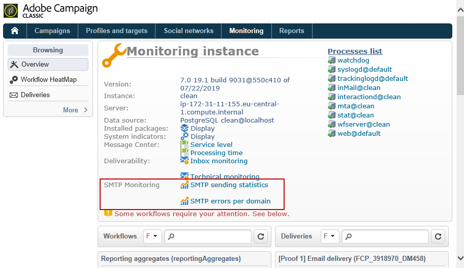

# Monitoraggio dei processi{#monitoring-processes}

Il server delle applicazioni e il server di reindirizzamento (**tracking**) possono essere monitorati manualmente o automaticamente.

## Monitoraggio manuale {#manual-monitoring}

Vai a **[!UICONTROL Monitoring]** e fai clic sul **[!UICONTROL Overview]** collegamento per visualizzare la pagina di monitoraggio del processo Adobe Campaign .


La pagina visualizzata consente di visualizzare lo stato dell’istanza connessa, ovvero:

* informazioni sull’istanza: versione, nome, motore di database, pacchetti installati, indicatori del sistema del server,
* l&#39;elenco dei processi mancanti e delle informazioni di esecuzione (data di inizio, PID, ecc.),
* una visualizzazione dei flussi di lavoro e delle consegne.

In [questa pagina](../../production/using/monitoring-guidelines.md)sono disponibili altri metodi per monitorare i diversi processi di Campaign.

### Giornale di registrazione {#log-journal}

È possibile visualizzare il giornale di registrazione del registro relativo a un processo. Per eseguire questa operazione, fare clic sul processo, **ad esempio** , quindi fare clic su **[!UICONTROL Open the log journal]** .


### Indicatori di sistema {#system-indicators}

L&#39;elenco degli indicatori di sistema consente di visualizzare informazioni relative alla macchina, come la sua memoria fisica e virtuale, i processi attivi e lo spazio disponibile su disco. Gli indicatori sono diversi per i sistemi operativi Linux e Windows. Vai alla **[!UICONTROL Instance Monitoring]** pagina e fai clic sul **[!UICONTROL Display]** collegamento per aprire l’elenco degli indicatori

#### Windows {#in-windows}

* **[!UICONTROL Pending events queued]** : indicatore specifico di **Centro** messaggi. Per ulteriori informazioni, consulta [questa sezione](../../message-center/using/monitoring-thresholds.md) .
* **[!UICONTROL Memory]** : informazioni relative alla memoria fisica (RAM).

   **[!UICONTROL Current value]** : consumo effettivo di memoria.

   **[!UICONTROL Max Value]** : quantità totale di memoria installata.

   **[!UICONTROL Available]** : quantità di memoria disponibile.

   **[!UICONTROL Warning]** : questo indicatore viene visualizzato quando il consumo di memoria raggiunge l&#39;80% della quantità totale.

   **[!UICONTROL Alert]** : questo indicatore viene visualizzato quando il consumo di memoria raggiunge il 90% della quantità totale.

   Quando **[!UICONTROL Warning]** e gli **[!UICONTROL Alert]** indicatori sono visualizzati, è possibile risolvere il problema aggiungendo RAM al computer in cui è installato il server Adobe Campaign . Potete anche decidere di installare il server Adobe Campaign  su un computer dedicato.

* **[!UICONTROL Swap Memory]** : informazioni relative alla memoria virtuale che corrisponde a un file di paging: un&#39;area sul disco rigido che Windows utilizza come se fosse RAM.

   **[!UICONTROL Current value]** : consumo effettivo di memoria.

   **[!UICONTROL Max Value]** : quantità totale di memoria.

   **[!UICONTROL Available]** : quantità di memoria disponibile.

   **[!UICONTROL Warning]** : questo indicatore viene visualizzato quando il consumo di memoria raggiunge l&#39;80% della quantità totale.

   **[!UICONTROL Alert]** : questo indicatore viene visualizzato quando il consumo di memoria raggiunge il 90% della quantità totale.

   Quando **[!UICONTROL Warning]** e gli **[!UICONTROL Alert]** indicatori sono visualizzati, è possibile risolvere il problema aumentando la dimensione del file di scambio nelle impostazioni avanzate di Windows.

* **[!UICONTROL Disk XXX]** : informazioni relative ai lettori di macchina.

   **[!UICONTROL Current value]** : spazio su disco effettivamente utilizzato.

   **[!UICONTROL Max Value]** : capacità totale del disco.

   **[!UICONTROL Available]** : spazio su disco disponibile

   **[!UICONTROL Used]** : percentuale di disco utilizzata.

   **[!UICONTROL Warning]** : questo indicatore viene visualizzato quando lo spazio disponibile su disco raggiunge l&#39;80% della capacità totale.

   **[!UICONTROL Alert]** : questo indicatore viene visualizzato quando lo spazio disponibile su disco raggiunge il 90% della capacità totale.

* **[!UICONTROL Number of processes too old]** : informazioni relative  processi Adobe Campaign attivi da più di un giorno.

   **[!UICONTROL Current value]** : numero di processi attualmente attivi.

   **[!UICONTROL Max Value]** : numero massimo di processi autorizzati (1).

   **[!UICONTROL Alert]** : questo indicatore viene visualizzato se il numero di processi è uguale a 1.

   Quando l&#39; **[!UICONTROL Alert]** indicatore viene visualizzato, è possibile che il processo interessato sia bloccato dal motore del database SQL o che sia bloccato in un ciclo infinito. Il processo **di controllo** fornito da  Adobe Campaign riavvia automaticamente tutti i processi ogni giorno e consente di risolvere il problema. Tuttavia, potete anche interrompere il processo in questione per forzare il riavvio.

#### Linux {#in-linux}


* **[!UICONTROL Pending events queued]** : indicatore specifico di **Centro** messaggi. Per ulteriori informazioni, consulta [questa sezione](../../message-center/using/monitoring-thresholds.md) .
* **[!UICONTROL Load average (1/5/15 minutes)]** : informazioni relative al carico, vale a dire il tasso di utilizzo del trasformatore da parte dei processi in esecuzione sulla macchina nell&#39;ultimo minuto, cinque minuti o quindici minuti

   **[!UICONTROL Current value]** : carico effettivo della macchina.

   **[!UICONTROL Max value]** : carico massimo di utilizzo dei processi sulla macchina

   **[!UICONTROL Warning]** : questo indicatore viene visualizzato quando il carico raggiunge l&#39;80% del valore massimo autorizzato nell&#39;ultimo minuto, cinque o quindici minuti.

   **[!UICONTROL Alert]** : questo indicatore viene visualizzato quando il carico raggiunge il 90% del valore massimo autorizzato dell&#39;ultimo minuto, cinque minuti o quindici minuti.

* **[!UICONTROL Memory]** : informazioni relative alla memoria fisica (RAM).

   **[!UICONTROL Current value]** : consumo effettivo di memoria.

   **[!UICONTROL Max Value]** : quantità totale di memoria installata.

   **[!UICONTROL Available]** : quantità di memoria disponibile.

   **[!UICONTROL Warning]** : questo indicatore viene visualizzato quando il consumo di memoria raggiunge l&#39;80% della quantità totale.

   **[!UICONTROL Alert]** : questo indicatore viene visualizzato quando il consumo di memoria raggiunge il 90% della quantità totale.

   Quando **[!UICONTROL Warning]** e gli **[!UICONTROL Alert]** indicatori sono visualizzati, è possibile risolvere il problema aggiungendo RAM al computer in cui è installato il server Adobe Campaign . Potete anche decidere di installare il server Adobe Campaign  su un computer dedicato.

* **[!UICONTROL Swap Memory]** : informazioni relative alla memoria virtuale che corrisponde a un file di paging: un&#39;area sul disco rigido che Windows utilizza come se fosse RAM.

   **[!UICONTROL Current value]** : consumo effettivo di memoria.

   **[!UICONTROL Max Value]** : quantità totale di memoria.

   **[!UICONTROL Available]** : quantità di memoria disponibile.

   **[!UICONTROL Warning]** : questo indicatore viene visualizzato quando il consumo di memoria raggiunge l&#39;80% della quantità totale.

   **[!UICONTROL Alert]** : questo indicatore viene visualizzato quando il consumo di memoria raggiunge il 90% della quantità totale.

   Quando **[!UICONTROL Warning]** e gli **[!UICONTROL Alert]** indicatori sono visualizzati, è possibile risolvere il problema aumentando le dimensioni del file di scambio.

* **[!UICONTROL Core Files]** : informazioni relative ai file generati in seguito all’arresto anomalo di un processo Adobe Campaign . Questi file consentono di diagnosticare i motivi dell&#39;arresto anomalo.

   **[!UICONTROL Current Value]** : numero di file esistenti.

   **[!UICONTROL Max Value]** : numero massimo di fascicoli autorizzati (1).

   **[!UICONTROL Warning]** : questo indicatore viene visualizzato quando il numero di file si avvicina a 1.

   **[!UICONTROL Alert]** : questo indicatore viene visualizzato quando il numero di file è uguale a 1.

   Quando un processo risulta mancante a causa di un arresto anomalo, viene visualizzato in rosso nell’elenco dei processi e riavviato automaticamente dal processo di **controllo** fornito da  Adobe Campaign.

* **[!UICONTROL Number of shared memory segments]** : informazioni sui segmenti di memoria condivisi da tutti  processi Adobe Campaign.

   **[!UICONTROL Current value]** : numero di segmenti di memoria attualmente in uso.

   **[!UICONTROL Max Value]** : numero massimo di segmenti di memoria autorizzati (2).

   **[!UICONTROL Warning]** : questo indicatore viene visualizzato quando il numero di segmenti di memoria raggiunge 1.

   **[!UICONTROL Alert]** : questo indicatore viene visualizzato quando il numero di segmenti di memoria raggiunge 2.

* **[!UICONTROL Number of processes too old]** : informazioni relative ai processi attivi da oltre un giorno.

   **[!UICONTROL Current value]** : numero di processi attualmente attivi.

   **[!UICONTROL Max Value]** : numero massimo di processi autorizzati.

   **[!UICONTROL Warning]** : questo indicatore viene visualizzato quando il numero di processi raggiunge l&#39;80% della soglia autorizzata.

   **[!UICONTROL Alert]** : questo indicatore viene visualizzato quando il numero di processi raggiunge il 90% della soglia autorizzata.

* **[!UICONTROL File Handles]** : informazioni relative ai descrittori del file, ossia il numero di file aperti per processo.

   **[!UICONTROL Current value]** : numero corrente di descrittori di file.

   **[!UICONTROL Max Value]** : numero massimo di descrittori di file autorizzati dal sistema operativo.

   **[!UICONTROL Warning]** : questo indicatore viene visualizzato quando il numero di descrittori di file autorizzati raggiunge la soglia dell&#39;80%.

   **[!UICONTROL Alert]** : questo indicatore viene visualizzato quando il numero di descrittori di file autorizzati raggiunge la soglia del 90%.

* **[!UICONTROL Processes]** : informazioni relative ai processi meccanici.

   **[!UICONTROL Current value]** : numero di processi attualmente attivi.

   **[!UICONTROL Max Value]** : numero massimo di processi autorizzati.

   **[!UICONTROL Active Processes]** : numero di processi attivi.

   **[!UICONTROL Inactive Processes]** : numero di processi inattivi.

   **[!UICONTROL Warning]** : questo indicatore viene visualizzato quando il numero di processi autorizzati raggiunge la soglia dell&#39;80%.

   **[!UICONTROL Alert]** : questo indicatore viene visualizzato quando il numero di processi autorizzati raggiunge la soglia del 90%.

* **[!UICONTROL Zombie Processes]** : informazioni relative ai processi che sono stati interrotti ma che presentano ancora un identificatore di processo (PID) e che rimangono visibili nella tabella del processo.

   **[!UICONTROL Current value]** : numero di processi zombie attualmente attivi.

   **[!UICONTROL Max Value]** : numero massimo di processi di autorizzazione zombie (2).

   **[!UICONTROL Warning]** : questo indicatore viene visualizzato quando il numero di processi zombie è vicino a 2.

   **[!UICONTROL Alert]** questo indicatore viene visualizzato quando il numero di processi zombie raggiunge 2.

#### Indicatori personalizzati {#customized-indicators}

 Adobe Campaign consente di personalizzare gli indicatori. Per eseguire questa operazione:

1. Create un file **.sh** e denominatelo **[!UICONTROL cust_indicators.sh]** .
1. Aggiungi gli indicatori personalizzati a questo file. Ad esempio:

   ```
   #!/bin/bash 
   echo "<indicator name='Zombie Processes'>  
   <current label='Current Value' value='0' display=''/>  
   <warning value='2'/>  <alert value='2'/>  
   <max label='Max Value' value='2'/>
   </indicator>"
   ```

   o

   ```
   #!/bin/bash 
   echo "<indicator name='Availability'>  
   <current label='Last update of data' display='2012-09-03 10:00'/>  
   <current label='Availability last month' display='100.00%'/>  
   <current label='Availability this month' display='100.00%'/> 
   <current label='Recent downtime periods' display='2012-07-04 11:10:00 - 11:19:59'/>
   </indicator>"
   ```

1. Inserite il file nella **[!UICONTROL usr/local/neolane/nl6]** cartella.

Questo file verrà chiamato da  Adobe Campaign.

## Report SMTP {#smtp-reports}

I report di monitoraggio della distribuzione SMTP sono integrati nella piattaforma Adobe Campaign . È possibile accedervi dalla console o tramite l&#39;accesso Web.

Questi rapporti mostrano le statistiche di consegna SMTP e gli errori SMTP per dominio.

Per accedervi, l&#39;operatore deve disporre dei diritti di amministrazione.

Sono raggruppati in **Monitoraggio** > &quot;Monitoraggio SMTP&quot;.



>[!IMPORTANT]
>
>* Le informazioni relative al monitoraggio SMTP sono disponibili solo se il canale e-mail è stato attivato.
>* I dati **[!UICONTROL SMTP sending statistics]** vengono offerti solo se il server di statistiche viene avviato nell&#39;istanza.

>


### Statistiche invio SMTP {#smtp-sending-statistics}

Il **[!UICONTROL SMTP sending statistics]** rapporto consente di controllare l&#39;attività del server. Viene visualizzata una sintesi di ciascuno dei campioni.


L&#39;elenco degli indicatori per questo rapporto è riportato sotto il grafico.

1. Numero totale di messaggi inviati.
1. 
   * Linea blu: messaggi pronti per l&#39;invio che sono arrivati nello shaper, cioè l&#39;ultimo passaggio prima dell&#39;invio SMTP (coincide con i dati in arrivo).

   * Linea verde: messaggi inviati correttamente (coincide con i dati in uscita).

   * Linea rossa: messaggi abbandonati dallo Shaper, restituiti al **mta** (coincidono con i dati rifiutati al momento del recupero).

   Questi valori sono espressi in numero di messaggi all&#39;ora.

1. Rappresenta due code dello shaper:

   * Curva blu: coda di messaggi attivi. Questi messaggi verranno inviati il prima possibile.

   * Curva Kaki: la coda &quot;differita&quot;. Impossibile restituire questi messaggi per il momento a causa di limitazione o perché non è disponibile alcuna connessione alla destinazione. I tentativi avranno luogo ogni 5s, 10s, 20s, 40s, 2 min, ecc. per il tempo **MaxAgeSec** definito prima dell&#39;abbandono.

1. Questo grafico mostra un dettaglio dei messaggi abbandonati (curva rossa sul secondo grafico): mostra la percentuale di messaggi abbandonati senza tentativi (mauve) rispetto a messaggi con invio non riuscito (rosso). Questo consente di visualizzare la percentuale di messaggi non elaborati entro il periodo concesso a causa di limitazioni da parte del server di statistiche (limitazione) o a causa di indisponibilità del server remoto.
1. Le connessioni SMTP si aprono o si aprono.
1. Stima del numero di **elementi secondari**.

>[!NOTE]
>
>Questo rapporto è correlato allo stato del componente Shaper traffico e-mail.

### Errori SMTP per dominio {#smtp-errors-per-domain}

Questo rapporto consente di visualizzare gli errori di consegna, in un determinato periodo, suddivisi per dominio.

>[!NOTE]
>
>Le opzioni **minConnectionsToLog**, **minErrorsToLog** e **minMessagesToLog** del file **serverConf.xml** definiscono le soglie sopra le quali vengono prese in considerazione le statistiche di connessione.


L&#39;elenco degli indicatori per questo rapporto è riportato sotto la tabella.

* La colonna **Dominio** contiene il nome del dominio a cui vengono inviati i messaggi (o il nome di dominio reale, ad esempio yahoo.com per yahoo.fr),
* La colonna **Cnx** visualizza il numero di connessioni SMTP aperte per questo dominio,
* La colonna **Inviato** corrisponde al numero di messaggi inviati a questo dominio,
* La colonna **Volume** mostra il volume di messaggi che sono stati tentati di inviare a questo dominio (valore approssimativo),
* La colonna **Errori** visualizza un indicatore del volume di errori su questo dominio nel periodo,
* La colonna **Ultima risposta** visualizza l&#39;ultimo messaggio di risposta SMTP ricevuto per questo dominio,
* La colonna **Data** visualizza la data dell&#39;ultima risposta SMTP ricevuta per questo dominio.

>[!NOTE]
>
>I valori visualizzati nelle colonne **Cnx**, **Inviato** e **Volume** vengono calcolati rispetto al periodo selezionato nel **[!UICONTROL Period]** campo.

Fate clic su un nome di dominio per visualizzarne gli errori.

Sono organizzati per PublicId: questo identificatore corrisponde a un indirizzo IP condiviso da diversi  Adobe Campaign dietro un router. Il server delle statistiche utilizza questo identificatore per memorizzare le statistiche di connessione e consegna tra questo punto iniziale e il server di destinazione.


Il **[!UICONTROL Owner of domain]** campo consente di raggruppare vari nomi di dominio sotto la stessa etichetta. Nella visualizzazione del rapporto iniziale, tutti i nomi di dominio MX saranno associati al proprietario.

Fate clic su un identificatore PublicId per visualizzare ulteriori dettagli.


>[!NOTE]
>
>La percentuale di errori è rappresentata da due grafici. La prima è una barra di avanzamento orizzontale su uno sfondo nero. Il secondo grafico è cronologico. Il periodo selezionato è diviso in dodici intervalli di tempo, ciascuno rappresentato da una barra di avanzamento verticale. In entrambe le rappresentazioni, se non è stato rilevato alcun errore, la barra è nera. Il colore della barra dipende dalla percentuale di errori riscontrati (giallo, arancione e infine rosso). Il colore grigio indica che non è stato trovato alcun volume di dati significativo. È possibile visualizzare la percentuale esatta di errori posizionando il cursore sul grafico.

>[!NOTE]
>
>Per ulteriori informazioni sugli errori SMTP e sulla loro gestione in  Adobe Campaign, consultare [questa sezione](../../installation/using/email-deliverability.md).

## Report fatturazione {#billing-report}

The **[!UICONTROL Billing]** technical workflow sends the system activity report to the &#39;billing&#39; operator by email. Viene attivato per impostazione predefinita il 25 di ogni mese.

Il flusso di lavoro tecnico si trova in una sottocartella del nodo seguente: **Amministrazione** > **Produzione** > Flussi di lavoro **** tecnici.


Una volta avviato il flusso di lavoro ogni 25 del mese, l’operatore di fatturazione riceverà il seguente rapporto nella propria inbox.


Sono disponibili le metriche seguenti per tenere traccia delle consegne:

* **[!UICONTROL Start date]** : Data di inizio della consegna. Tieni presente che può essere precedente alla data &quot;da&quot; del report.
* **[!UICONTROL Label]** : Etichetta della consegna. Le consegne con meno di 100 messaggi da inviare sono considerate troppo piccole e quindi aggregate per data di inizio, nel qual caso l&#39;etichetta mostra il numero di aggregati, ad esempio [Aggregazione di 3 piccole consegne].
* **[!UICONTROL Total volume]** : Volume totale dei byte trasferiti per la consegna.
* **[!UICONTROL Avg volume]** : Volume medio dei byte trasferiti. Questo è il risultato della seguente formula **(volume totale / messaggi)**, che è la base di calcolo della **[!UICONTROL Multiplier]** metrica.
* **[!UICONTROL Messages]** : Numero di messaggi inviati. Questo include sia i messaggi inviati con successo che i tentativi (dopo la ricezione di un messaggio di rimbalzo dal server contattato).
* **[!UICONTROL Multiplier (x)]** : Il valore del moltiplicatore viene dedotto dal volume medio dei messaggi.
* **[!UICONTROL Count]** : Risultato della moltiplicazione dei messaggi e del moltiplicatore.

## Monitoraggio automatico {#automatic-monitoring}

 Adobe Campaign offre diversi metodi di monitoraggio automatico, descritti di seguito.

### Riga di comando {#command-line}

Comando

**monitor nlserver**

Consente di elencare una serie di indicatori nei moduli Adobe Campaign  e nel sistema.

Genera l&#39;output in un formato XML facilmente elaborato.

Questo comando può essere eseguito anche con il parametro **-mancante** , che elenca i processi mancanti da questa istanza quando i file di configurazione dicono che dovrebbero essere eseguiti.

```
nlserver monitor -missing
HH:MM:SS > Application server for Adobe Campaign Classic (7.X YY.R build XXX@SHA1) of DD/MM/YYYY
mta@prod
stat@prod
wfserver@prod
```

### Informazioni pubblicate dal server {#information-published-by-the-server}

#### /r/test {#r-test}

La pagina **http(s)://`<application>`/r/test** viene utilizzata per testare il server di reindirizzamento. È consigliabile utilizzare lo stesso metodo per testare i server frontali utilizzati per il tracciamento. Questa pagina può essere utilizzata anche per testare un dispatcher di caricamento.

Visualizza una riga come questa in formato XML:

```
<redir status='OK' date='YYYY-MM-DD HH:MM:SS.112Z' build='XXXX' host='<hostname>' localHost='<servername>'/>
```

**Frequenza**: questo test non utilizza alcun carico e può quindi essere eseguito molto spesso (ad esempio una volta al secondo).

#### /nl/jsp/ping.jsp {#nl-jsp-ping-jsp}

Questa pagina **http(s)://`<Application server url>`/nl/jsp/ping.jsp** funziona nello stesso modo della sua controparte di rete: verifica una query completa attraverso apache/tomcat/modulo Web/database e il caricamento sul client. Se tutto funziona correttamente, restituisce un &quot;OK&quot;. È consigliabile eseguire questo test su computer con accesso ai database (ad esempio, mtas e sondaggi).

**Utilizzo**: un token di sessione associato al login di un operatore deve essere passato come argomento per accedere in remoto (vedete il suggerimento nel monitoraggio [automatico tramite  script](#automatic-monitoring-via-adobe-campaign-scripts)Adobe Campaign).

Ad esempio:


Il nome e il login dell&#39;operatore devono essere configurati in precedenza nella console client Adobe Campaign  con diritti di database.


**Frequenza**: questo è un test che utilizza poca larghezza di banda. Può quindi essere eseguito abbastanza spesso, ma non più di una volta al minuto.

#### /nl/jsp/monitor.jsp {#nl-jsp-monitor-jsp}

Si tratta di un test per verificare che un operatore possa accedere al server Adobe Campaign  tramite una pagina Web; la stessa pagina Web a cui si accede tramite i menu della console client. Puoi chiamare questa pagina dai tuoi strumenti di sorveglianza (Tivoli, Nagios, ecc.).


**Utilizzo**: un token di sessione associato al login di un operatore che consente di connettersi all&#39;istanza deve essere utilizzato come argomento (vedete il suggerimento nel monitoraggio [automatico tramite  script](#automatic-monitoring-via-adobe-campaign-scripts)Adobe Campaign).

L&#39;operatore e il relativo login devono essere configurati in precedenza nella console client Adobe Campaign  con i diritti e le restrizioni appropriati per il database.

**Frequenza**: si tratta di un test server completo e non deve essere eseguito spesso (ad esempio, può essere eseguito una volta ogni dieci minuti).

#### /nl/jsp/soaprouter.jsp {#nl-jsp-soaprouter-jsp}

Questo **jsp** rappresenta il punto di ingresso  API dell&#39;applicazione Adobe Campaign. Essa può pertanto fornire un controllo dettagliato della domanda. Può essere utilizzato anche per monitorare  servizi Web Adobe Campaign. Viene utilizzato nei nostri script di monitoraggio, ma si noti che è solo per gli utenti di alimentazione.

### Monitoraggio in base ai tipi di distribuzione {#monitoring-based-on-deployment-types}

 Adobe Campaign abilita diverse configurazioni di distribuzione (per ulteriori informazioni, consulta [questa sezione](../../installation/using/hosting-models.md)). Questa sezione descrive le varie tecniche di monitoraggio automatico da applicare a seconda del tipo di installazione.

<table> 
 <thead> 
  <tr> 
   <th> Tipo di distribuzione </th> 
   <th> Monitoraggio </th> 
  </tr> 
 </thead> 
 <tbody> 
  <tr> 
   <td> Autonomo </td> 
   <td> 
    <ul> 
     <li><p> <span class="uicontrol">/r/test</span> e <span class="uicontrol">/nl/jsp/monitor.jsp</span> sul server Adobe Campaign </p> </li> 
    </ul> </td> 
  </tr> 
  <tr> 
   <td> Standard </td> 
   <td> 
    <ul> 
     <li><p> <span class="uicontrol">/r/test</span> e <span class="uicontrol">/nl/jsp/ping.jsp</span> sui server frontali</p> </li> 
     <li><p> <span class="uicontrol">/nl/jsp/monitor.jsp</span> sul server dell’applicazione</p> </li> 
    </ul> </td> 
  </tr> 
  <tr> 
   <td> Enterprise </td> 
   <td> 
    <ul> 
     <li><p> <span class="uicontrol">/r/test</span> e <span class="uicontrol">/nl/jsp/ping.jsp</span> sui server frontali</p> </li> 
     <li><p> <span class="uicontrol">/r/test</span> e <span class="uicontrol">/nl/jsp/monitor.jsp</span> sul server dell'applicazione</p> </li> 
    </ul> </td> 
  </tr> 
  <tr> 
   <td> Media-sourcing </td> 
   <td> 
    <ul> 
     <li><p> <span class="uicontrol">/nl/jsp/monitor.jsp</span> sul server dell’applicazione</p> </li> 
    </ul> </td> 
  </tr> 
 </tbody> 
</table>

## Monitoraggio automatico tramite  script Adobe Campaign {#automatic-monitoring-via-adobe-campaign-scripts}

 Adobe Campaign può fornire uno strumento di monitoraggio delle istanze (netreport) che consente di inviare un report via e-mail sulle anomalie rilevate.


>[!IMPORTANT]
>
>Questo strumento può essere utilizzato per monitorare le istanze, ma non è supportato da  Adobe Campaign. Per ulteriori informazioni, contattate l&#39;amministratore della campagna.

### Elementi richiesti {#required-elements}

Per il monitoraggio automatico sono necessarie le seguenti precauzioni di preinstallazione:

* È necessario disporre dei file **netreport.tgz** (installazione Linux) o **netreport.zip** (installazione Windows),
* Consigliamo vivamente di non installare il monitoraggio sulla macchina da monitorare,
* deve essere installato su un computer con JRE o JDK,
* in Linux, la macchina da monitorare deve avere il pacchetto **bc** . Per ulteriori informazioni al riguardo, consulta [questa sezione](../../installation/using/installing-packages-with-linux.md#distribution-based-on-rpm--packages).

### Procedura di installazione {#installation-procedure}

La procedura di installazione è la seguente:

1. Nella console, create un nuovo operatore se necessario (l&#39;utente di monitoraggio esiste già), ma non assegnate alcun diritto.
1. Eseguire l&#39;estrazione dell&#39;archivio.
1. Leggete il file **Leggimi** .
1. Aggiornate il file di configurazione **netconf.xml** .
1. Aggiornate il file **netreport.bat** (Windows) o **netreport.sh** (Linux).

### Configurazione del file netconf.xml {#configuring-the-netconf-xml-file}

Il file di configurazione XML contiene i seguenti elementi:

* [Elemento &#39;Properties&#39;](#properties--element)
* [Elemento &#39;Instance&#39;](#instance--element)
* [Elemento &#39;Host&#39;](#host--element)
* [Sottoelementi](#sub-elements)

Esempio di configurazione:

```
<?xml version="1.0" encoding="ISO-8859-1"?>
<netconf>
  <properties mailServer="mail.adobe.net" mailFrom="mail@adobe.com" recipientList="recipient@adobe.com">
    <nightMode start="00:00 am" end="07:00 am"/>
    <buildRange minimum="7829" maximum="8180"/>
    <buildRange minimum="8300" maximum="8400"/>
    <sla/>
  </properties>

  <instance name="dev" recipientList="mail@mail.com,mail2@mail.com">
                <host name="devrd.domain.com" alias="devrd" sessiontoken="monitoring" criticalLevel="1" filter="wkf;new">
                                <ncs instance="devrd" url="/nl/jsp/soaprouter.jsp" includeDead="false" isSecure="false"/>
                                <redir url="/r/test"/>
                                <http url="/nl/jsp/ping.jsp"/>
                </host>
                <host name="devtrk.domain.com" alias="devtrk" sessiontoken="monitoring" criticalLevel="0" filter="wkf;new">
                                <ncs instance="devrd" url="/nl/jsp/soaprouter.jsp" includeDead="true" isSecure="false"/>
                </host>
  </instance>
  <host name="dev-test" alias="dev-test" sessiontoken="monitoring" criticalLevel="2">
                <ncs instance="dev" url="/nl/jsp/soaprouter.jsp" includeDead="false"/>
  </host>
</netconf>
```

>[!NOTE]
>
>Potete specificare diverse configurazioni aggiungendo un suffisso al file **netconf.xml** , ad esempio **netconf-dev.xml**, **netconf-prod.xml** e così via. Quindi specificate la configurazione da utilizzare per l&#39;esecuzione di netreport nei file **netreport.bat** o **netreport.sh** aggiungendo, ad esempio, **$JAVA_HOME/bin/java netreport dev** o **@%JAVA_HOME%binjava netreport prod** .

>[!IMPORTANT]
>
>Affinché l&#39;operatore di **monitoraggio** possa funzionare, il computer su cui viene eseguito il report di rete deve trovarsi in una zona di sicurezza in modalità **sessionTokenOnly** . Se non è stata specificata una maschera IP affidabile per questo operatore, la zona di sicurezza deve essere anche in modalità **allowEmptyPassword** e **allowUserPassword** .

#### Elemento &#39;Properties&#39; {#properties--element}

Questo elemento viene utilizzato per compilare la configurazione delle e-mail, ovvero

* **mailServer**: Server SMTP utilizzato per inviare e-mail (ad esempio: smtp.domain.net).
* **mailFrom**: indirizzo e-mail del mittente del rapporto (ad es.: monitoring@domain.net).
* **receiveList**: l’elenco degli indirizzi e-mail dei destinatari del monitoraggio. Gli indirizzi devono essere separati da virgole (senza spazi).
* La modalità &#39;**night**&#39; (opzionale) è utilizzata per evitare l&#39;invio di e-mail tra il periodo di tempo specificato. Al contrario, i dati vengono consolidati e un messaggio e-mail relativo all&#39;attività notturna viene inviato dopo l&#39;ora di fine (per impostazione predefinita, 7:00).
* Il sottoelemento **buildRange** (facoltativo) consente di specificare un numero di build minimo e massimo. Verrà generato un errore per tutti i computer il cui numero di build non rientra in questo intervallo

   ```
   <buildRange minimum="0000" maximum="9999"/>
   ```

* È possibile aggiungere un **`<sla>`** (facoltativo) elemento secondario nell&#39;elemento **properties** . Un file di registro verrà generato ogni volta che viene eseguito il rapporto di rete. Il nome del file contiene il nome della configurazione e la data e l&#39;ora, ad esempio **dev_06_12_13_16_47_05.tmp**. Il file contiene le informazioni seguenti: nome dell’istanza, nome del computer, livello di gravità, (da 0 a 3, dal meno critico al più critico), data (formato timestamp), tempo trascorso (in millisecondi) tra la query e la risposta, servizio utilizzato (http, ncs, ncsex, redir). Queste informazioni sono separate da indicatori di tabulazione e interruzioni di riga alla fine di ciascun servizio.

>[!NOTE]
>
>L&#39;attributo **persistHtmlFile** con il valore &quot;true&quot; nell&#39; **`<property>`** elemento viene utilizzato per registrare lo stato di monitoraggio più recente nel file **netreport.md**. Questo file viene salvato nella directory di installazione.

#### Elemento &#39;Instance&#39; {#instance--element}

Questo elemento consente di raggruppare più computer (host) nella stessa istanza. I nomi delle istanze vengono visualizzati nella prima parte dell’e-mail di monitoraggio. È possibile fare clic sul nome di un&#39;istanza per accedere ai dettagli relativi a ciascun computer.

```
instance name="instanceName" recipientList="mail@mail.com,mail2@mail.com">
                <host name="devcamp.domain.com" ...>
                       ...
                </host>
                <host name="devtrack.domain.com" ...>
                       ...
                </host>
</instance
```

* **name**: nome dell’istanza che verrà visualizzato nella prima parte dell’e-mail.
* **RecipientList** (facoltativo): consente di inviare un rapporto di monitoraggio relativo a una particolare istanza tramite e-mail.

#### Elemento &#39;Host&#39; {#host--element}

Questo elemento configura il monitoraggio di un determinato server sull’host, ovvero

* **name**: nome della macchina da monitorare.
* **alias** (facoltativo): nome del computer monitorato così come apparirà nel report.
* **sessionToken**: fornisce l&#39;autenticazione di accesso tramite un token di sessione autorizzato.

   Per configurare il token di sessione, selezionate l’operatore di **monitoraggio** nella console Adobe Campaign . Nella scheda Diritti **di** accesso, specificare gli indirizzi IP dei computer autorizzati a monitorare l&#39;istanza. Sarà quindi possibile connettersi alla pagina di monitoraggio da quei computer utilizzando l&#39;identificatore di **monitoraggio** e senza dover specificare una password.

   

* **criticalLevel** (facoltativo): consente di ordinare gli errori da visualizzare in base al livello di gravità. I valori possibili sono &#39;0&#39; (tutti i livelli visualizzati), &#39;1&#39; (solo errori critici e elevati visualizzati) e &#39;2&#39; (solo errori critici visualizzati). Se questo attributo non viene fornito, vengono visualizzati tutti i livelli di errore.
* **filter** (facoltativo): consente di escludere alcuni errori del flusso di lavoro, ad esempio **filter=&quot;wkf;wkf1&quot;**. Le etichette del flusso di lavoro devono essere separate da punto e virgola.

#### Sottoelementi {#sub-elements}

* **tcp**: verifica se il server è attivo o premuto. È necessario immettere un numero di porta.
* **http**: verifica che il server Web esista (il server applicazione è operativo).
* **ncs**: verifica i processi relativi all&#39;istanza immessa nell&#39;attributo &#39;instance&#39; (errori del flusso di lavoro, utilizzo della memoria, ecc.). L’attributo **include** (obbligatorio) consente di visualizzare i processi morti (valori &quot;true&quot; o &quot;false&quot;).
* **redir**: verifica il tracciamento.

Nella maggior parte dei casi, è possibile mantenere solo i **sottoelementi ncs** e **redir** .

In ogni caso, alcuni nodi possono essere sovraccaricati nei sottoelementi (ad esempio, il nodo **port=75** per sovraccaricare la porta utilizzata per la connessione http, ncs o redir):

```
<ncs instance="clap40" url="/nl/jsp/soaprouter.jsp" includeDead="false" port="80"/>
```

Nei sottoelementi **ncs**, **redir** e **http** potete aggiungere l&#39;attributo **isSecure** (facoltativo) per scegliere se utilizzare o meno il protocollo https (&#39;true&#39; o &#39;false&#39; valori). Se questo attributo non viene fornito, viene utilizzato il protocollo http.

### Configurazione del file netreport.bat o netreport.sh {#configuring-the-netreport-bat-or-netreport-sh--file}

Per configurarlo, modificate questo file e indicate la directory in cui è installato JRE o JDK.

### Avvio del monitoraggio {#launching-monitoring}

Per avviare il monitoraggio, esegui il file **netreport.bat** o **netreport.sh** a intervalli regolari tramite uno script. Un rapporto viene inviato dopo la prima esecuzione e solo in caso di cambiamento di stato.

### Verifica del monitoraggio {#testing-monitoring}

Per verificare il monitoraggio, eseguite il file **netreport.bat** o **netreport.sh** .

Viene inviata un&#39;e-mail ai destinatari specificati in **RecipientList** del file **netconf.xml** .
