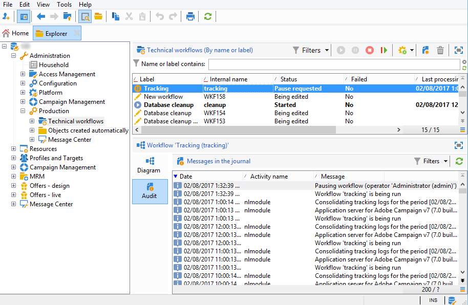

# Problemi dei registri di tracciamento{#tracking-logs-issues}

Ci possono essere diversi motivi per cui i registri di tracciamento non vengono inoltrati. Si consiglia di controllare le seguenti informazioni:

* **Il flusso di lavoro** Rilevamento **contiene errori?**

Consulta la [documentazione di Campaign v8](https://experienceleague.adobe.com/docs/campaign/automation/workflows/monitoring-workflows/monitor-technical-workflows.html?lang=it){target="_blank"}.

* **Il modulo** trackinglogd **è in esecuzione sul server?**

  Consulta [File di registro](../../production/using/log-files.md).

* **Sono state apportate modifiche?**

  Possono attivare una perdita di connessione ai server utilizzando l’alias di tracciamento.
