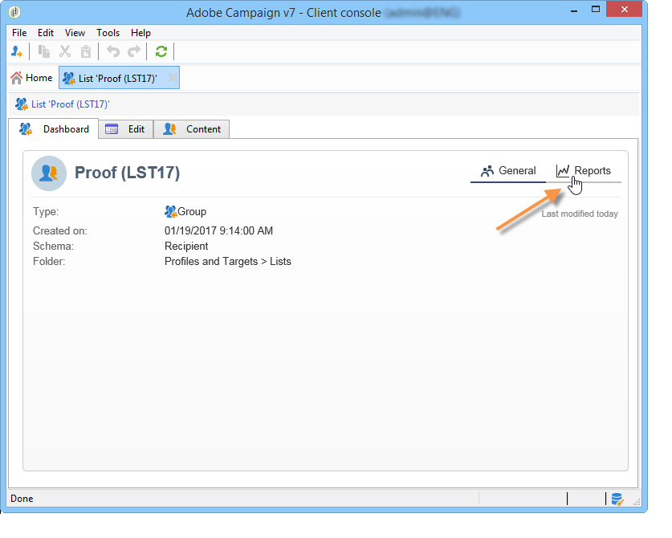

# Informazioni sui rapporti incorporati di Campaign{#about-campaign-built-in-reports}

Questo capitolo fornisce l’elenco dei rapporti incorporati di Adobe Campaign, il loro contenuto e il loro contesto. Le informazioni seguenti consentono di evitare la creazione di rapporti già disponibili nella piattaforma.

>[!NOTE]
>
>Puoi anche imparare ad aggiungere i tuoi rapporti personalizzati al **[!UICONTROL Reports]** scheda. Per ulteriori informazioni, consulta questa [pagina](../../reporting/using/configuring-access-to-the-report.md#defining-the-filtering-options).

Tali rapporti e il loro contenuto sono descritti in dettaglio nei documenti relativi alle funzionalità che riguardano.

Adobe Campaign offre diversi tipi di rapporti, accessibili tramite la console del cliente o un browser Internet.

Sono disponibili i seguenti tipi di rapporto:

* Rapporti sull’intera piattaforma, consulta [Rapporti globali](../../reporting/using/global-reports.md).
* Rapporti di consegna, vedi [Rapporti di consegna](../../reporting/using/delivery-reports.md).
* Rapporti cumulativi, vedi [Rapporti cumulativi](../../reporting/using/cumulative-reports.md).

Puoi accedere ai rapporti dalla home page della console client, dal dashboard dei rapporti o dall’elenco di consegna. La modalità di visualizzazione di un report dipende dal relativo contesto. L’elenco dei rapporti principali è disponibile nella pagina Home e consente di accedere rapidamente ai dati di consegna. Questo elenco può essere modificato in base alle tue esigenze. Fai riferimento a [questa sezione](../../reporting/using/about-reports-creation-in-campaign.md) per ulteriori informazioni.

Per accedere ai rapporti incorporati di Campaign:

1. Seleziona la **[!UICONTROL Reports]** dell’interfaccia di Adobe Campaign.

   

1. Utilizza i campi di ricerca per filtrare i rapporti visualizzati.

1. Quindi fai clic sul rapporto che desideri visualizzare.

   

1. Fai clic su **[!UICONTROL Back]** Il collegamento nella parte superiore della schermata ti riporta all’elenco dei rapporti.

   

Altre possibili azioni su un rapporto in fase di modifica sono descritte in [questa pagina](../../reporting/using/actions-on-reports.md).

I rapporti specifici di una campagna o di una consegna sono accessibili tramite le rispettive dashboard.

Il principio è lo stesso per elenchi, servizi, offerte, ecc. come mostrato di seguito:

