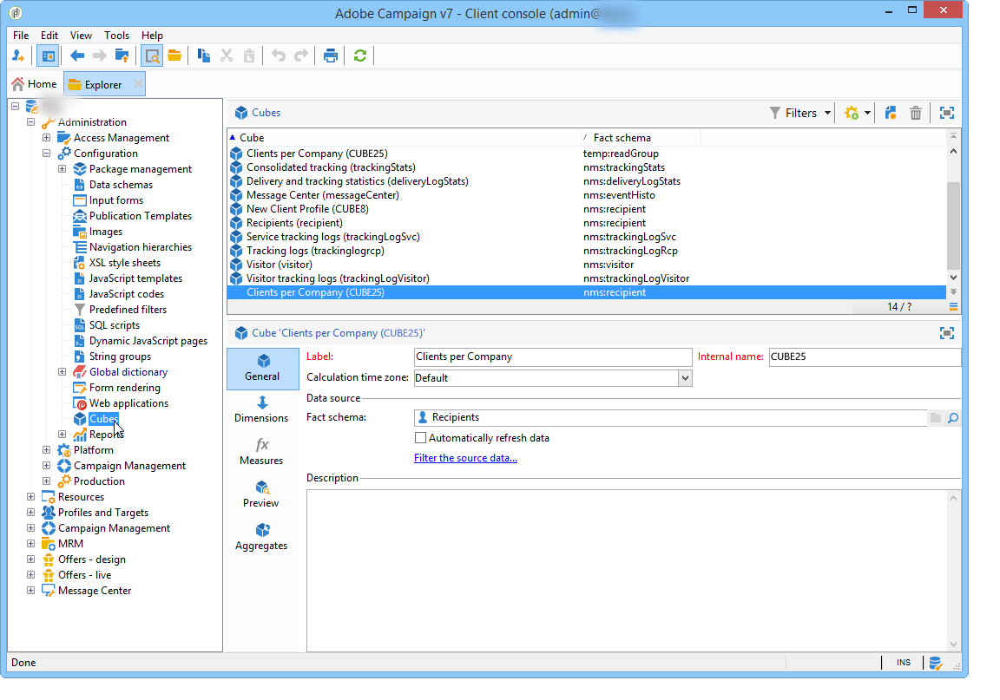
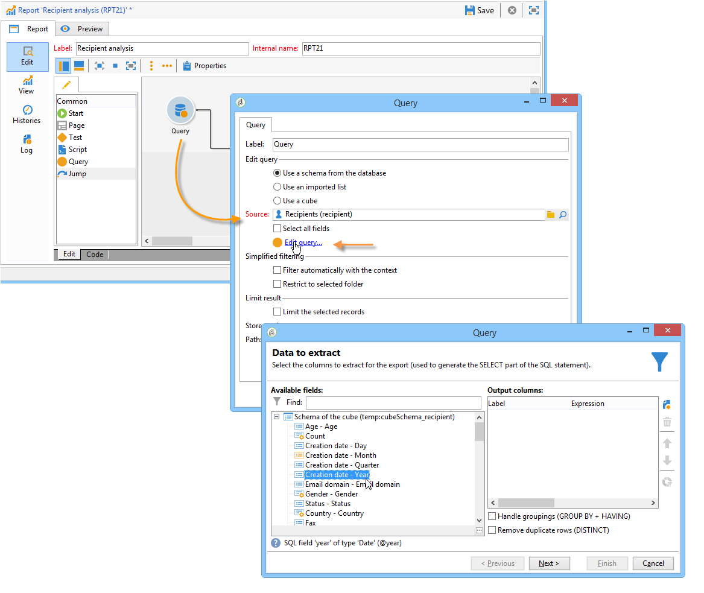

# Introduzione ai cubi{#about-cubes}

## Terminologia {#terminology}

Di seguito sono elencati i termini specifici per l&#39;utilizzo dei cubi.

* **Cubo** - Un cubo è una rappresentazione di informazioni multidimensionali: fornisce agli utenti finali strutture progettate per l&#39;analisi interattiva dei dati.

* **Tabella dei fatti/schema** - La tabella dei fatti (o schema dei fatti) contiene i dati grezzi o elementari su cui si baseranno le analisi. Si tratta principalmente di tabelle di volumi di grandi dimensioni (eventualmente con tabelle collegate) con calcoli potenzialmente lunghi. Ad esempio, una fact table può essere: la tabella broadlog, la tabella purchase e così via.

* **Dimension** - I Dimension consentono di segmentare i dati in gruppi: una volta creati, le dimensioni fungono da assi di analisi. Nella maggior parte dei casi, per una determinata dimensione, vengono definiti diversi livelli. Ad esempio, per una dimensione temporale, i livelli saranno mesi, giorni, ore, minuti e così via. Questo set di livelli rappresenta la gerarchia delle dimensioni e abilita vari livelli di analisi dei dati.

* **Binning** - In alcuni campi è possibile definire il binning per raggruppare i valori e semplificare la lettura delle informazioni. Binning applicato ai livelli. Si consiglia di definire il binning quando esiste la possibilità di molti valori diversi.

* **Misura** - Le misure più frequenti sono somma, media, massima, minima, deviazione standard, ecc. Le misure possono essere calcolate: ad esempio, il tasso di accettazione di un’offerta è il rapporto tra il numero di volte in cui è stata presentata e il numero di volte in cui è stata accettata.

## Area di lavoro del cubo {#cube-workspace}

I cubi vengono archiviati in **[!UICONTROL Administration > Configuration > Cubes]** nodo.

I principali contesti di utilizzo dei cubi sono i seguenti:

* Le esportazioni di dati possono essere eseguite direttamente in un rapporto, progettato in **[!UICONTROL Reports]** della piattaforma Adobe Campaign.

  A questo scopo, crea un nuovo rapporto e seleziona il cubo da utilizzare.

  

  I cubi vengono visualizzati come modelli in base ai rapporti creati. Dopo aver scelto un modello, fai clic su **[!UICONTROL Create]** per configurare e visualizzare il rapporto corrispondente.

  Puoi adattare le misure, modificare la modalità di visualizzazione o configurare la tabella, quindi visualizzare il rapporto utilizzando il pulsante principale.

  

* È inoltre possibile fare riferimento a un cubo nel **[!UICONTROL Query]** di una relazione per utilizzare i propri indicatori, come illustrato di seguito:

  

* È inoltre possibile inserire una tabella pivot basata su un cubo in qualsiasi pagina di un report. A questo scopo, fai riferimento al cubo da utilizzare nel **[!UICONTROL Data]** della tabella pivot sulla pagina interessata.

  

  Per ulteriori informazioni, consulta [Esplorare i dati in un rapporto](../../reporting/using/using-cubes-to-explore-data.md#exploring-the-data-in-a-report).
