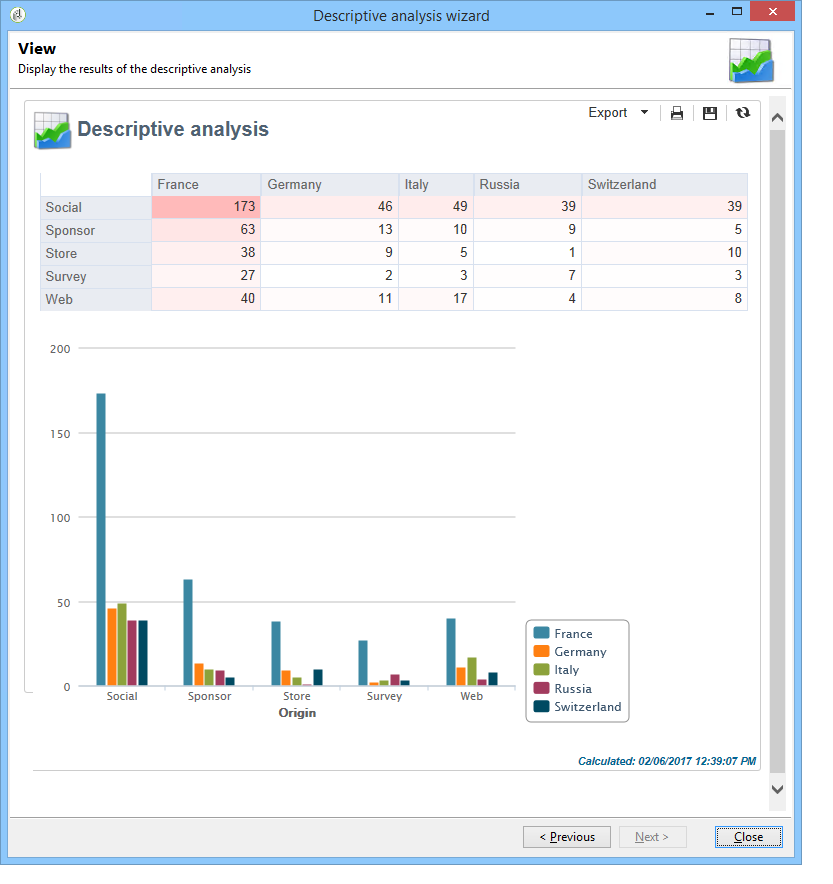

# Introduzione all’analisi descrittiva{#about-descriptive-analysis}

Per produrre statistiche sui dati nel database, crea rapporti di analisi descrittivi utilizzando l’assistente dedicato e adattane il contenuto e la presentazione alle tue esigenze.

Questi rapporti riguardano le popolazioni e devono essere utilizzati solo per analizzare piccoli volumi di dati.

Puoi generare rapporti di analisi quantitativa o qualitativa. Le analisi qualitative consentono di rappresentare i dati nel modo seguente:

* Tabella e istogramma:

  

* Valori cumulativi, senza la tabella:

  

* Raggruppamento per area di attività

  

Le analisi quantitative forniscono statistiche generali sui dati numerici della selezione, come illustrato di seguito:

Questi rapporti vengono creati tramite l’assistente di analisi descrittivo, che, in base a vari passaggi, consente di scegliere il tipo di rapporto da creare, nonché i dati e il layout. Il rapporto viene visualizzato nell’ultimo passaggio. Se necessario, il report può essere pubblicato e condiviso con altri operatori, stampato ed esportato in formato Excel, PDF o OpenDocument.

Le procedure guidate di analisi descrittive non sono potenti quanto i rapporti di Adobe Campaign, ma forniscono una rapida panoramica del contenuto del database o una selezione di dati.

>[!CAUTION]
>
>Un’analisi descrittiva non consente di esplorare volumi di dati di grandi dimensioni.
