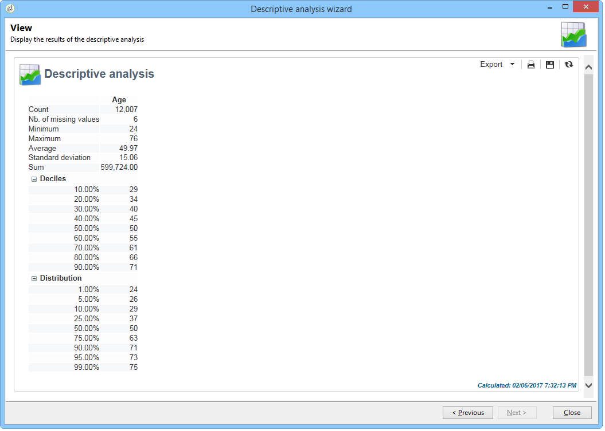

# Informazioni sull’analisi descrittiva{#about-descriptive-analysis}

Per produrre statistiche sui dati nel database, create report di analisi descrittivi utilizzando la procedura guidata dedicata e adattatene il contenuto e la presentazione in base alle vostre esigenze.

Tali relazioni riguardano le popolazioni e dovrebbero essere utilizzate solo per analizzare volumi di dati limitati.

Potete generare rapporti di analisi quantitativi o qualitativi. Le analisi qualitative consentono di rappresentare i dati come segue:

* Tabella e istogramma:

   

* Valori cumulati, senza tabella:

   

* Suddivisione per linea di attività

   

Le analisi quantitative forniscono statistiche generali sui dati numerici della selezione, come indicato di seguito:

Questi rapporti vengono creati tramite la procedura guidata di analisi descrittiva, che si basa su vari passaggi, consente di scegliere il tipo di rapporto che si desidera creare, nonché i dati e il layout. Il rapporto viene visualizzato nell&#39;ultimo passaggio. Se necessario, il rapporto può essere pubblicato e condiviso con altri operatori, stampato, esportato in formato Excel, PDF o OpenDocument.

Le procedure guidate per l&#39;analisi descrittiva non sono potenti come  report Adobe Campaign, ma forniscono una panoramica rapida del contenuto del database o una selezione di dati.

>[!CAUTION]
>
>Un&#39;analisi descrittiva non consente di esplorare grandi volumi di dati.

