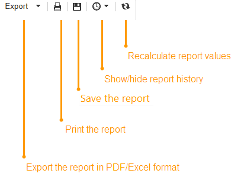

# Azioni sui rapporti{#actions-on-reports}


Quando visualizzi un rapporto, la barra degli strumenti ti consente di eseguire un certo numero di azioni. Tali informazioni sono descritte di seguito.


La barra degli strumenti consente di esportare, stampare, archiviare o visualizzare il rapporto, ad esempio in un browser Web.



## Esportare un rapporto {#exporting-a-report}

Seleziona il formato in cui desideri esportare il rapporto dall’elenco a discesa. (.xls, .pdf o .ods).


Quando un report contiene più pagine, è necessario ripetere l’operazione per ogni pagina.

Puoi configurare il report per esportarlo in formato PDF, Excel o OpenOffice. Apri Adobe Campaign Explorer e seleziona il rapporto interessato.

Le opzioni di esportazione sono accessibili tramite **[!UICONTROL Page]** attività della relazione, nel **[!UICONTROL Advanced]** scheda.

Modificare le impostazioni di **[!UICONTROL Paper]** e **[!UICONTROL Margins]** per soddisfare le tue esigenze. Puoi anche autorizzare l’esportazione di una pagina solo in formato PDF. A questo scopo, deseleziona la casella di controllo **[!UICONTROL Activate OpenOffice/Microsoft Excel export]** opzione.


### Esporta in Microsoft Excel {#exporting-into-microsoft-excel}

Per **[!UICONTROL List with group]** per i rapporti destinati all&#39;esportazione in Excel, si applicano le seguenti raccomandazioni e limitazioni:

* Questi rapporti non devono contenere righe vuote.

  

* La legenda dell&#39;elenco deve essere nascosta.

  

* I rapporti non devono utilizzare una formattazione specifica definita a livello di cella. È preferibile utilizzare **[!UICONTROL Form rendering]** per definire il formato delle celle nella tabella. Il **[!UICONTROL Form rendering]** accessibile tramite **[!UICONTROL Administration > Configuration > Form rendering]**.
* Si sconsiglia di inserire contenuto HTML.
* Se un rapporto contiene più tabelle, grafici, ecc. elementi di tipo, verranno esportati uno sotto l&#39;altro.
* Puoi forzare il ritorno a capo nelle celle: questa configurazione verrà mantenuta in Excel. Per ulteriori informazioni al riguardo, consulta [questa sezione](../../reporting/using/creating-a-table.md#defining-cell-format).

### Posticipa l&#39;esportazione {#postpone-the-export}

Puoi posticipare l’esportazione di un rapporto, ad esempio per attendere chiamate asincrone. A questo scopo, immetti il seguente parametro nello script di inizializzazione della pagina:

```
document.nl_waitBeforeRender = true;
```

Per attivare l’esportazione e iniziare la conversione in un PDF, utilizza **document.nl_renderToPdf()** senza alcun parametro.

### Allocazione di memoria {#memory-allocation}

Durante l’esportazione di alcuni rapporti di grandi dimensioni, possono verificarsi errori di allocazione della memoria.

In alcuni casi, il valore predefinito **max MB** (**SKM** per le istanze in hosting) del JavaScript indicato nella **serverConf.xml** il file di configurazione è impostato su 64 MB. In caso di errori di memoria insufficiente durante l’esportazione di un rapporto, si consiglia di aumentare questo valore a 512 MB:

```
<javaScript maxMB="512" stackSizeKB="8"/>
```

Per applicare le modifiche apportate alla configurazione, **nlserver** il servizio deve essere riavviato.

Per ulteriori informazioni su **serverConf.xml** file, consultare [questa sezione](../../production/using/configuration-principle.md).

Per ulteriori informazioni su **nlserver** servizio, fare riferimento a [questa sezione](../../production/using/administration.md).

## Stampare un rapporto {#printing-a-report}

Puoi stampare il rapporto: a questo scopo, fai clic sull’icona della stampante: viene visualizzata la finestra di dialogo.

Per ottenere un risultato migliore, modifica le opzioni di stampa di Explorer e seleziona **[!UICONTROL Print background colors and images]**.


## Creare archivi di rapporti {#creating-report-archives}

L’archiviazione di un rapporto consente di creare una visualizzazione del rapporto in vari periodi, ad esempio per visualizzare le statistiche per un determinato periodo di tempo.

Per creare un archivio, apri il rapporto in questione e fai clic sull’icona appropriata.


Per visualizzare o nascondere gli archivi esistenti, fare clic sull&#39;icona Mostra/Nascondi.


Le date dell&#39;archivio vengono visualizzate sotto l&#39;icona mostra/nascondi. Fai clic sull’archivio per visualizzarlo.


È possibile eliminare un archivio di rapporti. A questo scopo, vai al nodo Adobe Campaign in cui sono memorizzati i rapporti. Fai clic su **[!UICONTROL Archives]** , seleziona quella da eliminare e fai clic su **[!UICONTROL Delete]**.


