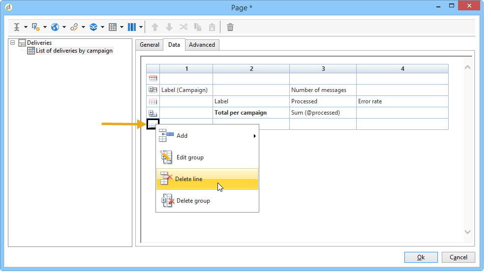

# Azioni sui rapporti{#actions-on-reports}


Quando visualizzi un rapporto, la barra degli strumenti ti consente di eseguire un certo numero di azioni. Questi sono descritti di seguito.


La barra degli strumenti consente, ad esempio, di esportare, stampare, archiviare o visualizzare il rapporto in un browser Web.


## Esportare un rapporto {#exporting-a-report}

Seleziona il formato in cui esportare il rapporto dall’elenco a discesa. (.xls, .pdf o .ods).


Quando un rapporto contiene più pagine, è necessario ripetere l’operazione per ogni pagina.

È possibile configurare il rapporto in modo da esportarlo in formato PDF, Excel o OpenOffice. Apri Adobe Campaign Explorer e seleziona il rapporto interessato.

Le opzioni di esportazione sono accessibili tramite il **[!UICONTROL Page]** attività della relazione, **[!UICONTROL Advanced]** scheda .

Modificare le impostazioni di **[!UICONTROL Paper]** e **[!UICONTROL Margins]** per soddisfare le tue esigenze. È inoltre possibile autorizzare l’esportazione di una pagina solo in formato PDF. Per eseguire questa operazione, deseleziona la **[!UICONTROL Activate OpenOffice/Microsoft Excel export]** opzione .


### Esportare in Microsoft Excel {#exporting-into-microsoft-excel}

Per **[!UICONTROL List with group]** tipi di rapporti destinati all’esportazione in Excel, si applicano le seguenti raccomandazioni e limitazioni:

* Questi rapporti non devono contenere righe vuote.

   

* La legenda dell&#39;elenco deve essere nascosta.

   

* I rapporti non devono utilizzare una formattazione specifica definita a livello di cella. È preferibile utilizzare **[!UICONTROL Form rendering]** definire il formato delle celle della tabella. La **[!UICONTROL Form rendering]** accessibile tramite **[!UICONTROL Administration > Configuration > Form rendering]**.
* Non è consigliabile inserire contenuto HTML.
* Se un report contiene diverse tabelle, grafici e così via. gli elementi di tipo , saranno esportati uno sotto l’altro.
* È possibile forzare il ritorno a capo nelle celle: questa configurazione verrà mantenuta in Excel. Per ulteriori informazioni al riguardo, consulta [questa sezione](../../reporting/using/creating-a-table.md#defining-cell-format).

### Posticipare l&#39;esportazione {#postpone-the-export}

Puoi posticipare l’esportazione di un rapporto, ad esempio per attendere le chiamate asincrone. A questo scopo, immetti il seguente parametro nello script di inizializzazione della pagina:

```
document.nl_waitBeforeRender = true;
```

Per attivare l’esportazione e iniziare la conversione in un PDF, utilizza il **document.nl_renderToPdf()** senza alcun parametro.

### Allocazione della memoria {#memory-allocation}

Quando si esportano alcuni report di grandi dimensioni, possono verificarsi errori di allocazione della memoria.

In alcuni casi, il valore predefinito **maxMB** (**SKMS** per le istanze in hosting) del JavaScript indicato nel **serverConf.xml** il file di configurazione è impostato su 64 MB. Se durante l&#39;esportazione di un report si verificano errori di memoria insufficienti, è consigliabile aumentare questa cifra a 512 MB:

```
<javaScript maxMB="512" stackSizeKB="8"/>
```

Per applicare le modifiche apportate alla configurazione, la **nlserver** è necessario riavviare il servizio.

Per saperne di più sulle **serverConf.xml** , fare riferimento a [questa sezione](../../production/using/configuration-principle.md).

Per saperne di più sulle **nlserver** , fai riferimento a [questa sezione](../../production/using/administration.md).

## Stampa di un rapporto {#printing-a-report}

È possibile stampare il rapporto: a questo scopo, fai clic sull’icona della stampante: viene visualizzata la finestra di dialogo.

Per ottenere un risultato migliore, modificare le opzioni di stampa di Esplora risorse e selezionare **[!UICONTROL Print background colors and images]**.


## Creare archivi dei rapporti {#creating-report-archives}

L’archiviazione di un rapporto consente di creare una visualizzazione del rapporto in diversi periodi, ad esempio per mostrare le statistiche per un determinato periodo di tempo.

Per creare un archivio, apri il rapporto interessato e fai clic sull’icona appropriata.


Per visualizzare o nascondere gli archivi esistenti, fai clic sull’icona mostra/nascondi .


Le date dell’archivio vengono visualizzate sotto l’icona mostra/nascondi . Fai clic sull’archivio per visualizzarlo.


È possibile eliminare un archivio dei rapporti. A questo scopo, vai al nodo Adobe Campaign in cui sono memorizzati i tuoi rapporti. Fai clic sul pulsante **[!UICONTROL Archives]** seleziona quello da eliminare e fai clic su **[!UICONTROL Delete]**.


